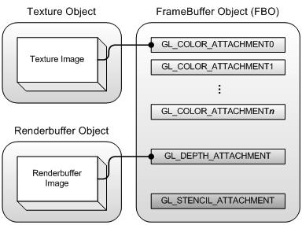
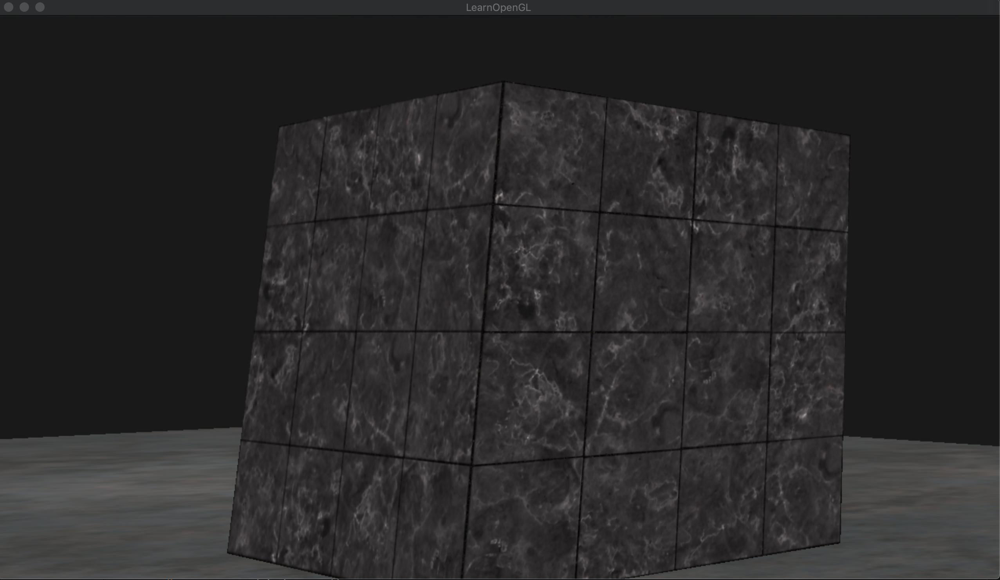

# FrameBuffer

* Color Buffer, Depth Buffer, Stencil Buffer의 결합
* 화면의 하나의 픽셀에 대응되는 Buffer
* FrameBuffer를 커스텀하게 선언하지 않더라도 `Default Frame Buffer`를 사용해서 렌더링
* 아래 예제의 흐름은 다음과 같다
    1. 기존 예제들 처럼 바닥과 큐브를 그린다.
    2. 하지만 기존과 다르게 바로 그리는것이 아니라 커스텀하게 생성한 프레임버퍼에 쓴다.
    3. 쓰여진 프레임버퍼에 있는 내용을 `quad`를 이용해서 화면에 그린다.


* 첨부물 ( Attatchment ) 는 2가지 형태가 있는데, `Texture Object Attatchment` 와 `RenderBuffer Object Attatchment` 이다.
    * `Texture Object` : 결과값을 텍스쳐 형태로 저장, 쉐이더에서 접근가능
    * `RenderBuffer Object` : 결과값을 배열 형태로 저장, 쉐이더 에서 접근 불가, 빠른 접근 가능

# Code summary
* FrameBuffer 생성
```cpp
unsigned int framebuffer;
glGenFramebuffers(1, &framebuffer);
```
* FrameBuffer Bind
```cpp
glBindFramebuffer(GL_FRAMEBUFFER, framebuffer);     //읽기, 작성의 통합
glBindFramebuffer(GL_READ_FRAMEBUFFER, framebuffer);    //glReadPixels와 같은 읽기 명령에 사용하기 위함
glBindFramebuffer(GL_DRAW_FRAMEBUFFER, framebuffer);    //렌더링, Clear 등과 같이 작성 명령에 사용하기 위함
```
* FrameBuffer의 완성 체크

```cpp
if (glCheckFramebufferStatus(GL_FRAMEBUFFER) != GL_FRAMEBUFFER_COMPLETE)
    cout << "ERROR::FRAMEBUFFER:: Framebuffer is not complete!" << endl;

FrameBuffer가 완성된 형태가 아니라면 사용 할 수 없는데, 아래와 같은 요구사항을 만족해야 한다.
    * 최소한 하나의 Buffer( Color, Depth or Stencil )를 첨부해야 한다.
    * 최소한 하나의 Color Buffer가 첨부되어야 한다.
    * 모든 첨부된 Buffer를 메모리 할당이 되어 있어야 한다.
    * 모든 첨부된 Buffer들은 샘플의 갯수가 같아야 한다. 
```
* FrameBuffer UnBind
    * 별도의 `FrameBuffer`에 쓰여진 것들은 `Window`에 전혀 영향을 끼치지 않는다.
    * `Default Frame Buffer`를 `bind` 해 줌으로써 `Window`에 그리도록 한다.
```cpp
glBindFramebuffer(GL_FRAMEBUFFER, 0);
``` 
* Texture Object 첨부물
```cpp
unsigned int textureColorbuffer;
glGenTextures(1, &textureColorbuffer);
glBindTexture(GL_TEXTURE_2D, textureColorbuffer);
glTexImage2D(GL_TEXTURE_2D, 0, GL_RGB, SCR_WIDTH, SCR_HEIGHT, 0, GL_RGB, GL_UNSIGNED_BYTE, NULL);   //  맨마지막 파라미터 ( Data )에 NULL을 넣음으로써 우리가 내용물을 채우겠다는 의미
glTexParameteri(GL_TEXTURE_2D, GL_TEXTURE_MIN_FILTER, GL_LINEAR);
glTexParameteri(GL_TEXTURE_2D, GL_TEXTURE_MAG_FILTER, GL_LINEAR);
glFramebufferTexture2D(GL_FRAMEBUFFER, GL_COLOR_ATTACHMENT0, GL_TEXTURE_2D, textureColorbuffer, 0);     //현재 바인딩 된 FrameBuffer의 Color 첨부물 0번에 지금 생성한 textureColorBuffer를 설정 하겠다는 의미
//GL_COLOR_ATTACHMENT는 0~31까지 존재
```
* RenderBuffer Object 첨부물
```cpp
unsigned int rbo;
glGenRenderbuffers(1, &rbo);
glBindRenderbuffer(GL_RENDERBUFFER, rbo);
glRenderbufferStorage(GL_RENDERBUFFER, GL_DEPTH24_STENCIL8, SCR_WIDTH, SCR_HEIGHT);     //Depth 24비트, Stencil 8비트로 나눠서 사용
glFramebufferRenderbuffer(GL_FRAMEBUFFER, GL_DEPTH_STENCIL_ATTACHMENT, GL_RENDERBUFFER, rbo);   //현재 바인딩 된 FrameBuffer의 Depth, Stencil 첨부물에 지금 생성한 rbo를 설정 하겠다는 의미
```

# Result



# Shader Codes

* 2개의 쉐이더 코드를 사용
    1. 기본 씬을 표현하기 위한 쉐이더 ( Object Shader )
    2. 프레임버퍼를 표현하기 위한 쉐이더 ( Screen Shader )

## Object Vertex Shader Codes
```cpp
#version 330 core
layout (location = 0) in vec3 aPos;
layout (location = 1) in vec2 aTexCoords;

out vec2 TexCoords;

uniform mat4 model;
uniform mat4 view;
uniform mat4 projection;

void main()
{
    TexCoords = aTexCoords;    
    gl_Position = projection * view * model * vec4(aPos, 1.0);
}

```
## Object Fragment Shader Codes
```cpp
#version 330 core
out vec4 FragColor;

in vec2 TexCoords;

uniform sampler2D texture1;

void main()
{    
    FragColor = texture(texture1, TexCoords);
}

```
## Screen Vertex Shader Codes
```cpp
#version 330 core
layout (location = 0) in vec2 aPos;
layout (location = 1) in vec2 aTexCoords;

out vec2 TexCoords;

void main()
{
    TexCoords = aTexCoords;
    gl_Position = vec4(aPos.x, aPos.y, 0.0, 1.0); 
}  

```
## Screen Fragment Shader Codes
```cpp
#version 330 core
out vec4 FragColor;

in vec2 TexCoords;

uniform sampler2D screenTexture;

void main()
{
    vec3 col = texture(screenTexture, TexCoords).rgb;
    FragColor = vec4(col, 1.0);
} 

```
# Source Codes

```cpp
#include <glad/glad.h>
#include <GLFW/glfw3.h>
#include <stb_image.h>

#include <glm/glm.hpp>
#include <glm/gtc/matrix_transform.hpp>
#include <glm/gtc/type_ptr.hpp>

#include <learnopengl/filesystem.h>
#include <learnopengl/shader_m.h>
#include <learnopengl/camera.h>
#include <learnopengl/model.h>

#include <iostream>

void framebuffer_size_callback(GLFWwindow* window, int width, int height);
unsigned int loadTexture(const char *path);

// settings
const unsigned int SCR_WIDTH = 1280;
const unsigned int SCR_HEIGHT = 720;

// camera
Camera camera(glm::vec3(0.0f, 0.0f, 3.0f));

int main()
{
    // glfw: initialize and configure
    // ------------------------------
    glfwInit();
    glfwWindowHint(GLFW_CONTEXT_VERSION_MAJOR, 3);
    glfwWindowHint(GLFW_CONTEXT_VERSION_MINOR, 3);
    glfwWindowHint(GLFW_OPENGL_PROFILE, GLFW_OPENGL_CORE_PROFILE);

#ifdef __APPLE__
    glfwWindowHint(GLFW_OPENGL_FORWARD_COMPAT, GL_TRUE); // uncomment this statement to fix compilation on OS X
#endif

    // glfw window creation
    // --------------------
    GLFWwindow* window = glfwCreateWindow(SCR_WIDTH, SCR_HEIGHT, "LearnOpenGL", NULL, NULL);
    if (window == NULL)
    {
        std::cout << "Failed to create GLFW window" << std::endl;
        glfwTerminate();
        return -1;
    }
    glfwMakeContextCurrent(window);
    glfwSetFramebufferSizeCallback(window, framebuffer_size_callback);
    glfwSetCursorPosCallback(window, mouse_callback);
    glfwSetScrollCallback(window, scroll_callback);

    // tell GLFW to capture our mouse
    glfwSetInputMode(window, GLFW_CURSOR, GLFW_CURSOR_DISABLED);

    // glad: load all OpenGL function pointers
    // ---------------------------------------
    if (!gladLoadGLLoader((GLADloadproc)glfwGetProcAddress))
    {
        std::cout << "Failed to initialize GLAD" << std::endl;
        return -1;
    }

    // configure global opengl state
    // -----------------------------
    glEnable(GL_DEPTH_TEST);

    // build and compile shaders
    // -------------------------
    Shader shader("5.1.framebuffers.vs", "5.1.framebuffers.fs");
    Shader screenShader("5.1.framebuffers_screen.vs", "5.1.framebuffers_screen.fs");

    // set up vertex data (and buffer(s)) and configure vertex attributes
    // ------------------------------------------------------------------
    float cubeVertices[] = {
        // positions          // texture Coords
        -0.5f, -0.5f, -0.5f,  0.0f, 0.0f,
         0.5f, -0.5f, -0.5f,  1.0f, 0.0f,
         0.5f,  0.5f, -0.5f,  1.0f, 1.0f,
         0.5f,  0.5f, -0.5f,  1.0f, 1.0f,
        -0.5f,  0.5f, -0.5f,  0.0f, 1.0f,
        -0.5f, -0.5f, -0.5f,  0.0f, 0.0f,

        -0.5f, -0.5f,  0.5f,  0.0f, 0.0f,
         0.5f, -0.5f,  0.5f,  1.0f, 0.0f,
         0.5f,  0.5f,  0.5f,  1.0f, 1.0f,
         0.5f,  0.5f,  0.5f,  1.0f, 1.0f,
        -0.5f,  0.5f,  0.5f,  0.0f, 1.0f,
        -0.5f, -0.5f,  0.5f,  0.0f, 0.0f,

        -0.5f,  0.5f,  0.5f,  1.0f, 0.0f,
        -0.5f,  0.5f, -0.5f,  1.0f, 1.0f,
        -0.5f, -0.5f, -0.5f,  0.0f, 1.0f,
        -0.5f, -0.5f, -0.5f,  0.0f, 1.0f,
        -0.5f, -0.5f,  0.5f,  0.0f, 0.0f,
        -0.5f,  0.5f,  0.5f,  1.0f, 0.0f,

         0.5f,  0.5f,  0.5f,  1.0f, 0.0f,
         0.5f,  0.5f, -0.5f,  1.0f, 1.0f,
         0.5f, -0.5f, -0.5f,  0.0f, 1.0f,
         0.5f, -0.5f, -0.5f,  0.0f, 1.0f,
         0.5f, -0.5f,  0.5f,  0.0f, 0.0f,
         0.5f,  0.5f,  0.5f,  1.0f, 0.0f,

        -0.5f, -0.5f, -0.5f,  0.0f, 1.0f,
         0.5f, -0.5f, -0.5f,  1.0f, 1.0f,
         0.5f, -0.5f,  0.5f,  1.0f, 0.0f,
         0.5f, -0.5f,  0.5f,  1.0f, 0.0f,
        -0.5f, -0.5f,  0.5f,  0.0f, 0.0f,
        -0.5f, -0.5f, -0.5f,  0.0f, 1.0f,

        -0.5f,  0.5f, -0.5f,  0.0f, 1.0f,
         0.5f,  0.5f, -0.5f,  1.0f, 1.0f,
         0.5f,  0.5f,  0.5f,  1.0f, 0.0f,
         0.5f,  0.5f,  0.5f,  1.0f, 0.0f,
        -0.5f,  0.5f,  0.5f,  0.0f, 0.0f,
        -0.5f,  0.5f, -0.5f,  0.0f, 1.0f
    };
    float planeVertices[] = {
        // positions          // texture Coords 
         5.0f, -0.5f,  5.0f,  2.0f, 0.0f,
        -5.0f, -0.5f,  5.0f,  0.0f, 0.0f,
        -5.0f, -0.5f, -5.0f,  0.0f, 2.0f,

         5.0f, -0.5f,  5.0f,  2.0f, 0.0f,
        -5.0f, -0.5f, -5.0f,  0.0f, 2.0f,
         5.0f, -0.5f, -5.0f,  2.0f, 2.0f
    };
    float quadVertices[] = { // vertex attributes for a quad that fills the entire screen in Normalized Device Coordinates.
        // positions   // texCoords
        -1.0f,  1.0f,  0.0f, 1.0f,
        -1.0f, -1.0f,  0.0f, 0.0f,
         1.0f, -1.0f,  1.0f, 0.0f,

        -1.0f,  1.0f,  0.0f, 1.0f,
         1.0f, -1.0f,  1.0f, 0.0f,
         1.0f,  1.0f,  1.0f, 1.0f
    };
    // cube VAO
    unsigned int cubeVAO, cubeVBO;
    glGenVertexArrays(1, &cubeVAO);
    glGenBuffers(1, &cubeVBO);
    glBindVertexArray(cubeVAO);
    glBindBuffer(GL_ARRAY_BUFFER, cubeVBO);
    glBufferData(GL_ARRAY_BUFFER, sizeof(cubeVertices), &cubeVertices, GL_STATIC_DRAW);
    glEnableVertexAttribArray(0);
    glVertexAttribPointer(0, 3, GL_FLOAT, GL_FALSE, 5 * sizeof(float), (void*)0);
    glEnableVertexAttribArray(1);
    glVertexAttribPointer(1, 2, GL_FLOAT, GL_FALSE, 5 * sizeof(float), (void*)(3 * sizeof(float)));
    // plane VAO
    unsigned int planeVAO, planeVBO;
    glGenVertexArrays(1, &planeVAO);
    glGenBuffers(1, &planeVBO);
    glBindVertexArray(planeVAO);
    glBindBuffer(GL_ARRAY_BUFFER, planeVBO);
    glBufferData(GL_ARRAY_BUFFER, sizeof(planeVertices), &planeVertices, GL_STATIC_DRAW);
    glEnableVertexAttribArray(0);
    glVertexAttribPointer(0, 3, GL_FLOAT, GL_FALSE, 5 * sizeof(float), (void*)0);
    glEnableVertexAttribArray(1);
    glVertexAttribPointer(1, 2, GL_FLOAT, GL_FALSE, 5 * sizeof(float), (void*)(3 * sizeof(float)));
    // screen quad VAO
    unsigned int quadVAO, quadVBO;
    glGenVertexArrays(1, &quadVAO);
    glGenBuffers(1, &quadVBO);
    glBindVertexArray(quadVAO);
    glBindBuffer(GL_ARRAY_BUFFER, quadVBO);
    glBufferData(GL_ARRAY_BUFFER, sizeof(quadVertices), &quadVertices, GL_STATIC_DRAW);
    glEnableVertexAttribArray(0);
    glVertexAttribPointer(0, 2, GL_FLOAT, GL_FALSE, 4 * sizeof(float), (void*)0);
    glEnableVertexAttribArray(1);
    glVertexAttribPointer(1, 2, GL_FLOAT, GL_FALSE, 4 * sizeof(float), (void*)(2 * sizeof(float)));

    // load textures
    // -------------
    unsigned int cubeTexture = loadTexture(FileSystem::getPath("resources/textures/marble.jpg").c_str());
    unsigned int floorTexture = loadTexture(FileSystem::getPath("resources/textures/metal.png").c_str());

    // shader configuration
    // --------------------
    shader.use();
    shader.setInt("texture1", 0);

    screenShader.use();
    screenShader.setInt("screenTexture", 0);

    // framebuffer configuration
    // -------------------------
    unsigned int framebuffer;
    glGenFramebuffers(1, &framebuffer);     //프레임 버퍼 생성 
    glBindFramebuffer(GL_FRAMEBUFFER, framebuffer);     //프레임 버퍼 바인드
    // create a color attachment texture
    unsigned int textureColorbuffer;
    glGenTextures(1, &textureColorbuffer);      //텍스쳐 객체 생성
    glBindTexture(GL_TEXTURE_2D, textureColorbuffer);
    glTexImage2D(GL_TEXTURE_2D, 0, GL_RGB, SCR_WIDTH, SCR_HEIGHT, 0, GL_RGB, GL_UNSIGNED_BYTE, NULL);
    glTexParameteri(GL_TEXTURE_2D, GL_TEXTURE_MIN_FILTER, GL_LINEAR);
    glTexParameteri(GL_TEXTURE_2D, GL_TEXTURE_MAG_FILTER, GL_LINEAR);
    glFramebufferTexture2D(GL_FRAMEBUFFER, GL_COLOR_ATTACHMENT0, GL_TEXTURE_2D, textureColorbuffer, 0); // 현재 바인드된 프레임 버퍼의 0번 컬러 첨부물에 텍스쳐 설정
    
    unsigned int rbo;
    glGenRenderbuffers(1, &rbo);    //Renderbuffer 생성
    glBindRenderbuffer(GL_RENDERBUFFER, rbo);
    glRenderbufferStorage(GL_RENDERBUFFER, GL_DEPTH24_STENCIL8, SCR_WIDTH, SCR_HEIGHT);      
    glFramebufferRenderbuffer(GL_FRAMEBUFFER, GL_DEPTH_STENCIL_ATTACHMENT, GL_RENDERBUFFER, rbo);   //현재 바인드된 프레임 버퍼의 Depth, Stencil 첨부물에 Renderbuffer 설정

    if (glCheckFramebufferStatus(GL_FRAMEBUFFER) != GL_FRAMEBUFFER_COMPLETE)
        cout << "ERROR::FRAMEBUFFER:: Framebuffer is not complete!" << endl;
    glBindFramebuffer(GL_FRAMEBUFFER, 0);

    // draw as wireframe
    //glPolygonMode(GL_FRONT_AND_BACK, GL_LINE);

    // render loop
    // -----------
    while (!glfwWindowShouldClose(window))
    {
        // per-frame time logic
        // --------------------
        float currentFrame = glfwGetTime();
        deltaTime = currentFrame - lastFrame;
        lastFrame = currentFrame;

        // input
        // -----
        processInput(window);


        // render
        // ------
        // bind to framebuffer and draw scene as we normally would to color texture 
        glBindFramebuffer(GL_FRAMEBUFFER, framebuffer);     //위에서 만든 프레임버퍼 바인드 이 이하는 framebuffer에 쓰여짐
        glEnable(GL_DEPTH_TEST); // enable depth testing (is disabled for rendering screen-space quad)

        // make sure we clear the framebuffer's content
        glClearColor(0.1f, 0.1f, 0.1f, 1.0f);
        glClear(GL_COLOR_BUFFER_BIT | GL_DEPTH_BUFFER_BIT);     //Stencil은 사용 안하기 때문에, Color와 Depth만 Clear

        shader.use();
        glm::mat4 model = glm::mat4(1.0f);
        glm::mat4 view = camera.GetViewMatrix();
        glm::mat4 projection = glm::perspective(glm::radians(camera.Zoom), (float)SCR_WIDTH / (float)SCR_HEIGHT, 0.1f, 100.0f);
        shader.setMat4("view", view);
        shader.setMat4("projection", projection);
        // cubes
        glBindVertexArray(cubeVAO);
        glActiveTexture(GL_TEXTURE0);
        glBindTexture(GL_TEXTURE_2D, cubeTexture);
        model = glm::translate(model, glm::vec3(-1.0f, 0.0f, -1.0f));
        shader.setMat4("model", model);
        glDrawArrays(GL_TRIANGLES, 0, 36);
        model = glm::mat4(1.0f);
        model = glm::translate(model, glm::vec3(2.0f, 0.0f, 0.0f));
        shader.setMat4("model", model);
        glDrawArrays(GL_TRIANGLES, 0, 36);
        // floor
        glBindVertexArray(planeVAO);
        glBindTexture(GL_TEXTURE_2D, floorTexture);
        shader.setMat4("model", glm::mat4(1.0f));
        glDrawArrays(GL_TRIANGLES, 0, 6);
        glBindVertexArray(0);

        glBindFramebuffer(GL_FRAMEBUFFER, 0);   //다시 0번 ( Default Framebuffer ) 로 바인드
        glDisable(GL_DEPTH_TEST); // disable depth test so screen-space quad isn't discarded due to depth test.
        // clear all relevant buffers
        glClearColor(1.0f, 1.0f, 1.0f, 1.0f); // set clear color to white (not really necessery actually, since we won't be able to see behind the quad anyways)
        glClear(GL_COLOR_BUFFER_BIT);

        screenShader.use();
        glBindVertexArray(quadVAO);
        glBindTexture(GL_TEXTURE_2D, textureColorbuffer);    // use the color attachment texture as the texture of the quad plane
        glDrawArrays(GL_TRIANGLES, 0, 6);


        // glfw: swap buffers and poll IO events (keys pressed/released, mouse moved etc.)
        // -------------------------------------------------------------------------------
        glfwSwapBuffers(window);
        glfwPollEvents();
    }

    // optional: de-allocate all resources once they've outlived their purpose:
    // ------------------------------------------------------------------------
    glDeleteVertexArrays(1, &cubeVAO);
    glDeleteVertexArrays(1, &planeVAO);
    glDeleteVertexArrays(1, &quadVAO);
    glDeleteBuffers(1, &cubeVBO);
    glDeleteBuffers(1, &planeVBO);
    glDeleteBuffers(1, &quadVBO);

    glfwTerminate();
    return 0;
}

// process all input: query GLFW whether relevant keys are pressed/released this frame and react accordingly
// ---------------------------------------------------------------------------------------------------------
void processInput(GLFWwindow *window)
{
    if (glfwGetKey(window, GLFW_KEY_ESCAPE) == GLFW_PRESS)
        glfwSetWindowShouldClose(window, true);
}

// glfw: whenever the window size changed (by OS or user resize) this callback function executes
// ---------------------------------------------------------------------------------------------
void framebuffer_size_callback(GLFWwindow* window, int width, int height)
{
    // make sure the viewport matches the new window dimensions; note that width and 
    // height will be significantly larger than specified on retina displays.
    glViewport(0, 0, width, height);
}

// utility function for loading a 2D texture from file
// ---------------------------------------------------
unsigned int loadTexture(char const * path)
{
    unsigned int textureID;
    glGenTextures(1, &textureID);

    int width, height, nrComponents;
    unsigned char *data = stbi_load(path, &width, &height, &nrComponents, 0);
    if (data)
    {
        GLenum format;
        if (nrComponents == 1)
            format = GL_RED;
        else if (nrComponents == 3)
            format = GL_RGB;
        else if (nrComponents == 4)
            format = GL_RGBA;

        glBindTexture(GL_TEXTURE_2D, textureID);
        glTexImage2D(GL_TEXTURE_2D, 0, format, width, height, 0, format, GL_UNSIGNED_BYTE, data);
        glGenerateMipmap(GL_TEXTURE_2D);

        glTexParameteri(GL_TEXTURE_2D, GL_TEXTURE_WRAP_S, GL_REPEAT);
        glTexParameteri(GL_TEXTURE_2D, GL_TEXTURE_WRAP_T, GL_REPEAT);
        glTexParameteri(GL_TEXTURE_2D, GL_TEXTURE_MIN_FILTER, GL_LINEAR_MIPMAP_LINEAR);
        glTexParameteri(GL_TEXTURE_2D, GL_TEXTURE_MAG_FILTER, GL_LINEAR);

        stbi_image_free(data);
    }
    else
    {
        std::cout << "Texture failed to load at path: " << path << std::endl;
        stbi_image_free(data);
    }

    return textureID;
}

```

#참조
* [glRenderbufferStorage](https://www.khronos.org/registry/OpenGL-Refpages/es3.0/html/glRenderbufferStorage.xhtml)
* [OpenGL 3.0 Ref](https://www.khronos.org/registry/OpenGL-Refpages/es3.0/)