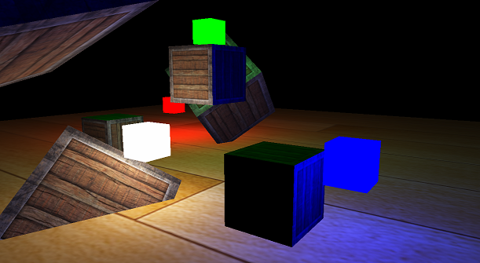
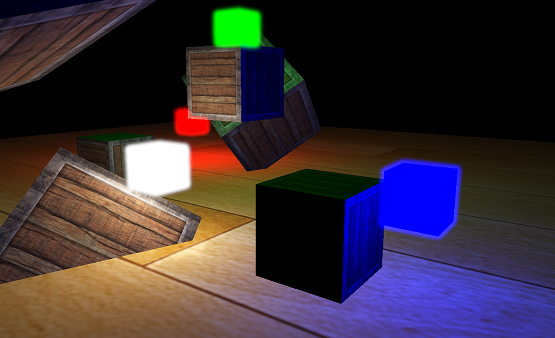
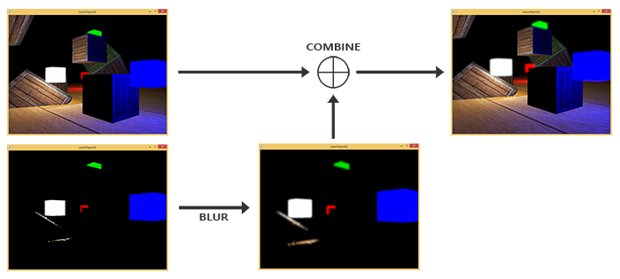

# Bloom

밝은 광원 혹은 강렬한 조명이라는 느낌을 주기 위한 기법
일반적으로 모니터의 강도 범위가 제한되어 있기 때문에 '밝다' 라는 느낌을 주기가 어려운데, 광원을 중심으로 빛의 번짐효과를 주어 강렬하게 빛나는 느낌을 주는 기법

## Result

* Bloom 효과가 적용되지 않은 장면



* Bloom 효과가 적용된 장면



## Bloom의 구현 과정



1. 일반 장면을 렌더링 한다.
2. 위 장면에서 특정 밝기값을 초과하는 픽셀을 추출한다.
3. 추출한 텍스쳐를 블러링(흐림)한다.
4. 1번 과정 텍스처와 3번 과정 텍스처를 합쳐서 최종 결과 텍스처를 렌더링 한다.

## Extracting bright color

첫번째로 두개의 텍스처를 추출해야 한다. MRT(Multiple Render Target) 이라는 기능을 사용하여 두 텍스처가 다른 쉐이더, 다른 프레임버퍼로 렌더링 하도록 지정이 가능하다.

레이아웃 위치 지정자를 사용하여 fragment 쉐이더가 어떤 컬러버퍼에 쓸지 제어한다.
```cpp
layout (location = 0) out vec4 FragColor; 
layout (location = 1) out vec4 BrightColor; 
```

그리고 현재 바인딩됨 프레임버퍼 객체에 여러 컬러버퍼가 필요하다.
`GL_COLOR_ATTACHMENT1` 을 사용하여 프레임버퍼 객체에 첨부된 두 개의 컬러버퍼를 가질 수 있다.

```cpp
glGenFramebuffers(1, &hdrFBO);
    glBindFramebuffer(GL_FRAMEBUFFER, hdrFBO);
    // create 2 floating point color buffers (1 for normal rendering, other for brightness treshold values)
    unsigned int colorBuffers[2];
    glGenTextures(2, colorBuffers);
    for (unsigned int i = 0; i < 2; i++)
    {
        glBindTexture(GL_TEXTURE_2D, colorBuffers[i]);
        glTexImage2D(GL_TEXTURE_2D, 0, GL_RGB16F, SCR_WIDTH, SCR_HEIGHT, 0, GL_RGB, GL_FLOAT, NULL);
        glTexParameteri(GL_TEXTURE_2D, GL_TEXTURE_MIN_FILTER, GL_LINEAR);
        glTexParameteri(GL_TEXTURE_2D, GL_TEXTURE_MAG_FILTER, GL_LINEAR);
        glTexParameteri(GL_TEXTURE_2D, GL_TEXTURE_WRAP_S, GL_CLAMP_TO_EDGE);  // we clamp to the edge as the blur filter would otherwise sample repeated texture values!
        glTexParameteri(GL_TEXTURE_2D, GL_TEXTURE_WRAP_T, GL_CLAMP_TO_EDGE);
        // attach texture to framebuffer
        glFramebufferTexture2D(GL_FRAMEBUFFER, GL_COLOR_ATTACHMENT0 + i, GL_TEXTURE_2D, colorBuffers[i], 0);
    }
```

또한 OpenGL 에게 `glDrawBuffer` 를 통해 여러 색상버퍼를 사용하겠다고 알려줘야 한다.

```cpp
unsigned int attachments[2] = { GL_COLOR_ATTACHMENT0, GL_COLOR_ATTACHMENT1 };
    glDrawBuffers(2, attachments);
```

## Gaussian Blur

가우스 곡선을 기반으로하는 가우시안 블러로 이미지를 흐림처리 한다.
이 곡선은 종 모양 커브로 기술되어 중심점에 가까운 높은 값을 점차적으로 떨어뜨린다. 

```cpp
uniform bool horizontal;
uniform float weight[5] = float[] (0.2270270270, 0.1945945946, 0.1216216216, 0.0540540541, 0.0162162162);

void main()
{             
     vec2 tex_offset = 1.0 / textureSize(image, 0); // gets size of single texel
     vec3 result = texture(image, TexCoords).rgb * weight[0];
     if(horizontal)
     {
         for(int i = 1; i < 5; ++i)
         {
            result += texture(image, TexCoords + vec2(tex_offset.x * i, 0.0)).rgb * weight[i];
            result += texture(image, TexCoords - vec2(tex_offset.x * i, 0.0)).rgb * weight[i];
         }
     }
     else
     {
         for(int i = 1; i < 5; ++i)
         {
             result += texture(image, TexCoords + vec2(0.0, tex_offset.y * i)).rgb * weight[i];
             result += texture(image, TexCoords - vec2(0.0, tex_offset.y * i)).rgb * weight[i];
         }
     }
     FragColor = vec4(result, 1.0);
}
```

프레임 버퍼에 추출된 밝기 텍스처를 채운 다음 이미지를 10번 흐리게 한다.

```cpp
bool horizontal = true, first_iteration = true;
        unsigned int amount = 10;
        shaderBlur.use();
        for (unsigned int i = 0; i < amount; i++)
        {
            glBindFramebuffer(GL_FRAMEBUFFER, pingpongFBO[horizontal]);
            shaderBlur.setInt("horizontal", horizontal);
            glBindTexture(GL_TEXTURE_2D, first_iteration ? colorBuffers[1] : pingpongColorbuffers[!horizontal]);  // bind texture of other framebuffer (or scene if first iteration)
            renderQuad();
            horizontal = !horizontal;
            if (first_iteration)
                first_iteration = false;
        }
        glBindFramebuffer(GL_FRAMEBUFFER, 0);
```

## Code

```cpp
// bloom.vs
#version 330 core
layout (location = 0) in vec3 aPos;
layout (location = 1) in vec3 aNormal;
layout (location = 2) in vec2 aTexCoords;

out VS_OUT {
    vec3 FragPos;
    vec3 Normal;
    vec2 TexCoords;
} vs_out;

uniform mat4 projection;
uniform mat4 view;
uniform mat4 model;

void main()
{
    vs_out.FragPos = vec3(model * vec4(aPos, 1.0));   
    vs_out.TexCoords = aTexCoords;
        
    mat3 normalMatrix = transpose(inverse(mat3(model)));
    vs_out.Normal = normalize(normalMatrix * aNormal);
    
    gl_Position = projection * view * model * vec4(aPos, 1.0);
}

// bloom.fs
#version 330 core
layout (location = 0) out vec4 FragColor;
layout (location = 1) out vec4 BrightColor;

in VS_OUT {
    vec3 FragPos;
    vec3 Normal;
    vec2 TexCoords;
} fs_in;

struct Light {
    vec3 Position;
    vec3 Color;
};

uniform Light lights[4];
uniform sampler2D diffuseTexture;
uniform vec3 viewPos;

void main()
{           
    vec3 color = texture(diffuseTexture, fs_in.TexCoords).rgb;
    vec3 normal = normalize(fs_in.Normal);
    // ambient
    vec3 ambient = 0.0 * color;
    // lighting
    vec3 lighting = vec3(0.0);
    vec3 viewDir = normalize(viewPos - fs_in.FragPos);
    for(int i = 0; i < 4; i++)
    {
        // diffuse
        vec3 lightDir = normalize(lights[i].Position - fs_in.FragPos);
        float diff = max(dot(lightDir, normal), 0.0);
        vec3 result = lights[i].Color * diff * color;      
        // attenuation (use quadratic as we have gamma correction)
        float distance = length(fs_in.FragPos - lights[i].Position);
        result *= 1.0 / (distance * distance);
        lighting += result;
                
    }
    vec3 result = ambient + lighting;
    // check whether result is higher than some threshold, if so, output as bloom threshold color
    float brightness = dot(result, vec3(0.2126, 0.7152, 0.0722));
    if(brightness > 1.0)
        BrightColor = vec4(result, 1.0);
    else
        BrightColor = vec4(0.0, 0.0, 0.0, 1.0);
    FragColor = vec4(result, 1.0);
}

// blur.vs
#version 330 core
layout (location = 0) in vec3 aPos;
layout (location = 1) in vec2 aTexCoords;

out vec2 TexCoords;

void main()
{
    TexCoords = aTexCoords;
    gl_Position = vec4(aPos, 1.0);
}

// blur.fs
#version 330 core
out vec4 FragColor;

in vec2 TexCoords;

uniform sampler2D image;

uniform bool horizontal;
uniform float weight[5] = float[] (0.2270270270, 0.1945945946, 0.1216216216, 0.0540540541, 0.0162162162);

void main()
{             
     vec2 tex_offset = 1.0 / textureSize(image, 0); // gets size of single texel
     vec3 result = texture(image, TexCoords).rgb * weight[0];
     if(horizontal)
     {
         for(int i = 1; i < 5; ++i)
         {
            result += texture(image, TexCoords + vec2(tex_offset.x * i, 0.0)).rgb * weight[i];
            result += texture(image, TexCoords - vec2(tex_offset.x * i, 0.0)).rgb * weight[i];
         }
     }
     else
     {
         for(int i = 1; i < 5; ++i)
         {
             result += texture(image, TexCoords + vec2(0.0, tex_offset.y * i)).rgb * weight[i];
             result += texture(image, TexCoords - vec2(0.0, tex_offset.y * i)).rgb * weight[i];
         }
     }
     FragColor = vec4(result, 1.0);
}
```

```cpp
#include <glad/glad.h>
#include <GLFW/glfw3.h>
#include <stb_image.h>

#include <glm/glm.hpp>
#include <glm/gtc/matrix_transform.hpp>
#include <glm/gtc/type_ptr.hpp>

#include <learnopengl/filesystem.h>
#include <learnopengl/shader.h>
#include <learnopengl/camera.h>
#include <learnopengl/model.h>

#include <iostream>

void framebuffer_size_callback(GLFWwindow* window, int width, int height);
void mouse_callback(GLFWwindow* window, double xpos, double ypos);
void scroll_callback(GLFWwindow* window, double xoffset, double yoffset);
void processInput(GLFWwindow *window);
unsigned int loadTexture(const char *path, bool gammaCorrection);
void renderQuad();
void renderCube();

// settings
const unsigned int SCR_WIDTH = 1280;
const unsigned int SCR_HEIGHT = 720;
bool bloom = true;
bool bloomKeyPressed = false;
float exposure = 1.0f;

// camera
Camera camera(glm::vec3(0.0f, 0.0f, 5.0f));
float lastX = (float)SCR_WIDTH / 2.0;
float lastY = (float)SCR_HEIGHT / 2.0;
bool firstMouse = true;

// timing
float deltaTime = 0.0f;
float lastFrame = 0.0f;

int main()
{
    // glfw: initialize and configure
    // ------------------------------
    glfwInit();
    glfwWindowHint(GLFW_CONTEXT_VERSION_MAJOR, 3);
    glfwWindowHint(GLFW_CONTEXT_VERSION_MINOR, 3);
    glfwWindowHint(GLFW_OPENGL_PROFILE, GLFW_OPENGL_CORE_PROFILE);

#ifdef __APPLE__
    glfwWindowHint(GLFW_OPENGL_FORWARD_COMPAT, GL_TRUE); // uncomment this statement to fix compilation on OS X
#endif

    // glfw window creation
    // --------------------
    GLFWwindow* window = glfwCreateWindow(SCR_WIDTH, SCR_HEIGHT, "LearnOpenGL", NULL, NULL);
    if (window == NULL)
    {
        std::cout << "Failed to create GLFW window" << std::endl;
        glfwTerminate();
        return -1;
    }
    glfwMakeContextCurrent(window);
    glfwSetFramebufferSizeCallback(window, framebuffer_size_callback);
    glfwSetCursorPosCallback(window, mouse_callback);
    glfwSetScrollCallback(window, scroll_callback);

    // tell GLFW to capture our mouse
    glfwSetInputMode(window, GLFW_CURSOR, GLFW_CURSOR_DISABLED);

    // glad: load all OpenGL function pointers
    // ---------------------------------------
    if (!gladLoadGLLoader((GLADloadproc)glfwGetProcAddress))
    {
        std::cout << "Failed to initialize GLAD" << std::endl;
        return -1;
    }

    // configure global opengl state
    // -----------------------------
    glEnable(GL_DEPTH_TEST);

    // build and compile shaders
    // -------------------------
    Shader shader("7.bloom.vs", "7.bloom.fs");
    Shader shaderLight("7.bloom.vs", "7.light_box.fs");
    Shader shaderBlur("7.blur.vs", "7.blur.fs");
    Shader shaderBloomFinal("7.bloom_final.vs", "7.bloom_final.fs");

    // load textures
    // -------------
    unsigned int woodTexture      = loadTexture(FileSystem::getPath("resources/textures/wood.png").c_str(), true); // note that we're loading the texture as an SRGB texture
    unsigned int containerTexture = loadTexture(FileSystem::getPath("resources/textures/container2.png").c_str(), true); // note that we're loading the texture as an SRGB texture

    // configure (floating point) framebuffers
    // ---------------------------------------
    unsigned int hdrFBO;
    glGenFramebuffers(1, &hdrFBO);
    glBindFramebuffer(GL_FRAMEBUFFER, hdrFBO);
    // create 2 floating point color buffers (1 for normal rendering, other for brightness treshold values)
    unsigned int colorBuffers[2];
    glGenTextures(2, colorBuffers);
    for (unsigned int i = 0; i < 2; i++)
    {
        glBindTexture(GL_TEXTURE_2D, colorBuffers[i]);
        glTexImage2D(GL_TEXTURE_2D, 0, GL_RGB16F, SCR_WIDTH, SCR_HEIGHT, 0, GL_RGB, GL_FLOAT, NULL);
        glTexParameteri(GL_TEXTURE_2D, GL_TEXTURE_MIN_FILTER, GL_LINEAR);
        glTexParameteri(GL_TEXTURE_2D, GL_TEXTURE_MAG_FILTER, GL_LINEAR);
        glTexParameteri(GL_TEXTURE_2D, GL_TEXTURE_WRAP_S, GL_CLAMP_TO_EDGE);  // we clamp to the edge as the blur filter would otherwise sample repeated texture values!
        glTexParameteri(GL_TEXTURE_2D, GL_TEXTURE_WRAP_T, GL_CLAMP_TO_EDGE);
        // attach texture to framebuffer
        glFramebufferTexture2D(GL_FRAMEBUFFER, GL_COLOR_ATTACHMENT0 + i, GL_TEXTURE_2D, colorBuffers[i], 0);
    }
    // create and attach depth buffer (renderbuffer)
    unsigned int rboDepth;
    glGenRenderbuffers(1, &rboDepth);
    glBindRenderbuffer(GL_RENDERBUFFER, rboDepth);
    glRenderbufferStorage(GL_RENDERBUFFER, GL_DEPTH_COMPONENT, SCR_WIDTH, SCR_HEIGHT);
    glFramebufferRenderbuffer(GL_FRAMEBUFFER, GL_DEPTH_ATTACHMENT, GL_RENDERBUFFER, rboDepth);
    // tell OpenGL which color attachments we'll use (of this framebuffer) for rendering 
    unsigned int attachments[2] = { GL_COLOR_ATTACHMENT0, GL_COLOR_ATTACHMENT1 };
    glDrawBuffers(2, attachments);
    // finally check if framebuffer is complete
    if (glCheckFramebufferStatus(GL_FRAMEBUFFER) != GL_FRAMEBUFFER_COMPLETE)
        std::cout << "Framebuffer not complete!" << std::endl;
    glBindFramebuffer(GL_FRAMEBUFFER, 0);

    // ping-pong-framebuffer for blurring
    unsigned int pingpongFBO[2];
    unsigned int pingpongColorbuffers[2];
    glGenFramebuffers(2, pingpongFBO);
    glGenTextures(2, pingpongColorbuffers);
    for (unsigned int i = 0; i < 2; i++)
    {
        glBindFramebuffer(GL_FRAMEBUFFER, pingpongFBO[i]);
        glBindTexture(GL_TEXTURE_2D, pingpongColorbuffers[i]);
        glTexImage2D(GL_TEXTURE_2D, 0, GL_RGB16F, SCR_WIDTH, SCR_HEIGHT, 0, GL_RGB, GL_FLOAT, NULL);
        glTexParameteri(GL_TEXTURE_2D, GL_TEXTURE_MIN_FILTER, GL_LINEAR);
        glTexParameteri(GL_TEXTURE_2D, GL_TEXTURE_MAG_FILTER, GL_LINEAR);
        glTexParameteri(GL_TEXTURE_2D, GL_TEXTURE_WRAP_S, GL_CLAMP_TO_EDGE); // we clamp to the edge as the blur filter would otherwise sample repeated texture values!
        glTexParameteri(GL_TEXTURE_2D, GL_TEXTURE_WRAP_T, GL_CLAMP_TO_EDGE);
        glFramebufferTexture2D(GL_FRAMEBUFFER, GL_COLOR_ATTACHMENT0, GL_TEXTURE_2D, pingpongColorbuffers[i], 0);
        // also check if framebuffers are complete (no need for depth buffer)
        if (glCheckFramebufferStatus(GL_FRAMEBUFFER) != GL_FRAMEBUFFER_COMPLETE)
            std::cout << "Framebuffer not complete!" << std::endl;
    }

    // lighting info
    // -------------
    // positions
    std::vector<glm::vec3> lightPositions;
    lightPositions.push_back(glm::vec3( 0.0f, 0.5f,  1.5f));
    lightPositions.push_back(glm::vec3(-4.0f, 0.5f, -3.0f));
    lightPositions.push_back(glm::vec3( 3.0f, 0.5f,  1.0f));
    lightPositions.push_back(glm::vec3(-.8f,  2.4f, -1.0f));
    // colors
    std::vector<glm::vec3> lightColors;
    lightColors.push_back(glm::vec3(5.0f,   5.0f,  5.0f));
    lightColors.push_back(glm::vec3(10.0f,  0.0f,  0.0f));
    lightColors.push_back(glm::vec3(0.0f,   0.0f,  15.0f));
    lightColors.push_back(glm::vec3(0.0f,   5.0f,  0.0f));


    // shader configuration
    // --------------------
    shader.use();
    shader.setInt("diffuseTexture", 0);
    shaderBlur.use();
    shaderBlur.setInt("image", 0);
    shaderBloomFinal.use();
    shaderBloomFinal.setInt("scene", 0);
    shaderBloomFinal.setInt("bloomBlur", 1);

    // render loop
    // -----------
    while (!glfwWindowShouldClose(window))
    {
        // per-frame time logic
        // --------------------
        float currentFrame = glfwGetTime();
        deltaTime = currentFrame - lastFrame;
        lastFrame = currentFrame;

        // input
        // -----
        processInput(window);

        // render
        // ------
        glClearColor(0.0f, 0.0f, 0.0f, 1.0f);
        glClear(GL_COLOR_BUFFER_BIT | GL_DEPTH_BUFFER_BIT);

        // 1. render scene into floating point framebuffer
        // -----------------------------------------------
        glBindFramebuffer(GL_FRAMEBUFFER, hdrFBO);
        glClear(GL_COLOR_BUFFER_BIT | GL_DEPTH_BUFFER_BIT);
        glm::mat4 projection = glm::perspective(glm::radians(camera.Zoom), (float)SCR_WIDTH / (float)SCR_HEIGHT, 0.1f, 100.0f);
        glm::mat4 view = camera.GetViewMatrix();
        glm::mat4 model = glm::mat4(1.0f);
        shader.use();
        shader.setMat4("projection", projection);
        shader.setMat4("view", view);
        glActiveTexture(GL_TEXTURE0);
        glBindTexture(GL_TEXTURE_2D, woodTexture);
        // set lighting uniforms
        for (unsigned int i = 0; i < lightPositions.size(); i++)
        {
            shader.setVec3("lights[" + std::to_string(i) + "].Position", lightPositions[i]);
            shader.setVec3("lights[" + std::to_string(i) + "].Color", lightColors[i]);
        }
        shader.setVec3("viewPos", camera.Position);
        // create one large cube that acts as the floor
        model = glm::mat4(1.0f);
        model = glm::translate(model, glm::vec3(0.0f, -1.0f, 0.0));
        model = glm::scale(model, glm::vec3(12.5f, 0.5f, 12.5f));
        shader.setMat4("model", model);
        shader.setMat4("model", model);
        renderCube();
        // then create multiple cubes as the scenery
        glBindTexture(GL_TEXTURE_2D, containerTexture);
        model = glm::mat4(1.0f);
        model = glm::translate(model, glm::vec3(0.0f, 1.5f, 0.0));
        model = glm::scale(model, glm::vec3(0.5f));
        shader.setMat4("model", model);
        renderCube();

        model = glm::mat4(1.0f);
        model = glm::translate(model, glm::vec3(2.0f, 0.0f, 1.0));
        model = glm::scale(model, glm::vec3(0.5f));
        shader.setMat4("model", model);
        renderCube();

        model = glm::mat4(1.0f);
        model = glm::translate(model, glm::vec3(-1.0f, -1.0f, 2.0));
        model = glm::rotate(model, glm::radians(60.0f), glm::normalize(glm::vec3(1.0, 0.0, 1.0)));
        shader.setMat4("model", model);
        renderCube();

        model = glm::mat4(1.0f);
        model = glm::translate(model, glm::vec3(0.0f, 2.7f, 4.0));
        model = glm::rotate(model, glm::radians(23.0f), glm::normalize(glm::vec3(1.0, 0.0, 1.0)));
        model = glm::scale(model, glm::vec3(1.25));
        shader.setMat4("model", model);
        renderCube();

        model = glm::mat4(1.0f);
        model = glm::translate(model, glm::vec3(-2.0f, 1.0f, -3.0));
        model = glm::rotate(model, glm::radians(124.0f), glm::normalize(glm::vec3(1.0, 0.0, 1.0)));
        shader.setMat4("model", model);
        renderCube();

        model = glm::mat4(1.0f);
        model = glm::translate(model, glm::vec3(-3.0f, 0.0f, 0.0));
        model = glm::scale(model, glm::vec3(0.5f));
        shader.setMat4("model", model);
        renderCube();

        // finally show all the light sources as bright cubes
        shaderLight.use();
        shaderLight.setMat4("projection", projection);
        shaderLight.setMat4("view", view);

        for (unsigned int i = 0; i < lightPositions.size(); i++)
        {
            model = glm::mat4(1.0f);
            model = glm::translate(model, glm::vec3(lightPositions[i]));
            model = glm::scale(model, glm::vec3(0.25f));
            shaderLight.setMat4("model", model);
            shaderLight.setVec3("lightColor", lightColors[i]);
            renderCube();
        }
        glBindFramebuffer(GL_FRAMEBUFFER, 0);

        // 2. blur bright fragments with two-pass Gaussian Blur 
        // --------------------------------------------------
        bool horizontal = true, first_iteration = true;
        unsigned int amount = 10;
        shaderBlur.use();
        for (unsigned int i = 0; i < amount; i++)
        {
            glBindFramebuffer(GL_FRAMEBUFFER, pingpongFBO[horizontal]);
            shaderBlur.setInt("horizontal", horizontal);
            glBindTexture(GL_TEXTURE_2D, first_iteration ? colorBuffers[1] : pingpongColorbuffers[!horizontal]);  // bind texture of other framebuffer (or scene if first iteration)
            renderQuad();
            horizontal = !horizontal;
            if (first_iteration)
                first_iteration = false;
        }
        glBindFramebuffer(GL_FRAMEBUFFER, 0);

        // 3. now render floating point color buffer to 2D quad and tonemap HDR colors to default framebuffer's (clamped) color range
        // --------------------------------------------------------------------------------------------------------------------------
        glClear(GL_COLOR_BUFFER_BIT | GL_DEPTH_BUFFER_BIT);
        shaderBloomFinal.use();
        glActiveTexture(GL_TEXTURE0);
        glBindTexture(GL_TEXTURE_2D, colorBuffers[0]);
        glActiveTexture(GL_TEXTURE1);
        glBindTexture(GL_TEXTURE_2D, pingpongColorbuffers[!horizontal]);
        shaderBloomFinal.setInt("bloom", bloom);
        shaderBloomFinal.setFloat("exposure", exposure);
        renderQuad();

        std::cout << "bloom: " << (bloom ? "on" : "off") << "| exposure: " << exposure << std::endl;

        // glfw: swap buffers and poll IO events (keys pressed/released, mouse moved etc.)
        // -------------------------------------------------------------------------------
        glfwSwapBuffers(window);
        glfwPollEvents();
    }

    glfwTerminate();
    return 0;
}

// renderCube() renders a 1x1 3D cube in NDC.
// -------------------------------------------------
unsigned int cubeVAO = 0;
unsigned int cubeVBO = 0;
void renderCube()
{
    // initialize (if necessary)
    if (cubeVAO == 0)
    {
        float vertices[] = {
            // back face
            -1.0f, -1.0f, -1.0f,  0.0f,  0.0f, -1.0f, 0.0f, 0.0f, // bottom-left
             1.0f,  1.0f, -1.0f,  0.0f,  0.0f, -1.0f, 1.0f, 1.0f, // top-right
             1.0f, -1.0f, -1.0f,  0.0f,  0.0f, -1.0f, 1.0f, 0.0f, // bottom-right         
             1.0f,  1.0f, -1.0f,  0.0f,  0.0f, -1.0f, 1.0f, 1.0f, // top-right
            -1.0f, -1.0f, -1.0f,  0.0f,  0.0f, -1.0f, 0.0f, 0.0f, // bottom-left
            -1.0f,  1.0f, -1.0f,  0.0f,  0.0f, -1.0f, 0.0f, 1.0f, // top-left
            // front face
            -1.0f, -1.0f,  1.0f,  0.0f,  0.0f,  1.0f, 0.0f, 0.0f, // bottom-left
             1.0f, -1.0f,  1.0f,  0.0f,  0.0f,  1.0f, 1.0f, 0.0f, // bottom-right
             1.0f,  1.0f,  1.0f,  0.0f,  0.0f,  1.0f, 1.0f, 1.0f, // top-right
             1.0f,  1.0f,  1.0f,  0.0f,  0.0f,  1.0f, 1.0f, 1.0f, // top-right
            -1.0f,  1.0f,  1.0f,  0.0f,  0.0f,  1.0f, 0.0f, 1.0f, // top-left
            -1.0f, -1.0f,  1.0f,  0.0f,  0.0f,  1.0f, 0.0f, 0.0f, // bottom-left
            // left face
            -1.0f,  1.0f,  1.0f, -1.0f,  0.0f,  0.0f, 1.0f, 0.0f, // top-right
            -1.0f,  1.0f, -1.0f, -1.0f,  0.0f,  0.0f, 1.0f, 1.0f, // top-left
            -1.0f, -1.0f, -1.0f, -1.0f,  0.0f,  0.0f, 0.0f, 1.0f, // bottom-left
            -1.0f, -1.0f, -1.0f, -1.0f,  0.0f,  0.0f, 0.0f, 1.0f, // bottom-left
            -1.0f, -1.0f,  1.0f, -1.0f,  0.0f,  0.0f, 0.0f, 0.0f, // bottom-right
            -1.0f,  1.0f,  1.0f, -1.0f,  0.0f,  0.0f, 1.0f, 0.0f, // top-right
            // right face
             1.0f,  1.0f,  1.0f,  1.0f,  0.0f,  0.0f, 1.0f, 0.0f, // top-left
             1.0f, -1.0f, -1.0f,  1.0f,  0.0f,  0.0f, 0.0f, 1.0f, // bottom-right
             1.0f,  1.0f, -1.0f,  1.0f,  0.0f,  0.0f, 1.0f, 1.0f, // top-right         
             1.0f, -1.0f, -1.0f,  1.0f,  0.0f,  0.0f, 0.0f, 1.0f, // bottom-right
             1.0f,  1.0f,  1.0f,  1.0f,  0.0f,  0.0f, 1.0f, 0.0f, // top-left
             1.0f, -1.0f,  1.0f,  1.0f,  0.0f,  0.0f, 0.0f, 0.0f, // bottom-left     
            // bottom face
            -1.0f, -1.0f, -1.0f,  0.0f, -1.0f,  0.0f, 0.0f, 1.0f, // top-right
             1.0f, -1.0f, -1.0f,  0.0f, -1.0f,  0.0f, 1.0f, 1.0f, // top-left
             1.0f, -1.0f,  1.0f,  0.0f, -1.0f,  0.0f, 1.0f, 0.0f, // bottom-left
             1.0f, -1.0f,  1.0f,  0.0f, -1.0f,  0.0f, 1.0f, 0.0f, // bottom-left
            -1.0f, -1.0f,  1.0f,  0.0f, -1.0f,  0.0f, 0.0f, 0.0f, // bottom-right
            -1.0f, -1.0f, -1.0f,  0.0f, -1.0f,  0.0f, 0.0f, 1.0f, // top-right
            // top face
            -1.0f,  1.0f, -1.0f,  0.0f,  1.0f,  0.0f, 0.0f, 1.0f, // top-left
             1.0f,  1.0f , 1.0f,  0.0f,  1.0f,  0.0f, 1.0f, 0.0f, // bottom-right
             1.0f,  1.0f, -1.0f,  0.0f,  1.0f,  0.0f, 1.0f, 1.0f, // top-right     
             1.0f,  1.0f,  1.0f,  0.0f,  1.0f,  0.0f, 1.0f, 0.0f, // bottom-right
            -1.0f,  1.0f, -1.0f,  0.0f,  1.0f,  0.0f, 0.0f, 1.0f, // top-left
            -1.0f,  1.0f,  1.0f,  0.0f,  1.0f,  0.0f, 0.0f, 0.0f  // bottom-left        
        };
        glGenVertexArrays(1, &cubeVAO);
        glGenBuffers(1, &cubeVBO);
        // fill buffer
        glBindBuffer(GL_ARRAY_BUFFER, cubeVBO);
        glBufferData(GL_ARRAY_BUFFER, sizeof(vertices), vertices, GL_STATIC_DRAW);
        // link vertex attributes
        glBindVertexArray(cubeVAO);
        glEnableVertexAttribArray(0);
        glVertexAttribPointer(0, 3, GL_FLOAT, GL_FALSE, 8 * sizeof(float), (void*)0);
        glEnableVertexAttribArray(1);
        glVertexAttribPointer(1, 3, GL_FLOAT, GL_FALSE, 8 * sizeof(float), (void*)(3 * sizeof(float)));
        glEnableVertexAttribArray(2);
        glVertexAttribPointer(2, 2, GL_FLOAT, GL_FALSE, 8 * sizeof(float), (void*)(6 * sizeof(float)));
        glBindBuffer(GL_ARRAY_BUFFER, 0);
        glBindVertexArray(0);
    }
    // render Cube
    glBindVertexArray(cubeVAO);
    glDrawArrays(GL_TRIANGLES, 0, 36);
    glBindVertexArray(0);
}

// renderQuad() renders a 1x1 XY quad in NDC
// -----------------------------------------
unsigned int quadVAO = 0;
unsigned int quadVBO;
void renderQuad()
{
    if (quadVAO == 0)
    {
        float quadVertices[] = {
            // positions        // texture Coords
            -1.0f,  1.0f, 0.0f, 0.0f, 1.0f,
            -1.0f, -1.0f, 0.0f, 0.0f, 0.0f,
             1.0f,  1.0f, 0.0f, 1.0f, 1.0f,
             1.0f, -1.0f, 0.0f, 1.0f, 0.0f,
        };
        // setup plane VAO
        glGenVertexArrays(1, &quadVAO);
        glGenBuffers(1, &quadVBO);
        glBindVertexArray(quadVAO);
        glBindBuffer(GL_ARRAY_BUFFER, quadVBO);
        glBufferData(GL_ARRAY_BUFFER, sizeof(quadVertices), &quadVertices, GL_STATIC_DRAW);
        glEnableVertexAttribArray(0);
        glVertexAttribPointer(0, 3, GL_FLOAT, GL_FALSE, 5 * sizeof(float), (void*)0);
        glEnableVertexAttribArray(1);
        glVertexAttribPointer(1, 2, GL_FLOAT, GL_FALSE, 5 * sizeof(float), (void*)(3 * sizeof(float)));
    }
    glBindVertexArray(quadVAO);
    glDrawArrays(GL_TRIANGLE_STRIP, 0, 4);
    glBindVertexArray(0);
}

// process all input: query GLFW whether relevant keys are pressed/released this frame and react accordingly
// ---------------------------------------------------------------------------------------------------------
void processInput(GLFWwindow *window)
{
    if (glfwGetKey(window, GLFW_KEY_ESCAPE) == GLFW_PRESS)
        glfwSetWindowShouldClose(window, true);

    if (glfwGetKey(window, GLFW_KEY_W) == GLFW_PRESS)
        camera.ProcessKeyboard(FORWARD, deltaTime);
    if (glfwGetKey(window, GLFW_KEY_S) == GLFW_PRESS)
        camera.ProcessKeyboard(BACKWARD, deltaTime);
    if (glfwGetKey(window, GLFW_KEY_A) == GLFW_PRESS)
        camera.ProcessKeyboard(LEFT, deltaTime);
    if (glfwGetKey(window, GLFW_KEY_D) == GLFW_PRESS)
        camera.ProcessKeyboard(RIGHT, deltaTime);

    if (glfwGetKey(window, GLFW_KEY_SPACE) == GLFW_PRESS && !bloomKeyPressed)
    {
        bloom = !bloom;
        bloomKeyPressed = true;
    }
    if (glfwGetKey(window, GLFW_KEY_SPACE) == GLFW_RELEASE)
    {
        bloomKeyPressed = false;
    }

    if (glfwGetKey(window, GLFW_KEY_Q) == GLFW_PRESS)
    {
        if (exposure > 0.0f)
            exposure -= 0.001f;
        else
            exposure = 0.0f;
    }
    else if (glfwGetKey(window, GLFW_KEY_E) == GLFW_PRESS)
    {
        exposure += 0.001f;
    }
}

// glfw: whenever the window size changed (by OS or user resize) this callback function executes
// ---------------------------------------------------------------------------------------------
void framebuffer_size_callback(GLFWwindow* window, int width, int height)
{
    // make sure the viewport matches the new window dimensions; note that width and 
    // height will be significantly larger than specified on retina displays.
    glViewport(0, 0, width, height);
}

// glfw: whenever the mouse moves, this callback is called
// -------------------------------------------------------
void mouse_callback(GLFWwindow* window, double xpos, double ypos)
{
    if (firstMouse)
    {
        lastX = xpos;
        lastY = ypos;
        firstMouse = false;
    }

    float xoffset = xpos - lastX;
    float yoffset = lastY - ypos; // reversed since y-coordinates go from bottom to top

    lastX = xpos;
    lastY = ypos;

    camera.ProcessMouseMovement(xoffset, yoffset);
}

// glfw: whenever the mouse scroll wheel scrolls, this callback is called
// ----------------------------------------------------------------------
void scroll_callback(GLFWwindow* window, double xoffset, double yoffset)
{
    camera.ProcessMouseScroll(yoffset);
}

// utility function for loading a 2D texture from file
// ---------------------------------------------------
unsigned int loadTexture(char const * path, bool gammaCorrection)
{
    unsigned int textureID;
    glGenTextures(1, &textureID);

    int width, height, nrComponents;
    unsigned char *data = stbi_load(path, &width, &height, &nrComponents, 0);
    if (data)
    {
        GLenum internalFormat;
        GLenum dataFormat;
        if (nrComponents == 1)
        {
            internalFormat = dataFormat = GL_RED;
        }
        else if (nrComponents == 3)
        {
            internalFormat = gammaCorrection ? GL_SRGB : GL_RGB;
            dataFormat = GL_RGB;
        }
        else if (nrComponents == 4)
        {
            internalFormat = gammaCorrection ? GL_SRGB_ALPHA : GL_RGBA;
            dataFormat = GL_RGBA;
        }

        glBindTexture(GL_TEXTURE_2D, textureID);
        glTexImage2D(GL_TEXTURE_2D, 0, internalFormat, width, height, 0, dataFormat, GL_UNSIGNED_BYTE, data);
        glGenerateMipmap(GL_TEXTURE_2D);

        glTexParameteri(GL_TEXTURE_2D, GL_TEXTURE_WRAP_S, GL_REPEAT);
        glTexParameteri(GL_TEXTURE_2D, GL_TEXTURE_WRAP_T, GL_REPEAT);
        glTexParameteri(GL_TEXTURE_2D, GL_TEXTURE_MIN_FILTER, GL_LINEAR_MIPMAP_LINEAR);
        glTexParameteri(GL_TEXTURE_2D, GL_TEXTURE_MAG_FILTER, GL_LINEAR);

        stbi_image_free(data);
    }
    else
    {
        std::cout << "Texture failed to load at path: " << path << std::endl;
        stbi_image_free(data);
    }

    return textureID;
}
```