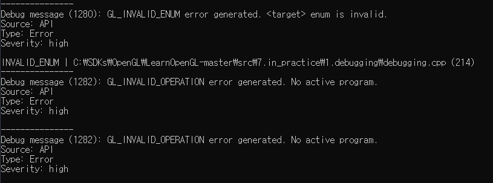
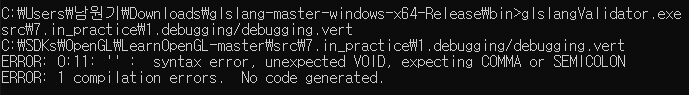

# Debugging

OpenGL 에서 디버깅하는 몇가지 기술과 요령을 알아본다.

## Result

* OpenGL 디버그 확장



* GLSL 유효성 검사기



## glGetError

> GLenum glGetError(void);

바로 직전에 호출한 gl 함수에 대해서 오류 여부를 판단하고, 오류 플래그를 반환한다. 이 함수는 별도로 출력이 되지 않기 때문에 체크후에 출력에 대한 코드가 필요하다. 또한 `glGetError()`가 호출되고 플래그가 `GL_NO_ERROR`로 재설정될 때까지 다른 오류는 기록되지 않는다.

[오류 플래그](https://www.khronos.org/registry/OpenGL-Refpages/gl4/html/glGetError.xhtml)

오류 플래그에 대한 별도의 출력이나, 한번 세트된 플래그가 초기화가 되지 않기 때문에 보통 사용하기 쉽게 함수로 만들어 사용한다

```cpp
GLenum glCheckError_(const char *file, int line)
{
    GLenum errorCode;
    while ((errorCode = glGetError()) != GL_NO_ERROR)
    {
        std::string error;
        switch (errorCode)
        {
            case GL_INVALID_ENUM:                  error = "INVALID_ENUM"; break;
            case GL_INVALID_VALUE:                 error = "INVALID_VALUE"; break;
            case GL_INVALID_OPERATION:             error = "INVALID_OPERATION"; break;
            case GL_STACK_OVERFLOW:                error = "STACK_OVERFLOW"; break;
            case GL_STACK_UNDERFLOW:               error = "STACK_UNDERFLOW"; break;
            case GL_OUT_OF_MEMORY:                 error = "OUT_OF_MEMORY"; break;
            case GL_INVALID_FRAMEBUFFER_OPERATION: error = "INVALID_FRAMEBUFFER_OPERATION"; break;
        }
        std::cout << error << " | " << file << " (" << line << ")" << std::endl;
    }
    return errorCode;
}
#define glCheckError() glCheckError_(__FILE__, __LINE__)
```

## Debug Output

OpenGL 4.3 버전 이후에는 디버그 확장 기능이 존재한다. 해당 기능을 사용하면 OpenGL 자체가 오류 또는 경고 메시지를 사용자에게 직접 전송한다.

먼저 GLFW에 디버그 컨텍스트를 요청해야 한다.

```cpp
glfwWindowHint(GLFW_OPENGL_DEBUG_CONTEXT, GL_TRUE);
```

디버그 컨텍스트를 성공적으로 초기화했는지 확인할 수 있다.
성공했다면 OpenGL에 오류 로깅 콜백 함수를 전달하고 콜백 함수에서 데이터를 콘솔에 표시하도록 처리한다.

```cpp
GLint flags;
glGetIntegerv(GL_CONTEXT_FLAGS, &flags);
    if (flags & GL_CONTEXT_FLAG_DEBUG_BIT)
    {
        glEnable(GL_DEBUG_OUTPUT);
        glEnable(GL_DEBUG_OUTPUT_SYNCHRONOUS); // makes sure errors are displayed synchronously
        glDebugMessageCallback(glDebugOutput, nullptr);
        glDebugMessageControl(GL_DONT_CARE, GL_DONT_CARE, GL_DONT_CARE, 0, nullptr, GL_TRUE);
    }
```
```cpp
void APIENTRY glDebugOutput(GLenum source, 
                            GLenum type, 
                            GLuint id, 
                            GLenum severity, 
                            GLsizei length, 
                            const GLchar *message, 
                            const void *userParam)
```

## GLSL 유효성 검사기

glsl 유효성 검사기를 통해 첫번째 인수로 셰이더 코드를 전달하여 문제가 없는지 확인이 가능하다. 이 유효성 검사기는 확장자를 통해 셰이더의 유형을 결정한다.

* .vert : 버텍스 셰이더
* .frag : 조각 셰이더
* .geom : 지오메트리 셰이더
* .tesc : 테셀레이션 컨트롤 셰이더
* .tese : 테셀레이션 평가 셰이더
* .comp : 셰이더를 계산한다.

```
glslagnValidater.exe debugging.vert
```

## Code

```cpp
#include <glad/glad.h>
#include <GLFW/glfw3.h>
#include <stb_image.h>

#include <glm/glm.hpp>
#include <glm/gtc/matrix_transform.hpp>
#include <glm/gtc/type_ptr.hpp>

#include <learnopengl/filesystem.h>
#include <learnopengl/shader.h>

#include <iostream>

void framebuffer_size_callback(GLFWwindow* window, int width, int height);
void processInput(GLFWwindow *window);

// settings
const unsigned int SCR_WIDTH = 1280;
const unsigned int SCR_HEIGHT = 720;


GLenum glCheckError_(const char *file, int line)
{
    GLenum errorCode;
    while ((errorCode = glGetError()) != GL_NO_ERROR)
    {
        std::string error;
        switch (errorCode)
        {
            case GL_INVALID_ENUM:                  error = "INVALID_ENUM"; break;
            case GL_INVALID_VALUE:                 error = "INVALID_VALUE"; break;
            case GL_INVALID_OPERATION:             error = "INVALID_OPERATION"; break;
            case GL_STACK_OVERFLOW:                error = "STACK_OVERFLOW"; break;
            case GL_STACK_UNDERFLOW:               error = "STACK_UNDERFLOW"; break;
            case GL_OUT_OF_MEMORY:                 error = "OUT_OF_MEMORY"; break;
            case GL_INVALID_FRAMEBUFFER_OPERATION: error = "INVALID_FRAMEBUFFER_OPERATION"; break;
        }
        std::cout << error << " | " << file << " (" << line << ")" << std::endl;
    }
    return errorCode;
}
#define glCheckError() glCheckError_(__FILE__, __LINE__)

void APIENTRY glDebugOutput(GLenum source, 
                            GLenum type, 
                            GLuint id, 
                            GLenum severity, 
                            GLsizei length, 
                            const GLchar *message, 
                            const void *userParam)
{
    if(id == 131169 || id == 131185 || id == 131218 || id == 131204) return; // ignore these non-significant error codes

    std::cout << "---------------" << std::endl;
    std::cout << "Debug message (" << id << "): " <<  message << std::endl;

    switch (source)
    {
        case GL_DEBUG_SOURCE_API:             std::cout << "Source: API"; break;
        case GL_DEBUG_SOURCE_WINDOW_SYSTEM:   std::cout << "Source: Window System"; break;
        case GL_DEBUG_SOURCE_SHADER_COMPILER: std::cout << "Source: Shader Compiler"; break;
        case GL_DEBUG_SOURCE_THIRD_PARTY:     std::cout << "Source: Third Party"; break;
        case GL_DEBUG_SOURCE_APPLICATION:     std::cout << "Source: Application"; break;
        case GL_DEBUG_SOURCE_OTHER:           std::cout << "Source: Other"; break;
    } std::cout << std::endl;

    switch (type)
    {
        case GL_DEBUG_TYPE_ERROR:               std::cout << "Type: Error"; break;
        case GL_DEBUG_TYPE_DEPRECATED_BEHAVIOR: std::cout << "Type: Deprecated Behaviour"; break;
        case GL_DEBUG_TYPE_UNDEFINED_BEHAVIOR:  std::cout << "Type: Undefined Behaviour"; break; 
        case GL_DEBUG_TYPE_PORTABILITY:         std::cout << "Type: Portability"; break;
        case GL_DEBUG_TYPE_PERFORMANCE:         std::cout << "Type: Performance"; break;
        case GL_DEBUG_TYPE_MARKER:              std::cout << "Type: Marker"; break;
        case GL_DEBUG_TYPE_PUSH_GROUP:          std::cout << "Type: Push Group"; break;
        case GL_DEBUG_TYPE_POP_GROUP:           std::cout << "Type: Pop Group"; break;
        case GL_DEBUG_TYPE_OTHER:               std::cout << "Type: Other"; break;
    } std::cout << std::endl;
    
    switch (severity)
    {
        case GL_DEBUG_SEVERITY_HIGH:         std::cout << "Severity: high"; break;
        case GL_DEBUG_SEVERITY_MEDIUM:       std::cout << "Severity: medium"; break;
        case GL_DEBUG_SEVERITY_LOW:          std::cout << "Severity: low"; break;
        case GL_DEBUG_SEVERITY_NOTIFICATION: std::cout << "Severity: notification"; break;
    } std::cout << std::endl;
    std::cout << std::endl;
}

int main()
{
    // glfw: initialize and configure
    // ------------------------------
    glfwInit();
    glfwWindowHint(GLFW_CONTEXT_VERSION_MAJOR, 3);
    glfwWindowHint(GLFW_CONTEXT_VERSION_MINOR, 3);
    glfwWindowHint(GLFW_OPENGL_PROFILE, GLFW_OPENGL_CORE_PROFILE);
    glfwWindowHint(GLFW_OPENGL_DEBUG_CONTEXT, GL_TRUE); // comment this line in a release build! 

#ifdef __APPLE__
    glfwWindowHint(GLFW_OPENGL_FORWARD_COMPAT, GL_TRUE); // uncomment this statement to fix compilation on OS X
#endif

    // glfw window creation
    // --------------------
    GLFWwindow* window = glfwCreateWindow(SCR_WIDTH, SCR_HEIGHT, "LearnOpenGL", NULL, NULL);
    glfwMakeContextCurrent(window);
    if (window == NULL)
    {
        std::cout << "Failed to create GLFW window" << std::endl;
        glfwTerminate();
        return -1;
    }
    glfwSetFramebufferSizeCallback(window, framebuffer_size_callback);

    // tell GLFW to capture our mouse
    glfwSetInputMode(window, GLFW_CURSOR, GLFW_CURSOR_DISABLED);

    // glad: load all OpenGL function pointers
    // ---------------------------------------
    if (!gladLoadGLLoader((GLADloadproc)glfwGetProcAddress))
    {
        std::cout << "Failed to initialize GLAD" << std::endl;
        return -1;
    }

    // enable OpenGL debug context if context allows for debug context
    GLint flags; glGetIntegerv(GL_CONTEXT_FLAGS, &flags);
    if (flags & GL_CONTEXT_FLAG_DEBUG_BIT)
    {
        glEnable(GL_DEBUG_OUTPUT);
        glEnable(GL_DEBUG_OUTPUT_SYNCHRONOUS); // makes sure errors are displayed synchronously
        glDebugMessageCallback(glDebugOutput, nullptr);
        glDebugMessageControl(GL_DONT_CARE, GL_DONT_CARE, GL_DONT_CARE, 0, nullptr, GL_TRUE);
    }

    // configure global opengl state
    // -----------------------------
    glEnable(GL_DEPTH_TEST);
    glEnable(GL_CULL_FACE);
 
    // OpenGL initial state
    Shader shader("debugging.vs", "debugging.fs");

    // configure 3D cube
    GLuint cubeVAO, cubeVBO;
    GLfloat vertices[] = {
         // back face
        -0.5f, -0.5f, -0.5f,  0.0f,  0.0f, // Bottom-left
         0.5f,  0.5f, -0.5f,  1.0f,  1.0f, // top-right
         0.5f, -0.5f, -0.5f,  1.0f,  0.0f, // bottom-right         
         0.5f,  0.5f, -0.5f,  1.0f,  1.0f, // top-right
        -0.5f, -0.5f, -0.5f,  0.0f,  0.0f, // bottom-left
        -0.5f,  0.5f, -0.5f,  0.0f,  1.0f, // top-left
         // front face
        -0.5f, -0.5f,  0.5f,  0.0f,  0.0f, // bottom-left
         0.5f, -0.5f,  0.5f,  1.0f,  0.0f, // bottom-right
         0.5f,  0.5f,  0.5f,  1.0f,  1.0f, // top-right
         0.5f,  0.5f,  0.5f,  1.0f,  1.0f, // top-right
        -0.5f,  0.5f,  0.5f,  0.0f,  1.0f, // top-left
        -0.5f, -0.5f,  0.5f,  0.0f,  0.0f, // bottom-left
         // left face
        -0.5f,  0.5f,  0.5f, -1.0f,  0.0f, // top-right
        -0.5f,  0.5f, -0.5f, -1.0f,  1.0f, // top-left
        -0.5f, -0.5f, -0.5f, -0.0f,  1.0f, // bottom-left
        -0.5f, -0.5f, -0.5f, -0.0f,  1.0f, // bottom-left
        -0.5f, -0.5f,  0.5f, -0.0f,  0.0f, // bottom-right
        -0.5f,  0.5f,  0.5f, -1.0f,  0.0f, // top-right
         // right face
         0.5f,  0.5f,  0.5f,  1.0f,  0.0f, // top-left
         0.5f, -0.5f, -0.5f,  0.0f,  1.0f, // bottom-right
         0.5f,  0.5f, -0.5f,  1.0f,  1.0f, // top-right         
         0.5f, -0.5f, -0.5f,  0.0f,  1.0f, // bottom-right
         0.5f,  0.5f,  0.5f,  1.0f,  0.0f, // top-left
         0.5f, -0.5f,  0.5f,  0.0f,  0.0f, // bottom-left     
         // bottom face
        -0.5f, -0.5f, -0.5f,  0.0f,  1.0f, // top-right
         0.5f, -0.5f, -0.5f,  1.0f,  1.0f, // top-left
         0.5f, -0.5f,  0.5f,  1.0f,  0.0f, // bottom-left
         0.5f, -0.5f,  0.5f,  1.0f,  0.0f, // bottom-left
        -0.5f, -0.5f,  0.5f,  0.0f,  0.0f, // bottom-right
        -0.5f, -0.5f, -0.5f,  0.0f,  1.0f, // top-right
         // top face
        -0.5f,  0.5f, -0.5f,  0.0f,  1.0f, // top-left
         0.5f,  0.5f,  0.5f,  1.0f,  0.0f, // bottom-right
         0.5f,  0.5f, -0.5f,  1.0f,  1.0f, // top-right     
         0.5f,  0.5f,  0.5f,  1.0f,  0.0f, // bottom-right
        -0.5f,  0.5f, -0.5f,  0.0f,  1.0f, // top-left
        -0.5f,  0.5f,  0.5f,  0.0f,  0.0f  // bottom-left        
    };
    glGenVertexArrays(1, &cubeVAO);
    glGenBuffers(1, &cubeVBO);
    // fill buffer
    glBindBuffer(GL_ARRAY_BUFFER, cubeVBO);
    glBufferData(GL_ARRAY_BUFFER, sizeof(vertices), vertices, GL_STATIC_DRAW);
    // link vertex attributes
    glBindVertexArray(cubeVAO);
    glEnableVertexAttribArray(0);
    glVertexAttribPointer(0, 3, GL_FLOAT, GL_FALSE, 5 * sizeof(GLfloat), (GLvoid*)0);
    glEnableVertexAttribArray(1);
    glVertexAttribPointer(1, 2, GL_FLOAT, GL_FALSE, 5 * sizeof(GLfloat), (GLvoid*)(3 * sizeof(GLfloat)));
    glBindBuffer(GL_ARRAY_BUFFER, 0);
    glBindVertexArray(0);

    // load cube texture
    unsigned int texture;
    glGenTextures(1, &texture);
    glBindTexture(GL_TEXTURE_2D, texture);
    int width, height, nrComponents;
    unsigned char *data = stbi_load(FileSystem::getPath("resources/textures/wood.png").c_str(), &width, &height, &nrComponents, 0);
    if (data)
    {
        glTexImage2D(GL_FRAMEBUFFER, 0, GL_RGB, width, height, 0, GL_RGB, GL_UNSIGNED_BYTE, data);
        glGenerateMipmap(GL_TEXTURE_2D);

        glTexParameteri(GL_TEXTURE_2D, GL_TEXTURE_WRAP_S, GL_REPEAT);
        glTexParameteri(GL_TEXTURE_2D, GL_TEXTURE_WRAP_T, GL_REPEAT);
        glTexParameteri(GL_TEXTURE_2D, GL_TEXTURE_MIN_FILTER, GL_LINEAR_MIPMAP_LINEAR);
        glTexParameteri(GL_TEXTURE_2D, GL_TEXTURE_MAG_FILTER, GL_LINEAR);
    }
    else
    {
        std::cout << "Failed to load texture" << std::endl;
    }
    stbi_image_free(data);

    // set up projection matrix
    glm::mat4 projection = glm::perspective(glm::radians(45.0f), (float)SCR_WIDTH / (float)SCR_HEIGHT, 0.1f, 10.0f);
    glUniformMatrix4fv(glGetUniformLocation(shader.ID, "projection"), 1, GL_FALSE, glm::value_ptr(projection));
    glUniform1i(glGetUniformLocation(shader.ID, "tex"), 0);

    // render loop
    // -----------
    while (!glfwWindowShouldClose(window))
    {
        // input
        // -----
        processInput(window);

        // render
        // ------
        glClearColor(0.0f, 0.0f, 0.0f, 1.0f);
        glClear(GL_COLOR_BUFFER_BIT | GL_DEPTH_BUFFER_BIT);

        shader.use();
        GLfloat rotationSpeed = 10.0f;
        GLfloat angle = (float)glfwGetTime() * rotationSpeed;
        glm::mat4 model = glm::mat4(1.0f);
        model = glm::translate(model, glm::vec3(0.0, 0.0f, -2.5));
        model = glm::rotate(model, glm::radians(angle), glm::vec3(1.0f, 1.0f, 1.0f));
        glUniformMatrix4fv(glGetUniformLocation(shader.ID, "model"), 1, GL_FALSE, glm::value_ptr(model));

        glBindTexture(GL_TEXTURE_2D, texture);
        glBindVertexArray(cubeVAO);
            glDrawArrays(GL_TRIANGLES, 0, 36);
        glBindVertexArray(0);

        // glfw: swap buffers and poll IO events (keys pressed/released, mouse moved etc.)
        // -------------------------------------------------------------------------------
        glfwSwapBuffers(window);
        glfwPollEvents();
    }

    glfwTerminate();
    return 0;
}
unsigned int quadVAO = 0;
unsigned int quadVBO;
void renderQuad()
{
    if (quadVAO == 0)
    {
        float quadVertices[] = {
            // positions        // texture Coords
            -1.0f,  1.0f, 0.0f, 0.0f, 1.0f,
            -1.0f, -1.0f, 0.0f, 0.0f, 0.0f,
            1.0f,  1.0f, 0.0f, 1.0f, 1.0f,
            1.0f, -1.0f, 0.0f, 1.0f, 0.0f,
        };
        // setup plane VAO
        glGenVertexArrays(1, &quadVAO);
        glGenBuffers(1, &quadVBO);
        glBindVertexArray(quadVAO);
        glBindBuffer(GL_ARRAY_BUFFER, quadVBO);
        glBufferData(GL_ARRAY_BUFFER, sizeof(quadVertices), &quadVertices, GL_STATIC_DRAW);
        glEnableVertexAttribArray(0);
        glVertexAttribPointer(0, 3, GL_FLOAT, GL_FALSE, 5 * sizeof(float), (void*)0);
        glEnableVertexAttribArray(1);
        glVertexAttribPointer(1, 2, GL_FLOAT, GL_FALSE, 5 * sizeof(float), (void*)(3 * sizeof(float)));
    }
    glBindVertexArray(quadVAO);
    glDrawArrays(GL_TRIANGLE_STRIP, 0, 4);
    glBindVertexArray(0);
}
void processInput(GLFWwindow *window)
{
    if (glfwGetKey(window, GLFW_KEY_ESCAPE) == GLFW_PRESS)
        glfwSetWindowShouldClose(window, true);
}

// glfw: whenever the window size changed (by OS or user resize) this callback function executes
// ---------------------------------------------------------------------------------------------
void framebuffer_size_callback(GLFWwindow* window, int width, int height)
{
    // make sure the viewport matches the new window dimensions; note that width and 
    // height will be significantly larger than specified on retina displays.
    glViewport(0, 0, width, height);
}
```