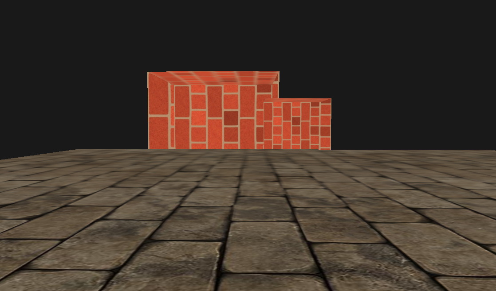
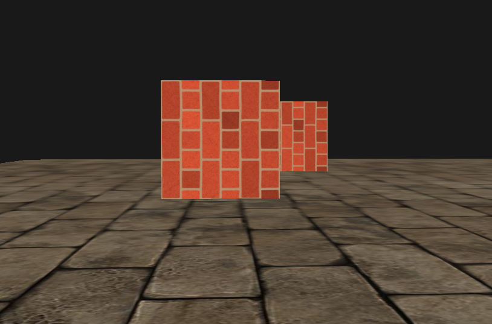
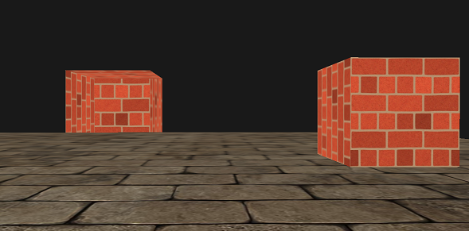

# Depth Testing

## Result

* GL_AWAYS : 깊이 테스트 무조건 통과



* GL_LESS : fragment의 깊이 값이 저장된 깊이 값보다 작을경우 통과



* 마스킹을 통해 특정 물체만 `depth test` 적용



## Depth Buffer

각 fragment 들의 깊이 정보를 저장하는 버퍼, 조건에 따라 fragment의 깊이 값을 테스트하며 통과하면 새로운 깊이 값으로 갱신되고, 실패할경우 해당 fragment는 폐기시킨다. OpenGL은 기본적으로 비활성화 되어있음

`depth test` 를 활성화 하려면 `GL_DEPTH_TEST` 옵션을 사용하여 활성화 시켜주어야 함

> glEnable(GL_DEPTH_TEST);

또한 `depth test` 를 활성화 했다면 각 렌더링 루프가 수행될 때 마다 `GL_DEPTH_BUFFER_BIT` 옵션을 사용하여 깊이 버퍼를 비워주어야 한다.

> glClear(GL_DEPTH_BUFFER_BIT)

특정 물체에만 `depth test` 를 적용하고 싶다면 read-only 깊이 버퍼를 사용한다.

> glDepthMask(GL_FALSE)

## Depth Test 함수

OpenGL은 `depth test` 에서 사용하는 비교 연산을 조정할 수 있도록 해준다. 이는 fragment를 어떤 조건에서 통과 혹은 페기 시켜야할지를 조정할 수 있도록 한다.

> glDepthFunc(GL_LESS) 기본값

| 조건 | 의미 |
|---|:---:|
| GL_AWAYS | depth test가 항상 통과됩니다. |
| GL_NEVER | depth test가 절대 통과되지 않습니다. |
| GL_LESS |  fragment의 깊이 값이 저장된 깊이 값보다 작을 경우 통과시킵니다.|
| GL_EQUAL | fragment의 깊이 값이 저장된 깊이 값과 동일한 경우 통과시킵니다. |
| GL_LEQUAL | fragment의 깊이 값이 저장된 깂이 값과 동일하거나 작을 경우 통과시킵니다. |
| GL_GREATER | fragment의 깊이 값이 저장된 깊이 값보다 클 경우 통과시킵니다. |
| GL_NOTEQUAL | fragment의 깊이 값이 저장된 깊이 값과 동일하지 않을 경우 통과시킵니다. |
|  GL_GEQUAL| fragment의 깊이 값이 저장된 깊이 값과 동일하거나 클 경우 통과시킵니다. |

## Code

```cpp
#include <glad/glad.h>
#include <GLFW/glfw3.h>
#include <stb_image.h>

#include <glm/glm.hpp>
#include <glm/gtc/matrix_transform.hpp>
#include <glm/gtc/type_ptr.hpp>

#include <learnopengl/filesystem.h>
#include <learnopengl/shader.h>
#include <learnopengl/camera.h>
#include <learnopengl/model.h>

#include <iostream>

void framebuffer_size_callback(GLFWwindow* window, int width, int height);
void mouse_callback(GLFWwindow* window, double xpos, double ypos);
void scroll_callback(GLFWwindow* window, double xoffset, double yoffset);
void processInput(GLFWwindow *window);
unsigned int loadTexture(const char *path);

// settings
const unsigned int SCR_WIDTH = 1280;
const unsigned int SCR_HEIGHT = 720;

// camera
Camera camera(glm::vec3(0.0f, 0.0f, 3.0f));
float lastX = (float)SCR_WIDTH  / 2.0;
float lastY = (float)SCR_HEIGHT / 2.0;
bool firstMouse = true;

// timing
float deltaTime = 0.0f;
float lastFrame = 0.0f;

int main()
{
    // glfw: initialize and configure
    // ------------------------------
    glfwInit();
    glfwWindowHint(GLFW_CONTEXT_VERSION_MAJOR, 3);
    glfwWindowHint(GLFW_CONTEXT_VERSION_MINOR, 3);
    glfwWindowHint(GLFW_OPENGL_PROFILE, GLFW_OPENGL_CORE_PROFILE);

#ifdef __APPLE__
    glfwWindowHint(GLFW_OPENGL_FORWARD_COMPAT, GL_TRUE); // uncomment this statement to fix compilation on OS X
#endif

    // glfw window creation
    // --------------------
    GLFWwindow* window = glfwCreateWindow(SCR_WIDTH, SCR_HEIGHT, "LearnOpenGL", NULL, NULL);
    if (window == NULL)
    {
        std::cout << "Failed to create GLFW window" << std::endl;
        glfwTerminate();
        return -1;
    }
    glfwMakeContextCurrent(window);
    glfwSetFramebufferSizeCallback(window, framebuffer_size_callback);
    glfwSetCursorPosCallback(window, mouse_callback);
    glfwSetScrollCallback(window, scroll_callback);

    // tell GLFW to capture our mouse
    glfwSetInputMode(window, GLFW_CURSOR, GLFW_CURSOR_DISABLED);

    // glad: load all OpenGL function pointers
    // ---------------------------------------
    if (!gladLoadGLLoader((GLADloadproc)glfwGetProcAddress))
    {
        std::cout << "Failed to initialize GLAD" << std::endl;
        return -1;
    }

    // configure global opengl state
    // -----------------------------
    glEnable(GL_DEPTH_TEST);
	//glDepthFunc(GL_ALWAYS); // always pass the depth test (same effect as glDisable(GL_DEPTH_TEST))
    glDepthFunc(GL_LESS); 

    // build and compile shaders
    // -------------------------
    Shader shader("1.1.depth_testing.vs", "1.1.depth_testing.fs");

    // set up vertex data (and buffer(s)) and configure vertex attributes
    // ------------------------------------------------------------------
    float cubeVertices[] = {
        // positions          // texture Coords
        -0.5f, -0.5f, -0.5f,  1.0f, 0.0f,
         0.5f, -0.5f, -0.5f,  1.0f, 0.0f,
         0.5f,  0.5f, -0.5f,  1.0f, 1.0f,
         0.5f,  0.5f, -0.5f,  1.0f, 1.0f,
        -0.5f,  0.5f, -0.5f,  0.0f, 1.0f,
        -0.5f, -0.5f, -0.5f,  0.0f, 0.0f,

        -0.5f, -0.5f,  0.5f,  0.0f, 0.0f,
         0.5f, -0.5f,  0.5f,  1.0f, 0.0f,
         0.5f,  0.5f,  0.5f,  1.0f, 1.0f,
         0.5f,  0.5f,  0.5f,  1.0f, 1.0f,
        -0.5f,  0.5f,  0.5f,  0.0f, 1.0f,
        -0.5f, -0.5f,  0.5f,  0.0f, 0.0f,

        -0.5f,  0.5f,  0.5f,  1.0f, 0.0f,
        -0.5f,  0.5f, -0.5f,  1.0f, 1.0f,
        -0.5f, -0.5f, -0.5f,  0.0f, 1.0f,
        -0.5f, -0.5f, -0.5f,  0.0f, 1.0f,
        -0.5f, -0.5f,  0.5f,  0.0f, 0.0f,
        -0.5f,  0.5f,  0.5f,  1.0f, 0.0f,

         0.5f,  0.5f,  0.5f,  1.0f, 0.0f,
         0.5f,  0.5f, -0.5f,  1.0f, 1.0f,
         0.5f, -0.5f, -0.5f,  0.0f, 1.0f,
         0.5f, -0.5f, -0.5f,  0.0f, 1.0f,
         0.5f, -0.5f,  0.5f,  0.0f, 0.0f,
         0.5f,  0.5f,  0.5f,  1.0f, 0.0f,

        -0.5f, -0.5f, -0.5f,  0.0f, 1.0f,
         0.5f, -0.5f, -0.5f,  1.0f, 1.0f,
         0.5f, -0.5f,  0.5f,  1.0f, 0.0f,
         0.5f, -0.5f,  0.5f,  1.0f, 0.0f,
        -0.5f, -0.5f,  0.5f,  0.0f, 0.0f,
        -0.5f, -0.5f, -0.5f,  0.0f, 1.0f,

        -0.5f,  0.5f, -0.5f,  0.0f, 1.0f,
         0.5f,  0.5f, -0.5f,  1.0f, 1.0f,
         0.5f,  0.5f,  0.5f,  1.0f, 0.0f,
         0.5f,  0.5f,  0.5f,  1.0f, 0.0f,
        -0.5f,  0.5f,  0.5f,  0.0f, 0.0f,
        -0.5f,  0.5f, -0.5f,  0.0f, 1.0f
    };
    float planeVertices[] = {
        // positions          // texture Coords (note we set these higher than 1 (together with GL_REPEAT as texture wrapping mode). this will cause the floor texture to repeat)
         5.0f, -0.5f,  5.0f,  2.0f, 0.0f,
        -5.0f, -0.5f,  5.0f,  0.0f, 0.0f,
        -5.0f, -0.5f, -5.0f,  0.0f, 2.0f,

         5.0f, -0.5f,  5.0f,  2.0f, 0.0f,
        -5.0f, -0.5f, -5.0f,  0.0f, 2.0f,
         5.0f, -0.5f, -5.0f,  2.0f, 2.0f								
    };
    // cube VAO
    unsigned int cubeVAO, cubeVBO;
    glGenVertexArrays(1, &cubeVAO);
    glGenBuffers(1, &cubeVBO);
    glBindVertexArray(cubeVAO);
    glBindBuffer(GL_ARRAY_BUFFER, cubeVBO);
    glBufferData(GL_ARRAY_BUFFER, sizeof(cubeVertices), &cubeVertices, GL_STATIC_DRAW);
    glEnableVertexAttribArray(0);
    glVertexAttribPointer(0, 3, GL_FLOAT, GL_FALSE, 5 * sizeof(float), (void*)0);
    glEnableVertexAttribArray(1);
    glVertexAttribPointer(1, 2, GL_FLOAT, GL_FALSE, 5 * sizeof(float), (void*)(3 * sizeof(float)));
    glBindVertexArray(0);
    // plane VAO
    unsigned int planeVAO, planeVBO;
    glGenVertexArrays(1, &planeVAO);
    glGenBuffers(1, &planeVBO);
    glBindVertexArray(planeVAO);
    glBindBuffer(GL_ARRAY_BUFFER, planeVBO);
    glBufferData(GL_ARRAY_BUFFER, sizeof(planeVertices), &planeVertices, GL_STATIC_DRAW);
    glEnableVertexAttribArray(0);
    glVertexAttribPointer(0, 3, GL_FLOAT, GL_FALSE, 5 * sizeof(float), (void*)0);
    glEnableVertexAttribArray(1);
    glVertexAttribPointer(1, 2, GL_FLOAT, GL_FALSE, 5 * sizeof(float), (void*)(3 * sizeof(float)));
    glBindVertexArray(0);

    // load textures
    // -------------
    unsigned int cubeTexture  = loadTexture(FileSystem::getPath("resources/textures/bricks2.jpg").c_str());
    unsigned int floorTexture = loadTexture(FileSystem::getPath("resources/textures/brickwall.jpg").c_str());

    // shader configuration
    // --------------------
    shader.use();
    shader.setInt("texture1", 0);

    // render loop
    // -----------
    while(!glfwWindowShouldClose(window))
    {
        // per-frame time logic
        // --------------------
        float currentFrame = glfwGetTime();
        deltaTime = currentFrame - lastFrame;
        lastFrame = currentFrame;

        // input
        // -----
        processInput(window);

        // render
        // ------
        glClearColor(0.1f, 0.1f, 0.1f, 1.0f);
        glClear(GL_COLOR_BUFFER_BIT | GL_DEPTH_BUFFER_BIT);

        shader.use();
        glm::mat4 model = glm::mat4(1.0f);
        glm::mat4 view = camera.GetViewMatrix();
        glm::mat4 projection = glm::perspective(glm::radians(camera.Zoom), (float)SCR_WIDTH / (float)SCR_HEIGHT, 0.1f, 100.0f);
        shader.setMat4("view", view);
        shader.setMat4("projection", projection);
        // cubes
        glBindVertexArray(cubeVAO);
        glActiveTexture(GL_TEXTURE0);
        glBindTexture(GL_TEXTURE_2D, cubeTexture); 	
        model = glm::translate(model, glm::vec3(-1.0f, 0.0f, -1.0f));
        shader.setMat4("model", model);
        glDrawArrays(GL_TRIANGLES, 0, 36);
        model = glm::mat4(1.0f);
        model = glm::translate(model, glm::vec3(2.0f, 0.0f, 0.0f));
        shader.setMat4("model", model);
        glDrawArrays(GL_TRIANGLES, 0, 36);
        // floor
        glBindVertexArray(planeVAO);
        glBindTexture(GL_TEXTURE_2D, floorTexture);
        shader.setMat4("model", glm::mat4(1.0f));
        glDrawArrays(GL_TRIANGLES, 0, 6);
        glBindVertexArray(0);

        // glfw: swap buffers and poll IO events (keys pressed/released, mouse moved etc.)
        // -------------------------------------------------------------------------------
        glfwSwapBuffers(window);
        glfwPollEvents();
    }

    // optional: de-allocate all resources once they've outlived their purpose:
    // ------------------------------------------------------------------------
    glDeleteVertexArrays(1, &cubeVAO);
    glDeleteVertexArrays(1, &planeVAO);
    glDeleteBuffers(1, &cubeVBO);
    glDeleteBuffers(1, &planeVBO);

    glfwTerminate();
    return 0;
}

// process all input: query GLFW whether relevant keys are pressed/released this frame and react accordingly
// ---------------------------------------------------------------------------------------------------------
void processInput(GLFWwindow *window)
{
    if (glfwGetKey(window, GLFW_KEY_ESCAPE) == GLFW_PRESS)
        glfwSetWindowShouldClose(window, true);

    if (glfwGetKey(window, GLFW_KEY_W) == GLFW_PRESS)
        camera.ProcessKeyboard(FORWARD, deltaTime);
    if (glfwGetKey(window, GLFW_KEY_S) == GLFW_PRESS)
        camera.ProcessKeyboard(BACKWARD, deltaTime);
    if (glfwGetKey(window, GLFW_KEY_A) == GLFW_PRESS)
        camera.ProcessKeyboard(LEFT, deltaTime);
    if (glfwGetKey(window, GLFW_KEY_D) == GLFW_PRESS)
        camera.ProcessKeyboard(RIGHT, deltaTime);
}

// glfw: whenever the window size changed (by OS or user resize) this callback function executes
// ---------------------------------------------------------------------------------------------
void framebuffer_size_callback(GLFWwindow* window, int width, int height)
{
    // make sure the viewport matches the new window dimensions; note that width and 
    // height will be significantly larger than specified on retina displays.
    glViewport(0, 0, width, height);
}

// glfw: whenever the mouse moves, this callback is called
// -------------------------------------------------------
void mouse_callback(GLFWwindow* window, double xpos, double ypos)
{
    if (firstMouse)
    {
        lastX = xpos;
        lastY = ypos;
        firstMouse = false;
    }

    float xoffset = xpos - lastX;
    float yoffset = lastY - ypos; // reversed since y-coordinates go from bottom to top

    lastX = xpos;
    lastY = ypos;

    camera.ProcessMouseMovement(xoffset, yoffset);
}

// glfw: whenever the mouse scroll wheel scrolls, this callback is called
// ----------------------------------------------------------------------
void scroll_callback(GLFWwindow* window, double xoffset, double yoffset)
{
    camera.ProcessMouseScroll(yoffset);
}

// utility function for loading a 2D texture from file
// ---------------------------------------------------
unsigned int loadTexture(char const *path)
{
    unsigned int textureID;
    glGenTextures(1, &textureID);

    int width, height, nrComponents;
    unsigned char *data = stbi_load(path, &width, &height, &nrComponents, 0);
    if (data)
    {
        GLenum format;
        if (nrComponents == 1)
            format = GL_RED;
        else if (nrComponents == 3)
            format = GL_RGB;
        else if (nrComponents == 4)
            format = GL_RGBA;

        glBindTexture(GL_TEXTURE_2D, textureID);
        glTexImage2D(GL_TEXTURE_2D, 0, format, width, height, 0, format, GL_UNSIGNED_BYTE, data);
        glGenerateMipmap(GL_TEXTURE_2D);

        glTexParameteri(GL_TEXTURE_2D, GL_TEXTURE_WRAP_S, GL_REPEAT);
        glTexParameteri(GL_TEXTURE_2D, GL_TEXTURE_WRAP_T, GL_REPEAT);
        glTexParameteri(GL_TEXTURE_2D, GL_TEXTURE_MIN_FILTER, GL_LINEAR_MIPMAP_LINEAR);
        glTexParameteri(GL_TEXTURE_2D, GL_TEXTURE_MAG_FILTER, GL_LINEAR);

        stbi_image_free(data);
    }
    else
    {
        std::cout << "Texture failed to load at path: " << path << std::endl;
        stbi_image_free(data);
    }

    return textureID;
}

```