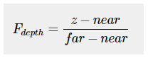

# Depth Testing View

## Result

* 비선형 그래프를 나타내는 깊이값 시각화


* 선형 그래프를 나타내는 깊이값 시각화


## Depth Value Precision

깊이 버퍼는 0.0과 1.0 사이의 깊이 값을 가지고 있고, 보여지는 모든 물체들의 z값과 비교된다. 이 `view space`의 `z`값들은 `projection frustum`의 `near`, `far` 사이의 어떠한 값이 될 수 있다. 따라서 `z`값들을 [0,1] 범위로 변환하는 방법이 필요하다.



다음 방정식을 통해 변환된 z값과 깊이값의 관계는 다음 그래프와 같다.


하지만 이와 같은 `선형 깊이 버퍼` 방식은 일반적으로 사용되지 않는다. 

올바른 투영 특성을 위해 `비선형 깊이 버퍼` 방식이 사용된다. 이것은 기본적으로 z값이 작을 때 큰 정밀도를 가지고, z값이 클 때 정밀도가 떨어지게 한다. 왜냐하면 아주 가까이 있는 물체와 굉장히 멀리 있는 물체의 깊이 값 정밀도가 동일할 필요가 없기 때문이다.

거리에 따른 정밀도를 염두한 방정식은 다음과 같다.


다음 방정식은 1/z 와 비례하며 z값과 깊이값의 관계는 다음과 같다.


## Code

```cpp
// 비선형 방식
void main()
{             
    FragColor = vec4(vec3(gl_FragCoord.z), 1.0);
}

// 선형 방식
#version 330 core
out vec4 FragColor;

float near = 0.1; 
float far = 100.0; 
float LinearizeDepth(float depth) 
{
    float z = depth * 2.0 - 1.0; // back to NDC 
    return (2.0 * near * far) / (far + near - z * (far - near));	
}

void main()
{             
    float depth = LinearizeDepth(gl_FragCoord.z) / far; // divide by far to get depth in range [0,1] for visualization purposes
    FragColor = vec4(vec3(depth), 1.0);
}
```