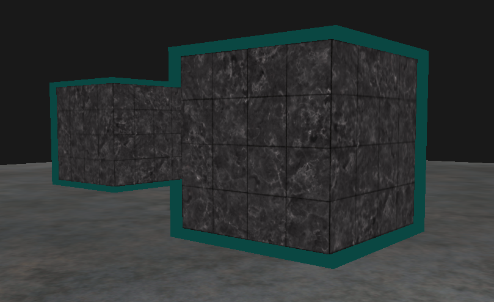

# Stencil Testing

## Result



## Stencil Buffer

fragment 처리중 `depth test` 와 비슷한 `stencil test` 라고 불리는 작업이 수행된다. 일반적으로 8비트의 stencil value를 가지고 있고 이 값을 설정하여 특정한 stencil 값을 가지고 있는 해당 fragment를 폐기할지 유지할지를 결정 할 수 있다.

`stencil buffer` 는 마음대로 사용할 수 있지만 일반적인 룰이 존재한다.
* stencil buffer 작성 활성화
* 오브젝트 렌더링, stencil buffer 수정
* stencil buffer 작성 비활성화
* stencil buffer를 기반으로 특정 fragment 유지 or 폐기하여 오브젝트 렌더링

`GL_STENCIL_TEST` 를 활성화 하여 `stencil test`를 활성화 할 수 있다.

> glEnable(GL_STENCIL_TEST)

또한 `depth buffer`와 마찬가지로 매 렌더링 루프마다 버퍼를 비워주어야 한다.

> glClear(GL_STENCIL_BUFFER_BIT)

`depth testing`의 `glDepthMask` 함수 처럼 곧 버퍼에 작성된 stencil 값에 `AND` 연산을 시킨 bitmask를 설정할 수 있다.

> glStencilMask(0xFF) // 각 비트들은 stencil buffer에 그대로 작성된다.
> glStencilMask(0x00) // 각 비트들은 stencil buffer에 0으로 작성된다. (작성 비활성화)

## Stencil 함수

`depth test`와 마찬가지로 통과시킬지 말지에 대한 조건을 설정할 수 있는 총 2개의 함수가 있다.

> glStencilFunc(GLenum func, GLint ref, GLuint mask)
* func : stencil test 조건을 설정한다. 가능한 옵션은 `depth test`와 동일
* ref : stencil test에 대한 레퍼런스 값을 지정한다. 이 값은 stencil buffer의 조건과 비교된다.
* mask : 값을 비교하기 전에 레퍼런스 값과 저장된 stencil 값 모두에 AND 연산이 수행되어질 mask를 지정한다. 초기값으로는 1로 설정된다.

> glStencilOp(GLenum sfail, GLenum dpfail, GLenum dppass)
* sfail : stencil test가 실패했을때 행동
* dpfail : stencil test가 통과했지만 depth test는 실패했을때 행동
* dppass : stencil, depth test 모두 통과했을때 행동

| 조건 | 의미 |
|---|:---:|
| GL_KEEP | 현재 저장된 stencil 값을 유지 |
| GL_ZERO | stencil 값을 0으로 설정 |
| GL_REPLACE | stencil 값을 glStencilFunc 함수에서 지정한 레퍼런스 값으로 설정|
| GL_INCR | 최댓값보다 작다면 stencil 값을 1만큼 증가시킴 |
| GL_INCR_WRAP | GL_INCR와 같지만 최댓값을 초과하면 0로 돌아옴 |
| GL_DECR | 최솟값보다 크다면 stencil 값을 1만큼 감소시킴 |
| GL_DECR_WRAP | GL_DECR와 같지만 0보다 작다면 최댓값으로 설정함 |
| GL_INVERT | 현재 stencil buffer 값의 비트를 뒤집음 |

## Code

```cpp
#include <glad/glad.h>
#include <GLFW/glfw3.h>
#include <stb_image.h>

#include <glm/glm.hpp>
#include <glm/gtc/matrix_transform.hpp>
#include <glm/gtc/type_ptr.hpp>

#include <learnopengl/filesystem.h>
#include <learnopengl/shader_m.h>
#include <learnopengl/camera.h>
#include <learnopengl/model.h>

#include <iostream>

void framebuffer_size_callback(GLFWwindow* window, int width, int height);
void mouse_callback(GLFWwindow* window, double xpos, double ypos);
void scroll_callback(GLFWwindow* window, double xoffset, double yoffset);
void processInput(GLFWwindow *window);
unsigned int loadTexture(const char *path);

// settings
const unsigned int SCR_WIDTH = 1280;
const unsigned int SCR_HEIGHT = 720;

// camera
Camera camera(glm::vec3(0.0f, 0.0f, 3.0f));
float lastX = (float)SCR_WIDTH / 2.0;
float lastY = (float)SCR_HEIGHT / 2.0;
bool firstMouse = true;

// timing
float deltaTime = 0.0f;
float lastFrame = 0.0f;

int main()
{
    // glfw: initialize and configure
    // ------------------------------
    glfwInit();
    glfwWindowHint(GLFW_CONTEXT_VERSION_MAJOR, 3);
    glfwWindowHint(GLFW_CONTEXT_VERSION_MINOR, 3);
    glfwWindowHint(GLFW_OPENGL_PROFILE, GLFW_OPENGL_CORE_PROFILE);

#ifdef __APPLE__
    glfwWindowHint(GLFW_OPENGL_FORWARD_COMPAT, GL_TRUE); // uncomment this statement to fix compilation on OS X
#endif

    // glfw window creation
    // --------------------
    GLFWwindow* window = glfwCreateWindow(SCR_WIDTH, SCR_HEIGHT, "LearnOpenGL", NULL, NULL);
    if (window == NULL)
    {
        std::cout << "Failed to create GLFW window" << std::endl;
        glfwTerminate();
        return -1;
    }
    glfwMakeContextCurrent(window);
    glfwSetFramebufferSizeCallback(window, framebuffer_size_callback);
    glfwSetCursorPosCallback(window, mouse_callback);
    glfwSetScrollCallback(window, scroll_callback);

    // tell GLFW to capture our mouse
    glfwSetInputMode(window, GLFW_CURSOR, GLFW_CURSOR_DISABLED);

    // glad: load all OpenGL function pointers
    // ---------------------------------------
    if (!gladLoadGLLoader((GLADloadproc)glfwGetProcAddress))
    {
        std::cout << "Failed to initialize GLAD" << std::endl;
        return -1;
    }

    // configure global opengl state
    // -----------------------------
    glEnable(GL_DEPTH_TEST);
    glDepthFunc(GL_LESS);
    glEnable(GL_STENCIL_TEST);
    glStencilFunc(GL_NOTEQUAL, 1, 0xFF);
    glStencilOp(GL_KEEP, GL_KEEP, GL_REPLACE);

    // build and compile shaders
    // -------------------------
    Shader shader("2.stencil_testing.vs", "2.stencil_testing.fs");
    Shader shaderSingleColor("2.stencil_testing.vs", "2.stencil_single_color.fs");

    // set up vertex data (and buffer(s)) and configure vertex attributes
    // ------------------------------------------------------------------
    float cubeVertices[] = {
        // positions          // texture Coords
        -0.5f, -0.5f, -0.5f,  0.0f, 0.0f,
         0.5f, -0.5f, -0.5f,  1.0f, 0.0f,
         0.5f,  0.5f, -0.5f,  1.0f, 1.0f,
         0.5f,  0.5f, -0.5f,  1.0f, 1.0f,
        -0.5f,  0.5f, -0.5f,  0.0f, 1.0f,
        -0.5f, -0.5f, -0.5f,  0.0f, 0.0f,

        -0.5f, -0.5f,  0.5f,  0.0f, 0.0f,
         0.5f, -0.5f,  0.5f,  1.0f, 0.0f,
         0.5f,  0.5f,  0.5f,  1.0f, 1.0f,
         0.5f,  0.5f,  0.5f,  1.0f, 1.0f,
        -0.5f,  0.5f,  0.5f,  0.0f, 1.0f,
        -0.5f, -0.5f,  0.5f,  0.0f, 0.0f,

        -0.5f,  0.5f,  0.5f,  1.0f, 0.0f,
        -0.5f,  0.5f, -0.5f,  1.0f, 1.0f,
        -0.5f, -0.5f, -0.5f,  0.0f, 1.0f,
        -0.5f, -0.5f, -0.5f,  0.0f, 1.0f,
        -0.5f, -0.5f,  0.5f,  0.0f, 0.0f,
        -0.5f,  0.5f,  0.5f,  1.0f, 0.0f,

         0.5f,  0.5f,  0.5f,  1.0f, 0.0f,
         0.5f,  0.5f, -0.5f,  1.0f, 1.0f,
         0.5f, -0.5f, -0.5f,  0.0f, 1.0f,
         0.5f, -0.5f, -0.5f,  0.0f, 1.0f,
         0.5f, -0.5f,  0.5f,  0.0f, 0.0f,
         0.5f,  0.5f,  0.5f,  1.0f, 0.0f,

        -0.5f, -0.5f, -0.5f,  0.0f, 1.0f,
         0.5f, -0.5f, -0.5f,  1.0f, 1.0f,
         0.5f, -0.5f,  0.5f,  1.0f, 0.0f,
         0.5f, -0.5f,  0.5f,  1.0f, 0.0f,
        -0.5f, -0.5f,  0.5f,  0.0f, 0.0f,
        -0.5f, -0.5f, -0.5f,  0.0f, 1.0f,

        -0.5f,  0.5f, -0.5f,  0.0f, 1.0f,
         0.5f,  0.5f, -0.5f,  1.0f, 1.0f,
         0.5f,  0.5f,  0.5f,  1.0f, 0.0f,
         0.5f,  0.5f,  0.5f,  1.0f, 0.0f,
        -0.5f,  0.5f,  0.5f,  0.0f, 0.0f,
        -0.5f,  0.5f, -0.5f,  0.0f, 1.0f
    };
    float planeVertices[] = {
        // positions          // texture Coords (note we set these higher than 1 (together with GL_REPEAT as texture wrapping mode). this will cause the floor texture to repeat)
         5.0f, -0.5f,  5.0f,  2.0f, 0.0f,
        -5.0f, -0.5f,  5.0f,  0.0f, 0.0f,
        -5.0f, -0.5f, -5.0f,  0.0f, 2.0f,

         5.0f, -0.5f,  5.0f,  2.0f, 0.0f,
        -5.0f, -0.5f, -5.0f,  0.0f, 2.0f,
         5.0f, -0.5f, -5.0f,  2.0f, 2.0f
    };
    // cube VAO
    unsigned int cubeVAO, cubeVBO;
    glGenVertexArrays(1, &cubeVAO);
    glGenBuffers(1, &cubeVBO);
    glBindVertexArray(cubeVAO);
    glBindBuffer(GL_ARRAY_BUFFER, cubeVBO);
    glBufferData(GL_ARRAY_BUFFER, sizeof(cubeVertices), &cubeVertices, GL_STATIC_DRAW);
    glEnableVertexAttribArray(0);
    glVertexAttribPointer(0, 3, GL_FLOAT, GL_FALSE, 5 * sizeof(float), (void*)0);
    glEnableVertexAttribArray(1);
    glVertexAttribPointer(1, 2, GL_FLOAT, GL_FALSE, 5 * sizeof(float), (void*)(3 * sizeof(float)));
    glBindVertexArray(0);
    // plane VAO
    unsigned int planeVAO, planeVBO;
    glGenVertexArrays(1, &planeVAO);
    glGenBuffers(1, &planeVBO);
    glBindVertexArray(planeVAO);
    glBindBuffer(GL_ARRAY_BUFFER, planeVBO);
    glBufferData(GL_ARRAY_BUFFER, sizeof(planeVertices), &planeVertices, GL_STATIC_DRAW);
    glEnableVertexAttribArray(0);
    glVertexAttribPointer(0, 3, GL_FLOAT, GL_FALSE, 5 * sizeof(float), (void*)0);
    glEnableVertexAttribArray(1);
    glVertexAttribPointer(1, 2, GL_FLOAT, GL_FALSE, 5 * sizeof(float), (void*)(3 * sizeof(float)));
    glBindVertexArray(0);

    // load textures
    // -------------
    unsigned int cubeTexture = loadTexture(FileSystem::getPath("resources/textures/marble.jpg").c_str());
    unsigned int floorTexture = loadTexture(FileSystem::getPath("resources/textures/metal.png").c_str());

    // shader configuration
    // --------------------
    shader.use();
    shader.setInt("texture1", 0);

    // render loop
    // -----------
    while (!glfwWindowShouldClose(window))
    {
        // per-frame time logic
        // --------------------
        float currentFrame = glfwGetTime();
        deltaTime = currentFrame - lastFrame;
        lastFrame = currentFrame;

        // input
        // -----
        processInput(window);

        // render
        // ------
        glClearColor(0.1f, 0.1f, 0.1f, 1.0f);
        glClear(GL_COLOR_BUFFER_BIT | GL_DEPTH_BUFFER_BIT | GL_STENCIL_BUFFER_BIT); // don't forget to clear the stencil buffer!

        // set uniforms
        shaderSingleColor.use();
        glm::mat4 model = glm::mat4(1.0f);
        glm::mat4 view = camera.GetViewMatrix();
        glm::mat4 projection = glm::perspective(glm::radians(camera.Zoom), (float)SCR_WIDTH / (float)SCR_HEIGHT, 0.1f, 100.0f);
        shaderSingleColor.setMat4("view", view);
        shaderSingleColor.setMat4("projection", projection);

        shader.use();
        shader.setMat4("view", view);
        shader.setMat4("projection", projection);

        // draw floor as normal, but don't write the floor to the stencil buffer, we only care about the containers. We set its mask to 0x00 to not write to the stencil buffer.
        glStencilMask(0x00);
        // floor
        glBindVertexArray(planeVAO);
        glBindTexture(GL_TEXTURE_2D, floorTexture);
        shader.setMat4("model", glm::mat4(1.0f));
        glDrawArrays(GL_TRIANGLES, 0, 6);
        glBindVertexArray(0);

        // 1st. render pass, draw objects as normal, writing to the stencil buffer
        // --------------------------------------------------------------------
        glStencilFunc(GL_ALWAYS, 1, 0xFF);
        glStencilMask(0xFF);
        // cubes
        glBindVertexArray(cubeVAO);
        glActiveTexture(GL_TEXTURE0);
        glBindTexture(GL_TEXTURE_2D, cubeTexture);
        model = glm::translate(model, glm::vec3(-1.0f, 0.0f, -1.0f));
        shader.setMat4("model", model);
        glDrawArrays(GL_TRIANGLES, 0, 36);
        model = glm::mat4(1.0f);
        model = glm::translate(model, glm::vec3(2.0f, 0.0f, 0.0f));
        shader.setMat4("model", model);
        glDrawArrays(GL_TRIANGLES, 0, 36);

        // 2nd. render pass: now draw slightly scaled versions of the objects, this time disabling stencil writing.
        // Because the stencil buffer is now filled with several 1s. The parts of the buffer that are 1 are not drawn, thus only drawing 
        // the objects' size differences, making it look like borders.
        // -----------------------------------------------------------------------------------------------------------------------------
        glStencilFunc(GL_NOTEQUAL, 1, 0xFF);
        glStencilMask(0x00);
        glDisable(GL_DEPTH_TEST);
        shaderSingleColor.use();
        float scale = 1.1;
        // cubes
        glBindVertexArray(cubeVAO);
        glBindTexture(GL_TEXTURE_2D, cubeTexture);
        model = glm::mat4(1.0f);
        model = glm::translate(model, glm::vec3(-1.0f, 0.0f, -1.0f));
        model = glm::scale(model, glm::vec3(scale, scale, scale));
        shaderSingleColor.setMat4("model", model);
        glDrawArrays(GL_TRIANGLES, 0, 36);
        model = glm::mat4(1.0f);
        model = glm::translate(model, glm::vec3(2.0f, 0.0f, 0.0f));
        model = glm::scale(model, glm::vec3(scale, scale, scale));
        shaderSingleColor.setMat4("model", model);
        glDrawArrays(GL_TRIANGLES, 0, 36);
        glBindVertexArray(0);
        glStencilMask(0xFF);
        glEnable(GL_DEPTH_TEST);

        // glfw: swap buffers and poll IO events (keys pressed/released, mouse moved etc.)
        // -------------------------------------------------------------------------------
        glfwSwapBuffers(window);
        glfwPollEvents();
    }

    // optional: de-allocate all resources once they've outlived their purpose:
    // ------------------------------------------------------------------------
    glDeleteVertexArrays(1, &cubeVAO);
    glDeleteVertexArrays(1, &planeVAO);
    glDeleteBuffers(1, &cubeVBO);
    glDeleteBuffers(1, &planeVBO);

    glfwTerminate();
    return 0;
}

// process all input: query GLFW whether relevant keys are pressed/released this frame and react accordingly
// ---------------------------------------------------------------------------------------------------------
void processInput(GLFWwindow *window)
{
    if (glfwGetKey(window, GLFW_KEY_ESCAPE) == GLFW_PRESS)
        glfwSetWindowShouldClose(window, true);

    if (glfwGetKey(window, GLFW_KEY_W) == GLFW_PRESS)
        camera.ProcessKeyboard(FORWARD, deltaTime);
    if (glfwGetKey(window, GLFW_KEY_S) == GLFW_PRESS)
        camera.ProcessKeyboard(BACKWARD, deltaTime);
    if (glfwGetKey(window, GLFW_KEY_A) == GLFW_PRESS)
        camera.ProcessKeyboard(LEFT, deltaTime);
    if (glfwGetKey(window, GLFW_KEY_D) == GLFW_PRESS)
        camera.ProcessKeyboard(RIGHT, deltaTime);
}

// glfw: whenever the window size changed (by OS or user resize) this callback function executes
// ---------------------------------------------------------------------------------------------
void framebuffer_size_callback(GLFWwindow* window, int width, int height)
{
    // make sure the viewport matches the new window dimensions; note that width and 
    // height will be significantly larger than specified on retina displays.
    glViewport(0, 0, width, height);
}

// glfw: whenever the mouse moves, this callback is called
// -------------------------------------------------------
void mouse_callback(GLFWwindow* window, double xpos, double ypos)
{
    if (firstMouse)
    {
        lastX = xpos;
        lastY = ypos;
        firstMouse = false;
    }

    float xoffset = xpos - lastX;
    float yoffset = lastY - ypos; // reversed since y-coordinates go from bottom to top

    lastX = xpos;
    lastY = ypos;

    camera.ProcessMouseMovement(xoffset, yoffset);
}

// glfw: whenever the mouse scroll wheel scrolls, this callback is called
// ----------------------------------------------------------------------
void scroll_callback(GLFWwindow* window, double xoffset, double yoffset)
{
    camera.ProcessMouseScroll(yoffset);
}

// utility function for loading a 2D texture from file
// ---------------------------------------------------
unsigned int loadTexture(char const * path)
{
    unsigned int textureID;
    glGenTextures(1, &textureID);

    int width, height, nrComponents;
    unsigned char *data = stbi_load(path, &width, &height, &nrComponents, 0);
    if (data)
    {
        GLenum format;
        if (nrComponents == 1)
            format = GL_RED;
        else if (nrComponents == 3)
            format = GL_RGB;
        else if (nrComponents == 4)
            format = GL_RGBA;

        glBindTexture(GL_TEXTURE_2D, textureID);
        glTexImage2D(GL_TEXTURE_2D, 0, format, width, height, 0, format, GL_UNSIGNED_BYTE, data);
        glGenerateMipmap(GL_TEXTURE_2D);

        glTexParameteri(GL_TEXTURE_2D, GL_TEXTURE_WRAP_S, GL_REPEAT);
        glTexParameteri(GL_TEXTURE_2D, GL_TEXTURE_WRAP_T, GL_REPEAT);
        glTexParameteri(GL_TEXTURE_2D, GL_TEXTURE_MIN_FILTER, GL_LINEAR_MIPMAP_LINEAR);
        glTexParameteri(GL_TEXTURE_2D, GL_TEXTURE_MAG_FILTER, GL_LINEAR);

        stbi_image_free(data);
    }
    else
    {
        std::cout << "Texture failed to load at path: " << path << std::endl;
        stbi_image_free(data);
    }

    return textureID;
}
```