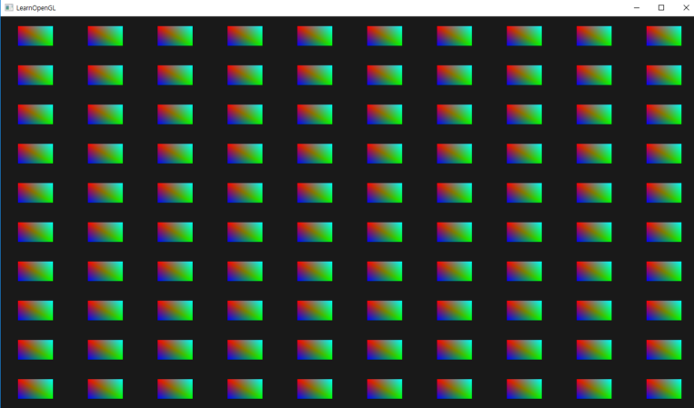

# Instancing

* 많은 오브젝트들을 한번의 draw call로 그리는 기법

* `glDrawArraysInstanced()` 와 `gl_InstanceID` 라는 빌트인 변수를 통해 구현이 가능하다.
    * 인스턴스 렌더링 콜을 그릴 때, `gl_InstanceID`는 0부터 시작해서 인스턴스마다 고유한 값을 갖게 된다.
* `Vertex Buffer Object` 에 배열을 넣고 읽어도 된다.
    * `glVertexAttribDivisor()` 함수를 통해 배열의 인덱스를 조절할 수 있다.
* 유니티에서는 쉐이더에 인스턴싱 코드를 추가해야 한다. [메뉴얼](https://docs.unity3d.com/kr/2017.4/Manual/GPUInstancing.html)

# Result



# Shader Codes

## Vertex Shader Codes

```cpp
#version 330 core
layout (location = 0) in vec2 aPos;
layout (location = 1) in vec3 aColor;
// VBO에 넣어서 쉐이더에 직접 값을 꽂아넣을때 사용
//layout (location = 2) in vec2 aOffset;

out vec3 fColor;

uniform vec2 offsets[100];

void main() {
    vec2 offset = offsets[gl_InstanceID];
    gl_Position = vec4(aPos + offset, 0.0, 1.0);
    fColor = aColor;
// VBO에 넣어서 쉐이더에 직접 값을 꽂아넣을때 사용
    //gl_Position = vec4(aPos + aOffset, 0.0, 1.0);
    //fColor = aColor;
}
```

## Fragment Shader Codes

```cpp
#version 330 core
out vec4 FragColor;
  
in vec3 fColor;

void main() {
    FragColor = vec4(fColor, 1.0);
}
```

# Source Codes

```cpp
#include <glad/glad.h>
#include <GLFW/glfw3.h>

#include <learnopengl/shader.h>

#include <iostream>

void framebuffer_size_callback(GLFWwindow* window, int width, int height);

// settings
const unsigned int SCR_WIDTH = 1280;
const unsigned int SCR_HEIGHT = 720;

int main() {
	// glfw: initialize and configure
	// ------------------------------
	glfwInit();
	glfwWindowHint(GLFW_CONTEXT_VERSION_MAJOR, 3);
	glfwWindowHint(GLFW_CONTEXT_VERSION_MINOR, 3);
	glfwWindowHint(GLFW_OPENGL_PROFILE, GLFW_OPENGL_CORE_PROFILE);

#ifdef __APPLE__
	glfwWindowHint(GLFW_OPENGL_FORWARD_COMPAT, GL_TRUE); // uncomment this statement to fix compilation on OS X
#endif

	// glfw window creation
	// --------------------
	GLFWwindow* window = glfwCreateWindow(SCR_WIDTH, SCR_HEIGHT, "LearnOpenGL", NULL, NULL);
	if (window == NULL) {
		std::cout << "Failed to create GLFW window" << std::endl;
		glfwTerminate();
		return -1;
	}
	glfwMakeContextCurrent(window);

	// glad: load all OpenGL function pointers
	// ---------------------------------------
	if (!gladLoadGLLoader((GLADloadproc)glfwGetProcAddress)) {
		std::cout << "Failed to initialize GLAD" << std::endl;
		return -1;
	}

	// configure global opengl state
	// -----------------------------
	glEnable(GL_DEPTH_TEST);

	// build and compile shaders
	// -------------------------
	Shader shader("10.1.instancing.vs", "10.1.instancing.fs");

	// generate a list of 100 quad locations/translation-vectors
	// ---------------------------------------------------------
	glm::vec2 translations[100];
	int index = 0;
	float offset = 0.1f;
	for (int y = -10; y < 10; y += 2) {
		for (int x = -10; x < 10; x += 2) {
			glm::vec2 translation;
			translation.x = (float)x / 10.0f + offset;
			translation.y = (float)y / 10.0f + offset;
			translations[index++] = translation;
		}
	}
	
	// shader 의 uniform variable에 값 전달
	shader.use();
	for (unsigned int i = 0; i < 100; i++) {
		std::stringstream ss;
		std::string index;
		ss << i;
		index = ss.str();
		shader.setVec2(("offsets[" + index + "]").c_str(), translations[i]);
		//glUniform2fv(glGetUniformLocation(ID, ("offsets[" + index + "]").c_str()), 1, &translations[i][0]);
	}

	// VBO에 넣어서 쉐이더에 직접 값을 꽂아넣을때 사용
	// store instance data in an array buffer
	// --------------------------------------
	//unsigned int instanceVBO;
	//glGenBuffers(1, &instanceVBO);
	//glBindBuffer(GL_ARRAY_BUFFER, instanceVBO);
	//glBufferData(GL_ARRAY_BUFFER, sizeof(glm::vec2) * 100, &translations[0], GL_STATIC_DRAW);
	//glBindBuffer(GL_ARRAY_BUFFER, 0);

	// set up vertex data (and buffer(s)) and configure vertex attributes
	// ------------------------------------------------------------------
	float quadVertices[] = {
		// positions     // colors
		-0.05f,  0.05f,  1.0f, 0.0f, 0.0f,
		0.05f, -0.05f,  0.0f, 1.0f, 0.0f,
		-0.05f, -0.05f,  0.0f, 0.0f, 1.0f,

		-0.05f,  0.05f,  1.0f, 0.0f, 0.0f,
		0.05f, -0.05f,  0.0f, 1.0f, 0.0f,
		0.05f,  0.05f,  0.0f, 1.0f, 1.0f
	};
	unsigned int quadVAO, quadVBO;
	glGenVertexArrays(1, &quadVAO);
	glGenBuffers(1, &quadVBO);
	glBindVertexArray(quadVAO);
	glBindBuffer(GL_ARRAY_BUFFER, quadVBO);
	glBufferData(GL_ARRAY_BUFFER, sizeof(quadVertices), quadVertices, GL_STATIC_DRAW);
	glEnableVertexAttribArray(0);
	glVertexAttribPointer(0, 2, GL_FLOAT, GL_FALSE, 5 * sizeof(float), (void*)0);
	glEnableVertexAttribArray(1);
	glVertexAttribPointer(1, 3, GL_FLOAT, GL_FALSE, 5 * sizeof(float), (void*)(2 * sizeof(float)));
	// VBO에 넣어서 쉐이더에 직접 값을 꽂아넣을때 사용
	// also set instance data
	//glEnableVertexAttribArray(2);
	//glBindBuffer(GL_ARRAY_BUFFER, instanceVBO); // this attribute comes from a different vertex buffer
	//glVertexAttribPointer(2, 2, GL_FLOAT, GL_FALSE, 2 * sizeof(float), (void*)0);
	//glBindBuffer(GL_ARRAY_BUFFER, 0);
	//// 2번 속성 포인터의 인덱스를 인스턴스가 1개 늘어날 때마다 변경한다.
	//glVertexAttribDivisor(2, 1); // tell OpenGL this is an instanced vertex attribute.


	// render loop
	// -----------
	while (!glfwWindowShouldClose(window)) {
		// render
		// ------
		glClearColor(0.1f, 0.1f, 0.1f, 1.0f);
		glClear(GL_COLOR_BUFFER_BIT | GL_DEPTH_BUFFER_BIT);

		// draw 100 instanced quads
		shader.use(); // = glUseProgram(ID);
		glBindVertexArray(quadVAO);
		// 배열의 0번 인덱스부터 읽는다. 6개의 버텍스를 가진 삼각형을 100번 그린다.
		glDrawArraysInstanced(GL_TRIANGLES, 0, 6, 100); // 100 triangles of 6 vertices each
		glBindVertexArray(0);

		// glfw: swap buffers and poll IO events (keys pressed/released, mouse moved etc.)
		// -------------------------------------------------------------------------------
		glfwSwapBuffers(window);
		glfwPollEvents();
	}

	// optional: de-allocate all resources once they've outlived their purpose:
	// ------------------------------------------------------------------------
	glDeleteVertexArrays(1, &quadVAO);
	glDeleteBuffers(1, &quadVBO);

	glfwTerminate();
	return 0;
}

// glfw: whenever the window size changed (by OS or user resize) this callback function executes
// ---------------------------------------------------------------------------------------------
void framebuffer_size_callback(GLFWwindow* window, int width, int height) {
	// make sure the viewport matches the new window dimensions; note that width and 
	// height will be significantly larger than specified on retina displays.
	glViewport(0, 0, width, height);
}
```