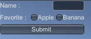
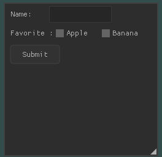

# Nuklear vs OnGUI

* `Nuklear`와 `OnGUI`를 비교해보자.

## OnGUI



* BeginVertical(), EndVertical() 함수를 사용하여 세로로 위젯을 넣을 수 있다.
* BeginHorizontal(), EndHorizontal() 함수를 사용하여 가로로 위젯을 넣을 수 있다.

```csharp
string m_name = "";
bool m_b_apple = false;
bool m_b_banana = false;

void OnGUI() {
    // 시작
    GUILayout.BeginVertical();

    // 텍스트 사용
    GUILayout.BeginHorizontal();
    GUILayout.Label("Name : ");
    m_name = GUILayout.TextField(m_name, 100);
    GUILayout.EndHorizontal();

    // 체크 박스 사용
    GUILayout.BeginHorizontal();
    GUILayout.Label("Favorite : ");
    m_b_apple = GUILayout.Toggle(m_b_apple, "Apple");
    m_b_banana = GUILayout.Toggle(m_b_banana, "Banana");
    GUILayout.EndHorizontal();

    // 버튼 사용
    if (GUILayout.Button("Submit")) {}

    // 종료
    GUILayout.EndVertical ();
}
```

## Nuklear



* nk_begin() 함수로 ui를 그릴 지역을 정해준다.
* 그리기 함수를 작성한다.
* nk_end() 함수로 끝낸다.
* nk_glfw3_render() 함수로 버퍼에 그린다.
* 프로그램이 종료될 때 nk_glfw3_shutdown() 함수를 호출한다.

```cpp
static int m_n_apple = 0;
static int m_n_banana = 0;
static char m_name[64];
static int field_len;
static const float ratio[] = { 60, 100 };

nk_glfw3_new_frame();
if (nk_begin(ctx, "", nk_rect(10, 10, 250, 250), NK_WINDOW_BORDER | NK_WINDOW_MOVABLE | NK_WINDOW_SCALABLE)) {

    // 텍스트 사용
    nk_layout_row_begin(ctx, NK_STATIC, 25, 2);
    nk_layout_row_push(ctx, ratio[0]);
    nk_label(ctx, "Name:", NK_TEXT_LEFT);
    nk_layout_row_push(ctx, ratio[1]);
    nk_edit_string(ctx, NK_EDIT_SIMPLE, m_name, &field_len, 64, nk_filter_default);
    nk_layout_row_end(ctx);

    // 체크 박스 사용
    nk_layout_row_dynamic(ctx, 30, 3);
    nk_label(ctx, "Favorite :", NK_TEXT_LEFT);
    nk_checkbox_label(ctx, "Apple", &m_n_apple);
    nk_checkbox_label(ctx, "Banana", &m_n_banana);

    // 버튼 사용
    nk_layout_row_static(ctx, 30, 80, 1);
    if (nk_button_label(ctx, "Submit"))
        fprintf(stdout, "button pressed\n"); 
}
nk_end(ctx);
```

## Nuklear 전체 코드

* `OpenGL` 코드는 [hello triangle](https://learnopengl.com/Getting-started/Hello-Triangle) 을 사용
* [참고](https://rawgit.com/vurtun/nuklear/master/doc/nuklear.html)

```cpp
#include <glad/glad.h>
#include <GLFW/glfw3.h>

#include <iostream>

#include <stdio.h>
#include <stdlib.h>
#include <stdint.h>
#include <stdarg.h>
#include <string.h>
#include <math.h>
#include <assert.h>
#include <math.h>
#include <limits.h>
#include <time.h>

#define NK_INCLUDE_FIXED_TYPES
#define NK_INCLUDE_STANDARD_IO
#define NK_INCLUDE_STANDARD_VARARGS
#define NK_INCLUDE_DEFAULT_ALLOCATOR
#define NK_INCLUDE_VERTEX_BUFFER_OUTPUT
#define NK_INCLUDE_FONT_BAKING
#define NK_INCLUDE_DEFAULT_FONT
#define NK_IMPLEMENTATION
#define NK_GLFW_GL3_IMPLEMENTATION
#define NK_KEYSTATE_BASED_INPUT
#include <C:\Users\Kanghyuk\Downloads\nuklear-master\nuklear.h>
#include <C:\Users\Kanghyuk\Downloads\nuklear-master\demo\glfw_opengl3\nuklear_glfw_gl3.h>
#include <C:\Users\Kanghyuk\Downloads\nuklear-master\demo\overview.c>
#define MAX_VERTEX_BUFFER 512 * 1024
#define MAX_ELEMENT_BUFFER 128 * 1024

void framebuffer_size_callback(GLFWwindow* window, int width, int height);
void processInput(GLFWwindow *window);

// settings
const unsigned int SCR_WIDTH = 800;
const unsigned int SCR_HEIGHT = 600;

const char *vertexShaderSource = "#version 330 core\n"
"layout (location = 0) in vec3 aPos;\n"
"void main()\n"
"{\n"
"   gl_Position = vec4(aPos.x, aPos.y, aPos.z, 1.0);\n"
"}\0";
const char *fragmentShaderSource = "#version 330 core\n"
"out vec4 FragColor;\n"
"void main()\n"
"{\n"
"   FragColor = vec4(1.0f, 0.5f, 0.2f, 1.0f);\n"
"}\n\0";

int main() {
	// glfw: initialize and configure
	// ------------------------------
	glfwInit();
	glfwWindowHint(GLFW_CONTEXT_VERSION_MAJOR, 3);
	glfwWindowHint(GLFW_CONTEXT_VERSION_MINOR, 3);
	glfwWindowHint(GLFW_OPENGL_PROFILE, GLFW_OPENGL_CORE_PROFILE);

#ifdef __APPLE__
	glfwWindowHint(GLFW_OPENGL_FORWARD_COMPAT, GL_TRUE); // uncomment this statement to fix compilation on OS X
#endif

	// glfw window creation
	// --------------------
	GLFWwindow* window = glfwCreateWindow(SCR_WIDTH, SCR_HEIGHT, "LearnOpenGL", NULL, NULL);
	if (window == NULL) {
		std::cout << "Failed to create GLFW window" << std::endl;
		glfwTerminate();
		return -1;
	}
	glfwMakeContextCurrent(window);
	glfwSetFramebufferSizeCallback(window, framebuffer_size_callback);

	// glad: load all OpenGL function pointers
	// ---------------------------------------
	if (!gladLoadGLLoader((GLADloadproc)glfwGetProcAddress)) {
		std::cout << "Failed to initialize GLAD" << std::endl;
		return -1;
	}


	// build and compile our shader program
	// ------------------------------------
	// vertex shader
	int vertexShader = glCreateShader(GL_VERTEX_SHADER);
	glShaderSource(vertexShader, 1, &vertexShaderSource, NULL);
	glCompileShader(vertexShader);
	// check for shader compile errors
	int success;
	char infoLog[512];
	glGetShaderiv(vertexShader, GL_COMPILE_STATUS, &success);
	if (!success) {
		glGetShaderInfoLog(vertexShader, 512, NULL, infoLog);
		std::cout << "ERROR::SHADER::VERTEX::COMPILATION_FAILED\n" << infoLog << std::endl;
	}
	// fragment shader
	int fragmentShader = glCreateShader(GL_FRAGMENT_SHADER);
	glShaderSource(fragmentShader, 1, &fragmentShaderSource, NULL);
	glCompileShader(fragmentShader);
	// check for shader compile errors
	glGetShaderiv(fragmentShader, GL_COMPILE_STATUS, &success);
	if (!success) {
		glGetShaderInfoLog(fragmentShader, 512, NULL, infoLog);
		std::cout << "ERROR::SHADER::FRAGMENT::COMPILATION_FAILED\n" << infoLog << std::endl;
	}
	// link shaders
	int shaderProgram = glCreateProgram();
	glAttachShader(shaderProgram, vertexShader);
	glAttachShader(shaderProgram, fragmentShader);
	glLinkProgram(shaderProgram);
	// check for linking errors
	glGetProgramiv(shaderProgram, GL_LINK_STATUS, &success);
	if (!success) {
		glGetProgramInfoLog(shaderProgram, 512, NULL, infoLog);
		std::cout << "ERROR::SHADER::PROGRAM::LINKING_FAILED\n" << infoLog << std::endl;
	}
	glDeleteShader(vertexShader);
	glDeleteShader(fragmentShader);

	// set up vertex data (and buffer(s)) and configure vertex attributes
	// ------------------------------------------------------------------
	float vertices[] = {
		-0.5f, -0.5f, 0.0f, // left  
		 0.5f, -0.5f, 0.0f, // right 
		 0.0f,  0.5f, 0.0f  // top   
	};

	unsigned int VBO, VAO;
	glGenVertexArrays(1, &VAO);
	glGenBuffers(1, &VBO);
	// bind the Vertex Array Object first, then bind and set vertex buffer(s), and then configure vertex attributes(s).
	glBindVertexArray(VAO);

	glBindBuffer(GL_ARRAY_BUFFER, VBO);
	glBufferData(GL_ARRAY_BUFFER, sizeof(vertices), vertices, GL_STATIC_DRAW);

	glVertexAttribPointer(0, 3, GL_FLOAT, GL_FALSE, 3 * sizeof(float), (void*)0);
	glEnableVertexAttribArray(0);

	// note that this is allowed, the call to glVertexAttribPointer registered VBO as the vertex attribute's bound vertex buffer object so afterwards we can safely unbind
	glBindBuffer(GL_ARRAY_BUFFER, 0);

	// You can unbind the VAO afterwards so other VAO calls won't accidentally modify this VAO, but this rarely happens. Modifying other
	// VAOs requires a call to glBindVertexArray anyways so we generally don't unbind VAOs (nor VBOs) when it's not directly necessary.
	glBindVertexArray(0);


	// uncomment this call to draw in wireframe polygons.
	//glPolygonMode(GL_FRONT_AND_BACK, GL_LINE);

	struct nk_context *ctx;
	struct nk_colorf bg;

	ctx = nk_glfw3_init(window, NK_GLFW3_INSTALL_CALLBACKS);
	/* Load Fonts: if none of these are loaded a default font will be used  */
	/* Load Cursor: if you uncomment cursor loading please hide the cursor */
	{
		struct nk_font_atlas *atlas;
		nk_glfw3_font_stash_begin(&atlas);
		/*struct nk_font *droid = nk_font_atlas_add_from_file(atlas, "../../../extra_font/DroidSans.ttf", 14, 0);*/
		/*struct nk_font *roboto = nk_font_atlas_add_from_file(atlas, "../../../extra_font/Roboto-Regular.ttf", 14, 0);*/
		/*struct nk_font *future = nk_font_atlas_add_from_file(atlas, "../../../extra_font/kenvector_future_thin.ttf", 13, 0);*/
		/*struct nk_font *clean = nk_font_atlas_add_from_file(atlas, "../../../extra_font/ProggyClean.ttf", 12, 0);*/
		/*struct nk_font *tiny = nk_font_atlas_add_from_file(atlas, "../../../extra_font/ProggyTiny.ttf", 10, 0);*/
		/*struct nk_font *cousine = nk_font_atlas_add_from_file(atlas, "../../../extra_font/Cousine-Regular.ttf", 13, 0);*/
		nk_glfw3_font_stash_end();
	}

	// render loop
	// -----------	
	enum {
		APPLE, BANANA
	};
	static int m_n_apple = 0;
	static int m_n_banana = 0;
	static int radio_value = APPLE;
	static char m_name[64];
	static int field_len;
	static const float ratio[] = { 60, 100 };
	while (!glfwWindowShouldClose(window)) {
		// input
		// -----
		processInput(window);

		/* GUI */
		nk_glfw3_new_frame();
		if (nk_begin(ctx, "", nk_rect(10, 10, 250, 250),
					 NK_WINDOW_BORDER | NK_WINDOW_MOVABLE | NK_WINDOW_SCALABLE /*| NK_WINDOW_MINIMIZABLE | NK_WINDOW_TITLE*/)) {

			//nk_layout_row(ctx, NK_STATIC, 25, 2, ratio);
			nk_layout_row_begin(ctx, NK_STATIC, 25, 2);
			nk_layout_row_push(ctx, ratio[0]);
			nk_label(ctx, "Name:", NK_TEXT_LEFT);
			nk_layout_row_push(ctx, ratio[1]);
			nk_edit_string(ctx, NK_EDIT_SIMPLE, m_name, &field_len, 64, nk_filter_default);
			nk_layout_row_end(ctx);

			nk_layout_row_dynamic(ctx, 30, 3);
			nk_label(ctx, "Favorite :", NK_TEXT_LEFT);
			nk_checkbox_label(ctx, "Apple", &m_n_apple);
			nk_checkbox_label(ctx, "Banana", &m_n_banana);
			// option box
			//if (nk_option_label(ctx, "Apple", radio_value == APPLE)) radio_value = APPLE;
			//if (nk_option_label(ctx, "Banana", radio_value == BANANA)) radio_value = BANANA;

			nk_layout_row_static(ctx, 30, 80, 1);
			if (nk_button_label(ctx, "Submit"))
				fprintf(stdout, "button pressed\n"); 
		}
		nk_end(ctx);
		//overview(ctx);

		// render
		// ------
		glClearColor(0.2f, 0.3f, 0.3f, 1.0f);
		glClear(GL_COLOR_BUFFER_BIT);

		// draw our first triangle
		glUseProgram(shaderProgram);
		glBindVertexArray(VAO); // seeing as we only have a single VAO there's no need to bind it every time, but we'll do so to keep things a bit more organized
		glDrawArrays(GL_TRIANGLES, 0, 3);
		// glBindVertexArray(0); // no need to unbind it every time 

		// glfw: swap buffers and poll IO events (keys pressed/released, mouse moved etc.)
		// -------------------------------------------------------------------------------
		nk_glfw3_render(NK_ANTI_ALIASING_ON, MAX_VERTEX_BUFFER, MAX_ELEMENT_BUFFER);
		glfwSwapBuffers(window);
		glfwPollEvents();
	}

	// optional: de-allocate all resources once they've outlived their purpose:
	// ------------------------------------------------------------------------
	glDeleteVertexArrays(1, &VAO);
	glDeleteBuffers(1, &VBO);

	// glfw: terminate, clearing all previously allocated GLFW resources.
	// ------------------------------------------------------------------
	nk_glfw3_shutdown();
	glfwTerminate();
	return 0;
}

// process all input: query GLFW whether relevant keys are pressed/released this frame and react accordingly
// ---------------------------------------------------------------------------------------------------------
void processInput(GLFWwindow *window) {
	if (glfwGetKey(window, GLFW_KEY_ESCAPE) == GLFW_PRESS)
		glfwSetWindowShouldClose(window, true);
}

// glfw: whenever the window size changed (by OS or user resize) this callback function executes
// ---------------------------------------------------------------------------------------------
void framebuffer_size_callback(GLFWwindow* window, int width, int height) {
	// make sure the viewport matches the new window dimensions; note that width and 
	// height will be significantly larger than specified on retina displays.
	glViewport(0, 0, width, height);
}
```