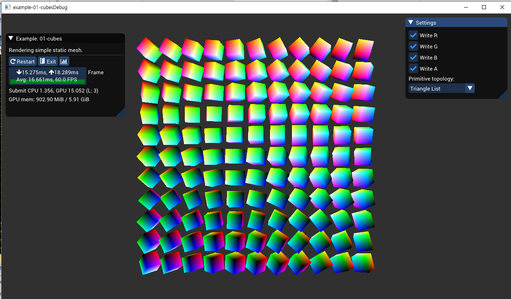

# [bgfx](https://github.com/bkaradzic/bgfx)

* `OpenGL`, `Direct3D`, `Metal` 등의 `Graphic API` 를 쉽게 사용하게 만든 `Cross-platform Rendering Library`
* `bgfx` 의 간단한 예제 코드분석을 해보자.

# Result

* 움직이는 큐브를 화면에 출력한다.



# [Code 분석](https://bkaradzic.github.io/bgfx/bgfx.html)

* `main` 함수에서 시작, 윈도우 초기화를 진행한다.

```cpp
// 매크로 함수
ENTRY_IMPLEMENT_MAIN(ExampleCubes, "01-cubes", "Rendering simple static mesh.");

// 전체 구현
#define ENTRY_IMPLEMENT_MAIN(_app, _name, _description) \
	int _main_(int _argc, char** _argv)                 \
	{                                                   \
			_app app(_name, _description);              \
			return entry::runApp(&app, _argc, _argv);   \
	}
#endif // ENTRY_CONFIG_IMPLEMENT_MAIN


int runApp(AppI* _app, int _argc, const char* const* _argv) {
	_app->init(_argc, _argv, s_width, s_height);
	bgfx::frame();

	WindowHandle defaultWindow = { 0 };
	setWindowSize(defaultWindow, s_width, s_height);

#if BX_PLATFORM_EMSCRIPTEN
	s_app = _app;
	emscripten_set_main_loop(&updateApp, -1, 1);
#else
	while (_app->update() ) {
		if (0 != bx::strLen(s_restartArgs) ) {
			break;
		}
	}
#endif // BX_PLATFORM_EMSCRIPTEN

	return _app->shutdown();
}
```

* 구현 클래스의 `init` 함수에서 `bgfx::init` 함수를 호출한다.
  * `bgfx::setViewClear()` : 현재 화면의 초기화를 진행한다.
  * `bgfx::createVertexBuffer()`, `bgfx::createIndexBuffer()` : 버텍스 버퍼, 인덱스 버퍼를 생성한다.
    * `bgfx::makeRef()` 함수는 메모리 할당을 해준다.
  * `loadProgram()` : 쉐이더 코드를 불러온다.


* `Update loop` 에서는 imgui를 세팅하고 그리기를 진행한다.
  * `bx::mtxLookAt()`, `bx::mtxProj()`, `bgfx::setViewTransform()` : 카메라 세팅을 한다.
  * `bgfx::setViewRect()` : 화면을 세팅한다.
  * `bgfx::touch(0)` : 드로우콜을 초기화한다.??
    * 원문 : Submit an empty primitive for rendering. Uniforms and draw state will be applied but no geometry will be submitted. These empty draw calls will sort before ordinary draw calls.
  * `bx::mtxRotateXY()` : `mtx` 를 `affine matrix` 로 변경한다.
  * `bgfx::setTransform()` : `model matrix` 를 지정한다.
  * `bgfx::setVertexBuffer()`, `bgfx::setIndexBuffer()` : 버퍼를 지정한다.
  * `bgfx::setState()` : 렌더링 옵션을 준다.
  * `bgfx::submit()` : 현재 상태를 쉐이더에 전달한다.
  * `bgfx::frame()` : 다음 프레임으로 넘어간다.

# bx 코드

```cpp
void mtxLookAt(float* _result, const Vec3& _eye, const Vec3& _at, const Vec3& _up, Handness::Enum _handness) {
	const Vec3 view = normalize(
			Handness::Right == _handness
		? sub(_eye, _at)
		: sub(_at, _eye)
		);
	const Vec3 uxv   = cross(_up, view);
	const Vec3 right = normalize(uxv);
	const Vec3 up    = cross(view, right);

	memSet(_result, 0, sizeof(float)*16);
	_result[ 0] = right.x;
	_result[ 1] = up.x;
	_result[ 2] = view.x;

	_result[ 4] = right.y;
	_result[ 5] = up.y;
	_result[ 6] = view.y;

	_result[ 8] = right.z;
	_result[ 9] = up.z;
	_result[10] = view.z;

	_result[12] = -dot(right, _eye);
	_result[13] = -dot(up,    _eye);
	_result[14] = -dot(view,  _eye);
	_result[15] = 1.0f;
}

void mtxProj(float* _result, float _ut, float _dt, float _lt, float _rt, float _near, float _far, bool _homogeneousNdc, Handness::Enum _handness) {
	const float invDiffRl = 1.0f/(_rt - _lt);
	const float invDiffUd = 1.0f/(_ut - _dt);
	const float width  =  2.0f*_near * invDiffRl;
	const float height =  2.0f*_near * invDiffUd;
	const float xx     = (_rt + _lt) * invDiffRl;
	const float yy     = (_ut + _dt) * invDiffUd;
	mtxProjXYWH(_result, xx, yy, width, height, _near, _far, _homogeneousNdc, _handness);
}
static void mtxProjXYWH(float* _result, float _x, float _y, float _width, float _height, float _near, float _far, bool _homogeneousNdc, Handness::Enum _handness) {
	const float diff = _far-_near;
	const float aa = _homogeneousNdc ? (     _far+_near)/diff : _far/diff;
	const float bb = _homogeneousNdc ? (2.0f*_far*_near)/diff : _near*aa;

	memSet(_result, 0, sizeof(float)*16);
	_result[ 0] = _width;
	_result[ 5] = _height;
	_result[ 8] = (Handness::Right == _handness) ?    _x :  -_x;
	_result[ 9] = (Handness::Right == _handness) ?    _y :  -_y;
	_result[10] = (Handness::Right == _handness) ?   -aa :   aa;
	_result[11] = (Handness::Right == _handness) ? -1.0f : 1.0f;
	_result[14] = -bb;
}

void mtxRotateXY(float* _result, float _ax, float _ay) {
	const float sx = sin(_ax);
	const float cx = cos(_ax);
	const float sy = sin(_ay);
	const float cy = cos(_ay);

	memSet(_result, 0, sizeof(float)*16);
	_result[ 0] = cy;
	_result[ 2] = sy;
	_result[ 4] = sx*sy;
	_result[ 5] = cx;
	_result[ 6] = -sx*cy;
	_result[ 8] = -cx*sy;
	_result[ 9] = sx;
	_result[10] = cx*cy;
	_result[15] = 1.0f;
}

int64_t getHPCounter() {
#if    BX_CRT_NONE
	int64_t i64 = crt0::getHPCounter();
#elif  BX_PLATFORM_WINDOWS \
	|| BX_PLATFORM_XBOXONE \
	|| BX_PLATFORM_WINRT
	LARGE_INTEGER li;
	QueryPerformanceCounter(&li);
	int64_t i64 = li.QuadPart;
#elif ...
#else
	BX_CHECK(false, "Not implemented!");
	int64_t i64 = UINT64_MAX;
#endif // BX_PLATFORM_
	return i64;
}
```

# 쉐이더 코드

```cpp
// vertex shader
$input a_position, a_color0
$output v_color0

/*
 * Copyright 2011-2019 Branimir Karadzic. All rights reserved.
 * License: https://github.com/bkaradzic/bgfx#license-bsd-2-clause
 */

#include "../common/common.sh"

void main() {
	gl_Position = mul(u_modelViewProj, vec4(a_position, 1.0) );
	v_color0 = a_color0;
}

// fragment shader
$input v_color0

/*
 * Copyright 2011-2019 Branimir Karadzic. All rights reserved.
 * License: https://github.com/bkaradzic/bgfx#license-bsd-2-clause
 */

#include "../common/common.sh"

void main() {
	gl_FragColor = v_color0;
}
```

# 전체 코드

```cpp
/*
 * Copyright 2011-2019 Branimir Karadzic. All rights reserved.
 * License: https://github.com/bkaradzic/bgfx#license-bsd-2-clause
 */

#include "common.h"
#include "bgfx_utils.h"
#include "imgui/imgui.h"

namespace {

	struct PosColorVertex {
		float m_x;
		float m_y;
		float m_z;
		uint32_t m_abgr;

		static void init() {
			ms_decl
				.begin()
				.add(bgfx::Attrib::Position, 3, bgfx::AttribType::Float)
				.add(bgfx::Attrib::Color0, 4, bgfx::AttribType::Uint8, true)
				.end();
		};

		static bgfx::VertexDecl ms_decl;
	};

	bgfx::VertexDecl PosColorVertex::ms_decl;

	static PosColorVertex s_cubeVertices[] = {
		{-1.0f,  1.0f,  1.0f, 0xff000000 },
		{ 1.0f,  1.0f,  1.0f, 0xff0000ff },
		{-1.0f, -1.0f,  1.0f, 0xff00ff00 },
		{ 1.0f, -1.0f,  1.0f, 0xff00ffff },
		{-1.0f,  1.0f, -1.0f, 0xffff0000 },
		{ 1.0f,  1.0f, -1.0f, 0xffff00ff },
		{-1.0f, -1.0f, -1.0f, 0xffffff00 },
		{ 1.0f, -1.0f, -1.0f, 0xffffffff },
	};

	static const uint16_t s_cubeTriList[] = {
		0, 1, 2, // 0
		1, 3, 2,
		4, 6, 5, // 2
		5, 6, 7,
		0, 2, 4, // 4
		4, 2, 6,
		1, 5, 3, // 6
		5, 7, 3,
		0, 4, 1, // 8
		4, 5, 1,
		2, 3, 6, // 10
		6, 3, 7,
	};

	static const uint16_t s_cubeTriStrip[] = {
		0, 1, 2,
		3,
		7,
		1,
		5,
		0,
		4,
		2,
		6,
		7,
		4,
		5,
	};

	static const uint16_t s_cubeLineList[] = {
		0, 1,
		0, 2,
		0, 4,
		1, 3,
		1, 5,
		2, 3,
		2, 6,
		3, 7,
		4, 5,
		4, 6,
		5, 7,
		6, 7,
	};

	static const uint16_t s_cubeLineStrip[] = {
		0, 2, 3, 1, 5, 7, 6, 4,
		0, 2, 6, 4, 5, 7, 3, 1,
		0,
	};

	static const uint16_t s_cubePoints[] = {
		0, 1, 2, 3, 4, 5, 6, 7
	};

	static const char* s_ptNames[] {
		"Triangle List",
		"Triangle Strip",
		"Lines",
		"Line Strip",
		"Points",
	};

	static const uint64_t s_ptState[] {
		UINT64_C(0),
		BGFX_STATE_PT_TRISTRIP,
		BGFX_STATE_PT_LINES,
		BGFX_STATE_PT_LINESTRIP,
		BGFX_STATE_PT_POINTS,
	};
	BX_STATIC_ASSERT(BX_COUNTOF(s_ptState) == BX_COUNTOF(s_ptNames));

	class ExampleCubes : public entry::AppI {
	public:
		ExampleCubes(const char* _name, const char* _description)
			: entry::AppI(_name, _description)
			, m_pt(0)
			, m_r(true)
			, m_g(true)
			, m_b(true)
			, m_a(true) {}

		void init(int32_t _argc, const char* const* _argv, uint32_t _width, uint32_t _height) override {
			Args args(_argc, _argv);

			m_width = _width;
			m_height = _height;
			m_debug = BGFX_DEBUG_NONE;
			m_reset = BGFX_RESET_VSYNC;

			bgfx::Init init;
			init.type = args.m_type;
			init.vendorId = args.m_pciId;
			init.resolution.width = m_width;
			init.resolution.height = m_height;
			init.resolution.reset = m_reset;
			bgfx::init(init);

			// Enable debug text.
			bgfx::setDebug(m_debug);

			// Set view 0 clear state.
			bgfx::setViewClear(0
							   , BGFX_CLEAR_COLOR | BGFX_CLEAR_DEPTH
							   , 0x303030ff
							   , 1.0f
							   , 0
			);

			// Create vertex stream declaration.
			PosColorVertex::init();

			// Create static vertex buffer.
			m_vbh = bgfx::createVertexBuffer(
				// Static data can be passed with bgfx::makeRef
				bgfx::makeRef(s_cubeVertices, sizeof(s_cubeVertices))
				, PosColorVertex::ms_decl
			);

			// Create static index buffer for triangle list rendering.
			m_ibh[0] = bgfx::createIndexBuffer(
				// Static data can be passed with bgfx::makeRef
				bgfx::makeRef(s_cubeTriList, sizeof(s_cubeTriList))
			);

			// Create static index buffer for triangle strip rendering.
			m_ibh[1] = bgfx::createIndexBuffer(
				// Static data can be passed with bgfx::makeRef
				bgfx::makeRef(s_cubeTriStrip, sizeof(s_cubeTriStrip))
			);

			// Create static index buffer for line list rendering.
			m_ibh[2] = bgfx::createIndexBuffer(
				// Static data can be passed with bgfx::makeRef
				bgfx::makeRef(s_cubeLineList, sizeof(s_cubeLineList))
			);

			// Create static index buffer for line strip rendering.
			m_ibh[3] = bgfx::createIndexBuffer(
				// Static data can be passed with bgfx::makeRef
				bgfx::makeRef(s_cubeLineStrip, sizeof(s_cubeLineStrip))
			);

			// Create static index buffer for point list rendering.
			m_ibh[4] = bgfx::createIndexBuffer(
				// Static data can be passed with bgfx::makeRef
				bgfx::makeRef(s_cubePoints, sizeof(s_cubePoints))
			);

			// Create program from shaders.
			m_program = loadProgram("vs_cubes", "fs_cubes");

			m_timeOffset = bx::getHPCounter();

			imguiCreate();
		}

		virtual int shutdown() override {
			imguiDestroy();

			// Cleanup.
			for (uint32_t ii = 0; ii < BX_COUNTOF(m_ibh); ++ii) {
				bgfx::destroy(m_ibh[ii]);
			}

			bgfx::destroy(m_vbh);
			bgfx::destroy(m_program);

			// Shutdown bgfx.
			bgfx::shutdown();

			return 0;
		}

		bool update() override {
			if (!entry::processEvents(m_width, m_height, m_debug, m_reset, &m_mouseState)) {
				imguiBeginFrame(m_mouseState.m_mx
								, m_mouseState.m_my
								, (m_mouseState.m_buttons[entry::MouseButton::Left] ? IMGUI_MBUT_LEFT : 0)
								| (m_mouseState.m_buttons[entry::MouseButton::Right] ? IMGUI_MBUT_RIGHT : 0)
								| (m_mouseState.m_buttons[entry::MouseButton::Middle] ? IMGUI_MBUT_MIDDLE : 0)
								, m_mouseState.m_mz
								, uint16_t(m_width)
								, uint16_t(m_height)
				);

				showExampleDialog(this);

				ImGui::SetNextWindowPos(
					ImVec2(m_width - m_width / 5.0f - 10.0f, 10.0f)
					, ImGuiCond_FirstUseEver
				);
				ImGui::SetNextWindowSize(
					ImVec2(m_width / 5.0f, m_height / 3.5f)
					, ImGuiCond_FirstUseEver
				);
				ImGui::Begin("Settings"
							 , NULL
							 , 0
				);

				ImGui::Checkbox("Write R", &m_r);
				ImGui::Checkbox("Write G", &m_g);
				ImGui::Checkbox("Write B", &m_b);
				ImGui::Checkbox("Write A", &m_a);

				ImGui::Text("Primitive topology:");
				ImGui::Combo("", (int*)&m_pt, s_ptNames, BX_COUNTOF(s_ptNames));

				ImGui::End();

				imguiEndFrame();

				float time = (float)((bx::getHPCounter() - m_timeOffset) / double(bx::getHPFrequency()));

				const bx::Vec3 at = { 0.0f, 0.0f,   0.0f };
				const bx::Vec3 eye = { 0.0f, 0.0f, -35.0f };

				// Set view and projection matrix for view 0.
				{
					float view[16];
					bx::mtxLookAt(view, eye, at);

					float proj[16];
					bx::mtxProj(proj, 60.0f, float(m_width) / float(m_height), 0.1f, 100.0f, bgfx::getCaps()->homogeneousDepth);
					bgfx::setViewTransform(0, view, proj);

					// Set view 0 default viewport.
					bgfx::setViewRect(0, 0, 0, uint16_t(m_width), uint16_t(m_height));
				}

				// This dummy draw call is here to make sure that view 0 is cleared
				// if no other draw calls are submitted to view 0.
				bgfx::touch(0);

				bgfx::IndexBufferHandle ibh = m_ibh[m_pt];
				uint64_t state = 0
					| (m_r ? BGFX_STATE_WRITE_R : 0)
					| (m_g ? BGFX_STATE_WRITE_G : 0)
					| (m_b ? BGFX_STATE_WRITE_B : 0)
					| (m_a ? BGFX_STATE_WRITE_A : 0)
					| BGFX_STATE_WRITE_Z
					| BGFX_STATE_DEPTH_TEST_LESS
					| BGFX_STATE_CULL_CW
					| BGFX_STATE_MSAA
					| s_ptState[m_pt]
					;

				// Submit 11x11 cubes.
				for (uint32_t yy = 0; yy < 11; ++yy) {
					for (uint32_t xx = 0; xx < 11; ++xx) {
						float mtx[16];
						bx::mtxRotateXY(mtx, time + xx * 0.21f, time + yy * 0.37f);
						mtx[12] = -15.0f + float(xx)*3.0f;
						mtx[13] = -15.0f + float(yy)*3.0f;
						mtx[14] = 0.0f;

						// Set model matrix for rendering.
						bgfx::setTransform(mtx);

						// Set vertex and index buffer.
						bgfx::setVertexBuffer(0, m_vbh);
						bgfx::setIndexBuffer(ibh);

						// Set render states.
						bgfx::setState(state);

						// Submit primitive for rendering to view 0.
						bgfx::submit(0, m_program);
					}
				}

				// Advance to next frame. Rendering thread will be kicked to
				// process submitted rendering primitives.
				bgfx::frame();

				return true;
			}

			return false;
		}

		entry::MouseState m_mouseState;

		uint32_t m_width;
		uint32_t m_height;
		uint32_t m_debug;
		uint32_t m_reset;
		bgfx::VertexBufferHandle m_vbh;
		bgfx::IndexBufferHandle m_ibh[BX_COUNTOF(s_ptState)];
		bgfx::ProgramHandle m_program;
		int64_t m_timeOffset;
		int32_t m_pt;

		bool m_r;
		bool m_g;
		bool m_b;
		bool m_a;
	};

} // namespace

ENTRY_IMPLEMENT_MAIN(ExampleCubes, "01-cubes", "Rendering simple static mesh.");
```