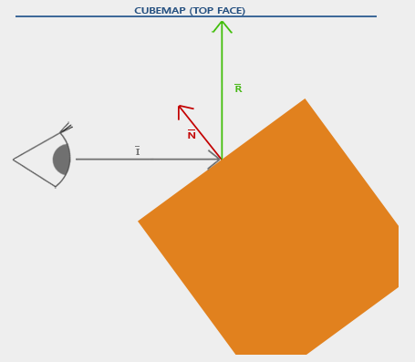
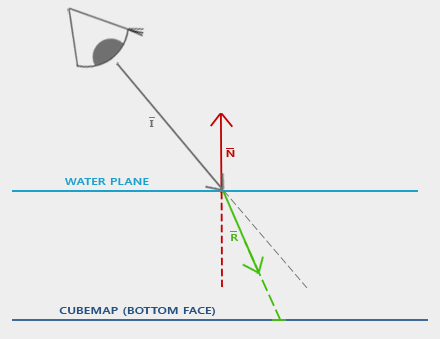
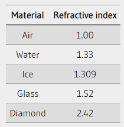
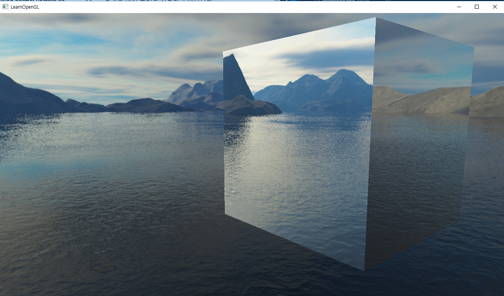
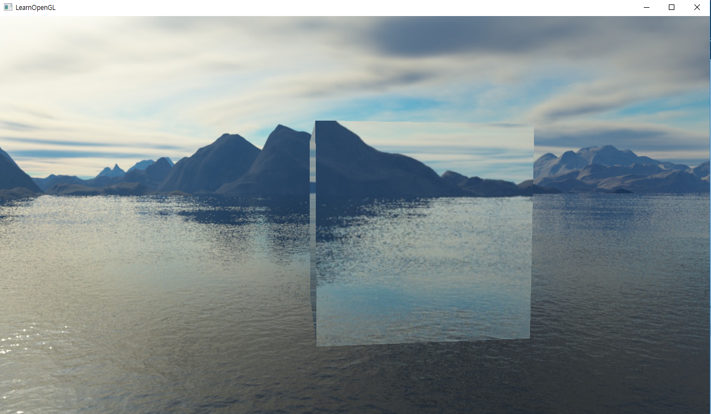

# Cubemap Environment Mapping

* 큐브맵 텍스쳐를 이용하여 환경 매핑 기술(반사, 굴절)을 사용해본다.

* 반사는 물체가 주변 환경을 반영하는 속성이다.
* 객체의 색상이 보는 사람의 각도에 따라 환경과 거의 동일하다.



* `GLSL` 의 `reflect()` 함수를 사용하여 반사벡터를 쉽게 구할 수 있다.

```cpp
// frag
#version 330 core
out vec4 FragColor;

in vec3 Normal;
in vec3 Position;

uniform vec3 cameraPos;
uniform samplerCube skybox;

void main() {
    vec3 I = normalize(Position - cameraPos);
    vec3 R = reflect(I, normalize(Normal));
    FragColor = vec4(texture(skybox, R).rgb, 1.0);
}

// vert
#version 330 core
layout (location = 0) in vec3 aPos;
layout (location = 1) in vec3 aNormal;

out vec3 Normal;
out vec3 Position;

uniform mat4 model;
uniform mat4 view;
uniform mat4 projection;

void main() {
    // 왜 역 + 전치 ?
    Normal = mat3(transpose(inverse(model))) * aNormal;
    Position = vec3(model * vec4(aPos, 1.0));
    gl_Position = projection * view * model * vec4(aPos, 1.0);
}  
```

* 굴절은 매질의 변화로 인한 빛의 방향 변화이다.



* `GLSL` 의 `refract()` 함수를 사용하여 반사벡터를 쉽게 구할 수 있다.
* 매질에 따른 굴절률은 아래의 표와 같다.



* 현재 예시에서는 유리를 가정하기 때문에 굴절 비율은 `1.00 / 1.52 = 0.658` 이 된다.
* `fragment shader` 에서는 다음과 같이 사용한다.

```cpp
void main() {
    float ratio = 1.00 / 1.52;
    vec3 I = normalize(Position - cameraPos);
    vec3 R = refract(I, normalize(Normal), ratio);
    FragColor = vec4(texture(skybox, R).rgb, 1.0);
}  
```

# Result





# Shader Codes

## Vertex Shader Codes

```cpp
// skybox
#version 330 core
layout (location = 0) in vec3 aPos;

out vec3 TexCoords;

uniform mat4 projection;
uniform mat4 view;

void main() {
    TexCoords = aPos; // 월드 좌표 == skybox의 방향벡터
    vec4 pos = projection * view * vec4(aPos, 1.0);
    gl_Position = pos.xyww; // z값이 항상 1.0 이된다.
}

// cube
#version 330 core
layout (location = 0) in vec3 aPos;
layout (location = 1) in vec2 aTexCoords;

out vec2 TexCoords;

uniform mat4 model;
uniform mat4 view;
uniform mat4 projection;

void main() {
    TexCoords = aTexCoords;    
    gl_Position = projection * view * model * vec4(aPos, 1.0);
}
```

## Fragment Shader Codes

```cpp
// skybox
#version 330 core
out vec4 FragColor;

in vec3 TexCoords;

uniform samplerCube skybox;

void main() {    
    FragColor = texture(skybox, TexCoords);
}

// cube
#version 330 core
out vec4 FragColor;

in vec2 TexCoords;

uniform sampler2D texture1;

void main() {
    FragColor = texture(texture1, TexCoords);
}
```

# Source Codes

```cpp
#include <glad/glad.h>
#include <GLFW/glfw3.h>
#include <stb_image.h>

#include <glm/glm.hpp>
#include <glm/gtc/matrix_transform.hpp>
#include <glm/gtc/type_ptr.hpp>

#include <learnopengl/filesystem.h>
#include <learnopengl/shader_m.h>
#include <learnopengl/camera.h>
#include <learnopengl/model.h>

#include <iostream>

void framebuffer_size_callback(GLFWwindow* window, int width, int height);
void mouse_callback(GLFWwindow* window, double xpos, double ypos);
void scroll_callback(GLFWwindow* window, double xoffset, double yoffset);
void processInput(GLFWwindow *window);
unsigned int loadTexture(const char *path);
unsigned int loadCubemap(vector<std::string> faces);

// settings
const unsigned int SCR_WIDTH = 1280;
const unsigned int SCR_HEIGHT = 720;

// camera
Camera camera(glm::vec3(0.0f, 0.0f, 3.0f));
float lastX = (float)SCR_WIDTH / 2.0;
float lastY = (float)SCR_HEIGHT / 2.0;
bool firstMouse = true;

// timing
float deltaTime = 0.0f;
float lastFrame = 0.0f;

int main()
{
    // glfw: initialize and configure
    // ------------------------------
    glfwInit();
    glfwWindowHint(GLFW_CONTEXT_VERSION_MAJOR, 3);
    glfwWindowHint(GLFW_CONTEXT_VERSION_MINOR, 3);
    glfwWindowHint(GLFW_OPENGL_PROFILE, GLFW_OPENGL_CORE_PROFILE);

#ifdef __APPLE__
    glfwWindowHint(GLFW_OPENGL_FORWARD_COMPAT, GL_TRUE); // uncomment this statement to fix compilation on OS X
#endif

    // glfw window creation
    // --------------------
    GLFWwindow* window = glfwCreateWindow(SCR_WIDTH, SCR_HEIGHT, "LearnOpenGL", NULL, NULL);
    if (window == NULL)
    {
        std::cout << "Failed to create GLFW window" << std::endl;
        glfwTerminate();
        return -1;
    }
    glfwMakeContextCurrent(window);
    glfwSetFramebufferSizeCallback(window, framebuffer_size_callback);
    glfwSetCursorPosCallback(window, mouse_callback);
    glfwSetScrollCallback(window, scroll_callback);

    // tell GLFW to capture our mouse
    glfwSetInputMode(window, GLFW_CURSOR, GLFW_CURSOR_DISABLED);

    // glad: load all OpenGL function pointers
    // ---------------------------------------
    if (!gladLoadGLLoader((GLADloadproc)glfwGetProcAddress))
    {
        std::cout << "Failed to initialize GLAD" << std::endl;
        return -1;
    }

    // configure global opengl state
    // -----------------------------
    glEnable(GL_DEPTH_TEST);

    // build and compile shaders
    // -------------------------
    Shader shader("6.1.cubemaps.vs", "6.1.cubemaps.fs");
    Shader skyboxShader("6.1.skybox.vs", "6.1.skybox.fs");

    // set up vertex data (and buffer(s)) and configure vertex attributes
    // ------------------------------------------------------------------
    float cubeVertices[] = {
        // positions          // texture Coords
        -0.5f, -0.5f, -0.5f,  0.0f, 0.0f,
         0.5f, -0.5f, -0.5f,  1.0f, 0.0f,
         0.5f,  0.5f, -0.5f,  1.0f, 1.0f,
         0.5f,  0.5f, -0.5f,  1.0f, 1.0f,
        -0.5f,  0.5f, -0.5f,  0.0f, 1.0f,
        -0.5f, -0.5f, -0.5f,  0.0f, 0.0f,

        -0.5f, -0.5f,  0.5f,  0.0f, 0.0f,
         0.5f, -0.5f,  0.5f,  1.0f, 0.0f,
         0.5f,  0.5f,  0.5f,  1.0f, 1.0f,
         0.5f,  0.5f,  0.5f,  1.0f, 1.0f,
        -0.5f,  0.5f,  0.5f,  0.0f, 1.0f,
        -0.5f, -0.5f,  0.5f,  0.0f, 0.0f,

        -0.5f,  0.5f,  0.5f,  1.0f, 0.0f,
        -0.5f,  0.5f, -0.5f,  1.0f, 1.0f,
        -0.5f, -0.5f, -0.5f,  0.0f, 1.0f,
        -0.5f, -0.5f, -0.5f,  0.0f, 1.0f,
        -0.5f, -0.5f,  0.5f,  0.0f, 0.0f,
        -0.5f,  0.5f,  0.5f,  1.0f, 0.0f,

         0.5f,  0.5f,  0.5f,  1.0f, 0.0f,
         0.5f,  0.5f, -0.5f,  1.0f, 1.0f,
         0.5f, -0.5f, -0.5f,  0.0f, 1.0f,
         0.5f, -0.5f, -0.5f,  0.0f, 1.0f,
         0.5f, -0.5f,  0.5f,  0.0f, 0.0f,
         0.5f,  0.5f,  0.5f,  1.0f, 0.0f,

        -0.5f, -0.5f, -0.5f,  0.0f, 1.0f,
         0.5f, -0.5f, -0.5f,  1.0f, 1.0f,
         0.5f, -0.5f,  0.5f,  1.0f, 0.0f,
         0.5f, -0.5f,  0.5f,  1.0f, 0.0f,
        -0.5f, -0.5f,  0.5f,  0.0f, 0.0f,
        -0.5f, -0.5f, -0.5f,  0.0f, 1.0f,

        -0.5f,  0.5f, -0.5f,  0.0f, 1.0f,
         0.5f,  0.5f, -0.5f,  1.0f, 1.0f,
         0.5f,  0.5f,  0.5f,  1.0f, 0.0f,
         0.5f,  0.5f,  0.5f,  1.0f, 0.0f,
        -0.5f,  0.5f,  0.5f,  0.0f, 0.0f,
        -0.5f,  0.5f, -0.5f,  0.0f, 1.0f
    };
    float skyboxVertices[] = {
        // positions          
        -1.0f,  1.0f, -1.0f,
        -1.0f, -1.0f, -1.0f,
         1.0f, -1.0f, -1.0f,
         1.0f, -1.0f, -1.0f,
         1.0f,  1.0f, -1.0f,
        -1.0f,  1.0f, -1.0f,

        -1.0f, -1.0f,  1.0f,
        -1.0f, -1.0f, -1.0f,
        -1.0f,  1.0f, -1.0f,
        -1.0f,  1.0f, -1.0f,
        -1.0f,  1.0f,  1.0f,
        -1.0f, -1.0f,  1.0f,

         1.0f, -1.0f, -1.0f,
         1.0f, -1.0f,  1.0f,
         1.0f,  1.0f,  1.0f,
         1.0f,  1.0f,  1.0f,
         1.0f,  1.0f, -1.0f,
         1.0f, -1.0f, -1.0f,

        -1.0f, -1.0f,  1.0f,
        -1.0f,  1.0f,  1.0f,
         1.0f,  1.0f,  1.0f,
         1.0f,  1.0f,  1.0f,
         1.0f, -1.0f,  1.0f,
        -1.0f, -1.0f,  1.0f,

        -1.0f,  1.0f, -1.0f,
         1.0f,  1.0f, -1.0f,
         1.0f,  1.0f,  1.0f,
         1.0f,  1.0f,  1.0f,
        -1.0f,  1.0f,  1.0f,
        -1.0f,  1.0f, -1.0f,

        -1.0f, -1.0f, -1.0f,
        -1.0f, -1.0f,  1.0f,
         1.0f, -1.0f, -1.0f,
         1.0f, -1.0f, -1.0f,
        -1.0f, -1.0f,  1.0f,
         1.0f, -1.0f,  1.0f
    };

    // cube VAO
    unsigned int cubeVAO, cubeVBO;
    glGenVertexArrays(1, &cubeVAO);
    glGenBuffers(1, &cubeVBO);
    glBindVertexArray(cubeVAO);
    glBindBuffer(GL_ARRAY_BUFFER, cubeVBO);
    glBufferData(GL_ARRAY_BUFFER, sizeof(cubeVertices), &cubeVertices, GL_STATIC_DRAW);
    glEnableVertexAttribArray(0);
    glVertexAttribPointer(0, 3, GL_FLOAT, GL_FALSE, 5 * sizeof(float), (void*)0);
    glEnableVertexAttribArray(1);
    glVertexAttribPointer(1, 2, GL_FLOAT, GL_FALSE, 5 * sizeof(float), (void*)(3 * sizeof(float)));
    // skybox VAO
    unsigned int skyboxVAO, skyboxVBO;
    glGenVertexArrays(1, &skyboxVAO);
    glGenBuffers(1, &skyboxVBO);
    glBindVertexArray(skyboxVAO);
    glBindBuffer(GL_ARRAY_BUFFER, skyboxVBO);
    glBufferData(GL_ARRAY_BUFFER, sizeof(skyboxVertices), &skyboxVertices, GL_STATIC_DRAW);
    glEnableVertexAttribArray(0);
    glVertexAttribPointer(0, 3, GL_FLOAT, GL_FALSE, 3 * sizeof(float), (void*)0);

    // load textures
    // -------------
    unsigned int cubeTexture = loadTexture(FileSystem::getPath("resources/textures/marble.jpg").c_str());

    vector<std::string> faces
    {
        FileSystem::getPath("resources/textures/skybox/right.jpg"),
        FileSystem::getPath("resources/textures/skybox/left.jpg"),
        FileSystem::getPath("resources/textures/skybox/top.jpg"),
        FileSystem::getPath("resources/textures/skybox/bottom.jpg"),
        FileSystem::getPath("resources/textures/skybox/front.jpg"),
        FileSystem::getPath("resources/textures/skybox/back.jpg")
    };
    unsigned int cubemapTexture = loadCubemap(faces);

    // shader configuration
    // --------------------
    shader.use();
    shader.setInt("texture1", 0);

    skyboxShader.use();
    skyboxShader.setInt("skybox", 0);

    // render loop
    // -----------
    while (!glfwWindowShouldClose(window))
    {
        // per-frame time logic
        // --------------------
        float currentFrame = glfwGetTime();
        deltaTime = currentFrame - lastFrame;
        lastFrame = currentFrame;

        // input
        // -----
        processInput(window);

        // render
        // ------
        glClearColor(0.1f, 0.1f, 0.1f, 1.0f);
        glClear(GL_COLOR_BUFFER_BIT | GL_DEPTH_BUFFER_BIT);

        // draw scene as normal
        shader.use();
        glm::mat4 model;
        glm::mat4 view = camera.GetViewMatrix();
        glm::mat4 projection = glm::perspective(glm::radians(camera.Zoom), (float)SCR_WIDTH / (float)SCR_HEIGHT, 0.1f, 100.0f);
        shader.setMat4("model", model);
        shader.setMat4("view", view);
        shader.setMat4("projection", projection);
        // cubes
        glBindVertexArray(cubeVAO);
        glActiveTexture(GL_TEXTURE0);
        glBindTexture(GL_TEXTURE_2D, cubeTexture);
        glDrawArrays(GL_TRIANGLES, 0, 36);
        glBindVertexArray(0);

        // draw skybox as last
        glDepthFunc(GL_LEQUAL);  // change depth function so depth test passes when values are equal to depth buffer's content
        skyboxShader.use();
        view = glm::mat4(glm::mat3(camera.GetViewMatrix())); // remove translation from the view matrix
        skyboxShader.setMat4("view", view);
        skyboxShader.setMat4("projection", projection);
        // skybox cube
        glBindVertexArray(skyboxVAO);
        glActiveTexture(GL_TEXTURE0);
        glBindTexture(GL_TEXTURE_CUBE_MAP, cubemapTexture);
        glDrawArrays(GL_TRIANGLES, 0, 36);
        glBindVertexArray(0);
        glDepthFunc(GL_LESS); // set depth function back to default

        // glfw: swap buffers and poll IO events (keys pressed/released, mouse moved etc.)
        // -------------------------------------------------------------------------------
        glfwSwapBuffers(window);
        glfwPollEvents();
    }

    // optional: de-allocate all resources once they've outlived their purpose:
    // ------------------------------------------------------------------------
    glDeleteVertexArrays(1, &cubeVAO);
    glDeleteVertexArrays(1, &skyboxVAO);
    glDeleteBuffers(1, &cubeVBO);
    glDeleteBuffers(1, &skyboxVAO);

    glfwTerminate();
    return 0;
}

// process all input: query GLFW whether relevant keys are pressed/released this frame and react accordingly
// ---------------------------------------------------------------------------------------------------------
void processInput(GLFWwindow *window)
{
    if (glfwGetKey(window, GLFW_KEY_ESCAPE) == GLFW_PRESS)
        glfwSetWindowShouldClose(window, true);

    if (glfwGetKey(window, GLFW_KEY_W) == GLFW_PRESS)
        camera.ProcessKeyboard(FORWARD, deltaTime);
    if (glfwGetKey(window, GLFW_KEY_S) == GLFW_PRESS)
        camera.ProcessKeyboard(BACKWARD, deltaTime);
    if (glfwGetKey(window, GLFW_KEY_A) == GLFW_PRESS)
        camera.ProcessKeyboard(LEFT, deltaTime);
    if (glfwGetKey(window, GLFW_KEY_D) == GLFW_PRESS)
        camera.ProcessKeyboard(RIGHT, deltaTime);
}

// glfw: whenever the window size changed (by OS or user resize) this callback function executes
// ---------------------------------------------------------------------------------------------
void framebuffer_size_callback(GLFWwindow* window, int width, int height)
{
    // make sure the viewport matches the new window dimensions; note that width and 
    // height will be significantly larger than specified on retina displays.
    glViewport(0, 0, width, height);
}

// glfw: whenever the mouse moves, this callback is called
// -------------------------------------------------------
void mouse_callback(GLFWwindow* window, double xpos, double ypos)
{
    if (firstMouse)
    {
        lastX = xpos;
        lastY = ypos;
        firstMouse = false;
    }

    float xoffset = xpos - lastX;
    float yoffset = lastY - ypos; // reversed since y-coordinates go from bottom to top

    lastX = xpos;
    lastY = ypos;

    camera.ProcessMouseMovement(xoffset, yoffset);
}

// glfw: whenever the mouse scroll wheel scrolls, this callback is called
// ----------------------------------------------------------------------
void scroll_callback(GLFWwindow* window, double xoffset, double yoffset)
{
    camera.ProcessMouseScroll(yoffset);
}

// utility function for loading a 2D texture from file
// ---------------------------------------------------
unsigned int loadTexture(char const * path)
{
    unsigned int textureID;
    glGenTextures(1, &textureID);

    int width, height, nrComponents;
    unsigned char *data = stbi_load(path, &width, &height, &nrComponents, 0);
    if (data)
    {
        GLenum format;
        if (nrComponents == 1)
            format = GL_RED;
        else if (nrComponents == 3)
            format = GL_RGB;
        else if (nrComponents == 4)
            format = GL_RGBA;

        glBindTexture(GL_TEXTURE_2D, textureID);
        glTexImage2D(GL_TEXTURE_2D, 0, format, width, height, 0, format, GL_UNSIGNED_BYTE, data);
        glGenerateMipmap(GL_TEXTURE_2D);

        glTexParameteri(GL_TEXTURE_2D, GL_TEXTURE_WRAP_S, GL_REPEAT);
        glTexParameteri(GL_TEXTURE_2D, GL_TEXTURE_WRAP_T, GL_REPEAT);
        glTexParameteri(GL_TEXTURE_2D, GL_TEXTURE_MIN_FILTER, GL_LINEAR_MIPMAP_LINEAR);
        glTexParameteri(GL_TEXTURE_2D, GL_TEXTURE_MAG_FILTER, GL_LINEAR);

        stbi_image_free(data);
    }
    else
    {
        std::cout << "Texture failed to load at path: " << path << std::endl;
        stbi_image_free(data);
    }

    return textureID;
}

// loads a cubemap texture from 6 individual texture faces
// order:
// +X (right)
// -X (left)
// +Y (top)
// -Y (bottom)
// +Z (front) 
// -Z (back)
// -------------------------------------------------------
unsigned int loadCubemap(vector<std::string> faces)
{
    unsigned int textureID;
    glGenTextures(1, &textureID);
    glBindTexture(GL_TEXTURE_CUBE_MAP, textureID);

    int width, height, nrChannels;
    for (unsigned int i = 0; i < faces.size(); i++)
    {
        unsigned char *data = stbi_load(faces[i].c_str(), &width, &height, &nrChannels, 0);
        if (data)
        {
            glTexImage2D(GL_TEXTURE_CUBE_MAP_POSITIVE_X + i, 0, GL_RGB, width, height, 0, GL_RGB, GL_UNSIGNED_BYTE, data);
            stbi_image_free(data);
        }
        else
        {
            std::cout << "Cubemap texture failed to load at path: " << faces[i] << std::endl;
            stbi_image_free(data);
        }
    }
	// 필터링
    glTexParameteri(GL_TEXTURE_CUBE_MAP, GL_TEXTURE_MIN_FILTER, GL_LINEAR);
    glTexParameteri(GL_TEXTURE_CUBE_MAP, GL_TEXTURE_MAG_FILTER, GL_LINEAR);
	// 면 사이를 샘플링할 때 가장자리 값을 반환
    glTexParameteri(GL_TEXTURE_CUBE_MAP, GL_TEXTURE_WRAP_S, GL_CLAMP_TO_EDGE); // 가로
    glTexParameteri(GL_TEXTURE_CUBE_MAP, GL_TEXTURE_WRAP_T, GL_CLAMP_TO_EDGE); // 세로
    glTexParameteri(GL_TEXTURE_CUBE_MAP, GL_TEXTURE_WRAP_R, GL_CLAMP_TO_EDGE); // 앞뒤

    return textureID;
}
```