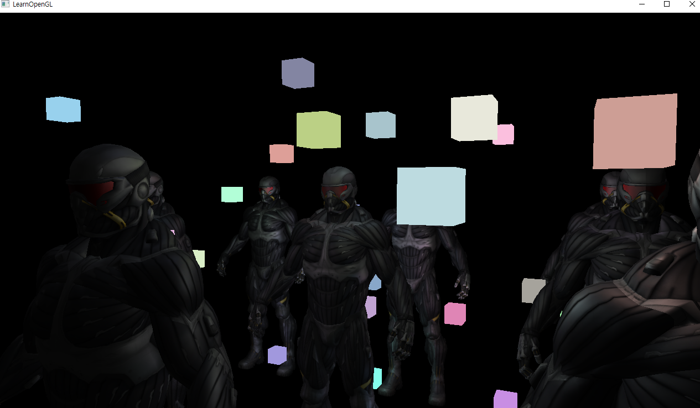

# Deferred Shading

* `Deferred Shading` 이 무엇인지, 어떻게 사용하는지 알아보자.

* 지금까지의 방식은 객체를 렌더링하고 씬의 모든 광원에서 빛을 비춘 후 객체를 다시 렌더링하는 `forward shading` 이다.
* 렌더링하는 각 객체는 모든 `fragment` 에서 라이팅 계산을 해야한다.
* `depth complexity` 가 높은 장면에서 효율이 떨어진다. (여러 객체가 동일한 스크린 픽셀을 사용한다)

* `deferred shading` 은 객체를 렌더링 하는 방법을 변경하여 위의 문제를 해결한다.
* 라이팅과 같이 계산량이 많은 렌더링의 대부분을 두 번째 pass 에서 수행한다.
* 첫번째 pass(geometry pass) 에서 장면을 한번 렌더링하고 `G-buffer` 라는 텍스쳐 모음에 기하학적 정보를 저장한다.
  * `position vectors`, `normal vectors`, `color vectors`, `specular value` 등


* 두번째 pass(lighting pass) 에서 `G-buffer` 에 저장된 기하학적 정보를 사용하여 픽셀 단위로 장면 조명을 계산한다.
* 계산 자체는 동일하지만 `vertex shader` 대신 `G-buffer` 에서 값을 가져온다.
* `depth test` 가 끝난 뒤의 정보가 `G-buffer`에 들어가기 때문에 `lighting pass` 에서 픽셀마다 한번만 그린다.
* 단점
  * 장면 데이터를 저장하기 위해 많은 메모리를 사용해야 한다.
  * 최상위 프래그먼트 정보만 있기 때문에 블렌딩을 지원하지 않는다.
	* `forward-rendering` 을 합쳐서 표현할 수 있다.
  * 씬 라이팅에 동일한 알고리즘을 사용해야 한다.
    * `G-buffer` 에 더 많은 `material-specific data` 를 포함시켜 해결 가능
* `multiple render targets` 를 사용하여 단일 렌더 패스에서 모든것을 수행할 수 있다.


* `deferred shading` 의 전체 프로세스는 아래와 같다.

```cpp
while(...) { // render loop
    // 1. geometry pass: render all geometric/color data to g-buffer 
    glBindFramebuffer(GL_FRAMEBUFFER, gBuffer);
    glClear(GL_COLOR_BUFFER_BIT | GL_DEPTH_BUFFER_BIT);
    gBufferShader.use();
    for(Object obj : Objects) {
        ConfigureShaderTransformsAndUniforms();
        obj.Draw();
    }  
    // 2. lighting pass: use g-buffer to calculate the scene's lighting
    glBindFramebuffer(GL_FRAMEBUFFER, 0);
    glClear(GL_COLOR_BUFFER_BIT);
    lightingPassShader.use();
    BindAllGBufferTextures();
    SetLightingUniforms();
    RenderQuad();
}
```

# Result



# Shader Codes

## G-buffer Shader Codes

* `G-buffer` 를 생성하는 쉐이더

```cpp
// vertex shader
#version 330 core
layout (location = 0) in vec3 aPos;
layout (location = 1) in vec3 aNormal;
layout (location = 2) in vec2 aTexCoords;

out vec3 FragPos;
out vec2 TexCoords;
out vec3 Normal;

uniform mat4 model;
uniform mat4 view;
uniform mat4 projection;

void main() {
	// 전부 world coordinate 이다.
    vec4 worldPos = model * vec4(aPos, 1.0);
    FragPos = worldPos.xyz; 
    TexCoords = aTexCoords;
    
    mat3 normalMatrix = transpose(inverse(mat3(model)));
    Normal = normalMatrix * aNormal;

    gl_Position = projection * view * worldPos;
}

// fragment shader
#version 330 core
layout (location = 0) out vec3 gPosition;
layout (location = 1) out vec3 gNormal;
layout (location = 2) out vec4 gAlbedoSpec;

in vec2 TexCoords;
in vec3 FragPos;
in vec3 Normal;

uniform sampler2D texture_diffuse1;
uniform sampler2D texture_specular1;

void main() {
    // store the fragment position vector in the first gbuffer texture
    gPosition = FragPos;
    // also store the per-fragment normals into the gbuffer
    gNormal = normalize(Normal);
    // and the diffuse per-fragment color
    gAlbedoSpec.rgb = texture(texture_diffuse1, TexCoords).rgb;
    // store specular intensity in gAlbedoSpec's alpha component
    gAlbedoSpec.a = texture(texture_specular1, TexCoords).r;
}
```

## Deferred Shader Codes

* 라이팅 계산을 하는 쉐이더

```cpp
// vertex shader
#version 330 core
layout (location = 0) in vec3 aPos;
layout (location = 1) in vec2 aTexCoords;

out vec2 TexCoords;

void main() {
    TexCoords = aTexCoords;
    gl_Position = vec4(aPos, 1.0);
}

// fragment shader
#version 330 core
out vec4 FragColor;

in vec2 TexCoords;

uniform sampler2D gPosition;
uniform sampler2D gNormal;
uniform sampler2D gAlbedoSpec;

struct Light {
    vec3 Position;
    vec3 Color;
    
    float Linear;
    float Quadratic;
};
const int NR_LIGHTS = 32;
uniform Light lights[NR_LIGHTS];
uniform vec3 viewPos;

void main() {         
    // retrieve data from gbuffer
    vec3 FragPos = texture(gPosition, TexCoords).rgb;
    vec3 Normal = texture(gNormal, TexCoords).rgb;
    vec3 Diffuse = texture(gAlbedoSpec, TexCoords).rgb;
    float Specular = texture(gAlbedoSpec, TexCoords).a;
    
    // then calculate lighting as usual
    vec3 lighting  = Diffuse * 0.1; // hard-coded ambient component
    vec3 viewDir  = normalize(viewPos - FragPos);
    for(int i = 0; i < NR_LIGHTS; ++i) {
        // diffuse
        vec3 lightDir = normalize(lights[i].Position - FragPos);
        vec3 diffuse = max(dot(Normal, lightDir), 0.0) * Diffuse * lights[i].Color;
        // specular
        vec3 halfwayDir = normalize(lightDir + viewDir);  
        float spec = pow(max(dot(Normal, halfwayDir), 0.0), 16.0);
        vec3 specular = lights[i].Color * spec * Specular;
        // attenuation
        float distance = length(lights[i].Position - FragPos);
        float attenuation = 1.0 / (1.0 + lights[i].Linear * distance + lights[i].Quadratic * distance * distance);
        diffuse *= attenuation;
        specular *= attenuation;
        lighting += diffuse + specular;        
    }
    FragColor = vec4(lighting, 1.0);
}

```

# Source Codes

```cpp
#include <glad/glad.h>
#include <GLFW/glfw3.h>

#include <glm/glm.hpp>
#include <glm/gtc/matrix_transform.hpp>
#include <glm/gtc/type_ptr.hpp>

#include <learnopengl/filesystem.h>
#include <learnopengl/shader.h>
#include <learnopengl/camera.h>
#include <learnopengl/model.h>

#include <iostream>

void framebuffer_size_callback(GLFWwindow* window, int width, int height);
void mouse_callback(GLFWwindow* window, double xpos, double ypos);
void scroll_callback(GLFWwindow* window, double xoffset, double yoffset);
void processInput(GLFWwindow *window);
unsigned int loadTexture(const char *path, bool gammaCorrection);
void renderQuad();
void renderCube();

// settings
const unsigned int SCR_WIDTH = 1280;
const unsigned int SCR_HEIGHT = 720;

// camera
Camera camera(glm::vec3(0.0f, 0.0f, 5.0f));
float lastX = (float)SCR_WIDTH / 2.0;
float lastY = (float)SCR_HEIGHT / 2.0;
bool firstMouse = true;

// timing
float deltaTime = 0.0f;
float lastFrame = 0.0f;

int main() {
    // glfw: initialize and configure
    // ------------------------------
    glfwInit();
    glfwWindowHint(GLFW_CONTEXT_VERSION_MAJOR, 3);
    glfwWindowHint(GLFW_CONTEXT_VERSION_MINOR, 3);
    glfwWindowHint(GLFW_OPENGL_PROFILE, GLFW_OPENGL_CORE_PROFILE);

#ifdef __APPLE__
    glfwWindowHint(GLFW_OPENGL_FORWARD_COMPAT, GL_TRUE); // uncomment this statement to fix compilation on OS X
#endif
    
    // glfw window creation
    // --------------------
    GLFWwindow* window = glfwCreateWindow(SCR_WIDTH, SCR_HEIGHT, "LearnOpenGL", NULL, NULL);
    if (window == NULL) {
        std::cout << "Failed to create GLFW window" << std::endl;
        glfwTerminate();
        return -1;
    }
    glfwMakeContextCurrent(window);
    glfwSetFramebufferSizeCallback(window, framebuffer_size_callback);
    glfwSetCursorPosCallback(window, mouse_callback);
    glfwSetScrollCallback(window, scroll_callback);

    // tell GLFW to capture our mouse
    glfwSetInputMode(window, GLFW_CURSOR, GLFW_CURSOR_DISABLED);

    // glad: load all OpenGL function pointers
    // ---------------------------------------
    if (!gladLoadGLLoader((GLADloadproc)glfwGetProcAddress)) {
        std::cout << "Failed to initialize GLAD" << std::endl;
        return -1;
    }

    // configure global opengl state
    // -----------------------------
    glEnable(GL_DEPTH_TEST);

    // build and compile shaders
    // -------------------------
    Shader shaderGeometryPass("8.1.g_buffer.vs", "8.1.g_buffer.fs");
    Shader shaderLightingPass("8.1.deferred_shading.vs", "8.1.deferred_shading.fs");
    Shader shaderLightBox("8.1.deferred_light_box.vs", "8.1.deferred_light_box.fs");

    // load models
    // -----------
    Model nanosuit(FileSystem::getPath("resources/objects/nanosuit/nanosuit.obj"));
    std::vector<glm::vec3> objectPositions;
    objectPositions.push_back(glm::vec3(-3.0,  -3.0, -3.0));
    objectPositions.push_back(glm::vec3( 0.0,  -3.0, -3.0));
    objectPositions.push_back(glm::vec3( 3.0,  -3.0, -3.0));
    objectPositions.push_back(glm::vec3(-3.0,  -3.0,  0.0));
    objectPositions.push_back(glm::vec3( 0.0,  -3.0,  0.0));
    objectPositions.push_back(glm::vec3( 3.0,  -3.0,  0.0));
    objectPositions.push_back(glm::vec3(-3.0,  -3.0,  3.0));
    objectPositions.push_back(glm::vec3( 0.0,  -3.0,  3.0));
    objectPositions.push_back(glm::vec3( 3.0,  -3.0,  3.0));


    // configure g-buffer framebuffer
    // ------------------------------
    unsigned int gBuffer;
    glGenFramebuffers(1, &gBuffer);
    glBindFramebuffer(GL_FRAMEBUFFER, gBuffer);
    unsigned int gPosition, gNormal, gAlbedoSpec;
    // position color buffer
    glGenTextures(1, &gPosition);
    glBindTexture(GL_TEXTURE_2D, gPosition);
    glTexImage2D(GL_TEXTURE_2D, 0, GL_RGB16F, SCR_WIDTH, SCR_HEIGHT, 0, GL_RGB, GL_FLOAT, NULL);
    glTexParameteri(GL_TEXTURE_2D, GL_TEXTURE_MIN_FILTER, GL_NEAREST);
    glTexParameteri(GL_TEXTURE_2D, GL_TEXTURE_MAG_FILTER, GL_NEAREST);
    glFramebufferTexture2D(GL_FRAMEBUFFER, GL_COLOR_ATTACHMENT0, GL_TEXTURE_2D, gPosition, 0);
    // normal color buffer
    glGenTextures(1, &gNormal);
    glBindTexture(GL_TEXTURE_2D, gNormal);
    glTexImage2D(GL_TEXTURE_2D, 0, GL_RGB16F, SCR_WIDTH, SCR_HEIGHT, 0, GL_RGB, GL_FLOAT, NULL);
    glTexParameteri(GL_TEXTURE_2D, GL_TEXTURE_MIN_FILTER, GL_NEAREST);
    glTexParameteri(GL_TEXTURE_2D, GL_TEXTURE_MAG_FILTER, GL_NEAREST);
    glFramebufferTexture2D(GL_FRAMEBUFFER, GL_COLOR_ATTACHMENT1, GL_TEXTURE_2D, gNormal, 0);
    // color + specular color buffer
    glGenTextures(1, &gAlbedoSpec);
    glBindTexture(GL_TEXTURE_2D, gAlbedoSpec);
    glTexImage2D(GL_TEXTURE_2D, 0, GL_RGBA, SCR_WIDTH, SCR_HEIGHT, 0, GL_RGBA, GL_UNSIGNED_BYTE, NULL);
    glTexParameteri(GL_TEXTURE_2D, GL_TEXTURE_MIN_FILTER, GL_NEAREST);
    glTexParameteri(GL_TEXTURE_2D, GL_TEXTURE_MAG_FILTER, GL_NEAREST);
    glFramebufferTexture2D(GL_FRAMEBUFFER, GL_COLOR_ATTACHMENT2, GL_TEXTURE_2D, gAlbedoSpec, 0);
    // tell OpenGL which color attachments we'll use (of this framebuffer) for rendering 
    unsigned int attachments[3] = { GL_COLOR_ATTACHMENT0, GL_COLOR_ATTACHMENT1, GL_COLOR_ATTACHMENT2 };
    glDrawBuffers(3, attachments);
    // create and attach depth buffer (renderbuffer)
    unsigned int rboDepth;
    glGenRenderbuffers(1, &rboDepth);
    glBindRenderbuffer(GL_RENDERBUFFER, rboDepth);
    glRenderbufferStorage(GL_RENDERBUFFER, GL_DEPTH_COMPONENT, SCR_WIDTH, SCR_HEIGHT);
    glFramebufferRenderbuffer(GL_FRAMEBUFFER, GL_DEPTH_ATTACHMENT, GL_RENDERBUFFER, rboDepth);
    // finally check if framebuffer is complete
    if (glCheckFramebufferStatus(GL_FRAMEBUFFER) != GL_FRAMEBUFFER_COMPLETE)
        std::cout << "Framebuffer not complete!" << std::endl;
    glBindFramebuffer(GL_FRAMEBUFFER, 0);

    // lighting info
    // -------------
    const unsigned int NR_LIGHTS = 32;
    std::vector<glm::vec3> lightPositions;
    std::vector<glm::vec3> lightColors;
    srand(13);
    for (unsigned int i = 0; i < NR_LIGHTS; i++) {
        // calculate slightly random offsets
        float xPos = ((rand() % 100) / 100.0) * 6.0 - 3.0;
        float yPos = ((rand() % 100) / 100.0) * 6.0 - 4.0;
        float zPos = ((rand() % 100) / 100.0) * 6.0 - 3.0;
        lightPositions.push_back(glm::vec3(xPos, yPos, zPos));
        // also calculate random color
        float rColor = ((rand() % 100) / 200.0f) + 0.5; // between 0.5 and 1.0
        float gColor = ((rand() % 100) / 200.0f) + 0.5; // between 0.5 and 1.0
        float bColor = ((rand() % 100) / 200.0f) + 0.5; // between 0.5 and 1.0
        lightColors.push_back(glm::vec3(rColor, gColor, bColor));
    }

    // shader configuration
    // --------------------
    shaderLightingPass.use();
    shaderLightingPass.setInt("gPosition", 0);
    shaderLightingPass.setInt("gNormal", 1);
    shaderLightingPass.setInt("gAlbedoSpec", 2);

    // render loop
    // -----------
    while (!glfwWindowShouldClose(window)) {
        // per-frame time logic
        // --------------------
        float currentFrame = glfwGetTime();
        deltaTime = currentFrame - lastFrame;
        lastFrame = currentFrame;

        // input
        // -----
        processInput(window);

        // render
        // ------
        glClearColor(0.0f, 0.0f, 0.0f, 1.0f);
        glClear(GL_COLOR_BUFFER_BIT | GL_DEPTH_BUFFER_BIT);

        // 1. geometry pass: render scene's geometry/color data into gbuffer
        // -----------------------------------------------------------------
        glBindFramebuffer(GL_FRAMEBUFFER, gBuffer);
            glClear(GL_COLOR_BUFFER_BIT | GL_DEPTH_BUFFER_BIT);
            glm::mat4 projection = glm::perspective(glm::radians(camera.Zoom), (float)SCR_WIDTH / (float)SCR_HEIGHT, 0.1f, 100.0f);
            glm::mat4 view = camera.GetViewMatrix();
            glm::mat4 model;
            shaderGeometryPass.use();
            shaderGeometryPass.setMat4("projection", projection);
            shaderGeometryPass.setMat4("view", view);
            for (unsigned int i = 0; i < objectPositions.size(); i++) {
                model = glm::mat4();
                model = glm::translate(model, objectPositions[i]);
                model = glm::scale(model, glm::vec3(0.25f));
                shaderGeometryPass.setMat4("model", model);
                nanosuit.Draw(shaderGeometryPass);
            }
        glBindFramebuffer(GL_FRAMEBUFFER, 0);

        // 2. lighting pass: calculate lighting by iterating over a screen filled quad pixel-by-pixel using the gbuffer's content.
        // -----------------------------------------------------------------------------------------------------------------------
        glClear(GL_COLOR_BUFFER_BIT | GL_DEPTH_BUFFER_BIT);
        shaderLightingPass.use();
        glActiveTexture(GL_TEXTURE0);
        glBindTexture(GL_TEXTURE_2D, gPosition);
        glActiveTexture(GL_TEXTURE1);
        glBindTexture(GL_TEXTURE_2D, gNormal);
        glActiveTexture(GL_TEXTURE2);
        glBindTexture(GL_TEXTURE_2D, gAlbedoSpec);
        // send light relevant uniforms
        for (unsigned int i = 0; i < lightPositions.size(); i++) {
            shaderLightingPass.setVec3("lights[" + std::to_string(i) + "].Position", lightPositions[i]);
            shaderLightingPass.setVec3("lights[" + std::to_string(i) + "].Color", lightColors[i]);
            // update attenuation parameters and calculate radius
            const float constant = 1.0; // note that we don't send this to the shader, we assume it is always 1.0 (in our case)
            const float linear = 0.7;
            const float quadratic = 1.8;
            shaderLightingPass.setFloat("lights[" + std::to_string(i) + "].Linear", linear);
            shaderLightingPass.setFloat("lights[" + std::to_string(i) + "].Quadratic", quadratic);
        }
        shaderLightingPass.setVec3("viewPos", camera.Position);
        // finally render quad
        renderQuad();

        // 2.5. copy content of geometry's depth buffer to default framebuffer's depth buffer
        // ----------------------------------------------------------------------------------
        glBindFramebuffer(GL_READ_FRAMEBUFFER, gBuffer);
        glBindFramebuffer(GL_DRAW_FRAMEBUFFER, 0); // write to default framebuffer
        // blit to default framebuffer. Note that this may or may not work as the internal formats of both the FBO and default framebuffer have to match.
        // the internal formats are implementation defined. This works on all of my systems, but if it doesn't on yours you'll likely have to write to the 		
        // depth buffer in another shader stage (or somehow see to match the default framebuffer's internal format with the FBO's internal format).
        glBlitFramebuffer(0, 0, SCR_WIDTH, SCR_HEIGHT, 0, 0, SCR_WIDTH, SCR_HEIGHT, GL_DEPTH_BUFFER_BIT, GL_NEAREST);
        glBindFramebuffer(GL_FRAMEBUFFER, 0);

        // 3. render lights on top of scene
        // --------------------------------
        shaderLightBox.use();
        shaderLightBox.setMat4("projection", projection);
        shaderLightBox.setMat4("view", view);
        for (unsigned int i = 0; i < lightPositions.size(); i++) {
            model = glm::mat4();
            model = glm::translate(model, lightPositions[i]);
            model = glm::scale(model, glm::vec3(0.125f));
            shaderLightBox.setMat4("model", model);
            shaderLightBox.setVec3("lightColor", lightColors[i]);
            renderCube();
        }


        // glfw: swap buffers and poll IO events (keys pressed/released, mouse moved etc.)
        // -------------------------------------------------------------------------------
        glfwSwapBuffers(window);
        glfwPollEvents();
    }

    glfwTerminate();
    return 0;
}

// renderCube() renders a 1x1 3D cube in NDC.
// -------------------------------------------------
unsigned int cubeVAO = 0;
unsigned int cubeVBO = 0;
void renderCube() {
    // initialize (if necessary)
    if (cubeVAO == 0) {
        float vertices[] = {
            // back face
            -1.0f, -1.0f, -1.0f,  0.0f,  0.0f, -1.0f, 0.0f, 0.0f, // bottom-left
             1.0f,  1.0f, -1.0f,  0.0f,  0.0f, -1.0f, 1.0f, 1.0f, // top-right
             1.0f, -1.0f, -1.0f,  0.0f,  0.0f, -1.0f, 1.0f, 0.0f, // bottom-right         
             1.0f,  1.0f, -1.0f,  0.0f,  0.0f, -1.0f, 1.0f, 1.0f, // top-right
            -1.0f, -1.0f, -1.0f,  0.0f,  0.0f, -1.0f, 0.0f, 0.0f, // bottom-left
            -1.0f,  1.0f, -1.0f,  0.0f,  0.0f, -1.0f, 0.0f, 1.0f, // top-left
            // front face
            -1.0f, -1.0f,  1.0f,  0.0f,  0.0f,  1.0f, 0.0f, 0.0f, // bottom-left
             1.0f, -1.0f,  1.0f,  0.0f,  0.0f,  1.0f, 1.0f, 0.0f, // bottom-right
             1.0f,  1.0f,  1.0f,  0.0f,  0.0f,  1.0f, 1.0f, 1.0f, // top-right
             1.0f,  1.0f,  1.0f,  0.0f,  0.0f,  1.0f, 1.0f, 1.0f, // top-right
            -1.0f,  1.0f,  1.0f,  0.0f,  0.0f,  1.0f, 0.0f, 1.0f, // top-left
            -1.0f, -1.0f,  1.0f,  0.0f,  0.0f,  1.0f, 0.0f, 0.0f, // bottom-left
            // left face
            -1.0f,  1.0f,  1.0f, -1.0f,  0.0f,  0.0f, 1.0f, 0.0f, // top-right
            -1.0f,  1.0f, -1.0f, -1.0f,  0.0f,  0.0f, 1.0f, 1.0f, // top-left
            -1.0f, -1.0f, -1.0f, -1.0f,  0.0f,  0.0f, 0.0f, 1.0f, // bottom-left
            -1.0f, -1.0f, -1.0f, -1.0f,  0.0f,  0.0f, 0.0f, 1.0f, // bottom-left
            -1.0f, -1.0f,  1.0f, -1.0f,  0.0f,  0.0f, 0.0f, 0.0f, // bottom-right
            -1.0f,  1.0f,  1.0f, -1.0f,  0.0f,  0.0f, 1.0f, 0.0f, // top-right
            // right face
             1.0f,  1.0f,  1.0f,  1.0f,  0.0f,  0.0f, 1.0f, 0.0f, // top-left
             1.0f, -1.0f, -1.0f,  1.0f,  0.0f,  0.0f, 0.0f, 1.0f, // bottom-right
             1.0f,  1.0f, -1.0f,  1.0f,  0.0f,  0.0f, 1.0f, 1.0f, // top-right         
             1.0f, -1.0f, -1.0f,  1.0f,  0.0f,  0.0f, 0.0f, 1.0f, // bottom-right
             1.0f,  1.0f,  1.0f,  1.0f,  0.0f,  0.0f, 1.0f, 0.0f, // top-left
             1.0f, -1.0f,  1.0f,  1.0f,  0.0f,  0.0f, 0.0f, 0.0f, // bottom-left     
            // bottom face
            -1.0f, -1.0f, -1.0f,  0.0f, -1.0f,  0.0f, 0.0f, 1.0f, // top-right
             1.0f, -1.0f, -1.0f,  0.0f, -1.0f,  0.0f, 1.0f, 1.0f, // top-left
             1.0f, -1.0f,  1.0f,  0.0f, -1.0f,  0.0f, 1.0f, 0.0f, // bottom-left
             1.0f, -1.0f,  1.0f,  0.0f, -1.0f,  0.0f, 1.0f, 0.0f, // bottom-left
            -1.0f, -1.0f,  1.0f,  0.0f, -1.0f,  0.0f, 0.0f, 0.0f, // bottom-right
            -1.0f, -1.0f, -1.0f,  0.0f, -1.0f,  0.0f, 0.0f, 1.0f, // top-right
            // top face
            -1.0f,  1.0f, -1.0f,  0.0f,  1.0f,  0.0f, 0.0f, 1.0f, // top-left
             1.0f,  1.0f , 1.0f,  0.0f,  1.0f,  0.0f, 1.0f, 0.0f, // bottom-right
             1.0f,  1.0f, -1.0f,  0.0f,  1.0f,  0.0f, 1.0f, 1.0f, // top-right     
             1.0f,  1.0f,  1.0f,  0.0f,  1.0f,  0.0f, 1.0f, 0.0f, // bottom-right
            -1.0f,  1.0f, -1.0f,  0.0f,  1.0f,  0.0f, 0.0f, 1.0f, // top-left
            -1.0f,  1.0f,  1.0f,  0.0f,  1.0f,  0.0f, 0.0f, 0.0f  // bottom-left        
        };
        glGenVertexArrays(1, &cubeVAO);
        glGenBuffers(1, &cubeVBO);
        // fill buffer
        glBindBuffer(GL_ARRAY_BUFFER, cubeVBO);
        glBufferData(GL_ARRAY_BUFFER, sizeof(vertices), vertices, GL_STATIC_DRAW);
        // link vertex attributes
        glBindVertexArray(cubeVAO);
        glEnableVertexAttribArray(0);
        glVertexAttribPointer(0, 3, GL_FLOAT, GL_FALSE, 8 * sizeof(float), (void*)0);
        glEnableVertexAttribArray(1);
        glVertexAttribPointer(1, 3, GL_FLOAT, GL_FALSE, 8 * sizeof(float), (void*)(3 * sizeof(float)));
        glEnableVertexAttribArray(2);
        glVertexAttribPointer(2, 2, GL_FLOAT, GL_FALSE, 8 * sizeof(float), (void*)(6 * sizeof(float)));
        glBindBuffer(GL_ARRAY_BUFFER, 0);
        glBindVertexArray(0);
    }
    // render Cube
    glBindVertexArray(cubeVAO);
    glDrawArrays(GL_TRIANGLES, 0, 36);
    glBindVertexArray(0);
}


// renderQuad() renders a 1x1 XY quad in NDC
// -----------------------------------------
unsigned int quadVAO = 0;
unsigned int quadVBO;
void renderQuad() {
    if (quadVAO == 0) {
        float quadVertices[] = {
            // positions        // texture Coords
            -1.0f,  1.0f, 0.0f, 0.0f, 1.0f,
            -1.0f, -1.0f, 0.0f, 0.0f, 0.0f,
             1.0f,  1.0f, 0.0f, 1.0f, 1.0f,
             1.0f, -1.0f, 0.0f, 1.0f, 0.0f,
        };
        // setup plane VAO
        glGenVertexArrays(1, &quadVAO);
        glGenBuffers(1, &quadVBO);
        glBindVertexArray(quadVAO);
        glBindBuffer(GL_ARRAY_BUFFER, quadVBO);
        glBufferData(GL_ARRAY_BUFFER, sizeof(quadVertices), &quadVertices, GL_STATIC_DRAW);
        glEnableVertexAttribArray(0);
        glVertexAttribPointer(0, 3, GL_FLOAT, GL_FALSE, 5 * sizeof(float), (void*)0);
        glEnableVertexAttribArray(1);
        glVertexAttribPointer(1, 2, GL_FLOAT, GL_FALSE, 5 * sizeof(float), (void*)(3 * sizeof(float)));
    }
    glBindVertexArray(quadVAO);
    glDrawArrays(GL_TRIANGLE_STRIP, 0, 4);
    glBindVertexArray(0);
}

// process all input: query GLFW whether relevant keys are pressed/released this frame and react accordingly
// ---------------------------------------------------------------------------------------------------------
void processInput(GLFWwindow *window) {
    if (glfwGetKey(window, GLFW_KEY_ESCAPE) == GLFW_PRESS)
        glfwSetWindowShouldClose(window, true);

    if (glfwGetKey(window, GLFW_KEY_W) == GLFW_PRESS)
        camera.ProcessKeyboard(FORWARD, deltaTime);
    if (glfwGetKey(window, GLFW_KEY_S) == GLFW_PRESS)
        camera.ProcessKeyboard(BACKWARD, deltaTime);
    if (glfwGetKey(window, GLFW_KEY_A) == GLFW_PRESS)
        camera.ProcessKeyboard(LEFT, deltaTime);
    if (glfwGetKey(window, GLFW_KEY_D) == GLFW_PRESS)
        camera.ProcessKeyboard(RIGHT, deltaTime);
}

// glfw: whenever the window size changed (by OS or user resize) this callback function executes
// ---------------------------------------------------------------------------------------------
void framebuffer_size_callback(GLFWwindow* window, int width, int height) {
    // make sure the viewport matches the new window dimensions; note that width and 
    // height will be significantly larger than specified on retina displays.
    glViewport(0, 0, width, height);
}

// glfw: whenever the mouse moves, this callback is called
// -------------------------------------------------------
void mouse_callback(GLFWwindow* window, double xpos, double ypos) {
    if (firstMouse) {
        lastX = xpos;
        lastY = ypos;
        firstMouse = false;
    }

    float xoffset = xpos - lastX;
    float yoffset = lastY - ypos; // reversed since y-coordinates go from bottom to top

    lastX = xpos;
    lastY = ypos;

    camera.ProcessMouseMovement(xoffset, yoffset);
}

// glfw: whenever the mouse scroll wheel scrolls, this callback is called
// ----------------------------------------------------------------------
void scroll_callback(GLFWwindow* window, double xoffset, double yoffset) {
    camera.ProcessMouseScroll(yoffset);
}
```