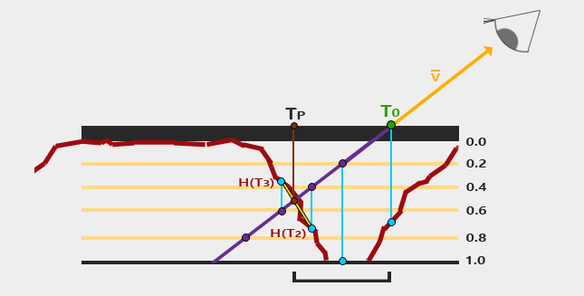
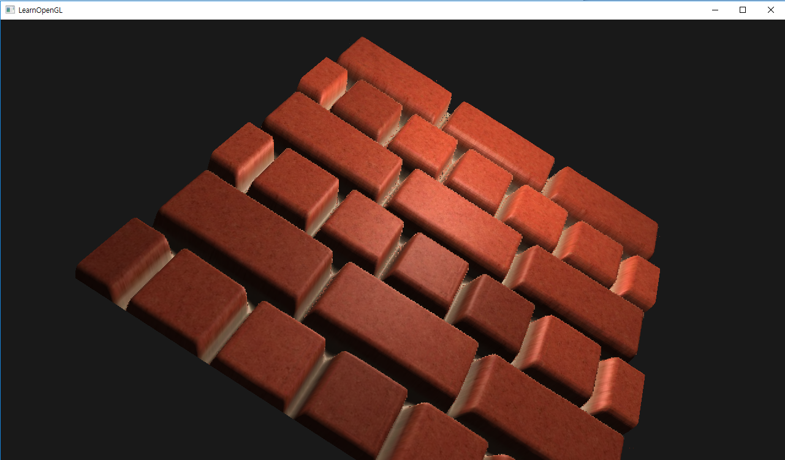

# Parallax Occlusion Mapping

* `Parallax Occlusion Mapping` 을 사용하여 텍스쳐 표면의 디테일과 깊이감을 줘보자.

* `Parallax Occlusion Mapping` 은 `Steep Parallax Mapping` 에서 한단계 더 나아간 버전이다.
* `Steep Parallax Mapping` 을 통해 구한 값과 직전의 값을 선형적으로 보간한다.
* 아래의 그림에서 `T_0` 의 깊이값은 `T_P`가 된다.



# Result



# Shader Codes

## Vertex Shader Codes

* `Parallax Mapping` 과 동일한 코드이다.

```cpp
#version 330 core
layout (location = 0) in vec3 aPos;
layout (location = 1) in vec3 aNormal;
layout (location = 2) in vec2 aTexCoords;
layout (location = 3) in vec3 aTangent;
layout (location = 4) in vec3 aBitangent;

out VS_OUT {
    vec3 FragPos;
    vec2 TexCoords;
    vec3 TangentLightPos;
    vec3 TangentViewPos; // 필수
    vec3 TangentFragPos; // 필수
} vs_out;

uniform mat4 projection;
uniform mat4 view;
uniform mat4 model;

uniform vec3 lightPos;
uniform vec3 viewPos;

void main() {
    gl_Position      = projection * view * model * vec4(aPos, 1.0);
    vs_out.FragPos   = vec3(model * vec4(aPos, 1.0));   
    vs_out.TexCoords = aTexCoords;    
    
    vec3 T   = normalize(mat3(model) * aTangent);
    vec3 B   = normalize(mat3(model) * aBitangent);
    vec3 N   = normalize(mat3(model) * aNormal);
    mat3 TBN = transpose(mat3(T, B, N)); // 좌표계 변환 행렬을 만든다.

    vs_out.TangentLightPos = TBN * lightPos;
    vs_out.TangentViewPos  = TBN * viewPos;
    vs_out.TangentFragPos  = TBN * vs_out.FragPos;
} 
```

## Fragment Shader Codes

```cpp
#version 330 core
out vec4 FragColor;

in VS_OUT {
    vec3 FragPos;
    vec2 TexCoords;
    vec3 TangentLightPos;
    vec3 TangentViewPos;
    vec3 TangentFragPos;
} fs_in;

uniform sampler2D diffuseMap;
uniform sampler2D normalMap;
uniform sampler2D depthMap;

uniform float heightScale;

// 시차 매핑되는 좌표를 가져오는 함수
vec2 ParallaxMapping(vec2 texCoords, vec3 viewDir) { 
    // number of depth layers
    const float minLayers = 8;
    const float maxLayers = 32;
    // cosine 값으로 interpolating 한다. (바라보는 방향이 텍스쳐의 수직에 가까우면 많은 레이어로 계산)
    float numLayers = mix(maxLayers, minLayers, abs(dot(vec3(0.0, 0.0, 1.0), viewDir)));  
    // calculate the size of each layer
    float layerDepth = 1.0 / numLayers;
    // depth of current layer
    float currentLayerDepth = 0.0;
    // 이동해야하는 UV좌표값
    vec2 P = viewDir.xy / viewDir.z * heightScale; 
    vec2 deltaTexCoords = P / numLayers;
  
    // get initial values
    vec2  currentTexCoords     = texCoords;
    float currentDepthMapValue = texture(depthMap, currentTexCoords).r;
      
    while(currentLayerDepth < currentDepthMapValue) {
        // shift texture coordinates along direction of P
        currentTexCoords -= deltaTexCoords;
        // get depthmap value at current texture coordinates
        currentDepthMapValue = texture(depthMap, currentTexCoords).r;  
        // get depth of next layer
        currentLayerDepth += layerDepth;  
    }
    
    // 이전 depth의 UV값을 가져온다.
    vec2 prevTexCoords = currentTexCoords + deltaTexCoords;

    // linear interpolation을 위해 depth 값을 가져온다.
    float afterDepth  = currentDepthMapValue - currentLayerDepth;
    float beforeDepth = texture(depthMap, prevTexCoords).r - currentLayerDepth + layerDepth;
 
    // interpolation of texture coordinates
    float weight = afterDepth / (afterDepth - beforeDepth); // 비율
    vec2 finalTexCoords = prevTexCoords * weight + currentTexCoords * (1.0 - weight);

    return finalTexCoords;
}

void main() {           
    // offset texture coordinates with Parallax Mapping
    vec3 viewDir = normalize(fs_in.TangentViewPos - fs_in.TangentFragPos);
    vec2 texCoords = fs_in.TexCoords;
    
    texCoords = ParallaxMapping(fs_in.TexCoords,  viewDir);
    // 가장자리의 오버 샘플링된 프래그먼트를 제거한다.  
    if(texCoords.x > 1.0 || texCoords.y > 1.0 || texCoords.x < 0.0 || texCoords.y < 0.0)
        discard;

    // obtain normal from normal map
    vec3 normal = texture(normalMap, texCoords).rgb;
    normal = normalize(normal * 2.0 - 1.0);   
   
    // get diffuse color
    vec3 color = texture(diffuseMap, texCoords).rgb;
    // ambient
    vec3 ambient = 0.1 * color;
    // diffuse
    vec3 lightDir = normalize(fs_in.TangentLightPos - fs_in.TangentFragPos);
    float diff = max(dot(lightDir, normal), 0.0);
    vec3 diffuse = diff * color;
    // specular    
    vec3 reflectDir = reflect(-lightDir, normal);
    vec3 halfwayDir = normalize(lightDir + viewDir);  
    float spec = pow(max(dot(normal, halfwayDir), 0.0), 32.0);

    vec3 specular = vec3(0.2) * spec;
    FragColor = vec4(ambient + diffuse + specular, 1.0);
}
```

# Source Codes

```cpp
#include <glad/glad.h>
#include <GLFW/glfw3.h>
#include <stb_image.h>

#include <glm/glm.hpp>
#include <glm/gtc/matrix_transform.hpp>
#include <glm/gtc/type_ptr.hpp>

#include <learnopengl/filesystem.h>
#include <learnopengl/shader.h>
#include <learnopengl/camera.h>
#include <learnopengl/model.h>

#include <iostream>

void framebuffer_size_callback(GLFWwindow* window, int width, int height);
void mouse_callback(GLFWwindow* window, double xpos, double ypos);
void scroll_callback(GLFWwindow* window, double xoffset, double yoffset);
void processInput(GLFWwindow *window);
unsigned int loadTexture(const char *path);
void renderQuad();

// settings
const unsigned int SCR_WIDTH = 1280;
const unsigned int SCR_HEIGHT = 720;
float heightScale = 0.1;

// camera
Camera camera(glm::vec3(0.0f, 0.0f, 3.0f));
float lastX = (float)SCR_WIDTH / 2.0;
float lastY = (float)SCR_HEIGHT / 2.0;
bool firstMouse = true;

// timing
float deltaTime = 0.0f;
float lastFrame = 0.0f;

int main() {
	// glfw: initialize and configure
	// ------------------------------
	glfwInit();
	glfwWindowHint(GLFW_CONTEXT_VERSION_MAJOR, 3);
	glfwWindowHint(GLFW_CONTEXT_VERSION_MINOR, 3);
	glfwWindowHint(GLFW_OPENGL_PROFILE, GLFW_OPENGL_CORE_PROFILE);

#ifdef __APPLE__
	glfwWindowHint(GLFW_OPENGL_FORWARD_COMPAT, GL_TRUE); // uncomment this statement to fix compilation on OS X
#endif

	// glfw window creation
	// --------------------
	GLFWwindow* window = glfwCreateWindow(SCR_WIDTH, SCR_HEIGHT, "LearnOpenGL", NULL, NULL);
	if (window == NULL) {
		std::cout << "Failed to create GLFW window" << std::endl;
		glfwTerminate();
		return -1;
	}
	glfwMakeContextCurrent(window);
	glfwSetFramebufferSizeCallback(window, framebuffer_size_callback);
	glfwSetCursorPosCallback(window, mouse_callback);
	glfwSetScrollCallback(window, scroll_callback);

	// tell GLFW to capture our mouse
	glfwSetInputMode(window, GLFW_CURSOR, GLFW_CURSOR_DISABLED);

	// glad: load all OpenGL function pointers
	// ---------------------------------------
	if (!gladLoadGLLoader((GLADloadproc)glfwGetProcAddress)) {
		std::cout << "Failed to initialize GLAD" << std::endl;
		return -1;
	}

	// configure global opengl state
	// -----------------------------
	glEnable(GL_DEPTH_TEST);

	// build and compile shaders
	// -------------------------
	Shader shader("5.1.parallax_mapping.vs", "5.1.parallax_mapping.fs");

	// load textures
	// -------------
	unsigned int diffuseMap = loadTexture(FileSystem::getPath("resources/textures/bricks2.jpg").c_str());
	unsigned int normalMap = loadTexture(FileSystem::getPath("resources/textures/bricks2_normal.jpg").c_str());
	unsigned int heightMap = loadTexture(FileSystem::getPath("resources/textures/bricks2_disp.jpg").c_str());
	/* unsigned int diffuseMap = loadTexture(FileSystem::getPath("resources/textures/toy_box_diffuse.png").c_str());
	 unsigned int normalMap = loadTexture(FileSystem::getPath("resources/textures/toy_box_normal.png").c_str());
	 unsigned int heightMap = loadTexture(FileSystem::getPath("resources/textures/toy_box_disp.png").c_str());*/

	 // shader configuration
	 // --------------------
	shader.use();
	shader.setInt("diffuseMap", 0);
	shader.setInt("normalMap", 1);
	shader.setInt("depthMap", 2);

	// lighting info
	// -------------
	glm::vec3 lightPos(0.5f, 1.0f, 0.3f);

	// render loop
	// -----------
	while (!glfwWindowShouldClose(window)) {
		// per-frame time logic
		// --------------------
		float currentFrame = glfwGetTime();
		deltaTime = currentFrame - lastFrame;
		lastFrame = currentFrame;

		// input
		// -----
		processInput(window);

		// render
		// ------
		glClearColor(0.1f, 0.1f, 0.1f, 1.0f);
		glClear(GL_COLOR_BUFFER_BIT | GL_DEPTH_BUFFER_BIT);

		// configure view/projection matrices
		glm::mat4 projection = glm::perspective(glm::radians(camera.Zoom), (float)SCR_WIDTH / (float)SCR_HEIGHT, 0.1f, 100.0f);
		glm::mat4 view = camera.GetViewMatrix();
		shader.use();
		shader.setMat4("projection", projection);
		shader.setMat4("view", view);
		// render parallax-mapped quad
		glm::mat4 model;
		model = glm::rotate(model, glm::radians((float)glfwGetTime() * -10.0f), glm::normalize(glm::vec3(1.0, 0.0, 1.0))); // rotate the quad to show parallax mapping from multiple directions
		shader.setMat4("model", model);
		shader.setVec3("viewPos", camera.Position);
		shader.setVec3("lightPos", lightPos);
		shader.setFloat("heightScale", heightScale); // adjust with Q and E keys
		std::cout << heightScale << std::endl;
		glActiveTexture(GL_TEXTURE0);
		glBindTexture(GL_TEXTURE_2D, diffuseMap);
		glActiveTexture(GL_TEXTURE1);
		glBindTexture(GL_TEXTURE_2D, normalMap);
		glActiveTexture(GL_TEXTURE2);
		glBindTexture(GL_TEXTURE_2D, heightMap);
		renderQuad();

		// render light source (simply re-renders a smaller plane at the light's position for debugging/visualization)
		model = glm::mat4();
		model = glm::translate(model, lightPos);
		model = glm::scale(model, glm::vec3(0.1f));
		shader.setMat4("model", model);
		renderQuad();

		// glfw: swap buffers and poll IO events (keys pressed/released, mouse moved etc.)
		// -------------------------------------------------------------------------------
		glfwSwapBuffers(window);
		glfwPollEvents();
	}

	glfwTerminate();
	return 0;
}

// renders a 1x1 quad in NDC with manually calculated tangent vectors
// ------------------------------------------------------------------
unsigned int quadVAO = 0;
unsigned int quadVBO;
void renderQuad() {
	if (quadVAO == 0) {
		// positions
		glm::vec3 pos1(-1.0f, 1.0f, 0.0f);
		glm::vec3 pos2(-1.0f, -1.0f, 0.0f);
		glm::vec3 pos3(1.0f, -1.0f, 0.0f);
		glm::vec3 pos4(1.0f, 1.0f, 0.0f);
		// texture coordinates
		glm::vec2 uv1(0.0f, 1.0f);
		glm::vec2 uv2(0.0f, 0.0f);
		glm::vec2 uv3(1.0f, 0.0f);
		glm::vec2 uv4(1.0f, 1.0f);
		// normal vector
		glm::vec3 nm(0.0f, 0.0f, 1.0f);

		// calculate tangent/bitangent vectors of both triangles
		glm::vec3 tangent1, bitangent1;
		glm::vec3 tangent2, bitangent2;
		// triangle 1
		// ----------
		glm::vec3 edge1 = pos2 - pos1;
		glm::vec3 edge2 = pos3 - pos1;
		glm::vec2 deltaUV1 = uv2 - uv1;
		glm::vec2 deltaUV2 = uv3 - uv1;

		float f = 1.0f / (deltaUV1.x * deltaUV2.y - deltaUV2.x * deltaUV1.y);

		tangent1.x = f * (deltaUV2.y * edge1.x - deltaUV1.y * edge2.x);
		tangent1.y = f * (deltaUV2.y * edge1.y - deltaUV1.y * edge2.y);
		tangent1.z = f * (deltaUV2.y * edge1.z - deltaUV1.y * edge2.z);
		tangent1 = glm::normalize(tangent1);

		bitangent1.x = f * (-deltaUV2.x * edge1.x + deltaUV1.x * edge2.x);
		bitangent1.y = f * (-deltaUV2.x * edge1.y + deltaUV1.x * edge2.y);
		bitangent1.z = f * (-deltaUV2.x * edge1.z + deltaUV1.x * edge2.z);
		bitangent1 = glm::normalize(bitangent1);

		// triangle 2
		// ----------
		edge1 = pos3 - pos1;
		edge2 = pos4 - pos1;
		deltaUV1 = uv3 - uv1;
		deltaUV2 = uv4 - uv1;

		f = 1.0f / (deltaUV1.x * deltaUV2.y - deltaUV2.x * deltaUV1.y);

		tangent2.x = f * (deltaUV2.y * edge1.x - deltaUV1.y * edge2.x);
		tangent2.y = f * (deltaUV2.y * edge1.y - deltaUV1.y * edge2.y);
		tangent2.z = f * (deltaUV2.y * edge1.z - deltaUV1.y * edge2.z);
		tangent2 = glm::normalize(tangent2);


		bitangent2.x = f * (-deltaUV2.x * edge1.x + deltaUV1.x * edge2.x);
		bitangent2.y = f * (-deltaUV2.x * edge1.y + deltaUV1.x * edge2.y);
		bitangent2.z = f * (-deltaUV2.x * edge1.z + deltaUV1.x * edge2.z);
		bitangent2 = glm::normalize(bitangent2);


		float quadVertices[] = {
			// positions            // normal         // texcoords  // tangent                          // bitangent
			pos1.x, pos1.y, pos1.z, nm.x, nm.y, nm.z, uv1.x, uv1.y, tangent1.x, tangent1.y, tangent1.z, bitangent1.x, bitangent1.y, bitangent1.z,
			pos2.x, pos2.y, pos2.z, nm.x, nm.y, nm.z, uv2.x, uv2.y, tangent1.x, tangent1.y, tangent1.z, bitangent1.x, bitangent1.y, bitangent1.z,
			pos3.x, pos3.y, pos3.z, nm.x, nm.y, nm.z, uv3.x, uv3.y, tangent1.x, tangent1.y, tangent1.z, bitangent1.x, bitangent1.y, bitangent1.z,

			pos1.x, pos1.y, pos1.z, nm.x, nm.y, nm.z, uv1.x, uv1.y, tangent2.x, tangent2.y, tangent2.z, bitangent2.x, bitangent2.y, bitangent2.z,
			pos3.x, pos3.y, pos3.z, nm.x, nm.y, nm.z, uv3.x, uv3.y, tangent2.x, tangent2.y, tangent2.z, bitangent2.x, bitangent2.y, bitangent2.z,
			pos4.x, pos4.y, pos4.z, nm.x, nm.y, nm.z, uv4.x, uv4.y, tangent2.x, tangent2.y, tangent2.z, bitangent2.x, bitangent2.y, bitangent2.z
		};
		// configure plane VAO
		glGenVertexArrays(1, &quadVAO);
		glGenBuffers(1, &quadVBO);
		glBindVertexArray(quadVAO);
		glBindBuffer(GL_ARRAY_BUFFER, quadVBO);
		glBufferData(GL_ARRAY_BUFFER, sizeof(quadVertices), &quadVertices, GL_STATIC_DRAW);
		glEnableVertexAttribArray(0);
		glVertexAttribPointer(0, 3, GL_FLOAT, GL_FALSE, 14 * sizeof(float), (void*)0);
		glEnableVertexAttribArray(1);
		glVertexAttribPointer(1, 3, GL_FLOAT, GL_FALSE, 14 * sizeof(float), (void*)(3 * sizeof(float)));
		glEnableVertexAttribArray(2);
		glVertexAttribPointer(2, 2, GL_FLOAT, GL_FALSE, 14 * sizeof(float), (void*)(6 * sizeof(float)));
		glEnableVertexAttribArray(3);
		glVertexAttribPointer(3, 3, GL_FLOAT, GL_FALSE, 14 * sizeof(float), (void*)(8 * sizeof(float)));
		glEnableVertexAttribArray(4);
		glVertexAttribPointer(4, 3, GL_FLOAT, GL_FALSE, 14 * sizeof(float), (void*)(11 * sizeof(float)));
	}
	glBindVertexArray(quadVAO);
	glDrawArrays(GL_TRIANGLES, 0, 6);
	glBindVertexArray(0);
}

// process all input: query GLFW whether relevant keys are pressed/released this frame and react accordingly
// ---------------------------------------------------------------------------------------------------------
void processInput(GLFWwindow *window) {
	if (glfwGetKey(window, GLFW_KEY_ESCAPE) == GLFW_PRESS)
		glfwSetWindowShouldClose(window, true);

	if (glfwGetKey(window, GLFW_KEY_W) == GLFW_PRESS)
		camera.ProcessKeyboard(FORWARD, deltaTime);
	if (glfwGetKey(window, GLFW_KEY_S) == GLFW_PRESS)
		camera.ProcessKeyboard(BACKWARD, deltaTime);
	if (glfwGetKey(window, GLFW_KEY_A) == GLFW_PRESS)
		camera.ProcessKeyboard(LEFT, deltaTime);
	if (glfwGetKey(window, GLFW_KEY_D) == GLFW_PRESS)
		camera.ProcessKeyboard(RIGHT, deltaTime);

	if (glfwGetKey(window, GLFW_KEY_Q) == GLFW_PRESS) {
		if (heightScale > 0.0f)
			heightScale -= 0.0005f;
		else
			heightScale = 0.0f;
	} else if (glfwGetKey(window, GLFW_KEY_E) == GLFW_PRESS) {
		if (heightScale < 1.0f)
			heightScale += 0.0005f;
		else
			heightScale = 1.0f;
	}
}

// glfw: whenever the window size changed (by OS or user resize) this callback function executes
// ---------------------------------------------------------------------------------------------
void framebuffer_size_callback(GLFWwindow* window, int width, int height) {
	// make sure the viewport matches the new window dimensions; note that width and 
	// height will be significantly larger than specified on retina displays.
	glViewport(0, 0, width, height);
}

// glfw: whenever the mouse moves, this callback is called
// -------------------------------------------------------
void mouse_callback(GLFWwindow* window, double xpos, double ypos) {
	if (firstMouse) {
		lastX = xpos;
		lastY = ypos;
		firstMouse = false;
	}

	float xoffset = xpos - lastX;
	float yoffset = lastY - ypos; // reversed since y-coordinates go from bottom to top

	lastX = xpos;
	lastY = ypos;

	camera.ProcessMouseMovement(xoffset, yoffset);
}

// glfw: whenever the mouse scroll wheel scrolls, this callback is called
// ----------------------------------------------------------------------
void scroll_callback(GLFWwindow* window, double xoffset, double yoffset) {
	camera.ProcessMouseScroll(yoffset);
}

// utility function for loading a 2D texture from file
// ---------------------------------------------------
unsigned int loadTexture(char const * path) {
	unsigned int textureID;
	glGenTextures(1, &textureID);

	int width, height, nrComponents;
	unsigned char *data = stbi_load(path, &width, &height, &nrComponents, 0);
	if (data) {
		GLenum format;
		if (nrComponents == 1)
			format = GL_RED;
		else if (nrComponents == 3)
			format = GL_RGB;
		else if (nrComponents == 4)
			format = GL_RGBA;

		glBindTexture(GL_TEXTURE_2D, textureID);
		glTexImage2D(GL_TEXTURE_2D, 0, format, width, height, 0, format, GL_UNSIGNED_BYTE, data);
		glGenerateMipmap(GL_TEXTURE_2D);

		glTexParameteri(GL_TEXTURE_2D, GL_TEXTURE_WRAP_S, GL_REPEAT);
		glTexParameteri(GL_TEXTURE_2D, GL_TEXTURE_WRAP_T, GL_REPEAT);
		glTexParameteri(GL_TEXTURE_2D, GL_TEXTURE_MIN_FILTER, GL_LINEAR_MIPMAP_LINEAR);
		glTexParameteri(GL_TEXTURE_2D, GL_TEXTURE_MAG_FILTER, GL_LINEAR);

		stbi_image_free(data);
	} else {
		std::cout << "Texture failed to load at path: " << path << std::endl;
		stbi_image_free(data);
	}

	return textureID;
}
```