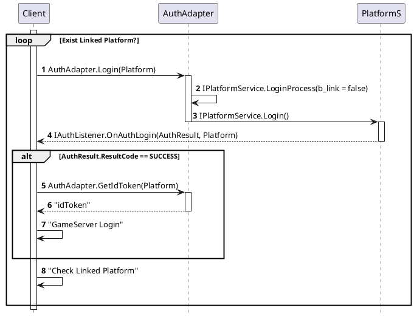
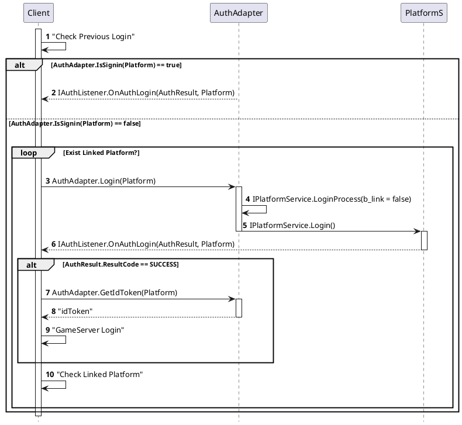
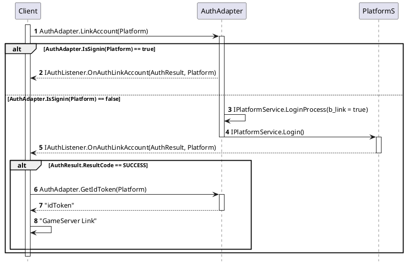

- [라이브러리 설명](#%EB%9D%BC%EC%9D%B4%EB%B8%8C%EB%9F%AC%EB%A6%AC-%EC%84%A4%EB%AA%85)
- [배경지식](#%EB%B0%B0%EA%B2%BD%EC%A7%80%EC%8B%9D)
- [외부라이브러리 이름 및 버전 등등](#%EC%99%B8%EB%B6%80%EB%9D%BC%EC%9D%B4%EB%B8%8C%EB%9F%AC%EB%A6%AC-%EC%9D%B4%EB%A6%84-%EB%B0%8F-%EB%B2%84%EC%A0%84-%EB%93%B1%EB%93%B1)
- [시나리오](#%EC%8B%9C%EB%82%98%EB%A6%AC%EC%98%A4)
  - [최초 로그인](#%EC%B5%9C%EC%B4%88-%EB%A1%9C%EA%B7%B8%EC%9D%B8)
  - [일반 로그인](#%EC%9D%BC%EB%B0%98-%EB%A1%9C%EA%B7%B8%EC%9D%B8)
  - [계정연동](#%EA%B3%84%EC%A0%95%EC%97%B0%EB%8F%99)
  - [Sequence Diagram](#Sequence-Diagram)
    - [최초 로그인](#%EC%B5%9C%EC%B4%88-%EB%A1%9C%EA%B7%B8%EC%9D%B8-1)
    - [일반 로그인](#%EC%9D%BC%EB%B0%98-%EB%A1%9C%EA%B7%B8%EC%9D%B8-1)
    - [계정 연동](#%EA%B3%84%EC%A0%95-%EC%97%B0%EB%8F%99)
- [설치방법](#%EC%84%A4%EC%B9%98%EB%B0%A9%EB%B2%95)
- [사용방법](#%EC%82%AC%EC%9A%A9%EB%B0%A9%EB%B2%95)
- [주의사항](#%EC%A3%BC%EC%9D%98%EC%82%AC%ED%95%AD)
  - [Q&A](#QA)

-----

# 라이브러리 설명

* 계정과 관련된 여러 기능들을 제공한다.
  * 플랫폼서비스 로그인 했는지 확인하기
  * 플랫폼서비스 로그인하기
    * 구글,애플 로그인
  * 로그아웃하기 
  * 계정연동설정하기
  * 계정연동해제하기
  * 디바이스 고유 아이디 가져오기

# 배경지식

* 아래의 문서들을 참조
  * [AuthGooglePlayGameService.md](AuthGooglePlayGameService.md)
  * [AuthAppleGameCenter.md](AuthAppleGameCenter.md)
  * [AuthFacebook.md](AuthFacebook.md)

# 외부라이브러리 이름 및 버전 등등

* Google : [play-games-plugin-for-unity](https://github.com/playgameservices/play-games-plugin-for-unity)
  * Version : [0.9.62](https://github.com/playgameservices/play-games-plugin-for-unity/releases)
* Resolver : [unity-jar-resolver](https://github.com/googlesamples/unity-jar-resolver)
  * Version : [1.2.116](https://github.com/googlesamples/unity-jar-resolver)
* Facebook : [Facebook SDK for Unity](https://developers.facebook.com/docs/unity)
  * Version : `7.15.1`

# 시나리오

* 각 플랫폼에서 행해지는 작업은 아래의 문서를 참조
  
  * [GooglePlay](/Temp/AuthGooglePlayGameService.md)
  * [Apple Game Center](/Temp/AuthAppleGameCenter.md)
  * [Facebook](/Temp/AuthFacebook.md)

## 최초 로그인
  
* (AuthAdapter) 원하는 플랫폼의 Adapter를 찾아서 `Login()` 함수 호출
* (IPlatformService) `LoginProcess(false)` 함수 호출
* (IPlatformService) `Login()` 함수 호출
* (IPlatformService) 로그인 결과를 `AuthResult`에 담고 `OnAuthLogin(AuthResult, PlatformServiceType)` 호출
* (IAuthListener) `AuthAdapter.GetIdToken()`으로 게임 서버에 보낼 토큰을 가져옴
* (IAuthListener) 토큰을 가지고 게임서버에 `login` 패킷 전달
* (IAuthListener) 게임서버에서 받은 패킷에 연동된 플랫폼이 존재한다면 로그인 프로세스를 플랫폼 개수만큼 반복

## 일반 로그인

* (Client) 이전에 로그인 했던 플랫폼이 있는지 확인
  
* (AuthAdapter) 현재 로그인이 되어있는지 확인
  * 로그인이 되어있으면 리턴
* 이후의 시나리오는 [최초 로그인](#%EC%B5%9C%EC%B4%88-%EB%A1%9C%EA%B7%B8%EC%9D%B8-1)과 동일

## 계정연동

* (AuthAdapter) 원하는 플랫폼의 Adapter를 찾아서 `LinkAccount()` 함수 호출
  
* (IPlatformService) `LoginProcess(true)` 함수 호출
* (IPlatformService) `Login()` 함수 호출
* (IPlatformService) 로그인 결과를 `AuthResult`에 담고 `OnAuthLinkAccount(AuthResult, PlatformServiceType)` 호출
* (IAuthListener) `AuthAdapter.GetIdToken()`으로 게임 서버에 보낼 토큰을 가져옴
* (IAuthListener) 토큰을 가지고 게임서버에 `link` 패킷 전달

## Sequence Diagram

### 최초 로그인

### 일반 로그인

### 계정 연동

## 테스트 유스케이스

### 로그인

* 로그인 시 뜨는 플랫폼 UI를 취소해본다.
* 플랫폼 UI가 뜬 상태로 홈에 갔다 와본다.

### 계정 연동

* 연동 진행 시 플랫폼 UI가 정상출력 되는지 확인한다.
* 게스트 -> 플랫폼 연동이 정상동작 하는지 확인한다.
* 플랫폼 별 연동이 정상적으로 동작하는지 확인한다.
  * ex) 구글 -> 페북, 페북 -> 구글

# 설치방법

* `AuthFramework.unitypackage` 패키지를 임포트 한다.
* 주의사항 : `Google Play Game Service`와 `Facebook SDK for Unity`를 업데이트 할 때, `PlayServicesResolver` 폴더를 공유하기 때문에, 높은 버전의 `PlayServicesResolver`가 이미 설치되어 있다면 `PlayServicesResolver`를 임포트 하지 않아야 한다.

# 사용방법

* [AuthAdapter.cs](../Lib/Auth/Assets/.Auth/Script/AuthAdapter.cs) 에 구현된 `static` 함수를 필요에 맞게 호출한다.
  * 자세한 설명은 스크립트를 참조

* `IAuthListener` 를 상속받은 클래스를 구현한다.
  * 계정연동을 사용한다면 이벤트 핸들러에서 기존 콜백 구현 외에도 연동된 계정 로그인 구현이 추가로 필요하다.
  * [IAuthListener.cs](../Lib/Auth/Assets/.Auth/Script/IAuthListener.cs) 의 주석을 참조

# 주의사항

* host 에서는 플랫폼 서비스 로그인 했는지 확인을 한 후에 로그인을 시도해야 한다.
* IAuthListener에서 호출되는 이벤트 핸들러에서 idToken을 서버에 보내는 작업을 해줘야한다.

## Q&A

* AuthFramework 에서 현재 로그인된 계정들을 가지고 있는데, PlatformD에 로그인을 시도한 후 이 계정에 연동 된 계정이 있는지 확인하려면 서버가 로그인 시점에서 리스트를 내려줘야 한다.
* 한 계정에 로그인 한 후, 연동된 계정은 자동으로 로그인 해야된다.
* 계정 연동이 되어 있는 계정을 로그인 할 경우 연동된 계정들을 모두 로그인 시켜줘야 한다. 이때, 연동 계정의 로그인이 실패했을 경우 환경설정에서 어떻게 보여줘야 하는가?
* 페이스북, 구글이 연동된 계정을 구글 로그인 했을 때, 밑단에서 페이스북 로그인을 진행하게 될텐데, 만약 핸드폰에 저장되어 있는 페이스북 계정이 지금 로그인하고 싶은 계정과 다를 경우 어떻게 처리해야 하는가? platformd에 보내줘야 하는가?