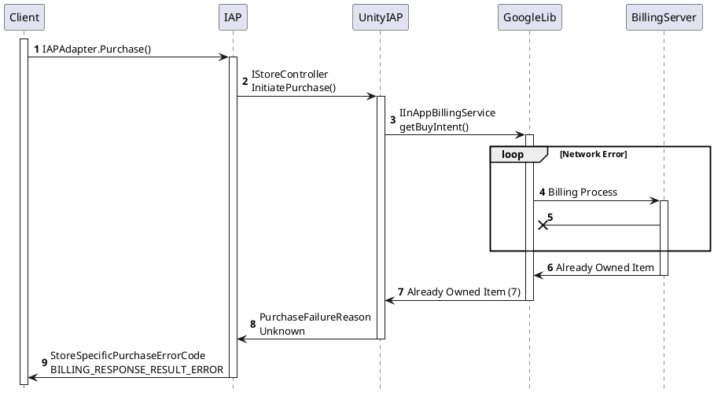

- [배경지식](#%eb%b0%b0%ea%b2%bd%ec%a7%80%ec%8b%9d)
  - [미리 읽어야할 문서들](#%eb%af%b8%eb%a6%ac-%ec%9d%bd%ec%96%b4%ec%95%bc%ed%95%a0-%eb%ac%b8%ec%84%9c%eb%93%a4)
  - [미리 알아두면 좋은 내용들](#%eb%af%b8%eb%a6%ac-%ec%95%8c%ec%95%84%eb%91%90%eb%a9%b4-%ec%a2%8b%ec%9d%80-%eb%82%b4%ec%9a%a9%eb%93%a4)
- [설정방법](#%ec%84%a4%ec%a0%95%eb%b0%a9%eb%b2%95)
  - [Unity IAP 설정하기](#unity-iap-%ec%84%a4%ec%a0%95%ed%95%98%ea%b8%b0)
  - [개발자 콘솔 설정하기](#%ea%b0%9c%eb%b0%9c%ec%9e%90-%ec%bd%98%ec%86%94-%ec%84%a4%ec%a0%95%ed%95%98%ea%b8%b0)
- [사용방법](#%ec%82%ac%ec%9a%a9%eb%b0%a9%eb%b2%95)
- [주의사항](#%ec%a3%bc%ec%9d%98%ec%82%ac%ed%95%ad)
  - [additional work for server-side verification](#additional-work-for-server-side-verification)
  - [network disconnected error after puchrse](#network-disconnected-error-after-puchrse)

-----

# 배경지식

## 미리 읽어야할 문서들

* [Google In-app Billing API](https://developer.android.com/google/play/billing/api.html?hl=ko)
* [Unity IAP Manual - Google Play Store](https://docs.unity3d.com/kr/current/Manual/UnityIAPGoogleConfiguration.html)
  * Unity IAP 메뉴얼 중 Google Play Store에 상품을 등록하고 테스트 하는 방법
* [Unity IAP Manual - Initialize](https://docs.unity3d.com/kr/current/Manual/UnityIAPInitialization.html)
  * Unity IAP 메뉴얼 중 초기화 부분
* [Unity IAP Manual - Purchase Process](https://docs.unity3d.com/kr/current/Manual/UnityIAPProcessingPurchases.html)
  * Unity IAP 메뉴얼 중 구매 부분
* [why use developer payload](https://stackoverflow.com/questions/14553515/why-is-it-important-to-set-the-developer-payload-with-in-app-billing)
  * `Developer Payload`에 대한 설명
* [use accountid for fraud](https://developer.android.com/distribute/best-practices/earn/fraud-prevention.html)
  * 구매 시 `accountID`를 왜 사용해야 하는가에 대한 설명

## 미리 알아두면 좋은 내용들

* `AndroidManifest.xml` 에 빌링 권한을 추가해야 한다.
```xml
  <uses-permission android:name="com.android.vending.BILLING"/>
```


# 설정방법

## Unity IAP 설정하기

* `Unity Service`창에서 In-App Purchasing을 선택한다.
  


  * `서비스 프로젝트 ID`가 없으면 [메뉴얼](https://docs.unity3d.com/kr/current/Manual/SettingUpProjectServices.html)을 참조하여 생성한다.
* 우측 상단의 스위치를 토글한다.
  

    
  * 현재 플러그인에 임포트가 되어있기 때문에 `ReImport` 버튼을 클릭하지 않아도 된다.
  * 혹시 구매를 진행했을 때 `TypeLoadException`이 나온다면, 아래의 버튼을 실행해보자.
    * `Assets | Run Api Updater...` 
    * `Assets | Reimport All`
  

   
  * 알려진 이슈
    * [TypeLoadException](https://forum.unity.com/threads/typeloadexception-could-not-load-type-unityengine-vr-vrsettings-from-assembly-stores.539915/)
    * [VRSetting](https://forum.unity.com/threads/could-not-load-type-unityengine-vr-vrsettings-from-assembly-stores.521484/)

## 개발자 콘솔 설정하기

* [개발자 콘솔](https://play.google.com/apps/publish)에서 애플리케이션을 생성한다.
  * 자세한 내용은 [Auth.md](Auth.md)를 참조한다.
  * 빌링 권한이 추가된 앱을 등록해야 한다. 그렇지 않으면 제품등록을 하지 못한다.
  * 판매자 계정 등록을 해야한다. 인앱 상품 등록 페이지에서 링크로 진행할 수 있다.
* 상품을 등록한다.
  * 앱 정보 탭의 인앱 상품 -> 관리되는 제품에서 관리되는 제품 만들기를 진행한다.
  


  * 필요한 정보를 기입하고 상태를 `활성 APK`로 변경한다.
  


  * 국가에 따른 가격을 입력하고 저장한다.
  


* 개발자 콘솔 설정 탭 -> 계정 세부정보 하단부에 `라이선스 테스트` 항목이 있는데, 여기에 빌링 테스트를 진행할 계정을 추가한다.


* 앱 등록 시 테스트 대상 관리 부분에서 해당 계정을 테스트로 등록하지 않았다면 `테스트 참여 URL`에 진입하여 테스터 등록을 한다.
  


# 사용방법

* [IAP.md](IAP.md) 참고


# 주의사항

* 콘솔에 등록된 앱이 출시되어야만 구매 테스트를 진행할 수 있다.

* `UnityIAP` 에서 구현된 `Google Play Store` 는 상품 목록을 초기화할때, 소비하지 못한 상품들을 확인하고 자동으로 소비하는 기능을 가지고 있다. 하지만 해당 플러그인에서는 복구 기능의 제어를 위해 자동 소비를 진행하지 않도록 구현되었다.

## additional work for server-side verification

* 게임 서버가 영수증 검증을 구현할 때, [Google Play Console](https://console.developers.google.com/apis/dashboard?project=test2-34622806) 에서 아래의 작업을 해야한다. 
  * `Google Play Android Developer API` API를 사용 설정 해야 하고, 

  * 인증 정보에 `서비스 계정 키` 를 추가해야 하며, 
  


  * `개발자 콘솔 설정 / 개발자 계정 / API 액세스` 의 `연결된 프로젝트` 에서 `Games Services Publishing API` 사용을 허용해야 한다.


  * 서비스 계정 등록 시 나오는 `json` 키 파일을 서버가 사용한다. (앱 서명시 사용하는 키스토어와 동일한 역할! 중요보관소에 저장할것)
* `서비스 계정` 등록 후 해당 계정의 역할에서 `재무 데이터 보기` 항목을 켜주어야 한다.
  * 해당 작업이 구글 서버에 적용되기까지 최대 24시간이 걸린다고 한다. 미리미리 해놓자.


## network disconnected error after puchrse

google 결제 도중 GoogleLib 과 BillingServer 사이의 네트워크가 단절된 후 재연결하면 Unity IAP에 영수증이 발급되지 않는 문제가 있다. 다음은 재현 스텝이다.

  1. google API 팝업에서 결제하기 진행
  2. 결제가 완료되기 전에 네트워크 단절
  3. google API에서 `네트워크 단절` 오류 팝업 출력 (현재 상황에서 확인 버튼을 누르면 리디렉션함)
  4. 네트워크 재연결
  5. google API 팝업의 확인 버튼 클릭
  6. `이미 소유한 항목` 에러 발생
  7. 확인 버튼 누르면 UnityIAP unknown 에러 발생
  8. 이후 해당 상품은 복구의 대상이 되지 않음 + 구매 시 `이미 소유한 항목` 에러 발생



   
확인 결과 `Unity IAP` 의 버그가 아니라 `Google Billing Server` 의 버그인 것으로 드러났다. `IInAppBillingService.getPurchase()` 함수를 호출해도 `sku` 부분이 비어있었다.

해결방법은 다음과 같다. 유저는 기기에 등록된 현재 구글 계정을 지웠다가 다시 등록한 후 게임을 재시작하면 정상적으로 상품을 받을 수 있다. 또한 개발자는 `StoreSpecificPurchaseErrorCode.BILLING_RESPONSE_RESULT_ERROR` 를 특별히 처리해준다. 예를 들어, `C/S 를 요청하세요.` 의 내용을 유저에게 알려주면 적당하다.

