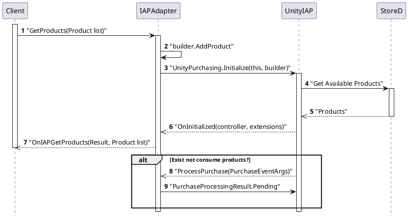
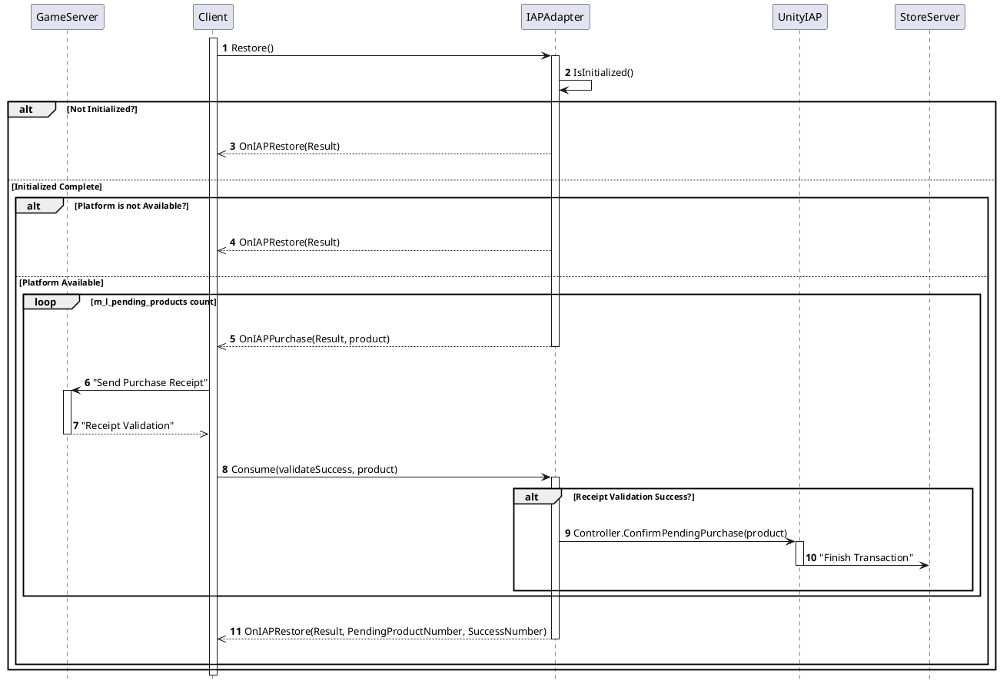

- [배경지식](#%EB%B0%B0%EA%B2%BD%EC%A7%80%EC%8B%9D)
  - [라이브러리 개요](#%EB%9D%BC%EC%9D%B4%EB%B8%8C%EB%9F%AC%EB%A6%AC-%EA%B0%9C%EC%9A%94)
- [설정방법](#%EC%84%A4%EC%A0%95%EB%B0%A9%EB%B2%95)
  - [Unity IAP 설정하기](#Unity-IAP-%EC%84%A4%EC%A0%95%ED%95%98%EA%B8%B0)
  - [상품 등록](#%EC%83%81%ED%92%88-%EB%93%B1%EB%A1%9D)
  - [앱 등록](#%EC%95%B1-%EB%93%B1%EB%A1%9D)
  - [sandbox 테스터 등록](#sandbox-%ED%85%8C%EC%8A%A4%ED%84%B0-%EB%93%B1%EB%A1%9D)
  - [계좌정보 등록](#%EA%B3%84%EC%A2%8C%EC%A0%95%EB%B3%B4-%EB%93%B1%EB%A1%9D)
  - [iTunes 및 App Store 로그아웃](#iTunes-%EB%B0%8F-App-Store-%EB%A1%9C%EA%B7%B8%EC%95%84%EC%9B%83)
- [사용방법](#%EC%82%AC%EC%9A%A9%EB%B0%A9%EB%B2%95)
  - [시나리오](#%EC%8B%9C%EB%82%98%EB%A6%AC%EC%98%A4)
    - [상품목록 초기화](#%EC%83%81%ED%92%88%EB%AA%A9%EB%A1%9D-%EC%B4%88%EA%B8%B0%ED%99%94)
    - [상품 복구](#%EC%83%81%ED%92%88-%EB%B3%B5%EA%B5%AC)
  - [Sequence Diagram](#Sequence-Diagram)
    - [상품목록 초기화](#%EC%83%81%ED%92%88%EB%AA%A9%EB%A1%9D-%EC%B4%88%EA%B8%B0%ED%99%94-1)
    - [상품 복구](#%EC%83%81%ED%92%88-%EB%B3%B5%EA%B5%AC-1)
  - [테스트 유스케이스](#%ED%85%8C%EC%8A%A4%ED%8A%B8-%EC%9C%A0%EC%8A%A4%EC%BC%80%EC%9D%B4%EC%8A%A4)
  - [`applicationUserName` 을 이용하여 developerPayload 를 전달하는 방법](#applicationUserName-%EC%9D%84-%EC%9D%B4%EC%9A%A9%ED%95%98%EC%97%AC-developerPayload-%EB%A5%BC-%EC%A0%84%EB%8B%AC%ED%95%98%EB%8A%94-%EB%B0%A9%EB%B2%95)
    - [상품 구매](#%EC%83%81%ED%92%88-%EA%B5%AC%EB%A7%A4)
    - [상품 구매 완료](#%EC%83%81%ED%92%88-%EA%B5%AC%EB%A7%A4-%EC%99%84%EB%A3%8C)
  - [애플 확장 기능](#%EC%95%A0%ED%94%8C-%ED%99%95%EC%9E%A5-%EA%B8%B0%EB%8A%A5)
    - [Ask-To-Buy](#Ask-To-Buy)
    - [앱 내 구입 홍보](#%EC%95%B1-%EB%82%B4-%EA%B5%AC%EC%9E%85-%ED%99%8D%EB%B3%B4)
    - [결제 제한 사항 확인](#%EA%B2%B0%EC%A0%9C-%EC%A0%9C%ED%95%9C-%EC%82%AC%ED%95%AD-%ED%99%95%EC%9D%B8)
- [주의사항](#%EC%A3%BC%EC%9D%98%EC%82%AC%ED%95%AD)
  - [Q&A](#QA)
  - [Pending Test](#Pending-Test)

----

# 배경지식

* [in app purchase 관련 애플 문서](https://help.apple.com/app-store-connect/#/devb57be10e7)
* [in app purchase 관련 애플 개발 문서](https://developer.apple.com/library/archive/documentation/NetworkingInternet/Conceptual/StoreKitGuide/Introduction.html#//apple_ref/doc/uid/TP40008267-CH1-SW1)
* [in app purchase 관련 유니티 메뉴얼](https://docs.unity3d.com/kr/current/Manual/UnityIAPAppleConfiguration.html)

## 라이브러리 개요

IAP 테스트는 참 험난한 일이다. 가장먼저 [appstore connect](https://appstoreconnect.apple.com) 에 접속해서
상품을 등록해야 한다. 예를 들어 두가지 상품 `clothes 1$, coins 1$` 를 등록한다.
그리고 xcode의 archive를 이용해 앱 (`a.ipa`) 을 appstore connect 에 등록해야 한다. 또한
sandbox 에 테스터 계정을 등록해야 한다. 테스트 계정은 애플 개발자 계정 혹은 
아이튠즈 계정등은 안된다. 마지막으로 법인명의 계좌가 동록되야 한다. 위에서 
언급한 것들이 준비되면 테스트를 할 수 있다.


# 설정방법

## Unity IAP 설정하기

* [IAPGooglePlayStore](IAPGooglePlayStore.md) 참고

## 상품 등록

* [appstore connect](https://appstoreconnect.apple.com)의 [나의 앱]으로 들어간다
* 테스트 할 앱을 생성하지 않았다면 [AuthAppleGameCenter.md](AuthAppleGameCenter.md)의 'Developer Console 설정하기'를 참고해 앱을 생성한다.
    * apple developer 에서 만든 app id 와 app store connect 에서 만든 앱의 bundle id는 같아야한다.
* 테스트할 앱을 선택한 후 `앱 내 추가 기능` 탭을 선택한다.
* 앱 내 구입의 (+) 버튼을 통해 상품을 등록할 수 있다.
    * 심사 정보에 필요한 스크린샷도 준비한다.


* 제품 id(Product id)와 유니티에서 ConfigurationBuilder::AddProduct() 함수를 통해 제공할 id 값은 같아야한다.


* 진행 상태는 제출 준비 완료 상태여야 하며, 진행 상태 관련 정보는 [이 곳에서](https://help.apple.com/app-store-connect/#/dev840c56fb6) 확인할 수 있다.

## 앱 등록

* IAP 테스트를 하기 위해선 App Store Connect에 앱을 등록해야 한다.
    * App Store Connect에서 앱을 생성해야 한다면 [IAPIosAppStore.md](IAPIosAppStore.md)의 'Developer Console 설정하기'를 참고해 앱을 생성한다.
      * `Xcode`의 버전이 낮을 경우 업로드 되지 않을 수 있으므로 버전 확인 후 업로드를 실행한다. 
      * apple developer 에서 만든 app id 와 app store connect 에서 만든 앱의 bundle id는 같아야한다.
* xcode에서 Capabilities의 In-App Purchase 설정을 활성화한다.


* app store connect 에 앱을 등록하기 위해 앱 업로드 시 사용할 증명서와 프로비저닝 프로파일의 타입은 Distribution이어야 한다.
    * General에 등록된 증명서와 프로비저닝 프로파일과는 관계 없다.
    * 앱 등록시 사용할 증명서와 프로비저닝 프로파일에 연결된 증명서는 같아야 한다.
    * 증명서의 개인키가 키체인에 등록되어 있어야 한다.
  

  


## sandbox 테스터 등록

* [appstore connect](https://appstoreconnect.apple.com)의 [사용자 및 액세스]로 들어간다
* 왼쪽의 [Sandbox > 테스터] 항목을 선택한다.
* (+) 버튼을 눌러 app store connect 에 테스터를 등록한다.
    * IAP 테스트시 sandbox 테스터에 등록된 계정을 사용해 테스트한다.
* iTunes, App Store Connect와 관련이 없고 실제 존재하는 이메일을 등록해야한다.
* 이메일 외 다른 정보는 아무거나 기입해도 된다.


## 계좌정보 등록

* [appstore connect](https://appstoreconnect.apple.com)의 `계약,세금 및 금융거래` 항목의 세금 및 계좌정보가 등록되어 있어야 한다.
  * 세금 및 계좌정보가 등록되어 있다면 세금 탭 및 금융거래 탭에서 관련 내용을 확인할 수 있다.
  * 계정 소유자, 관리자만 해당 내용을 확인할 수 있다.
  * 등록이 안되어있다면 앱에서 상품을 요청했을 때 상품을 받을 수 없다. ( NoProductsAvailable 에러 발생 )
* 계좌정보 등록은 `계약 실소유주`(account holder)의 아이디로만 가능하고, 이중인증이 활성화되어 있어야 한다.
    * 계좌정보 등록 참고 문서
        * https://help.apple.com/app-store-connect/?lang=en#/devb6df5ee51
        * https://blog.yagom.net/15
    * 이중인증 활성화 방법 : https://support.apple.com/ko-kr/HT204915
    * 이중인증을 활성화하려면 본인인증이 필요할수도 있다.
* 본인인증 답변을 모르거나 본인인증 재설정이 안될 때, 또는 계좌정보 등록하는 방법을 모를때는 [애플 고객센터](https://developer.apple.com//contact/#!/topic/select)로 연락한다
    * 애플은 문의 전화를 요청할 수 있다. ( 전화를 걸 수는 없음 )
    * [보고서 및 지불 > 세금 및 금융거래 설정] 항목이 아닌 [멤버십 및 계정 > 계약 및 계약서] 항목을 선택하면 전화문의를 할 수 있다.
    * 전화번호를 입력하면 고객센터에서 전화가 온다. ( 20분이 넘어도 전화가 안 올 땐 다시 요청 )

## iTunes 및 App Store 로그아웃

* sandbox 계정으로 IAP를 테스트하기 위해서 테스트할 기기의 [iTunes 및 App Store]에 등록된 아이디를 로그아웃해야한다.


# 사용방법

* [IAP.md](IAP.md) 참고

* [IAPAdapter.cs](../Lib/IAP/Assets/.IAP/Script/IAPAdapter.cs) 참고
* [IAPBehaviour.cs](../Lib/IAP/Assets/.IAP/Script/IAPBehaviour.cs) 참고
* [IIAPListener.cs](../Lib/IAP/Assets/.IAP/Script/IIAPListener.cs) 참고

## 시나리오

* [IAP.md](Iap.md)와 다른 시나리오만 기술

### 상품목록 초기화

* (IAPAdapter) `GetProducts()` 함수 호출
  
* (IAPBehavior) `builder.AddProduct()` 함수로 상품 목록 생성
* (IAPBehavior) `UnityPurchasing.Initialize()` 함수 호출
* (UnityIAP) `IStoreListener`를 구현한 `IAPBehaviour` 내부의 `OnInitialized()` 함수 호출
* (UnityIAP) 구매가 완료되지 않은 상품들에 한해 (IAPBehaviour)`ProcessPurchase()`함수 자동 실행
    * 해당 상품들 (IAPBehaviour)`m_l_pending_products`에 추가

### 상품 복구

* (IAPAdapter) `Restore(account_id)` 호출
* (IAPBehaviour) `RestorePurchases(account_id)` 호출
    * `Initialize`가 안되어 있으면 `OnIAPRestore()` 함수 호출
* 복구가 필요한 상품의 개수 만큼 아래의 루틴을 반복
    * (IAPBehaviour) `m_l_pending_products` 리스트 상품들의 `account_id`와 `Restore`함수의 매개변수로 받은 `account_id`가 일치하는 상품에 한해서 (IIAPListener)OnIAPPurchase() 함수 호출 
  
    * (Client)영수증 체크를 위한 함수 호출, 체크가 필요없다면 바로 다음 순서 진행
    * (IAPBehaviour) `ConsumeProduct()` 함수 호출
    * (UnityIAP)상품 소모를 진행(Transaction, Consume)

* (IAPBehaviour)OnIAPRestore()함수 호출      
* (IIAPListener)복구 처리 완료 진행

## Sequence Diagram

### 상품목록 초기화



### 상품 복구




## 테스트 유스케이스

* [Iap](Iap.md) 참고
* 서버한테 보내고 컨슘 X
* account_id 가 다른 상품 복구 시도


## `applicationUserName` 을 이용하여 developerPayload 를 전달하는 방법

* `apple`의 경우 `IStoreController.InitiatePurchase()` 함수의 매개변수에 `developerPayload`를 전달해도 `ProcessPurchase`에서 사용할 수 없다.
* 같은 기기에서만 `ApplicationUsername`을 주고 받을 수 있다. A기기에서 주고 B기기에서 받을 수는 없다.

### 상품 구매 

* (IAPBehaviour)`BuyProductID()`에서 `InitiatePurchase()`를 진행할 때 `IAppleExtensions`에서 제공하는 `SetApplicationUsername()`함수에 `account_id`와 `developerPayload`를 json으로 변환해 매개변수로 전달한다.
```cs
Dictionary<string, string> d_payload = new Dictionary<string, string>();
d_payload["accountId"] = account_id;
d_payload["developerPayload"] = payload;
m_extensions.GetExtension<IAppleExtensions>().SetApplicationUsername(MiniJson.JsonEncode(d_payload));
```

### 상품 구매 완료

* `UnityPurchasing.m` 파일에는 구매, 복구의 transaction이 성공했을 시 실행되는 `onTransactionSucceeded()`함수가 있다
  * 이 함수에서 `transactionId`에 `applicationUsername`을 `|`로 결합해 유니티에 제공한다
```objc
NSString* transactionId = transaction.transactionIdentifier;
NSString* str = [NSMutableString stringWithFormat:@"%@|%@", transaction.payment.applicationUsername, transactionId];
transactionId = str;
```

* (IAPBehaviour)`ProcessPurchase()`에서는 `ReceiveBlock`클래스와 `PendingProduct` 클래스를 생성할 때 생성자에서 영수증의 `transactionId`값을 파싱해 멤버변수에 `account_id`와 `developerPayload`값을 저장한다

```cs
string transaction_id = (string)d_receipt["TransactionID"];
string[] parsing_transaction_id = transaction_id.Split('|');

var d_transaction_id = (Dictionary<string, object>)MiniJson.JsonDecode(parsing_transaction_id[0]);

m_account_id = (string)d_transaction_id["accountId"];
m_payload = (string)d_transaction_id["developerPayload"];

m_transaction_id = parsing_transaction_id[1];
```

## 애플 확장 기능

### Ask-To-Buy

* 부모의 승인이 있을때까지 구매를 지연
* [Ask-To-Buy 애플 설명](https://support.apple.com/en-us/HT201089)
* [샌드박스에서는 테스트 할 수 없다.](https://qiita.com/dsgarage/items/bd456fde4245ea13fafb)
* 부모가 구매를 허락한 경우는 `IAPBehaviour:ProcessPurchase`, 거절한 경우 `IAPBehaviour:OnPurchaseFailed`가 호출된다.
* 현재 코드는 `IAPBehaviour:ProcessPurchase` 이 실행되면 해당 상품을 m_l_pending_products에 담고 있다.

### 앱 내 구입 홍보

* App Store에서 앱 내 구입을 직접 찾아 볼 수 있음
* 상품을 클릭 했을 때 해당 앱이 설치되어 있다면 앱이 실행되고, 설치되어 있지 않다면 앱 다운로드 후 실행
* [앱 내 구입 홍보 설명](https://developer.apple.com/app-store/promoting-in-app-purchases/)
* [관련 애플 개발 문서](https://developer.apple.com/library/archive/documentation/NetworkingInternet/Conceptual/StoreKitGuide/PromotingIn-AppPurchases/PromotingIn-AppPurchases.html)
* `IAppleExtensions`의 `SetStorePromotionVisibility(product, AppleStorePromotionVisibility)`를 통해 app store에 노출시킬 상품을 선택할 수 있다.
* URL을 이용해 테스트할 기기에서 접속하면 콜백함수를 통해 어떤 상품이 선택됐는지 받을 수 있다.
  * URL : `itms-services://?action=purchaseIntent&bundleId=com.example.app&productIdentifier=product_name`
    * bundleId와 테스트할 상품 id가 담긴 URL
  * 테스트할 기기에서 URL을 클릭하면 자동으로 앱이 활성화됨(해당 앱은 설치되어 있어야함)
  * 콜백함수를 통해 어떤 상품이 선택됐는지 알 수 있고, UnityIAP가 제공하는 함수나 `IAPAdapter:Purchase`를 통해 해당 상품을 구매할 수 있다.
    * UnityIAP가 제공하는 함수 : `IAppleExtensions:ContinuePromotionalPurchases`
  * 선택된 상품은 구매 상태가 아니라 선택만 알려주는 용도, 상품을 구매하지 않아도 앱을 껐다 키면 콜백 함수는 다시 동작하지 않음

### 결제 제한 사항 확인

* 앱 내 구매가 장치 설정으로 제한되어 있을 수 있다
  * 설정 > 일반 > 차단 항목에서 확인 가능


# 주의사항

## Q&A

* ~~시퀀스 다이어그램이 맥과 안드로이드가 다른가???~~ > 같다

## Pending Test

이하에서 패드를 A라고 칭하고, 폰을 B라고 칭한다.

1. 강제로 Pending 해 놓은 상황
    1. 앱을 새로 설치 했을 때
        * A와 B의 영수증 모양이 전혀 다르다
    2. 앱 영수증을 갱신 했을 때
        * A와 B의 영수증 모양이 동일해 진다.
    3. A에서 consumable상품을 Pending 시켰을 때
        * B를 껏다 키더라도 앱영수증이 갱신되지 않으면, 알 방법이 없다.
        * 앱 영수증을 갱신 하게되면, A와 B의 앱 영수증이 동일해 진다. 하지만 paymentQueue는 동일하지 않다. 
        그렇기 때문에, B를 껏다 키더라도, ProcessPurchase가 자동으로 호출 되지 않는다. 그래서 앱영수증을 열어봐야만 pending해놓은 consumable 상품이 있는지 알 수 있다.
    4. A에서 NonConsumable 상품을 Pending 시켰을 때
        * B를 껏다 키더라도 앱영수증이 갱신되지 않으면, 알 방법이 없다.
        * 앱 영수증을 갱신 하게되면, A와 B의 앱 영수증이 동일해 진다. B를 껏다 키면 ProcessPurchase가 자동으로 호출된다. 그래서 pending해놓은 NonConsumable 상품이 있는지 알 수 있다.
2. NonConsumable 상품을 여러번 구매 할 수 있나?
    1. ApplicationUserName = "Hello" 라고 설정 한 이후 상품 구매
    2. ApplicationUserName = "World" 라고 설정 한 이후 동일한 상품을 구매.
    3. 결론. ApplicationUserName이 달라도, NonConsumable은 중복 구매를 할 수 없다.
3. consumable 상품을 동일한 기기에서 Pending 해 놓은 상황
    1. 껏다 키면, ProcessPurchas가 자동으로 호출 된다. 그래서 Pending해놓은 consumable 상품이 있는지 알 수 있다.
4. A기기에서 게임계정C로 1번 상품을 Pending, 게임계정 D 로 1번 상품을 Pending해 놓은상황
    1. 동일한 기기에서 게임계정 구분은 불가능하다. 
    2. 게임계정 별로 복구 하는 행위도 불가능 하다. 왜냐하면, 동일한 상품에 대해서 게임계정별로 Pending을 처리 할 수 없다.
    3. 다른 게임계정에서 Pending한 상품이여도, 복구는 같이 이루어져야만 한다.
5. A기기에서 Pendinge해 놓은 consumable 상품을 B기기에서 복구를 할 수 있는 방법이 없다.
    1. 앱 영수증을 갱신해서 복구할 것이 있는지 확인은 가능
    2. 복구를 시도 할 수는 있으나, 앱영수증에서 삭제 시키려면 FinishTransaction이 호출되어야 하는데, SkPaymentTransaction을 만들어낼 방법이 없다.

* 결론 : apple 에서는 consumable / non-consumable 상품 모두 펜딩 시켜 놨을 때는 서로 다른 기기에서 복구할 수 없다. 펜딩시켜놓은 기기에서만 복구 가능

```json
[상품 펜딩 상태 영수증]
"in_app": [
        {
          "quantity": "1",
          "product_id": "com.test3",
          "transaction_id": "1000000525776125",
          "original_transaction_id": "1000000525776125",
          "purchase_date": "2019-05-08 05:18:11 Etc/GMT",
          "purchase_date_ms": "1557292691000",
          "purchase_date_pst": "2019-05-07 22:18:11 America/Los_Angeles",
          "original_purchase_date": "2019-05-08 05:18:11 Etc/GMT",
          "original_purchase_date_ms": "1557292691000",
          "original_purchase_date_pst": "2019-05-07 22:18:11 America/Los_Angeles",
          "is_trial_period": "false"
        },

[다른 디바이스에서 컨슈머블 상품 구매한 후 영수증]
"in_app": [
        {
          "quantity": "1",
          "product_id": "com.test3",
          "transaction_id": "1000000525776125",
          "original_transaction_id": "1000000525776125",
          "purchase_date": "2019-05-08 05:18:11 Etc/GMT",
          "purchase_date_ms": "1557292691000",
          "purchase_date_pst": "2019-05-07 22:18:11 America/Los_Angeles",
          "original_purchase_date": "2019-05-08 05:18:11 Etc/GMT",
          "original_purchase_date_ms": "1557292691000",
          "original_purchase_date_pst": "2019-05-07 22:18:11 America/Los_Angeles",
          "is_trial_period": "false"
        },
        {
          "quantity": "1",
          "product_id": "com.test3",
          "transaction_id": "1000000525776481",
          "original_transaction_id": "1000000525776481",
          "purchase_date": "2019-05-08 05:22:16 Etc/GMT",
          "purchase_date_ms": "1557292936000",
          "purchase_date_pst": "2019-05-07 22:22:16 America/Los_Angeles",
          "original_purchase_date": "2019-05-08 05:22:16 Etc/GMT",
          "original_purchase_date_ms": "1557292936000",
          "original_purchase_date_pst": "2019-05-07 22:22:16 America/Los_Angeles",
          "is_trial_period": "false"
        },        
```
