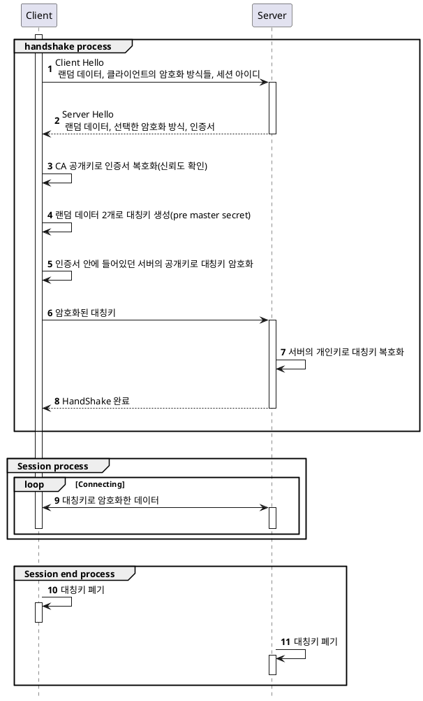
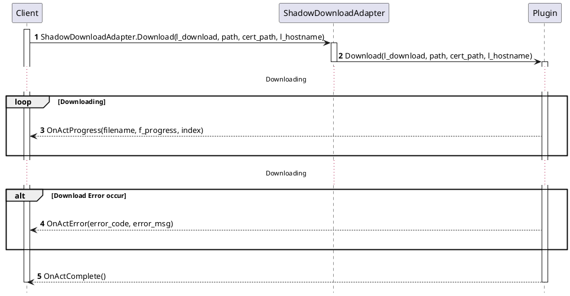

- [라이브러리 설명](#%EB%9D%BC%EC%9D%B4%EB%B8%8C%EB%9F%AC%EB%A6%AC-%EC%84%A4%EB%AA%85)
- [배경지식](#%EB%B0%B0%EA%B2%BD%EC%A7%80%EC%8B%9D)
  - [HTTP](#HTTP)
  - [HTTPS, SSL](#HTTPS-SSL)
  - [Public-key Cryptography (공개키 암호화 기법)](#Public-key-Cryptography-%EA%B3%B5%EA%B0%9C%ED%82%A4-%EC%95%94%ED%98%B8%ED%99%94-%EA%B8%B0%EB%B2%95)
  - [CA (Certified Autority)](#CA-Certified-Autority)
  - [SSL 인증서](#SSL-%EC%9D%B8%EC%A6%9D%EC%84%9C)
  - [SSL 동작방법](#SSL-%EB%8F%99%EC%9E%91%EB%B0%A9%EB%B2%95)
- [시나리오](#%EC%8B%9C%EB%82%98%EB%A6%AC%EC%98%A4)
  - [시퀀스 다이어그램](#%EC%8B%9C%ED%80%80%EC%8A%A4-%EB%8B%A4%EC%9D%B4%EC%96%B4%EA%B7%B8%EB%9E%A8)
  - [테스트 유스케이스](#%ED%85%8C%EC%8A%A4%ED%8A%B8-%EC%9C%A0%EC%8A%A4%EC%BC%80%EC%9D%B4%EC%8A%A4)
- [설치방법](#%EC%84%A4%EC%B9%98%EB%B0%A9%EB%B2%95)
- [사용방법](#%EC%82%AC%EC%9A%A9%EB%B0%A9%EB%B2%95)
  - [자체 서명된 인증서 생성하기](#%EC%9E%90%EC%B2%B4-%EC%84%9C%EB%AA%85%EB%90%9C-%EC%9D%B8%EC%A6%9D%EC%84%9C-%EC%83%9D%EC%84%B1%ED%95%98%EA%B8%B0)
  - [자체 서명된 인증서로 nginx 서버 띄우기 (for Http File Server)](#%EC%9E%90%EC%B2%B4-%EC%84%9C%EB%AA%85%EB%90%9C-%EC%9D%B8%EC%A6%9D%EC%84%9C%EB%A1%9C-nginx-%EC%84%9C%EB%B2%84-%EB%9D%84%EC%9A%B0%EA%B8%B0-for-Http-File-Server)

-----

# 라이브러리 설명

* 백그라운드 다운로드 기능을 제공한다.


# 배경지식

* 참고 : [생활코딩](https://opentutorials.org/course/228/4894)

## HTTP

* [Hyper Text Transfer Protocol](https://ko.wikipedia.org/wiki/HTTP)
* `WWW` 내에서 정보를 주고받을 때 사용하는 클라이언트와 서버 사이에 이루어지는 요청/응답 프로토콜
* [Hyper Text Markup Language (HTML)](https://ko.wikipedia.org/wiki/HTML)를 전송하기 위한 통신규약

## HTTPS, SSL

* [Hyper Text Transfer Protocol over Secure Socket Layer](https://ko.wikipedia.org/wiki/HTTPS)
* `HTTP`에 보안이 강화된 버전.
* 통신 과정 중의 데이터를 암호화하여 주고받는다.
* [SSL](https://ko.wikipedia.org/wiki/SSL)은 `넷스케이프사`에서 개발한 인터넷 보안 프로토콜.
* `HTTPS`는 `SSL`위에서 동작하는 프로토콜이다.

## Public-key Cryptography (공개키 암호화 기법)

* [대칭키 (symmetric-key algorithm)](https://ko.wikipedia.org/wiki/%EB%8C%80%EC%B9%AD_%ED%82%A4_%EC%95%94%ED%98%B8)의 단점인 `암호를 주고받는 사람들 사이에 키를 전달하는 것이 어렵다.`를 보완한 암호화 방식
* 두 개의 키를 가지며 한쪽 키로 암호화를 하면 다른 하나의 키로만 복호화를 할 수 있는 암호화 방식
* 하나를 개인키(private key, 비공개키), 다른 하나를 공개키(public key)로 지정한다.
* 개인키는 자신만이 가지고 있고 공개키를 타인에게 제공한다.
* 개인키로 암호화 한 데이터는 공개키로 복호화를 할 수 있다는 사실때문에 데이터를 제공한 사람의 신원을 보장해준다. 이를 전자서명이라 한다.
* 공개키 방식을 통해 통신을 할 경우 컴퓨터 자원이 많이 소모되기 때문에 처음 연결 시(HandShake)에만 사용한다.

## [CA (Certified Autority)](https://ko.wikipedia.org/wiki/%EC%9D%B8%EC%A6%9D_%EA%B8%B0%EA%B4%80)

* 클라이언트가 접속한 서버가 클라이언트가 의도한 서버가 맞는지 보장해주는 인증서를 발급해주는 기관.
* 신뢰성이 엄격하게 공인된 민간 기업만이 CA를 할 수 있다.
* SSL을 통해 암호화된 통신을 제공하려면 CA를 통해 인증서를 구입해야 한다.
* 인증서를 구입할 때 공개키, `CSR(Certificate Signing Request, 인증요청서)` 파일을 CA에 제공해주어야 한다.

## SSL 인증서

* 클라이언트가 접속한 서버가 신뢰할 수 있는 서버임을 보장해주는 데이터
* 서비스의 정보(CA, 도메인 등)와 서버의 공개키(+ 암호화 방법)가 포함되어 있다.
* CA의 개인키로 암호화가 되어있다. 브라우저는 내부적으로 CA 리스트와 공개키를 가지고 있기 때문에 복호화가 가능하다.
* CA의 공개키로 복호화가 진행되면 해당 인증서는 신뢰할 수 있는 데이터라고 판단할 수 있다.(전자서명)

## SSL 동작방법

* SSL은 암호화된 데이터를 전송하기 위해 공개키 방식과 대칭키 방식을 혼합해서 사용한다.
  * 서버와 주고받는 실제 정보는 대칭키 방식으로 암호화, 대칭키는 공개키 방식으로 암호화해서 처음 handshake 과정에서 전달한다.
* 컴퓨터간 네트워크를 이용해서 통신할 때는 악수 -> 전송 -> 세션 종료 순으로 진행된다.





# 시나리오

* 각 플랫폼 플러그인 내부에서 행해지는 작업은 아래의 문서를 참조
  
  * [Android](ShadowDownloadAndroid.md)
  * [iOS](ShadowDownloadIos.md)

## 시퀀스 다이어그램




## 테스트 유스케이스

* 다운로드 리스트를 넘기지 않고 다운로드를 진행한다.
* 콜백 함수를 1개 이상 넘기지 않고 다운로드를 진행한다.
* https 접근 시 `cert_path` 파라미터를 비우고 다운로드를 진행한다.
* https 접근 시 `l_hostname` 파라미터를 비우고 다운로드를 진행한다.


# 설치방법

* `ShadowDownload.unitypackage` 패키지를 임포트 한다.


# 사용방법

* `.ShadowDownload.ShadowDownloadAdapter.Open()` 함수를 먼저 호출한다.
* 필요한 타이밍에 `.ShadowDownload.ShadowDownloadAdapter.Download()` 함수를 호출한다.
  * 자체 서명된 인증서를 사용할 경우, `cert_path`와 `l_hostname`에 적절한 정보를 채워주어야 한다. 

## 자체 서명된 인증서 생성하기

1. 인증 기관(CA, 자체 서명일 경우 내가 인증 기관이 된다.)의 개인키를 생성한다.

```bash
openssl genrsa -out server.key 2048
```

2. 서버 인증서 발급을 위한 `CSR(인증요청서)` 파일을 생성한다. 아래의 스크린샷처럼 정보를 채워줘야 한다.


3. 인증서에 포함할 추가 정보를 별도의 파일(v3.ext)로 생성해둔다.

```
authorityKeyIdentifier=keyid,issuer
basicConstraints=CA:FALSE
keyUsage = digitalSignature, nonRepudiation, keyEncipherment, dataEncipherment
subjectAltName = @alt_names

[alt_names]
DNS.1 = *.nadagames.com
DNS.2 = 192.168.0.165
```

4. 위에서 만든 개인키, 인증요청서, 추가 정보 파일을 가지고 인증서(.crt)를 생성한다.

```bash
openssl x509 -req -in server.csr -signkey server.key -out server.crt -days 3650 -sha256 -extfile v3.ext
```

5. 인증서를 서버 설정파일에 추가한다. 아래 `자체 서명된 인증서로 nginx 서버 띄우기`에서 설명한다.
6. 자체 서명된 인증서를 신뢰하도록 브라우저에 추가한다.(선택?) 크롬 기준 설명
   * https로 서버에 접속한다.
   * `F12`를 눌러 `Chrome Developer Tool`을 띄운 후 `Security` 탭으로 들어간다.


   * `View certificate` 버튼을 눌러 인증서 설정에 들어간다.


   * `자세히` 탭을 클릭하고 `파일에 복사` 버튼을 누른다.


   * 파일 형식을 `P7B`로 선택하고 파일을 생성한다.


   * 브라우저의 설정 창에 들어가 `인증서 관리`를 누른다.


   * 인증서 창의 `가져오기` 버튼을 누른다.


   * 아까 전 절차에서 만든 P7B 파일을 불러온다.


   * 인증서 저장소를 `신뢰할 수 있는 루트 인증 기관`으로 설정하고 나머지를 진행한다.


## 자체 서명된 인증서로 nginx 서버 띄우기 (for Http File Server)

* [nginx for windows](https://nginx.org/en/download.html)를 다운로드 받는다.

* 압축을 풀고 폴더 내 `conf/nginx.conf` 를 연다.
* `server` 블럭 내부에 아래와 같이 https 연결에 필요한 정보를 추가한다.
* `location` 블럭의 `root`를 파일이 있는 경로로 설정한다.
* `location` 블럭에 `autoindex on;` 텍스트를 추가한다. (브라우저 접근 시 인덱스로 보인다.)

* 참고 : 처음 다운로드 받으면 주석으로 정리가 잘 되어있다.
  
```
worker_processes  1;

events {
    worker_connections  1024;
}

http {
    include       mime.types;
    default_type  application/octet-stream;

    sendfile        on;
    #tcp_nopush     on;

    keepalive_timeout  65;

    server {
        listen       80;
        server_name  192.168.0.165 localhost;
		
        listen       443 ssl;

        ssl_certificate      /nginx/conf/server.crt;
        ssl_certificate_key  /nginx/conf/server.key;

        location / {
            root   /testPatch;
			autoindex on;
        }
    }
}
```