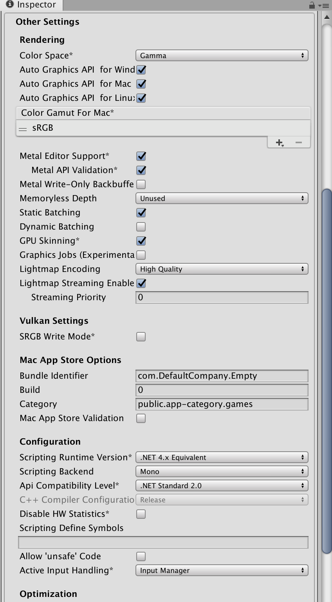

- [Unity의 빌드 프로세스를 알아보자](#unity의-빌드-프로세스를-알아보자)
  - [PlayerSetting](#playersetting)
    - [Standalone](#standalone)
      - [Resolution and Presentation](#resolution-and-presentation)
      - [Other Setting](#other-setting)
    - [iOS](#ios)
      - [Resolution and Presentation](#resolution-and-presentation-1)
      - [Other Setting](#other-setting-1)
    - [Android](#android)
      - [Resolution and Presentation](#resolution-and-presentation-2)
      - [Other Setting](#other-setting-2)
  - [빌드 후 처리를 해보자](#빌드-후-처리를-해보자)
    - [PostProcessBuildAttribute의 활용 - 1](#postprocessbuildattribute의-활용---1)
    - [PostProcessBuildAttribute의 활용 - 2](#postprocessbuildattribute의-활용---2)
    - [PostProcessBuildAttribute의 활용 - 3](#postprocessbuildattribute의-활용---3)

# Unity의 빌드 프로세스를 알아보자

## PlayerSetting

### Standalone

#### Resolution and Presentation

* Run In Background
* Resizable Window


#### Other Setting  

* Bundle Identifier
* Build
* Scripting RuntimeVersion
* Scripting Backend
* Api Compatibility Level
* Scripting Define Symbols



### iOS

#### Resolution and Presentation

* Status Bar
* Orientation


#### Other Setting  

* Bundle Identifier
* Version
* Build
* Signing Team ID
* Automatically Sign
* Scripting Runtime Version
* Scripting Backend
* Api Compatibility Level


### Android

#### Resolution and Presentation


#### Other Setting  

* Package Name
* Version
* Bundle Version Code
* Minimum API Level
* Target API Level
* Scripting Runtime Version 
* Scripting Backend
* Api Compatibility Level
* Target Architectures
* Install Location
* Internet Access
* Write Permission


## 빌드 후 처리를 해보자

### PostProcessBuildAttribute의 활용 - 1

```cs
using UnityEngine;
using UnityEditor;
using UnityEditor.Callbacks;

public class MyBuildPostprocessor {

    [PostProcessBuildAttribute(1)]
    public static void OnPostprocessBuild(BuildTarget target, string pathToBuiltProject) 
    {
        Debug.Log( target + ", " + pathToBuiltProject );
    }
}
```


### PostProcessBuildAttribute의 활용 - 2

```cs
using UnityEngine;
using UnityEditor;
using UnityEditor.Callbacks;

public class MyBuildPostprocessor {

    [PostProcessBuildAttribute(1)]
    public static void OnPostprocessBuild(BuildTarget target, string pathToBuiltProject) 
    {
        Debug.Log( target );
    }
}

public class MyBuildPostprocessor2 {

    [PostProcessBuildAttribute(2)]
    public static void OnPostprocessBuild(BuildTarget target, string pathToBuiltProject) 
    {
        Debug.Log( pathToBuiltProject );
    }
}
```


### PostProcessBuildAttribute의 활용 - 3

```cs
using UnityEngine;
using UnityEditor;
using UnityEditor.Callbacks;
using UnityEditor.iOS.Xcode;
using System.IO;

public class XcodeSettingsPostProcesser
{
    [PostProcessBuildAttribute (0)]
    public static void OnPostprocessBuild (BuildTarget buildTarget, string pathToBuiltProject)
    {

        // Stop processing if targe is NOT iOS
        if (buildTarget != BuildTarget.iOS)
            return; 

        // Initialize PbxProject
        var projectPath = pathToBuiltProject + "/Unity-iPhone.xcodeproj/project.pbxproj";
        PBXProject pbxProject = new PBXProject ();
        pbxProject.ReadFromFile (projectPath);
        string targetGuid = pbxProject.TargetGuidByName ("Unity-iPhone");

        // Sample of adding build property
        pbxProject.AddBuildProperty(targetGuid, "OTHER_LDFLAGS", "-all_load");

        // Sample of setting build property
        pbxProject.SetBuildProperty(targetGuid, "ENABLE_BITCODE", "NO");

        // Sample of update build property
        pbxProject.UpdateBuildProperty(targetGuid, "OTHER_LDFLAGS", new string[]{"-ObjC"}, new string[]{"-weak_framework"});

        // Sample of adding REQUIRED framwrok
        pbxProject.AddFrameworkToProject(targetGuid, "Security.framework", false);

        // Sample of adding OPTIONAL framework
        pbxProject.AddFrameworkToProject(targetGuid, "SafariServices.framework", true);

        // Sample of setting compile flags
        var guid = pbxProject.FindFileGuidByProjectPath("Classes/UI/Keyboard.mm");
        var flags = pbxProject.GetCompileFlagsForFile(targetGuid, guid);
        flags.Add("-fno-objc-arc");
        pbxProject.SetCompileFlagsForFile(targetGuid, guid, flags);

        // Apply settings
        File.WriteAllText (projectPath, pbxProject.WriteToString ());

        // Samlpe of editing Info.plist
        var plistPath = Path.Combine (pathToBuiltProject, "Info.plist");
        var plist = new PlistDocument ();
        plist.ReadFromFile (plistPath);

        // Add string setting
        plist.root.SetString ("hogehogeId", "dummyid");

        // Add URL Scheme
        var array = plist.root.CreateArray ("CFBundleURLTypes");
        var urlDict = array.AddDict ();
        urlDict.SetString ("CFBundleURLName", "hogehogeName");
        var urlInnerArray = urlDict.CreateArray ("CFBundleURLSchemes");
        urlInnerArray.AddString ("hogehogeValue");

        // Apply editing settings to Info.plist
        plist.WriteToFile (plistPath);
    }
}
```
