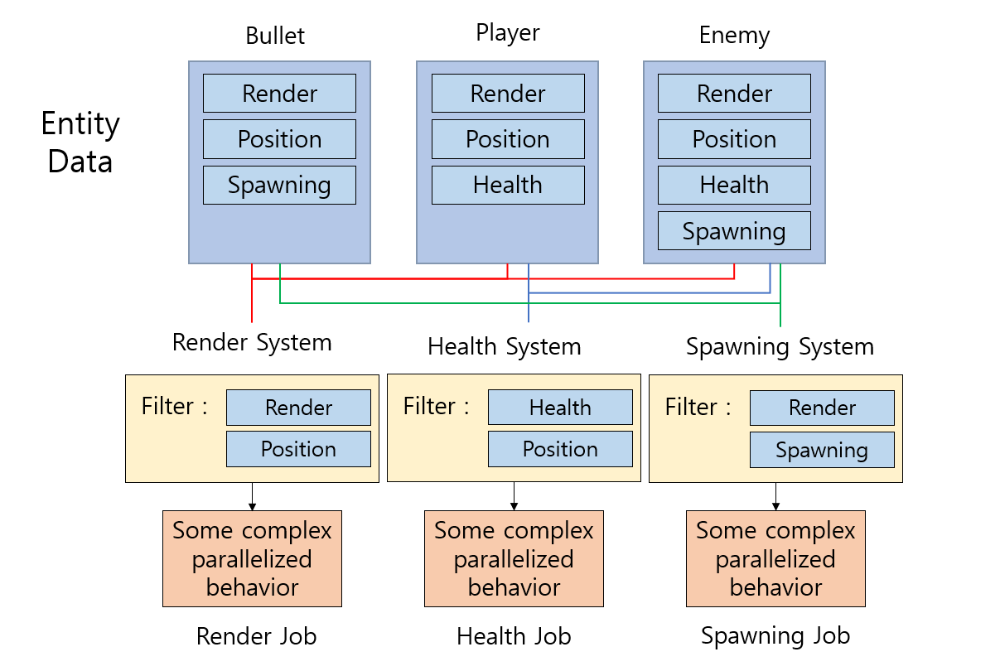

- [Introduction to ECS](#introduction-to-ecs)
- [Introduction to the Entity Component System and C# Job System](#introduction-to-the-entity-component-system-and-c-job-system)
- [ECS Overview](#ecs-overview)
- [Implementing Job System](#implementing-job-system)
- [Implementing ECS](#implementing-ecs)
- [Using the Burst Compiler](#using-the-burst-compiler)
- [Reference](#reference)

# [Introduction to ECS](https://unity3d.com/kr/learn/tutorials/topics/scripting/introduction-ecs?playlist=17117)

> Entity Component System는 객체 지향 프로그래밍에서 벗어나 데이터 지향 프로그래밍(Data Oriented Design)을 사용하는 것

* Entities : 컴포넌트들을 모아두는 그룹. GameObject와 유사
* Components : 데이터만 담고 다른 일을 하지 않는 그룹.
* Systems : 컴포넌트를 기반으로 동작을 정의하는 그룹. 특정 컴포넌트가 설정되어 있는 모든 엔터티들의 동작을 실행.

* ECS의 장점
  * 성능이 좋은 코드를 작성할 수 있다.
  * 코드가 쉽게 읽힌다.
  * 쉽게 코드를 재사용할 수 있다.
  * 최고 성능의 C# 코딩을 위한 Burst Compiler를 이용할 수 있다.
  * C#의 Job System과 잘 통합되어 있다.

* PURE ECS : GameObject와 MonoBehaviour를 사용하지 않음.
* Hybrid ECS : GameObject와 MonoBehaviour를 사용하지만 몇몇 기능을 지원하지 않음. MonoBehaviour에서  Behaviour에 해당하는 부분을 실행하지 않음.
  * using Unity.Entity 사용
  * 기존의 GameObject에 GameObjectEntity 컴포넌트를 추가하면 Entity로 작동.
  * Entity Debugger에서 동작중인 컴포넌트들과 그 안에 있는 엔터티들을 확인할 수 있다.


----
# [Introduction to the Entity Component System and C# Job System](https://unity3d.com/kr/learn/tutorials/topics/scripting/introduction-entity-component-system-and-c-job-system?playlist=17117)

> ECS는 Job System을 사용하여 구현되었다.

* 클래식한 방법 : Monobehaviours, 데이터와 프로세스가 묶여있음, 레퍼런스 타입에 많은 의존.
  * 데이터가 산재해 있기 때문에 메모리에서 캐시로 로딩할 때 매우 느리다.
  * 참조할 때 불필요한 데이터들도 같이 딸려온다.
  * 싱글 스레드이기 때문에 한번에 하나만 처리할 수 있다.

* Job System : 함수에서 데이터를 분리, 멀티코어 프로세스 -> 멀티스레드 가능
  * 코어 수에 맞게 job들을 분산하여 코어당 부담을 줄여준다.
  * 멀티스레드에서 나오는 문제점(코딩의 어려움, race condition, context switching의 큰 비용)을 해결해주기 때문에 게임코드 구현에 집중할 수 있다.


----
# [ECS Overview](https://unity3d.com/kr/learn/tutorials/topics/scripting/ecs-overview?playlist=17117)

* ECS의 구조는 다음 그림으로 설명할 수 있다.



* ECS와 Job System은 비슷하지만 다른 것이다.


----
# [Implementing Job System](https://unity3d.com/kr/learn/tutorials/topics/scripting/implementing-job-system?playlist=17117)

> Job System을 예제를 통해 구현해본다.

* 기존 코드와 Job System을 이용한 코드의 차이점 비교
  * JobHandle의 Complete함수를 계속 호출해준다.

* 기존 코드

```c#
Movememt.cs

public class Movement : MonoBehaviour {
	void Update() {
		Vector3 pos = transform.position;
		pos += transform.forward * GameMananger.GM.enemySpeed * Time.deltaTime;
		
		if (pos.z < GameManager.GM.bottomBound)
			pos = GameManager.GM.topBound;
		
		transform.position = pos;
	}
}


GameManager.cs

public class GameMangaer : MonoBehaviour {
	void Start() {
		AddShips(enemyShipCount);
	}

	void Update() {
		if(Input.GetKeyDown("space")
			AddShips(enemyShipIncremement);
	}

	void AddShips(int amount) {
		for (int i = 0; i < amount; i++) {
		  float xVal = Random.Range(leftBound, rightBount);
		  float zVal = Random.Range(0f, 10f);

  		  Vector3 pos = new Vector3(xVal, 0f, zVal + topBound);
		  Quaternion rot = Quaternion.Euler(0f, 180f, 0f);

		  var obj = Instantiate(enemyShipPrefab, pos, rot) as GameObject;
		}
	}
}
```

* Job System - MovementJob.cs
  * IJobParallelForTransform 인터페이스를 구현하는 구조체
    * IJob : 모든 IJob variants 가 상속하는 기본 인터페이스 구조
    * Parallel For : 일반적인 단일 스레드 for 루프를 취하고 여러 코어에서 작동하도록 인덱스 범위를 기반으로 작업을 여러 개의 청크로 분할하는 병렬 패턴
    * Transform : Execute 함수가 외부 Transform 참조에 이동 데이터를 제공하기 위해 TransformAccess 매개 변수를 포함한다는 것을 나타냄
  * Job Scheduler로 전달되는 구조. 하나의 작업 단위를 의미한다.


```c#
MovementJob.cs

[ComputeJobOptimization]
public struct MovementJob : IJobParallelForTransform {
	public float moveSpeed;
	public float topBound;
	public float bottomBount;
	public float deltaTime; // 작업에는 델타 시간 개념이 없기 때문에 외부에서 받아야 한다.

	public void Execute(int index, TransformAccess transform) {
		Vector3 pos = transform.position;
		pos += moveSpeed * deltaTime * (transform.rotation * new Vector3(0f, 0f, 1f));
		
		if (pos.z < bottomBound)
			pos = topBound;
		
		transform.position = pos;
	}
}
```

* Job System - GameManager.cs
  * TransformAccessArray : 각 오브젝트의 수정된 Transform(Job-ready TransformAccess)을 보유할 데이터 컨테이너
  * MovementJob: job 구조체의 인스턴스. 작업을 구성하는 데 사용
  * JobHandle : 완료 확인과 같은 다양한 작업을 위해 Job을 참조하는 데 사용하는 고유 식별자
    * moveHandle.Complete() : 예약된 작업이 완료될 때 까지 메인스레드가 실행되지 않도록 함. 이전 작업이 수행되는 동안 작업 예악을 방지하기 때문에 새로운 오브젝트를 추가할 수 없다.
    * moveHandle.Schedule() : TransformAccessArray의 transform 리스트를 인자로 받아 스케쥴에 추가한다.
    * JobHandle.ScheduleBatchedJobs() : 모든 스케쥴링 되어 있는 job 들을 전달한다.


```c#
GameManager.cs

public class GameMangaer : MonoBehaviour {
	TransformAccessArray transforms;
	MovementJob moveJob;
	JobHandle moveHandle;

	void OnDisable() {
		moveHandle.Complete();
		transforms.Dispose();
	} 

	void Start() {
		transforms = new TransformAccessArray(0,-1);

		AddShips(enemyShipCount);
	}

	void Update() {
		moveHandle.Complete();

		if(Input.GetKeyDown("space")
			AddShips(enemyShipIncremement);

		moveJob = new MovementJob() {
		  moveSpeed = enemySpeed,
		  topBound = topBound,
		  bottomBound = bottomBound,
		  deltaTime = Time.deltaTime
		};

		moveHandle = moveJob.Schedule(transforms);

		JobHandler.ScheduleBatchedJobs();
	}

	void AddShips(int amount) {
		moveHandle.Complete(); // 안전을 위해 작업 완료를 다시 확인

		transforms.capacity = transforms.length + amount;
		
		for (int i = 0; i < amount; i++) {
		  float xVal = Random.Range(leftBound, rightBound);
		  float zVal = Random.Range(0f, 10f);

  		  Vector3 pos = new Vector3(xVal, 0f, zVal + topBound);
		  Quaternion rot = Quaternion.Euler(0f, 180f, 0f);

		  var obj = Instantiate(enemyShipPrefab, pos, rot) as GameObject;

		  transforms.Add(obj.transform);
		}
	}
}
```

----
# [Implementing ECS](https://unity3d.com/kr/learn/tutorials/topics/scripting/implementing-ecs?playlist=17117)

> Entity Component System을 예제를 통해 구현해본다.

* 프리팹을 오브젝트가 아닌 엔터티를 생성할 때 사용하는 템플릿으로 사용
* GameObject에 Transform 이외에 Unity 구성 요소가 없다. -> ~Component.cs 스크립트로 구성
  * 기존 Mesh Renderer : MeshInstanceRendererComponent로 변경
* GameObjectEntity.cs가 프리팹에 첨부되어 있다. -> GameObject를 엔터티처럼 취급함

* MoveSpeedComponent.cs : MoveSpeed 데이터를 설정하는 코드

```c#
[Serializable]
public struct MoveSpeed : IComponentData {
    public float Value;
}

public class MoveSpeedComponent : ComponentDataWrapper<MoveSpeed> { } // 인스펙터에 데이터를 표시함
```

* GameplayManager.cs : EntityManager를 생성하여 게임오브젝트 생성을 관리

```c#
public class GameManager : MonoBehaviour {
    EntityManager manager;

    void Start() {
        manager = World.Active.GetOrCreateManager<EntityManager>();
        AddShips(enemyShipCount);
    }

    void Update() {
        if (Input.GetKeyDown("space"))
            AddShips(enemyShipIncremement);
    }

    void AddShips(int amount) {
        NativeArray<Entity> entities = new NativeArray<Entity>(amount, Allocator.Temp);
        manager.Instantiate(enemyShipPrefab, entities);

        for (int i = 0; i < amount; i++) {
            float xVal = Random.Range(leftBound, rightBound);
            float zVal = Random.Range(0f, 10f);
            manager.SetComponentData(entities[i], new Position { Value = new float3(xVal, 0f, topBound + zVal) });
            manager.SetComponentData(entities[i], new Rotation { Value = new quaternion(0, 1, 0, 0) });
            manager.SetComponentData(entities[i], new MoveSpeed { Value = enemySpeed });
        }
        entities.Dispose();
    }
}
```

* MovementSystem.cs : 모든 엔터티 이동 작업을 담당.
  * JobComponentSystem : 모든 시스템 관련 코드에 구현해야 하는 콜백을 제공
  * ECS가 모든 엔터티의 데이터를 파악하여 Execute 함수에 자동으로 넣어준다.
  * OnUpdate() : JobComponentSystem에서 제공하는 가상 함수. MovementJob 데이터 설정, 프레임 별 데이터 설정 (시간 및 범위), 작업 스케줄링을 수행한다.
    * OnUpdate () 함수는 특정 데이터 컴포넌트 그룹을 포함하는 엔티티를 처음 인스턴스화 할 때까지 호출되지 않는다.

```c#
public class MovementSystem : JobComponentSystem {
    [ComputeJobOptimization]
    struct MovementJob : IJobProcessComponentData<Position, Rotation, MoveSpeed> {
        public float topBound;
        public float bottomBound;
        public float deltaTime;

        public void Execute(ref Position position, [ReadOnly] ref Rotation rotation, [ReadOnly] ref MoveSpeed speed) {
            float3 value = position.Value;

            value += deltaTime * speed.Value * math.forward(rotation.Value);

            if (value.z < bottomBound)
                value.z = topBound;

            position.Value = value;
        }
    }

    protected override JobHandle OnUpdate(JobHandle inputDeps) {
        MovementJob moveJob = new MovementJob {
            topBound = GameManager.GM.topBound,
            bottomBound = GameManager.GM.bottomBound,
            deltaTime = Time.deltaTime
        };

        JobHandle moveHandle = moveJob.Schedule(this, 64, inputDeps);

        return moveHandle;
    }
}
```

----
# [Using the Burst Compiler](https://unity3d.com/kr/learn/tutorials/topics/scripting/using-burst-compiler?playlist=17117)

> Burst Compiler의 이점에 대해 알아본다.

* Burst Compiler는 ECS의 데이터를 보다 효율적으로 구성하여 보이지 않는 성능 향상을 가져온다.

* 현재 플레이어 기기의 프로세서 기능에 따라 코드 작업을 최적화한다.

* 패키지 기반의 컴파일러이기 때문에 유니티 에디터와 독자적으로 업데이트를 진행할 수 있다.


# Reference 

* [Get Started with the Unity* Entity Component System (ECS), C# Job System, and Burst Compiler](https://software.intel.com/en-us/articles/get-started-with-the-unity-entity-component-system-ecs-c-sharp-job-system-and-burst-compiler)