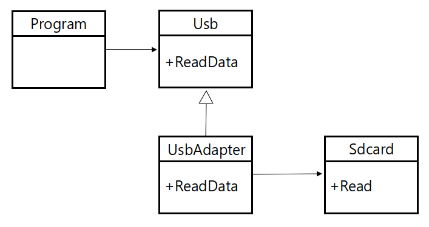

# Adapter pattern

* Stuctural design pattern
* 클래스의 인터페이스를 다른 인터페이스로 변환하는 패턴, 어댑터 패턴을 사용함으로서 호환되지 않는 두 클래스를 동작하게 할 수 있다.



## Code

### C#

```csharp
class Usb {
    public virtual void ReadData() {
        Console.WriteLine("USB : ReadData()");
    }
}

class Sdcard {
    public void Read() {
        Console.WriteLine("SDCard : Read()");
    }
}

class UsbAdapter : Usb {
    Sdcard sd_card = new Sdcard();

    public override void ReadData() {
        sd_card.Read();
    }
}

class Program {
    static void Main(string[] args) {
        Usb usb = new UsbAdapter();
        usb.ReadData();
    }
}
```

### C++

```cpp
class Usb {
public:
	virtual void ReadData() {
		cout << "USB : ReadData()" << endl;
	}
};

class Sdcard {
public:
	void Read() {
		cout << "SDCard : Read()" << endl;
	}
};

class UsbAdapter : public Usb {
private:
	Sdcard *sd_card = new Sdcard();
public:
	void ReadData() {
		sd_card->Read();
	}
};

int main() {
	Usb *usb = new UsbAdapter();
	usb->ReadData();
}
```

### Java

```java
class Usb {
	public void ReadData() {
		System.out.println("USB : ReadData()");
	}
}

class Sdcard {
	public void Read() {
		System.out.println("SdCard : Read()");
	}
}

class UsbAdapter extends Usb {
	Sdcard sd_card = new Sdcard();
	
	@Override
	public void ReadData() {
		sd_card.Read();
	}
}

public class Main {
	public static void main(String args[]) {
		Usb usb = new UsbAdapter();
		usb.ReadData();
	}
}
```

### Objective-C

```objc
@protocol Usb<NSObject>
-(void)ReadData;
@end

@interface Usb : NSObject
@end
    
@interface Sdcard : NSObject
-(void)Read;
@end
    
@interface UsbAdapter : NSObject<Usb> {
    Sdcard *sdcard;
}
-(void)ReadData;
@end

@implementation Sdcard
-(void)Read {
    NSLog(@"Sdcard : Read()");
}
@end
    
@implementation Usb
@end

@implementation UsbAdapter
-(void)ReadData {
    sdcard = [[Sdcard alloc] init];
    [sdcard Read];
}
@end

int main (int argc, const char * argv[])
{
    UsbAdapter *adapter = [[UsbAdapter alloc] init];
    [adapter ReadData];
    
    return 0;
}
```

### Python

```python
class Usb:
    def ReadData():
        print("USB : ReadData()");
        
class Sdcard:
    def Read():
       print("SDCard : Read()");
       
class UsbAdapter(Usb):
    def ReadData():
        Sdcard.Read();
        
UsbAdapter.ReadData();