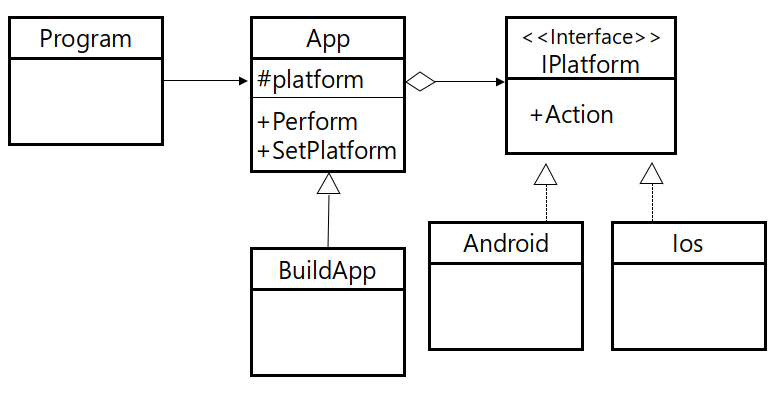

# Bridge Pattern

클래스의 세부 구현을 독립적으로 작동시키기 위해 구현을 추상화한 패턴



## Code

### C#

```csharp
interface IPlatform {
    void Action();
}

class Android : IPlatform {
    public void Action() {
        Console.WriteLine("Android : Action()");
    }
}

class Ios : IPlatform {
    public void Action() {
        Console.WriteLine("Ios : Action()");
    }
}

abstract class App {
    protected IPlatform m_platform;

    public abstract void Perform();

    public void SetPlatform(IPlatform platform) {
        m_platform = platform;
    }
}

class BuildApp : App {
    public override void Perform() {
        Console.WriteLine("BuildApp : Perform()");
        m_platform.Action();
    }
}

class Program {
    static void Main(string[] args) {
        BuildApp app = new BuildApp();
        app.SetPlatform(new Android());
        app.Perform();

        app.SetPlatform(new Ios());
        app.Perform();
    }
}
```

### C++

```cpp
class IPlatform {
public:
	virtual void Action() = 0;
};

class Android : public IPlatform {
public:
	void Action() {
		cout << "Android : Action()" << endl;
	}
};

class Ios : public IPlatform {
public:
	void Action() {
		cout << "Ios : Action()" << endl;
	}
};

class App {
public:
	IPlatform *m_platform;

	virtual void Perform() = 0;
	void SetPlatform(IPlatform *platform) {
		m_platform = platform;
	}
};

class BuildApp : public App {
public:
	void Perform() {
		cout << "BuildApp : Perform()" << endl;
		m_platform->Action();
	}
};

int main() {
	BuildApp *app = new BuildApp();
	app->SetPlatform(new Android());
	app->Perform();

	app->SetPlatform(new Ios());
	app->Perform();
}
```

### Java

```java
interface IPlatform {
	void Action();
}

class Android implements IPlatform {
	public void Action() {
		System.out.println("Android : Action()");
	}
}

class Ios implements IPlatform {
	public void Action() {
		System.out.println("Ios : Action()");
	}
}

abstract class App {
	protected IPlatform m_platform;
	
	public abstract void Perform();
	
	public void SetPlatform(IPlatform platform) {
		m_platform = platform;
	}
}

class BuildApp extends App {
	@Override
	public void Perform() {
		System.out.println("BuildApp : Perform()");
		m_platform.Action();
	}
}

public class Main {
	public static void main(String args[]) {
		BuildApp app = new BuildApp();
		app.SetPlatform(new Android());
		app.Perform();
		
		app.SetPlatform(new Ios());
		app.Perform();		
	}
}
```

### Objective-C

```objc
#import <Foundation/Foundation.h>

@protocol IPlatform<NSObject>
@required
-(void) Action;
@end
    
@interface Android : NSObject<IPlatform>
@end

@implementation Android
-(void)Action {
    NSLog(@"Android : Action()");
}
@end

@interface Ios : NSObject<IPlatform>
@end

@implementation Ios
-(void)Action {
    NSLog(@"Ios : Action()");
}
@end

@protocol App<NSObject>
@required
-(void)Perform;
@end

@interface BuildApp : NSObject<App> {
    id<IPlatform> platform;
}
@property (assign) id<IPlatform> platform;
-(void) Perform;
@end

@implementation BuildApp
@synthesize platform;
-(void) Perform {
    [platform Action];
}
@end

int main (int argc, const char * argv[])
{
    Android *android = [[Android alloc] init];
    Ios *ios = [[Ios alloc] init];
    BuildApp *app = [[BuildApp alloc] init];

    [app setPlatform:android];
    [app Perform];
    [app setPlatform:ios];
    [app Perform];

    return 0;
}
```

### Python

```python
from abc import *

class IPlatform:
    @abstractmethod
    def Action(self):
        pass
        
class Android(IPlatform):
    def Action(self):
        print("Android : Action()");
        
class Ios(IPlatform):
    def Action(self):
        print("Ios : Action()");
        
class App:
    def SetPlatform(self, target):
        self.platform = target;
    
    @abstractmethod
    def Perform(self):
        pass
        
class BuildApp(App):
    def Perform(self):
        self.platform.Action();
        
app = BuildApp();
app.SetPlatform(Android());
app.Perform();

app.SetPlatform(Ios());
app.Perform();