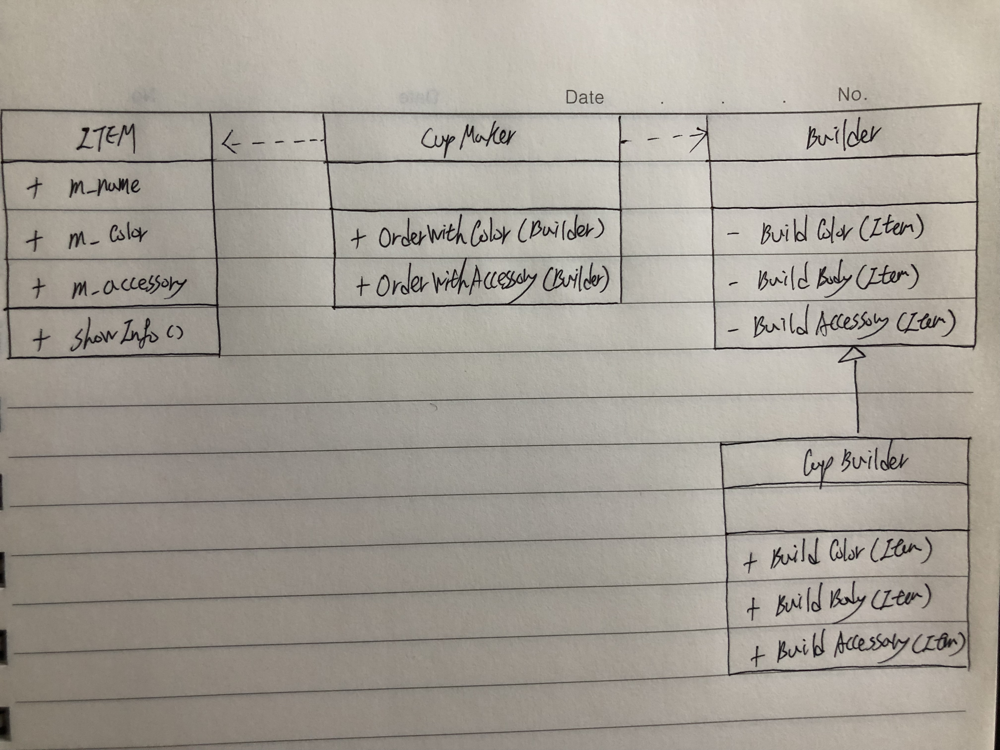

# Builder

* Creational
* 생성과정을 추상화(Builder)하여 여러 형태(withColor, withAccessory)의 객체를 생성 할 수 있는 패턴

## Class Diagram



## Code

`[C# Code]`

```csharp
using System;

// Product
class Item {
	public string m_name;		// 이름
	public string m_color;		// 색깔
	public string m_accessory;	// 장식품 이름
	
	public Item() {
		m_name = "";
		m_color = "White";
		m_accessory = "None";
	}
	
	// 아이템 설명
	public void ShowInfo() {
		Console.WriteLine(string.Format("이 {0}의 색은 {1}, 장식품은 {2} 입니다.", m_name, m_color, m_accessory));
	}
}

// Director
class CupMaker {
	// Item을 제작하는데 색을 변경 할 수 있는 함수.
	public Item OrderWithColor(Builder builder) {
		Item item = new Item();
		builder.BuildColor(item);
		builder.BuildBody(item);
		
		return item;
	}
	
	// Item을 제작하는데 악세서리를 변경 할 수 있는 함수
	public Item OrderWithAccessory(Builder builder) {
		Item item = new Item();
		builder.BuildBody(item);
		builder.BuildAccessory(item);
		
		return item;
	}
}

// Builder
interface Builder {
	void BuildColor(Item item);
	void BuildBody(Item item);
	void BuildAccessory(Item item);
}

// ConcreteBuilder
class CupBuilder : Builder {
	public void BuildColor(Item item) {
		item.m_color = "Blue";
	}
	
	public void BuildBody(Item item) {
		item.m_name = "Cup";
	}
	
	public void BuildAccessory(Item item) {
		item.m_accessory = "Diamond";
	}
}

public class Program {
	public static void Main() {
		CupBuilder cup_builder = new CupBuilder();
		CupMaker cup_maker = new CupMaker();
		
		Item item = cup_maker.OrderWithColor(cup_builder);
		item.ShowInfo();
		
		item = cup_maker.OrderWithAccessory(cup_builder);
		item.ShowInfo();
	}
}
```

`[Java Code]`

```java
// Product
class Item {
	public String m_name;		// 이름
	public String m_color;		// 색깔
	public String m_accessory;	// 장식품 이름
	
	public Item() {
		m_name = "";
		m_color = "White";
		m_accessory = "None";
	}
	
	// 아이템 설명
	public void ShowInfo() {
		System.out.println(String.format("이 %s의 색은 %s, 장식품은 %s 입니다.", m_name, m_color, m_accessory));
	}
}

// Director
class CupMaker {
	// Item을 제작하는데 색을 변경 할 수 있는 함수.
	public Item OrderWithColor(Builder builder) {
		Item item = new Item();
		builder.BuildColor(item);
		builder.BuildBody(item);
		
		return item;
	}
	
	// Item을 제작하는데 악세서리를 변경 할 수 있는 함수
	public Item OrderWithAccessory(Builder builder) {
		Item item = new Item();
		builder.BuildBody(item);
		builder.BuildAccessory(item);
		
		return item;
	}
}

// Builder
interface Builder {
	void BuildColor(Item item);
	void BuildBody(Item item);
	void BuildAccessory(Item item);
}

// ConcreteBuilder
class CupBuilder implements Builder {
	public void BuildColor(Item item) {
		item.m_color = "Blue";
	}
	
	public void BuildBody(Item item) {
		item.m_name = "Cup";
	}
	
	public void BuildAccessory(Item item) {
		item.m_accessory = "Diamond";
	}
}

public class MainClass{
     public static void main(String []args){
        CupBuilder cup_builder = new CupBuilder();
		CupMaker cup_maker = new CupMaker();
		
		Item item = cup_maker.OrderWithColor(cup_builder);
		item.ShowInfo();
		
		item = cup_maker.OrderWithAccessory(cup_builder);
		item.ShowInfo();
     }
}
```

`[Objective C Code]`

```objc
[.h]

// Product
@interface Item : NSObject {
@public
    NSString* m_name;       // 이름
    NSString* m_color;		// 색깔
    NSString* m_accessory;	// 장식품 이름
}

- (id) init;
- (void) ShowInfo;
@end

// Builder
@interface Builder : NSObject
- (void) BuildColor:item;
- (void) BuildBody:item;
- (void) BuildAccessory:item;
@end

// ConcreteBuilder
@interface CupBuilder : Builder
@end

// Director
@interface CupMaker : NSObject
- (Item*) OrderWithColor:builder;
- (Item*) OrderWithAccessory:builder;
@end
```

```objc
[.m]

// Product
@implementation Item
-(id)init{
    self = [super init];
    if(self){
        m_name = @"";
        m_color = @"White";
        m_accessory = @"None";
    }
    return self;
}

// 아이템 설명
- (void) ShowInfo {
    NSLog(@"이 %@의 색은 %@, 장식품은 %@ 입니다.", m_name, m_color, m_accessory);
}
@end

// Builder
@implementation Builder
- (void) BuildColor:item{}
- (void) BuildBody:item{}
- (void) BuildAccessory:item{}
@end

// ConcreteBuilder
@implementation CupBuilder

- (void) BuildColor:(Item*)item {
    item->m_color = @"Blue";
}

- (void) BuildBody:(Item*)item {
    item->m_name = @"Cup";
}
- (void) BuildAccessory:(Item*)item {
    item->m_accessory = @"Diamond";
}
@end

// Director
@implementation CupMaker
- (Item*) OrderWithColor:builder{
    Item* item = [[Item alloc] init];
    [builder BuildColor:item];
    [builder BuildBody:item];
    
    return item;
}

- (Item*) OrderWithAccessory:builder{
    Item* item = [[Item alloc] init];
    [builder BuildBody:item];
    [builder BuildAccessory:item];
    
    return item;
}

@end

int main(int argc, char * argv[]) {
    CupBuilder *cup_builder = [[CupBuilder alloc] init];
    CupMaker *cup_maker = [[CupMaker alloc] init];
    
    Item *item = [cup_maker OrderWithColor:cup_builder];
    [item ShowInfo];
    
    item = [cup_maker OrderWithAccessory:cup_builder];
    [item ShowInfo];
}
```

`[Python Code]`

```python
# Product
class Item:
	m_name = "";		# 이름
	m_color = "";       # 색깔
	m_accessory = "";	# 장식품 이름
	
	def __init__(self):
	    self.m_name = "";
	    self.m_color = "White";
	    self.m_accessory = "None";
	
	# 아이템 설명
	def ShowInfo(self):
		print(string.Format("이 {0}의 색은 {1}, 장식품은 {2} 입니다.".format(m_name, m_color, m_accessory)));

# Director
class CupMaker:
	# Item을 제작하는데 색을 변경 할 수 있는 함수.
	def OrderWithColor(self, builder):
		item = Item();
		builder.BuildColor(item);
		builder.BuildBody(item);
		
		return item;
	
	# Item을 제작하는데 악세서리를 변경 할 수 있는 함수
	def OrderWithAccessory(self, builder):
		item = Item();
		builder.BuildBody(item);
		builder.BuildAccessory(item);
		
		return item;

# Builder
class Builder:
	def BuildColor(self, item):
	    pass;
	    
	def BuildBody(self, item):
	    pass;
	    
	def BuildAccessory(self, item):
	    pass;

# ConcreteBuilder
class CupBuilder(Builder):
	def BuildColor(self, item):
		item.m_color = "Blue";
	
	def BuildBody(self, item):
		item.m_name = "Cup";
	
	def BuildAccessory(self, item):
		item.m_accessory = "Diamond";
		
# Main
cup_builder = CupBuilder();
cup_maker = CupMaker();
		
item = cup_maker.OrderWithColor(cup_builder);
item.ShowInfo();
		
item = cup_maker.OrderWithAccessory(cup_builder);
item.ShowInfo();
```

`[C++ Code]`

```cpp
/******************************************************************************

                              Online C++ Compiler.
               Code, Compile, Run and Debug C++ program online.
Write your code in this editor and press "Run" button to compile and execute it.

*******************************************************************************/

#include <iostream>

using namespace std;

// Product
class Item {
public:
    string m_name;		// 이름
	string m_color;		// 색깔
	string m_accessory;	// 장식품 이름
	
	Item() {
		m_name = "";
		m_color = "White";
		m_accessory = "None";
	}
	
	// 아이템 설명
	void ShowInfo() {
		cout << "이 " << m_name << "의 색은 " << m_color << ", 장식품은 " << m_accessory << " 입니다.";
	}
};

// Builder
class Builder {
public:
	virtual void BuildColor(Item *item);
	virtual void BuildBody(Item *item);
	virtual void BuildAccessory(Item *item);
};

// ConcreteBuilder
class CupBuilder : public Builder {
public:
	virtual void BuildColor(Item *item) {
		item->m_color = "Blue";
	}
	
	virtual void BuildBody(Item *item) {
		item->m_name = "Cup";
	}
	
	virtual void BuildAccessory(Item *item) {
		item->m_accessory = "Diamond";
	}
};

// Director
class CupMaker {
public:
	// Item을 제작하는데 색을 변경 할 수 있는 함수.
	Item* OrderWithColor(Builder *builder) {
		Item *item = new Item();
		builder->BuildColor(item);
		builder->BuildBody(item);
		
		return item;
	}
	
	// Item을 제작하는데 악세서리를 변경 할 수 있는 함수
	Item* OrderWithAccessory(Builder *builder) {
		Item *item = new Item();
		builder->BuildBody(item);
		builder->BuildAccessory(item);
		
		return item;
	}
};

int main() {
    CupBuilder *cup_builder = new CupBuilder();
	CupMaker *cup_maker = new CupMaker();
		
	Item *item = cup_maker->OrderWithColor(cup_builder);
	item->ShowInfo();
		
	item = cup_maker->OrderWithAccessory(cup_builder);
	item->ShowInfo();
    return 0;
}
```