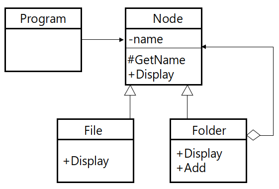

# Composite Pattern

단일 객체와 객체들의 집합에 대한 처리를 동일하게 수행하기 위한 패턴, 컴포지트 패턴은 트리 구조로 구성된다.



## Code

### C#

```csharp
abstract class Node {
    string name;

    public Node(string name) {
        this.name = name;
    }

    protected string GetName() {
        return name;
    }

    public abstract void Show();
}

class File : Node {
    public File(string name) : base(name) { }

    public override void Show() {
        Console.WriteLine(GetName());
    }
}

class Folder : Node {
    List<Node> m_l_node = new List<Node>();

    public Folder(string name) : base(name) { }

    public void Add(Node node) {
        m_l_node.Add(node);
    }

    public override void Show() {
        Console.WriteLine(GetName());

        for(int n_idx = 0; n_idx < m_l_node.Count; n_idx++) {
            Node node = m_l_node[n_idx];
            if (node == null)
                continue;
            node.Show();
        }
    }
}

class Program {
    static void Main(string[] args) {
        Folder folder = new Folder("Folder1");
        folder.Add(new File("File1"));
        folder.Add(new File("File2"));

        Folder folder1 = new Folder("Folder11");
        folder1.Add(new File("File11"));
        folder1.Add(new File("File12"));

        folder.Add(folder1);
        folder.Show();
    }
}
```

### C++

```cpp
class Node {
private:
	string name;
public:
	Node(string name) {
		this->name = name;
	}

	string GetName() {
		return name;
	}

	virtual void Show() = 0;
};

class File : public Node {
public:
	File(string name) : Node(name) { }

	void Show() {
		cout << GetName() << endl;
	}
};

class Folder : public Node {
public:
	list<Node*> m_l_node;

	Folder(string name) : Node(name){ }

	void Add(Node *node) {
		m_l_node.push_back(node);
	}

	void Show() {
		cout << GetName() << endl;

		list<Node*>::iterator iter;
		for (iter = m_l_node.begin(); iter != m_l_node.end(); iter++) {
			(*iter)->Show();
		}
	}
};

int main() {
	Folder *folder = new Folder("folder1");
	folder->Add(new File("file1"));
	folder->Add(new File("file2"));

	Folder *folder1 = new Folder("folder11");
	folder1->Add(new File("file11"));
	folder1->Add(new File("file12"));

	folder->Add(folder1);
	folder->Show();
}
```

### Java

```java
abstract class Node {
	private String name;
	
	public Node(String name) {
		this.name = name;
	}
	
	protected String GetName() {
		return name;
	}
	
	public abstract void Show();
}

class File extends Node {
	public File(String name) {
		super(name);
	}
	
	@Override
	public void Show() {
		System.out.println(GetName());
	}
}

class Folder extends Node {
	List<Node> m_l_node = new ArrayList<Node>();
	
	public Folder(String name) {
		super(name);
	}
	
	void Add(Node node) {
		m_l_node.add(node);
	}
	
	@Override
	public void Show() {
		System.out.println(GetName());
		
		for(int n_idx = 0; n_idx < m_l_node.size(); n_idx++) {
			Node node = m_l_node.get(n_idx);
			node.Show();
		}
	}
}

public class Main {
	public static void main(String args[]) {
		Folder folder = new Folder("folder1");
		folder.Add(new File("file1"));
		folder.Add(new File("file2"));
		
		Folder folder1 = new Folder("folder11");
		folder1.Add(new File("file11"));
		folder1.Add(new File("file12"));
		
		folder.Add(folder1);
		folder.Show();
	}
}
```

### Objective-C

```objc
#import <Foundation/Foundation.h>

@interface Node : NSObject {
    NSString *m_name;
}
-(void)initWithName:(NSString*)name;
-(void)Show;
@end

@implementation Node
-(void)initWithName:(NSString*)name {
    self = [super init];
    if(self) {
        m_name = name;
    }
}
-(void)Show {
    NSLog(m_name);
}
@end

@interface File : Node
-(void)initWithName:(NSString*)name;
-(void)Show;
@end

@implementation File
-(void)initWithName:(NSString*)name {
    return [super initWithName:name];
}
-(void)Show {
    NSLog(m_name);
}
@end

@interface Folder : Node {
    NSMutableArray *m_nodes;
}
-(void)initWithName:(NSString*)name;
-(void)Add:(Node*)node;
@end

@implementation Folder
-(void)initWithName:(NSString*)name {
    m_nodes = [NSMutableArray arrayWithCapacity:10];
    return [super initWithName:name];
}
-(void)Add:(Node*)node {
    [m_nodes addObject:node];
}
-(void)Show {
    NSLog(m_name);
    for(Node* node in m_nodes) {
        [node Show];
    }
}
@end

int main (int argc, const char * argv[])
{
        NSAutoreleasePool *pool = [[NSAutoreleasePool alloc] init];
        
        Folder *folder1 = [[Folder alloc]initWithName:@"folder1"];
        [folder1 Add:[[File alloc]initWithName:@"file1"]];
        Folder *folder2 = [[Folder alloc]initWithName:@"folder2"];
        [folder2 Add:[[File alloc]initWithName:@"file2"]];
        
        [folder1 Add:folder2];
        [folder1 Show];
        
        [pool drain];
        return 0;
}
```

### Python

```python
from abc import *

class Node:
    def __init__(self, name):
        self.name = name;
        
    @abstractmethod
    def Show(self):
        pass
        
class File(Node):
    def Show(self):
        print(self.name);
        
class Folder(Node):
    def __init__(self, name):
        self.name = name;
        self.nodes = list();
        
    def Add(self, node):
        self.nodes.append(node);
        
    def Show(self):
        print(self.name);
        for node in self.nodes:
            node.Show();
        
folder1 = Folder("folder1");
folder1.Add(File("file1"));
folder2 = Folder("folder2");
folder2.Add(File("file2"));

folder1.Add(folder2);
folder1.Show();
```