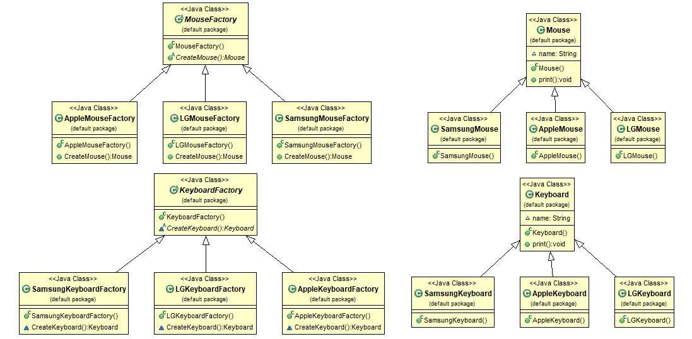

# Abstract Factory, Factory Method

* Factory Method : 조건에 따른 객체 생성을 팩토리 클래스로 위임하여, 팩토리 클래스에서 객체를 생성하는 패턴
    * 하나의 제품 항목에 대해 객체를 만드는 팩토리 생성
  
* Abstract Factory : 서로 관련이 있는 객체들을 통째로 묶어서 객체를 생성하는 팩토리 클래스로 만들고, 팩토리를 조건에 따라 생성하는 패턴
    * 여러개의 제품 항목을 묶어 객체를 만드는 팩토리 생성


## java

```java
public class Keyboard {
	String name;
	public void print() {
		System.out.println("This is "+name);
	}
}

public class SamsungKeyboard extends Keyboard {
	public SamsungKeyboard() {
		name = "Samsung Keyboard";
	}
}

public class AppleKeyboard extends Keyboard {
	public AppleKeyboard() {
		name = "Apple Keyboard";
	}
}

public class LGKeyboard extends Keyboard {
	public LGKeyboard() {
		name = "LG Keyboard";
	}
}

public class Mouse {
	String name;
	public void print() {
		System.out.println("This is "+name+" mouse");
	}
}

public class SamsungMouse extends Mouse {
	public SamsungMouse() {
		name = "Samsung";
	}
}

public class AppleMouse extends Mouse {
	public AppleMouse() {
		name = "Apple";
	}
}

public class LGMouse extends Mouse {
	public LGMouse() {
		name = "LG";
	}
}
```
### Factory Method
```java
public abstract class KeyboardFactory {
	abstract Keyboard CreateKeyboard();
}

public class SamsungKeyboardFactory extends KeyboardFactory {
	@Override
	Keyboard CreateKeyboard() {
		return new SamsungKeyboard();
	}
}

public class AppleKeyboardFactory extends KeyboardFactory {
	@Override
	Keyboard CreateKeyboard() {
		return new AppleKeyboard();
	}
}

public class LGKeyboardFactory extends KeyboardFactory {
	@Override
	Keyboard CreateKeyboard() {
		return new LGKeyboard();
	}
}

public abstract class MouseFactory {
	public abstract Mouse CreateMouse();
}

public class SamsungMouseFactory extends MouseFactory {
	@Override
	public Mouse CreateMouse() {
		return new SamsungMouse();
	}
}

public class AppleMouseFactory  extends MouseFactory {
	@Override
	public Mouse CreateMouse() {
		return new AppleMouse();
	}
}

public class LGMouseFactory extends MouseFactory {
	@Override
	public Mouse CreateMouse() {
		return new LGMouse();
	}
}

public static void main(String[] args) {
    KeyboardFactory keyboard_factory = new SamsungKeyboardFactory();
    Keyboard keyboard = keyboard_factory.CreateKeyboard(); 
    MouseFactory mouse_factory = new SamsungMouseFactory();
    Mouse mouse = mouse_factory.CreateMouse();

    keyboard.print();
    mouse.print();
}

//결과
This is Samsung Keyboard
This is Samsung mouse
```
### Abstract Factory
```java
public abstract class ComputerFactory {
	public abstract Keyboard CreateKeyboard();
	public abstract Mouse CreateMouse();
}

public class SamsungComputerFactory extends ComputerFactory {
	@Override
	public Keyboard CreateKeyboard() {
		return new SamsungKeyboard();
	}

	@Override
	public Mouse CreateMouse() {
		return new SamsungMouse();
	}
}

public class AppleComputerFactory  extends ComputerFactory {
	@Override
	public Keyboard CreateKeyboard() {
		return new AppleKeyboard();
	}

	@Override
	public Mouse CreateMouse() {
		return new AppleMouse();
	}
}

public class LGComputerFactory extends ComputerFactory {
	@Override
	public Keyboard CreateKeyboard() {
		return new LGKeyboard();
	}

	@Override
	public Mouse CreateMouse() {
		return new LGMouse();
	}
}

public static void main(String[] args) {
    ComputerFactory samsung_computer = new SamsungComputerFactory();
    Keyboard keyboard = samsung_computer.CreateKeyboard();
    Mouse mouse = samsung_computer.CreateMouse
   
    keyboard.print();
    mouse.print();
}

//결과
This is Samsung Keyboard
This is Samsung mouse
```

## C#

```cs
public class Keyboard {
    protected string name;
    public void print() {
        Console.WriteLine("This is " + name);
    }
}

public class SamsungKeyboard : Keyboard {
    public SamsungKeyboard() {
        name = "Samsung Keyboard";
    }
}

public class AppleKeyboard : Keyboard {
    public AppleKeyboard() {
        name = "Apple Keyboard";
    }
}

public class LGKeyboard : Keyboard {
    public LGKeyboard() {
        name = "LG Keyboard";
    }
}

public class Mouse {
    protected string name;
    public void print() {
    Console.WriteLine("This is " + name + " mouse");
    }
}

public class SamsungMouse : Mouse {
    public SamsungMouse() {
        name = "Samsung";
    }
}

public class AppleMouse : Mouse {
    public AppleMouse() {
        name = "Apple";
    }
}

public class LGMouse : Mouse {
    public LGMouse() {
        name = "LG";
    }
}
```
### Factory Method
```cs
public abstract class KeyboardFactory {
    public abstract Keyboard CreateKeyboard();
}

public class SamsungKeyboardFactory : KeyboardFactory {
    public override Keyboard CreateKeyboard() {
        return new SamsungKeyboard();
    }
}

public class AppleKeyboardFactory : KeyboardFactory {
    public override Keyboard CreateKeyboard() {
        return new AppleKeyboard();
    }
}

public class LGKeyboardFactory : KeyboardFactory {
    public override Keyboard CreateKeyboard() {
        return new LGKeyboard();
    }
}

public abstract class MouseFactory {
    public abstract Mouse CreateMouse();
}

public class SamsungMouseFactory : MouseFactory {
    public override Mouse CreateMouse() {
        return new SamsungMouse();
    }
}

public class AppleMouseFactory : MouseFactory {
    public override Mouse CreateMouse() {
        return new AppleMouse();
    }
}

public class LGMouseFactory : MouseFactory {
    public override Mouse CreateMouse() {
        return new LGMouse();
    }
}

static void Main(string[] args) {
    KeyboardFactory keyboard_factory = new SamsungKeyboardFactory();
    Keyboard keyboard = keyboard_factory.CreateKeyboard();
    MouseFactory mouse_factory = new SamsungMouseFactory();
    Mouse mouse = mouse_factory.CreateMouse();

    keyboard.print();
    mouse.print();
}
```
### Abstract Factory
```cs
public abstract class ComputerFactory {
    public abstract Keyboard CreateKeyboard();
    public abstract Mouse CreateMouse();
}

public class SamsungComputerFactory : ComputerFactory {
    public override Keyboard CreateKeyboard() {
    return new SamsungKeyboard();
    }

    public override Mouse CreateMouse() {
    return new SamsungMouse();
    }
}

public class AppleComputerFactory : ComputerFactory {
    public override Keyboard CreateKeyboard() {
    return new AppleKeyboard();
    }

    public override Mouse CreateMouse() {
    return new AppleMouse();
    }
}

public class LGComputerFactory : ComputerFactory {
    public override Keyboard CreateKeyboard() {
        return new LGKeyboard();
    }

    public override Mouse CreateMouse() {
        return new LGMouse();
    }
}

static void Main(string[] args) {
    ComputerFactory samsung_computer = new SamsungComputerFactory();
    Keyboard keyboard = samsung_computer.CreateKeyboard();
    Mouse mouse = samsung_computer.CreateMouse();

    keyboard.print();
    mouse.print();
}
```
## C++
```cpp
class Keyboard {
protected:
	string name;
public:
	void print() {
		cout << "This is " << name;
	}
};

class SamsungKeyboard : public Keyboard {
public:
	SamsungKeyboard() {
		name = "Samsung Keyboard";
	}
};

class AppleKeyboard : public Keyboard {
public:
	AppleKeyboard() {
		name = "Apple Keyboard";
	}
};

class LGKeyboard : public Keyboard {
public:
	LGKeyboard() {
		name = "LG Keyboard";
	}
};

class Mouse {
protected:
	string name;
public:
	void print() {
		cout << "This is " << name << " mouse";
	}
};

class SamsungMouse : public Mouse {
public:
	SamsungMouse() {
		name = "Samsung";
	}
};

class AppleMouse : public Mouse {
public:
	AppleMouse() {
		name = "Apple";
	}
};

class LGMouse : public Mouse {
public:
	LGMouse() {
		name = "LG";
	}
};
```
### Factory Method
```cpp
class KeyboardFactory {
public:
	virtual Keyboard CreateKeyboard() = 0;
};

class SamsungKeyboardFactory : public KeyboardFactory {
public:
	virtual Keyboard CreateKeyboard() {
		return SamsungKeyboard();
	}
};

class AppleKeyboardFactory : public KeyboardFactory {
public:
	virtual Keyboard CreateKeyboard() {
		return AppleKeyboard();
	}
};

class LGKeyboardFactory : public KeyboardFactory {
public:
	virtual Keyboard CreateKeyboard() {
		return LGKeyboard();
	}
};

class MouseFactory {
public:
	virtual Mouse CreateMouse() = 0;
};

class SamsungMouseFactory : public MouseFactory {
public:
	virtual Mouse CreateMouse() {
		return SamsungMouse();
	}
};

class AppleMouseFactory : public MouseFactory {
public:
	virtual Mouse CreateMouse() {
		return AppleMouse();
	}
};

class LGMouseFactory : public MouseFactory {
public:
	virtual Mouse CreateMouse() {
		return LGMouse();
	}
};

int main() {
	KeyboardFactory* keyboard_factory = new SamsungKeyboardFactory();
	Keyboard keyboard = keyboard_factory->CreateKeyboard();
	MouseFactory* mouse_factory = new SamsungMouseFactory();
	Mouse mouse = mouse_factory->CreateMouse();

	keyboard.print();
	mouse.print();
	return 0;
}
```
### abstract Factory
```cpp
class ComputerFactory {
public:
	virtual Keyboard CreateKeyboard() = 0;
	virtual Mouse CreateMouse() = 0;
};

class SamsungComputerFactory : public ComputerFactory {
public:
	virtual Keyboard CreateKeyboard() {
		return SamsungKeyboard();
	}

	virtual Mouse CreateMouse() {
		return SamsungMouse();
	}
};

class AppleComputerFactory : public ComputerFactory {
public:
	virtual Keyboard CreateKeyboard() {
		return AppleKeyboard();
	}

	virtual Mouse CreateMouse() {
		return AppleMouse();
	}
};

class LGComputerFactory : public ComputerFactory {
public:
	virtual Keyboard CreateKeyboard() {
		return LGKeyboard();
	}

	virtual Mouse CreateMouse() {
		return LGMouse();
	}
};

int main() {
	ComputerFactory* samsung_computer = new SamsungComputerFactory();
	Keyboard keyboard = samsung_computer->CreateKeyboard();
	Mouse mouse = samsung_computer->CreateMouse();

	keyboard.print();
	mouse.print();

	return 0;
}
```

## Objective-C
```objc
@interface Keyboard : NSObject {
    NSString* name;
}
- (void) print;
@end

@interface SamsungKeyboard : Keyboard
- (id)init;
@end

@interface AppleKeyboard : Keyboard
- (id)init;
@end

@interface LGKeyboard : Keyboard
- (id)init;
@end

@interface Mouse : NSObject {
    NSString* name;
}
- (void) print;
@end

@interface SamsungMouse : Mouse 
- (id)init;
@end

@interface AppleMouse : Mouse
- (id)init;
@end

@interface LGMouse : Mouse 
- (id)init;
@end

@implementation Keyboard
-(void) print {
    NSLog(@"This is %@ Keyboard", name);
}
@end

@implementation SamsungKeyboard
-(id) init {
    if(self == [super init]) {
        name = @"Samsung";
    }
    return self;
}
@end

@implementation AppleKeyboard
-(id) init {
    if(self == [super init]) {
        name = @"Apple";
    }
    return self;
}
@end

@implementation LGKeyboard
-(id) init {
    if(self == [super init]) {
        name = @"LG";
    }
    return self;
}
@end

@implementation Mouse
-(void) print {
    NSLog(@"This is %@ Mouse", name);
}
@end

@implementation SamsungMouse
-(id) init {
    if(self == [super init]) {
        name = @"Samsung";
    }
    return self;
}
@end

@implementation AppleMouse
-(id) init {
    if(self == [super init]) {
        name = @"Apple";
    }
    return self;
}
@end

@implementation LGMouse
-(id) init {
    if(self == [super init]) {
        name = @"LG";
    }
    return self;
}
@end
```
### Factory Method
```objc
@interface KeyboardFactory : NSObject
-(Keyboard *) CreateKeyboard;
@end

@interface SamsungKeyboardFactory : KeyboardFactory
@end

@interface AppleKeyboardFactory : KeyboardFactory
@end

@interface LGKeyboardFactory : KeyboardFactory
@end

@interface MouseFactory : NSObject
-(Mouse *) CreateMouse;
@end

@interface SamsungMouseFactory : MouseFactory
@end

@interface AppleMouseFactory : MouseFactory
@end

@interface LGMouseFactory : MouseFactory
@end

@implementation KeyboardFactory
@end

@implementation SamsungKeyboardFactory
-(Keyboard *) CreateKeyboard {
    return [[SamsungKeyboard alloc] init];
    }
@end

@implementation AppleKeyboardFactory
-(Keyboard *) CreateKeyboard {
    return [[AppleKeyboard alloc] init];
    }
@end

@implementation LGKeyboardFactory
-(Keyboard *) CreateKeyboard {
    return [[LGKeyboard alloc] init];
    }
@end

@implementation MouseFactory
@end

@implementation SamsungMouseFactory
-(Mouse *) CreateMouse {
    return [[SamsungMouse alloc] init];
    }
@end

@implementation AppleMouseFactory
-(Mouse *) CreateMouse {
    return [[AppleMouse alloc] init];
    }
@end

@implementation LGMouseFactory
-(Mouse *) CreateMouse {
    return [[LGMouse alloc] init];
    }
@end

int main (int argc, const char * argv[])
{
    KeyboardFactory* keyboard_factory = [[SamsungKeyboardFactory alloc] init];
    Keyboard* keyboard = [keyboard_factory CreateKeyboard];
    MouseFactory* mouse_factory = [[SamsungMouseFactory alloc] init];
    Mouse* mouse = [mouse_factory CreateMouse];

	[keyboard print];
	[mouse print];
}
```
### Abstract Factory

```objc
@interface ComputerFactory : NSObject
-(Keyboard *) CreateKeyboard;
-(Mouse *) CreateMouse;
@end

@interface SamsungComputerFactory : ComputerFactory
@end

@interface AppleComputerFactory : ComputerFactory
@end

@interface LGComputerFactory : ComputerFactory
@end

@implementation ComputerFactory
@end

@implementation SamsungComputerFactory
-(Keyboard *) CreateKeyboard {
    return [[SamsungKeyboard alloc] init];
}
-(Mouse *) CreateMouse {
    return [[SamsungMouse alloc] init];
}
@end

@implementation AppleComputerFactory
-(Keyboard *) CreateKeyboard {
    return [[AppleKeyboard alloc] init];
}
-(Mouse *) CreateMouse {
    return [[AppleMouse alloc] init];
}
@end

@implementation LGComputerFactory
-(Keyboard *) CreateKeyboard {
    return [[LGKeyboard alloc] init];
}
-(Mouse *) CreateMouse {
    return [[LGMouse alloc] init];
}
@end

int main (int argc, const char * argv[])
{
    ComputerFactory* samsung_computer = [[SamsungComputerFactory alloc] init];
    Keyboard* keyboard = [samsung_computer CreateKeyboard];
    Mouse* mouse = [samsung_computer CreateMouse];

	[keyboard print];
	[mouse print];
}
```