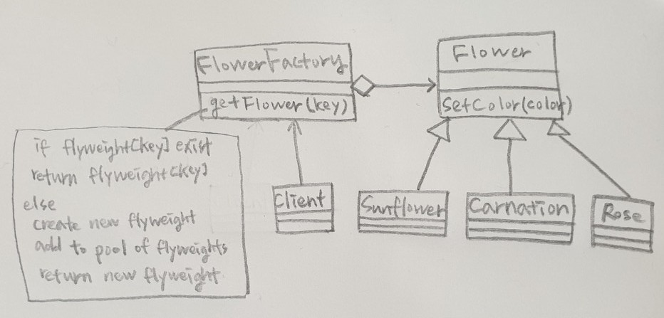

# Flyweight, Proxy

## Flyweight

* 동일하거나 유사한 객체들 사이에 데이터를 서로 공유하여 사용하도록 하는 디자인 패턴

### Java
```java
public abstract class Flower {
	String color;
	String origin;
	String season;
	
	public abstract void SetColor(String color);
}

public class Rose extends Flower {
	public Rose() {
		this.origin = "서아시아";
		this.season = "여름";
	}
	
	@Override
	public void SetColor(String color) {
		this.color = color;
		System.out.println("장미 - 색 : "+color+" 원산지 : "+origin + " 개화시기 : "+season);
	}
}

public class SunFlower extends Flower {
	public SunFlower() {
		this.origin = "북아메리카";
		this.season = "가을";
	}
	
	@Override
	public void SetColor(String color) {
		this.color = color;
		System.out.println("해바라기 - 색 : "+color+" 원산지 : "+origin + " 개화시기 : "+season);
	}
}

public class Carnation extends Flower {
	public Carnation() {
		this.origin = "지중해";
		this.season = "여름";
	}
	
	@Override
	public void SetColor(String color) {
		this.color = color;
		System.out.println("카네이션 - 색 : "+color+" 원산지 : "+origin + " 개화시기 : "+season);
	}
}

public class FlowerFactory {
	Map<String, Flower> m_flowers = new HashMap<String, Flower>();  //flyweights
	
	public Flower getFlower(String name) {
		Flower flower = null;
		if(m_flowers.containsKey(name)) {
			System.out.println(name + " is exist.");
			flower = m_flowers.get(name);
		} else {
			switch(name) {
			case "Rose" : 
				flower = new Rose();
				break;
			case "SunFlower" : 
				flower = new SunFlower();
				break;
			case "Carnation" :
				flower = new Carnation();
				break;
			}
			m_flowers.put(name, flower);
		}
		return flower;
	}
}

public static void main(String[] args) {
    FlowerFactory factory = new FlowerFactory();
	   
    Flower rose1 = factory.getFlower("Rose");
    rose1.SetColor("빨강");
    Flower rose2 = factory.getFlower("Rose");
    rose2.SetColor("노랑");
	   
    Flower carnation = factory.getFlower("Carnation");
    carnation.SetColor("빨강");
}

// 결과
장미 - 색 : 빨강 원산지 : 서아시아 개화시기 : 여름
Rose is exist.
장미 - 색 : 노랑 원산지 : 서아시아 개화시기 : 여름
카네이션 - 색 : 빨강 원산지 : 지중해 개화시기 : 여름
```
### C#
```cs
public abstract class Flower {
    protected string color;
    protected string origin;
    protected string season;

    public abstract void SetColor(string color);
}

public class Rose : Flower {
    public Rose() {
        origin = "서아시아";
        season = "여름";
    }

    public override void SetColor(string color) {
        this.color = color;
        Console.WriteLine("장미 - 색 : " + color + " 원산지 : " + origin + " 개화시기 : " + season);
    }
}

public class SunFlower : Flower {
    public SunFlower() {
        origin = "북아메리카";
        season = "가을";
    }

    public override void SetColor(string color) {
        this.color = color;
        Console.WriteLine("해바라기 - 색 : " + color + " 원산지 : " + origin + " 개화시기 : " + season);
    }
}

public class Carnation : Flower {
    public Carnation() {
        origin = "지중해";
        season = "여름";
    }

    public override void SetColor(string color) {
        this.color = color;
        Console.WriteLine("카네이션 - 색 : " + color + " 원산지 : " + origin + " 개화시기 : " + season);
    }
}

public class FlowerFactory {
    Dictionary<string, Flower> m_flowers = new Dictionary<string, Flower>();  //flyweights

    public Flower getFlower(string name) {
        Flower flower = null;
        if (m_flowers.ContainsKey(name)) {
            Console.WriteLine(name + " is exist.");
            flower = m_flowers[name];
        } else {
            switch (name) {
                case "Rose":
                    flower = new Rose();
                    break;
                case "SunFlower":
                    flower = new SunFlower();
                    break;
                case "Carnation":
                    flower = new Carnation();
                    break;
            }
            m_flowers.Add(name, flower);
        }
        return flower;
    }
}

static void Main(string[] args) {
    FlowerFactory factory = new FlowerFactory();

    Flower rose1 = factory.getFlower("Rose");
    rose1.SetColor("빨강");
    Flower rose2 = factory.getFlower("Rose");
    rose2.SetColor("노랑");

    Flower carnation = factory.getFlower("Carnation");
    carnation.SetColor("빨강");
}

//결과
장미 - 색 : 빨강 원산지 : 서아시아 개화시기 : 여름
Rose is exist.
장미 - 색 : 노랑 원산지 : 서아시아 개화시기 : 여름
카네이션 - 색 : 빨강 원산지 : 지중해 개화시기 : 여름
```
### C++
```cpp
class Flower {
protected:
	string color;
	string origin;
	string season;

public:
	virtual void SetColor(string color) = 0;
};

class Rose : public Flower {
public:
	Rose() {
		origin = "서아시아";
		season = "여름";
	}

	virtual void SetColor(string color) {
		this->color = color;
		cout << "장미 - 색 : " << color << " 원산지 : " << origin << " 개화시기 : " << season << endl;
	}
};

class SunFlower : public Flower {
public:
	SunFlower() {
		origin = "북아메리카";
		season = "가을";
	}

	virtual void SetColor(string color) {
		this->color = color;
		cout << "해바라기 - 색 : " << color << " 원산지 : " << origin << " 개화시기 : " << season << endl;
	}
};

class Carnation : public Flower {
public:
	Carnation() {
		origin = "지중해";
		season = "여름";
	}

	virtual void SetColor(string color) {
		this->color = color;
		cout << "카네이션 - 색 : " << color << " 원산지 : " << origin << " 개화시기 : " << season << endl;
	}
};

class FlowerFactory {
private:
	map<int, Flower *> m_flowers;  //flyweights

public:
	Flower* getFlower(int idx) {
		Flower* flower = NULL;
		if (m_flowers.find(idx) != m_flowers.end()) {
			cout << idx << " is exist." << endl;
			flower = m_flowers[idx];
		}
		else {
			switch (idx) {
			case 0:
				flower = new Rose();
				break;
			case 1:
				flower = new SunFlower();
				break;
			case 2:
				flower = new Carnation();
				break;
			}
			m_flowers.insert(make_pair(idx, flower));
		}
		return flower;
	}
};

int main() {
	FlowerFactory* factory = new FlowerFactory();

	Flower* rose1 = factory->getFlower(0);
	rose1->SetColor("빨강");
	Flower* rose2 = factory->getFlower(0);
	rose2->SetColor("노랑");

	Flower* carnation = factory->getFlower(2);
	carnation->SetColor("빨강");

	return 0;
}

//결과
장미 - 색 : 빨강 원산지 : 서아시아 개화시기 : 여름
0 is exist.
장미 - 색 : 노랑 원산지 : 서아시아 개화시기 : 여름
카네이션 - 색 : 빨강 원산지 : 지중해 개화시기 : 여름
```

### objective-c
```objc
@interface Flower : NSObject {
	NSString* m_color;
	NSString* m_origin;
	NSString* m_season;
    }

-(void) SetColor:(NSString*)color;
@end

@interface Rose : Flower
-(id)init;
@end

@interface SunFlower : Flower
-(id)init;
@end

@interface Carnation : Flower
-(id)init;
@end

@interface FlowerFactory : NSObject {
    NSMutableDictionary * m_flowers;
    }

-(Flower*) getFlower:(int)idx;
@end

@implementation Flower
@end

@implementation Rose
-(id)init {
    if(self == [super init]){
        m_origin = @"서아시아";
		m_season = @"여름";
    }
    return self;
}

-(void) SetColor:(NSString*)color {
    m_color = color;
    NSLog(@"장미 - 색 : %@ 원산지 : %@ 개화시기 : %@",m_color, m_origin, m_season);
}
@end

@implementation SunFlower
-(id)init {
    if(self == [super init]){
        m_origin = @"북아메리카";
		m_season = @"가을";
    }
    return self;
}

-(void) SetColor:(NSString*)color {
    m_color = color;
    NSLog(@"해바라기 - 색 : %@ 원산지 : %@ 개화시기 : %@",m_color, m_origin, m_season);
}
@end

@implementation Carnation
-(id)init {
    if(self == [super init]){
        m_origin = @"지중해";
		m_season = @"여름";
    }
    return self;
}

-(void) SetColor:(NSString*)color {
    m_color = color;
    NSLog(@"카네이션 - 색 : %@ 원산지 : %@ 개화시기 : %@",m_color, m_origin, m_season);
}
@end

@implementation FlowerFactory
-(Flower *) getFlower:(int)index{
    Flower* flower = nil;
    if((flower = [m_flowers objectForKey:index]) == nil){
        switch (index) {
			case 0:
				flower = [[Rose alloc] init];
				break;
			case 1:
			    flower = [[SunFlower alloc] init];
				break;
			case 2:
			    flower = [[Carnation alloc] init];
				break;
			}
			
			[m_flowers setObject:flower forKey:index];
    } else {
        NSLog(@"%d is exist.", index);
    }
    return flower;
}
@end

int main (int argc, const char * argv[])
{
    FlowerFactory* factory = [[FlowerFactory alloc] init];

	Flower* rose1 = [factory getFlower:0];
	[rose1 SetColor:@"빨강"];
	Flower* rose2 = [factory getFlower:0];
	[rose2 SetColor:@"노랑"];

	Flower* carnation = [factory getFlower:2];
	[carnation SetColor:@"노랑"];
    
    return 0;
}

//결과
2019-05-07 17:26:58.602 main[73948] 장미 - 색 : 빨강 원산지 : 서아시아 개화시기 : 여름
2019-05-07 17:26:58.603 main[73948] 장미 - 색 : 노랑 원산지 : 서아시아 개화시기 : 여름
2019-05-07 17:26:58.603 main[73948] 카네이션 - 색 : 노랑 원산지 : 지중해 개화시기 : 여름
```
* * *
  
## Proxy

* proxy : 대리자, 대변인
* 다른 개체에 대한 접근을 제어하기 위해 대리자를 제공
* 클라이언트가 어떤일을 요청하면 프록시가 대신 실제오브젝트의 일을 수행하고 반환값을 클라이언트에 전달


### java
```java
public interface IStore {
	void Sell(String shoes);
	void Buy(String shoes);
	String Reserve(String shoes);
}

public class ShoesStore implements IStore {
	@Override
	public void Sell(String shoes) {
		System.out.println("Sell : " + shoes);
	}
	
	@Override
	public void Buy(String shoes) {
		System.out.println("Buy : " + shoes);
	}
	
	@Override
	public String Reserve(String shoes) {
		return "Reserve : " + shoes;
	}
}

public class StoreProxy implements IStore {
	ShoesStore shoes_store = new ShoesStore();
	
	@Override
	public void Sell(String shoes) {
		shoes_store.Sell(shoes);
	}

	@Override
	public void Buy(String shoes) {
		shoes_store.Buy(shoes);
	}

	@Override
	public String Reserve(String shoes) {
		return shoes_store.Reserve(shoes);
	}
}

public static void main(String[] args) {
	StoreProxy proxy = new StoreProxy();
	proxy.Sell("운동화");
	proxy.Buy("슬리퍼");
	System.out.println(proxy.Reserve("샌들"));
}

//결과
Sell : 운동화
Buy : 슬리퍼
Reserve : 샌들
```

### C#
```cs
interface IStore {
	void Sell(string shoes);
	void Buy(string shoes);
	string Reserve(string shoes);
}

class ShoesStore : IStore {
	public void Sell(string shoes) {
		Console.WriteLine("Sell : " + shoes);
	}

	public void Buy(string shoes) {
		Console.WriteLine("Buy : " + shoes);
	}

	public string Reserve(string shoes) {
		return "Reserve : " + shoes;
	}
}

class StoreProxy : IStore {
	ShoesStore shoes_store = new ShoesStore();

	public void Sell(string shoes) {
		shoes_store.Sell(shoes);
	}

	public void Buy(string shoes) {
		shoes_store.Buy(shoes);
	}

	public string Reserve(string shoes) {
		return shoes_store.Reserve(shoes);
	}
}

static void Main(string[] args) {
	StoreProxy proxy = new StoreProxy();
	proxy.Sell("운동화");
	proxy.Buy("슬리퍼");
	Console.WriteLine(proxy.Reserve("샌들"));
}

//결과
Sell : 운동화
Buy : 슬리퍼
Reserve : 샌들
```
### C++
```cpp
class IStore {
public:
	virtual void Sell(string shoes) = 0;
	virtual void Buy(string shoes) = 0;
	virtual string Reserve(string shoes) = 0;
};

class ShoesStore : IStore {
public:
	virtual void Sell(string shoes) {
		cout << "Sell : " << shoes << endl;
	}
	virtual void Buy(string shoes) {
		cout << "Buy : " << shoes << endl;
	}

	virtual string Reserve(string shoes) {
		return "Reserve : " + shoes;
	}
};

class StoreProxy : IStore {
	ShoesStore* shoes_store = new ShoesStore();

public:
	virtual void Sell(string shoes) {
		shoes_store->Sell(shoes);
	}

	virtual void Buy(string shoes) {
		shoes_store->Buy(shoes);
	}

	virtual string Reserve(string shoes) {
		return shoes_store->Reserve(shoes);
	}
};

int main() {
	StoreProxy* proxy = new StoreProxy();
	proxy->Sell("운동화");
	proxy->Buy("슬리퍼");
	cout << proxy->Reserve("샌들") << endl;

	return 0;
}

//결과
Sell : 운동화
Buy : 슬리퍼
Reserve : 샌들
```

### Objective-C
```objc
@protocol IStore

-(void)Sell:(NSString*)shoes;
-(void)Buy:(NSString*)shoes;
-(NSString *)Reserve:(NSString*)shoes;

@end

@interface ShoesStore : NSObject<IStore>
@end

@interface StoreProxy : NSObject<IStore> {
    ShoesStore* shoes_store;
}
@end

@implementation ShoesStore

-(void)Sell:(NSString*)shoes{
    NSLog(@"Sell : %@", shoes);
}

-(void)Buy:(NSString*)shoes {
    NSLog(@"Buy : %@", shoes);
}

-(NSString *)Reserve:(NSString*)shoes {
    return [NSString stringWithFormat: @"Reserve :  %@", shoes];
}

@end

@implementation StoreProxy

-(void)Sell:(NSString*)shoes{
	if(shoes_store == nil){
		shoes_store = [[ShoesStore alloc] init];
	}
    [shoes_store Sell:shoes];
}

-(void)Buy:(NSString*)shoes{
	if(shoes_store == nil){
		shoes_store = [[ShoesStore alloc] init];
	}
    [shoes_store Buy:shoes];
}

-(NSString *)Reserve:(NSString*)shoes{
	if(shoes_store == nil){
		shoes_store = [[ShoesStore alloc] init];
	}
    return [shoes_store Reserve:shoes];
}

@end

int main (int argc, const char * argv[]) {
   	StoreProxy* proxy =  [[StoreProxy alloc] init];
   	[proxy Sell:@"운동화"];
   	[proxy Buy:@"슬리퍼"];
   	NSLog([proxy Reserve:@"샌들"]);
   return 0;
}
```