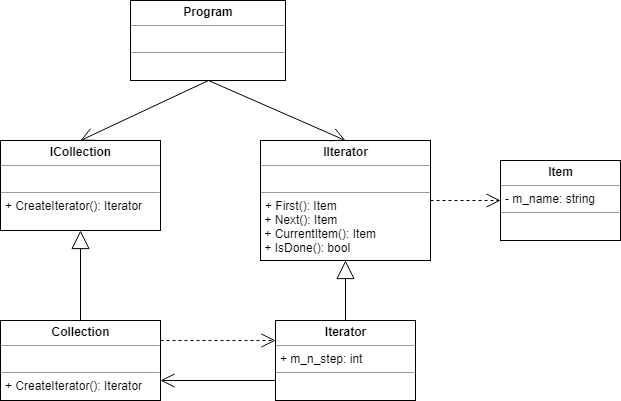

# Iterator

* Behavioral
* 객체 집합에 순차적으로 접근하는 방법을 제공하는 패턴
* 

## Class Diagram

* 증가량을 조절할 수 있는 `Iterator`를 만들고 싶다.



## Code

### C#

```cs
class Item {
	string m_name;
	
	public Item(string name) {
		this.m_name = name;
	}

	public string Name {
		get { return m_name; }
	}
}

interface IAbstractCollection {
	Iterator CreateIterator();
}

class Collection : IAbstractCollection {
	ArrayList m_l_items = new ArrayList();

	public Iterator CreateIterator() {
		return new Iterator(this);
	}
	
	public int Count {
		get { return m_l_items.Count; }
	}
	
	public object this[int index] {
		get { return m_l_items[index]; }
		set { m_l_items.Add(value); }
	}
}

interface IAbstractIterator {
	Item First();
	Item Next();
	bool IsDone { get; }
	Item CurrentItem { get; }
}

class Iterator : IAbstractIterator {
	Collection m_collection;
	int m_n_current = 0;
	public int m_n_step = 1;
	
	public Iterator(Collection collection) {
		m_collection = collection;
	}
	
	public Item First() {
		m_n_current = 0;
		return m_collection[m_n_current] as Item;
	}
	
	public Item Next() {
		m_n_current += m_n_step;
		if (!IsDone)
			return m_collection[m_n_current] as Item;
		else
			return null;
	}
	
	public Item CurrentItem {
		get { return m_collection[m_n_current] as Item; }
	}
	
	public bool IsDone {
		get { return m_n_current >= m_collection.Count; }
	}
}

class Program {
	static void Main(string[] args) {
		Collection collection = new Collection();
		collection[0] = new Item("Item 0");
		collection[1] = new Item("Item 1");
		collection[2] = new Item("Item 2");
		collection[3] = new Item("Item 3");
		collection[4] = new Item("Item 4");
		collection[5] = new Item("Item 5");
		collection[6] = new Item("Item 6");
		collection[7] = new Item("Item 7");
		collection[8] = new Item("Item 8");

		Iterator iterator = collection.CreateIterator();            
		iterator.m_n_step = 2;

		Console.WriteLine("Start Iterating over collection:");

		for (Item item = iterator.First(); !iterator.IsDone; item = iterator.Next()) {
			Console.WriteLine(item.Name);
		}
	}
}

// output
Start Iterating over collection:
Item 0
Item 2
Item 4
Item 6
Item 8
```

### C++

```cpp

```

### Java

```java

```

### Objective-c

```objc

```

### python

```python

```