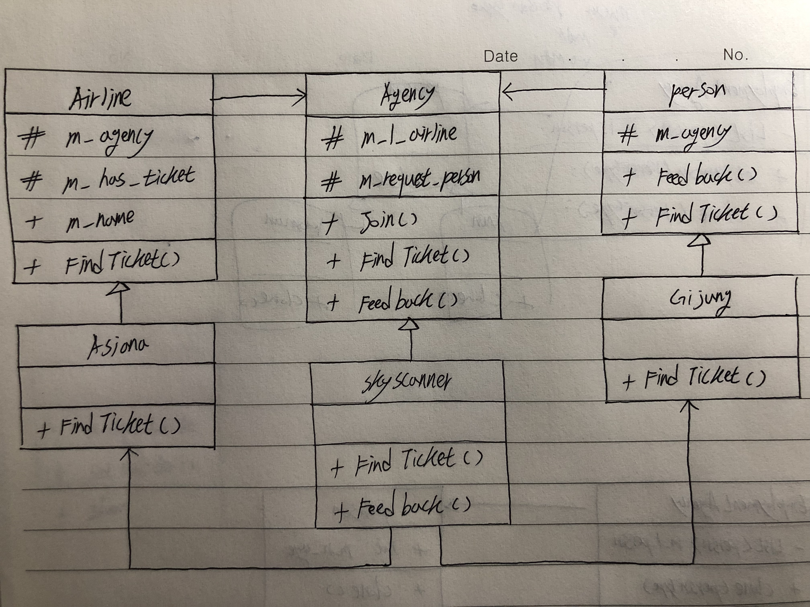

# Mediator

+ 객체들간의 참조를 중재자 내부에서 처리하여 의존성을 줄이려는 의도의 패턴.

## Diagram

+ 항공사와 사람간의 티켓 구매 가능 판단을 대행업체를 통하도록 하는 구성.

  

## Code

`[C# Code]`

```csharp
using System;
using System.Collections.Generic;

// Colleague
abstract class Airline {
	protected Agency m_agency;		// Mediator
	protected string m_has_ticket;	// 보유 티켓
	public string m_name;			// 항공사 이름
	
	public abstract void FindTicket(string country);
}

// ConcreteColleague
class Asiana : Airline {
	public Asiana(Agency agency) {
		m_agency = agency;
		m_has_ticket = "canada";
		m_name = "아시아나";
	}
	
	public override void FindTicket(string country) {
		m_agency.Feedback(this, m_has_ticket == country);
	}
}

// Colleague
abstract class Person {
	protected Agency m_agency;		// Mediator
	
	public void Feedback(string msg) {
		Console.WriteLine(msg);
	}
	
	public abstract void FindTicket(string country);
}

// ConcreteColleague
class Gijung : Person {
	public Gijung(Agency agency) {
		m_agency = agency;
	}
	
	public override void FindTicket(string country) {
		m_agency.FindTicket(country, this);
	}
}

// Mediator
abstract class Agency {
	protected List<Airline> m_l_airline = new List<Airline>();	// 항공사 정보
	protected Person m_request_person;							// 요청한 사람
	
	// 항공사 저장
	public void Join(Airline airline) {
		m_l_airline.Add(airline);
	}
	
	public abstract void FindTicket(string country, Person person);	// 해당 항공사에 티켓이 있는지 요청
	public abstract void Feedback(Airline airline, bool b_exist);	// 항공사로부터 티켓 여부를 확인
}

// ConcreteMediator
class SkyScanner : Agency {
	public override void FindTicket(string country, Person person) {
		m_request_person = person;
		
		for(int idx = 0; idx < m_l_airline.Count; idx++) {
			m_l_airline[idx].FindTicket(country);
		}
	}
	
	public override void Feedback(Airline airline, bool b_exist) {
		string msg = "";
		
		if(b_exist) {
			msg = airline.m_name + "항공사는 티켓이 있습니다.";
		} else {
			msg = airline.m_name + "항공사는 티켓이 없습니다.";
		}
		
		m_request_person.Feedback(msg);
	}
}

public class Program {
	public static void Main() {
		SkyScanner scanner = new SkyScanner();	// 항공사 예약 대행 업체
		scanner.Join(new Asiana(scanner));
		
		Gijung gijung = new Gijung(scanner);
		gijung.FindTicket("canada");
	}
}
```

`[Java Code]`

```java
import java.util.List;
import java.util.ArrayList;

// Colleague
abstract class Airline {
	protected Agency m_agency;		// Mediator
	protected String m_has_ticket;	// 보유 티켓
	public String m_name;			// 항공사 이름
	
	public abstract void FindTicket(String country);
}

// ConcreteColleague
class Asiana extends Airline {
	public Asiana(Agency agency) {
		m_agency = agency;
		m_has_ticket = "canada";
		m_name = "아시아나";
	}
	
	@Override
	public void FindTicket(String country) {
		m_agency.Feedback(this, m_has_ticket == country);
	}
}

// Colleague
abstract class Person {
	protected Agency m_agency;		// Mediator
	
	public void Feedback(String msg) {
		System.out.println(msg);
	}
	
	public abstract void FindTicket(String country);
}

// ConcreteColleague
class Gijung extends Person {
	public Gijung(Agency agency) {
		m_agency = agency;
	}
	
	@Override
	public void FindTicket(String country) {
		m_agency.FindTicket(country, this);
	}
}

// Mediator
abstract class Agency {
	protected List<Airline> m_l_airline = new ArrayList<Airline>();    // 항공사 정보
	protected Person m_request_person;		                           // 요청한 사람
	
	// 항공사 저장
	public void Join(Airline airline) {
		m_l_airline.add(airline);
	}
	
	public abstract void FindTicket(String country, Person person);	// 해당 항공사에 티켓이 있는지 요청
	public abstract void Feedback(Airline airline, boolean b_exist);	// 항공사로부터 티켓 여부를 확인
}

// ConcreteMediator
class SkyScanner extends Agency {
    @Override
	public void FindTicket(String country, Person person) {
		m_request_person = person;
		
		for(int idx = 0; idx < m_l_airline.size(); idx++) {
			m_l_airline.get(idx).FindTicket(country);
		}
	}
	
	@Override
	public void Feedback(Airline airline, boolean b_exist) {
		String msg = "";
		
		if(b_exist) {
			msg = airline.m_name + "항공사는 티켓이 있습니다.";
		} else {
			msg = airline.m_name + "항공사는 티켓이 없습니다.";
		}
		
		m_request_person.Feedback(msg);
	}
}

public class MainClass{
     public static void main(String []args){
        SkyScanner scanner = new SkyScanner();	// 항공사 예약 대행 업체
		scanner.Join(new Asiana(scanner));
		
		Gijung gijung = new Gijung(scanner);
		gijung.FindTicket("canada");
     }
}
```

`[Objective C Code]`

```objc
[.h]

@class Person;

// Mediator
@interface Agency : NSObject {
@protected
    NSArray *m_l_airline;       // 항공사 정보
    Person *m_request_person;   // 요청한 사람
}

- (void) Join:airline;
- (void) FindTicket:country person:person;	// 해당 항공사에 티켓이 있는지 요청
- (void) Feedback:airline b_exist:(BOOL)b_exist;	// 항공사로부터 티켓 여부를 확인
@end

// ConcreteMediator
@interface SkyScanner : Agency
@end

// Colleague
@interface Person : NSObject {
@protected
    Agency *m_agency;   // Mediator
}

- (void) Feedback:msg;
- (void) FindTicket:country;
@end

// ConcreteColleague
@interface Gijung : Person
- (id) initWithName:scanner;
@end

// Colleague
@interface Airline : NSObject {
@protected
    Agency *m_agency;		// Mediator
    NSString *m_has_ticket;	// 보유 티켓
    
@public
    NSString *m_name;		// 항공사 이름
}

- (void) FindTicket:country;
@end

// ConcreteColleague
@interface Asiana : Airline
- (id) initWithName:scanner;
@end
```

```objc
[.m]

// Mediator
@implementation Agency
- (void) Join:airline {
    [m_l_airline arrayByAddingObject:airline];
}

- (void) FindTicket:country person:person{}
- (void) Feedback:airline b_exist:(BOOL)b_exist{}
@end

// Colleague
@implementation Airline
- (void) FindTicket:country {}
@end

// ConcreteMediator
@implementation SkyScanner
- (void) FindTicket:country person:person{
    m_request_person = person;
    
    for(int idx = 0; idx < [m_l_airline count]; idx++) {
        [[m_l_airline objectAtIndex: idx] FindTicket:country];
    }
}

- (void) Feedback:(Airline*)airline b_exist:(BOOL)b_exist{
    NSString *msg;
    if(b_exist) {
        msg = [airline->m_name stringByAppendingString:@"항공사는 티켓이 있습니다."];
    } else {
        msg = [airline->m_name stringByAppendingString:@"항공사는 티켓이 없습니다."];
    }
    
    [m_request_person Feedback:msg];
}
@end

// Colleague
@implementation Person

- (void) Feedback:msg{
    NSLog(@"%@", msg);
}

- (void) FindTicket:country{}
@end

// ConcreteColleague
@implementation Gijung
- (id) initWithName:scanner {
    self = [super init];
    if (self) {
        m_agency = scanner;
    }
    return self;
}

- (void) FindTicket:country{
    [m_agency FindTicket:country person:self];
}
@end

// ConcreteColleague
@implementation Asiana
- (id) initWithName:scanner {
    self = [super init];
    if (self) {
        m_agency = scanner;
        m_has_ticket = @"canada";
        m_name = @"아시아나";
    }
    return self;
}

- (void) FindTicket:country {
    [m_agency Feedback:self b_exist:[m_has_ticket isEqual:country]];
}
@end

int main(int argc, char * argv[]) {
    SkyScanner *scanner = [[SkyScanner alloc] init];	// 항공사 예약 대행 업체
    [scanner Join:[[Asiana alloc] initWithName:scanner]];
    
    Gijung *gijung = [[Gijung alloc] initWithName:scanner];
    [gijung FindTicket:@"canada"];
}
```

`[Python Code]`

```python
# Colleague
class Airline:
	m_agency = "";		# Mediator
	m_has_ticket = "";	# 보유 티켓
	m_name = "";		# 항공사 이름
	
	def FindTicket(self, country):
	    pass;

# ConcreteColleague
class Asiana(Airline):
    def __init__(self, agency):
        self.m_agency = agency;
        self.m_has_ticket = "canada";
        self.m_name = "아시아나";
        
    def FindTicket(self, country):
        self.m_agency.Feedback(self, self.m_has_ticket == country);

# Colleague
class Person:
	m_agency = "";		# Mediator
	
	def Feedback(self, msg):
		print(msg);
		
	def FindTicket(self, country):
	    pass;

# ConcreteColleague
class Gijung(Person):
    def __init__(self, agency):
        self.m_agency = agency;
        
    def FindTicket(self, country):
	    self.m_agency.FindTicket(country, self);

# Mediator
class Agency:
	m_l_airline = [];	        # 항공사 정보
	m_request_person = "";		# 요청한 사람
	
	# 항공사 저장
	def Join(self, airline):
		self.m_l_airline.append(airline);
	
	def FindTicket(self, country, person):	# 해당 항공사에 티켓이 있는지 요청
	    pass;
	    
	def Feedback(self, airline, b_exist):	# 항공사로부터 티켓 여부를 확인
	    pass;

# ConcreteMediator
class SkyScanner(Agency):
	def FindTicket(self, country, person):
		self.m_request_person = person;
		
		for idx in range(len(self.m_l_airline)):
		    self.m_l_airline[idx].FindTicket(country);
	
	def Feedback(self, airline, b_exist):
		msg = "";
		
		if b_exist:
			msg = airline.m_name + "항공사는 티켓이 있습니다.";
		else:
		    msg = airline.m_name + "항공사는 티켓이 없습니다.";
		
		self.m_request_person.Feedback(msg);

# Main

scanner = SkyScanner();	# 항공사 예약 대행 업체
scanner.Join(Asiana(scanner));
		
gijung = Gijung(scanner);
gijung.FindTicket("canada");
```

`[C++ Code]`

```cpp
#include <iostream>
#include <list>

using namespace std;

class Agency;

// Colleague
class Airline {
protected:
    Agency *m_agency;		// Mediator
	string m_has_ticket;	// 보유 티켓
	
public:
	string m_name;			// 항공사 이름
	virtual void FindTicket(string country) = 0;
};

// ConcreteColleague
class Asiana : public Airline {
public:
    Asiana(Agency *agency) {
		m_agency = agency;
		m_has_ticket = "canada";
		m_name = "아시아나";
	}
	
	virtual void FindTicket(string country) {
		m_agency->Feedback(this, m_has_ticket == country);
	}
};

// Colleague
class Person {
protected:
    Agency *m_agency;		// Mediator
	
public:
	void Feedback(string msg) {
	    cout << msg;
	}
	
	virtual void FindTicket(string country) = 0;
};

// ConcreteColleague
class Gijung : Person {
public:
    Gijung(Agency *agency) {
		m_agency = agency;
	}
	
	virtual void FindTicket(string country) {
		m_agency->FindTicket(country, this);
	}
};

// Mediator
class Agency {
protected:
	list<Airline> *m_l_airline;	// 항공사 정보
    Person *m_request_person;   // 요청한 사람
	
public:
	// 항공사 저장
	void Join(Airline *airline) {
		m_l_airline.push_back(airline);
	}
	
	virtual void FindTicket(string country, Person *person) = 0;	// 해당 항공사에 티켓이 있는지 요청
	virtual void Feedback(Airline *airline, bool b_exist) = 0;	    // 항공사로부터 티켓 여부를 확인
};

// ConcreteMediator
class SkyScanner : public Agency {
public:
	virtual void FindTicket(string country, Person *person) {
		m_request_person = person;
		
		for(int idx = 0; idx < m_l_airline.size(); idx++) {
		    list<Airline>::iterator air_line = m_l_airline.begin() + idx;
		    air_line.FindTicket(country);
		}
	}
	
	virtual void Feedback(Airline *airline, bool b_exist) {
		string msg = "";
		
		if(b_exist) {
			msg = airline->m_name + "항공사는 티켓이 있습니다.";
		} else {
			msg = airline->m_name + "항공사는 티켓이 없습니다.";
		}
		
		m_request_person->Feedback(msg);
	}
};

int main() {
    SkyScanner *scanner = new SkyScanner();	// 항공사 예약 대행 업체
	scanner->Join(new Asiana(scanner));
		
	Gijung *gijung = new Gijung(scanner);
	gijung->FindTicket("canada");
}
```