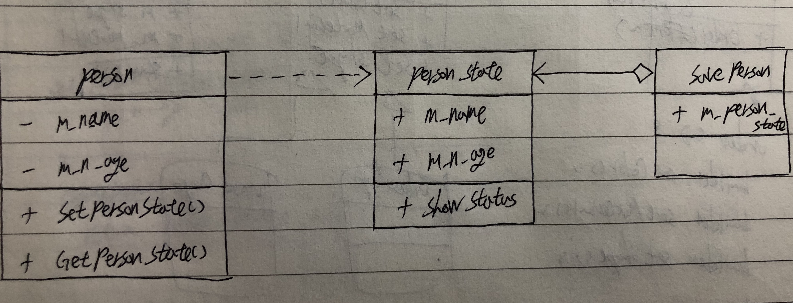

# Memento

* Behavioral
* 캡슐화를 위반하지 않고 이전 상태로 복원하기 위한 패턴.
* careTacker : 이전에 상태들이 저장되어야 하는 것들을 모아서 관리하기 위한 용도.

## Diagram

+ 여러 상태의 Person을 만들다 최초 상태의 Person을 만들도록 구성.



## Code

`[C# Code]`

```csharp
using System;

// Originator
class Person {
	string m_name;
	int m_n_age;
	
	// 상태 저장 함수
	public void SetPersonState(string name, int n_age) {
		m_name = name;
		m_n_age = n_age;
	}
	
	// 특정 상태를 갖는 Person 객체를 반환하는 함수
	public PersonState GetPersonState() {
		return new PersonState(m_name, m_n_age);
	}
}

// Menento
class PersonState {
	public string m_name;
	public int m_n_age;
	
	public PersonState(string name, int n_age) {
		m_name = name;
		m_n_age = n_age;
	}
	
	public void ShowStatus() {
		Console.WriteLine("이름 : " + m_name + ", 나이 : " + m_n_age);
	}
}

// Caretaker
class SavePerson {
	public PersonState m_person_state;
}

public class Program {
	public static void Main() {
		Person person = new Person();
		person.SetPersonState("기정", 29);
		
		// 최초 설정 정보의 Person 저장
		SavePerson save_person = new SavePerson();
		save_person.m_person_state = person.GetPersonState();
		save_person.m_person_state.ShowStatus();
		
		// 새로운 정보로 Person 제작
		person.SetPersonState("홍홍", 35);
		PersonState person_state = person.GetPersonState();
		person_state.ShowStatus();
		
		// 기존 Person 정보로 초기화
		person.SetPersonState(save_person.m_person_state.m_name, save_person.m_person_state.m_n_age);
		person_state = person.GetPersonState();
		person_state.ShowStatus();
	}
}
```

`[Java Code]`

```java
// Originator
class Person {
	String m_name;
	int m_n_age;
	
	// 상태 저장 함수
	public void SetPersonState(String name, int n_age) {
		m_name = name;
		m_n_age = n_age;
	}
	
	// 특정 상태를 갖는 Person 객체를 반환하는 함수
	public PersonState GetPersonState() {
		return new PersonState(m_name, m_n_age);
	}
}

// Menento
class PersonState {
	public String m_name;
	public int m_n_age;
	
	public PersonState(String name, int n_age) {
		m_name = name;
		m_n_age = n_age;
	}
	
	public void ShowStatus() {
		System.out.println("이름 : " + m_name + ", 나이 : " + m_n_age);
	}
}

// Caretaker
class SavePerson {
	public PersonState m_person_state;
}

public class MainClass{
     public static void main(String []args){
        Person person = new Person();
		person.SetPersonState("기정", 29);
		
		// 최초 설정 정보의 Person 저장
		SavePerson save_person = new SavePerson();
		save_person.m_person_state = person.GetPersonState();
		save_person.m_person_state.ShowStatus();
		
		// 새로운 정보로 Person 제작
		person.SetPersonState("홍홍", 35);
		PersonState person_state = person.GetPersonState();
		person_state.ShowStatus();
		
		// 기존 Person 정보로 초기화
		person.SetPersonState(save_person.m_person_state.m_name, save_person.m_person_state.m_n_age);
		person_state = person.GetPersonState();
		person_state.ShowStatus();
     }
}
```

`[Objective C Code]`

```objc
[.h]

// Menento
@interface PersonState : NSObject  {
@public
    NSString* m_name;
    int m_n_age;
}

- (id)initWithName:name n_age:(int)n_age;
- (void) ShowState;
@end

// Originator
@interface Person : NSObject  {
@public
    NSString* m_name;
    int m_n_age;
}

- (void) SetPersonState:name n_age:(int) n_age;
- (PersonState *)GetPersonState;
@end

// Caretaker
@interface SavePerson : NSObject  {
@public
    PersonState* m_person_state;
}
@end
```

```objc
[.m]

// Menento
@implementation PersonState
-(id)initWithName:name n_age:(int)n_age {
    self = [super init];
    if (self) {
        m_name = name;
        m_n_age = n_age;
    }
    return self;
}

- (void) ShowState {
    NSLog(@"이름 : %@ , 나이 : %d", m_name, m_n_age);
}
@end

// Originator
@implementation Person
// 상태 저장 함수
- (void) SetPersonState:name n_age:(int) n_age {
    m_name = name;
    m_n_age = n_age;
}

// 특정 상태를 갖는 Person 객체를 반환하는 함수
- (PersonState *)GetPersonState {
    return [[PersonState alloc] initWithName:m_name n_age:m_n_age];
}
@end

// Caretaker
@implementation SavePerson
@end

int main(int argc, char * argv[]) {
    Person *person = [[Person alloc] init];
    [person SetPersonState:@"기정" n_age:29];
    
    // 최초 설정 정보의 Person 저장
    SavePerson *save_person = [[SavePerson alloc] init];
    save_person->m_person_state = [person GetPersonState];
    [save_person->m_person_state ShowState];
    
    // 새로운 정보로 Person 제작
    [person SetPersonState:@"홍홍" n_age:35];
    PersonState *person_state = [person GetPersonState];
    [person_state ShowState];
    
    // 기존 Person 정보로 초기화
    [person SetPersonState:save_person->m_person_state->m_name n_age:save_person->m_person_state->m_n_age];
    person_state = [person GetPersonState];
    [person_state ShowState];
}
```

`[Python Code]`

```python
# Originator
class Person:
	m_name = "";
	m_n_age = 0;
	
	# 상태 저장 함수
	def SetPersonState(self, name, n_age):
		self.m_name = name;
		self.m_n_age = n_age;
	
	# 특정 상태를 갖는 Person 객체를 반환하는 함수
	def GetPersonState(self):
		return PersonState(self.m_name, self.m_n_age);

# Menento
class PersonState:
	m_name = "";
	m_n_age = 0;
	
	def __init__(self, name, n_age):
	    self.m_name = name;
	    self.m_n_age = n_age;
	
	def ShowStatus(self):
	    print("이름 : " + self.m_name + ", 나이 : " + self.m_n_age);

# Caretaker
class SavePerson:
	m_person_state = 0;

# Main
person = Person();
person.SetPersonState("기정", 29);
		
# 최초 설정 정보의 Person 저장
save_person = SavePerson();
save_person.m_person_state = person.GetPersonState();
save_person.m_person_state.ShowStatus();
		
# 새로운 정보로 Person 제작
person.SetPersonState("홍홍", 35);
person_state = person.GetPersonState();
person_state.ShowStatus();
		
# 기존 Person 정보로 초기화
person.SetPersonState(save_person.m_person_state.m_name, save_person.m_person_state.m_n_age);
person_state = person.GetPersonState();
person_state.ShowStatus();
```

`[C++ Code]`

```cpp
#include <iostream>

using namespace std;

// Menento
class PersonState {
public:
	char* m_name;
	int m_n_age;
	
	PersonState(char* name, int n_age) {
		m_name = name;
		m_n_age = n_age;
	}
	
	void ShowStatus() {
		cout<< "이름 : " << m_name << ", 나이 : " << m_n_age << "\n";
	}
};

// Originator
class Person {
	char* m_name;
	int m_n_age;
	
public:
	// 상태 저장 함수
	void SetPersonState(char* name, int n_age) {
		m_name = name;
		m_n_age = n_age;
	}
	
	// 특정 상태를 갖는 Person 객체를 반환하는 함수
	PersonState* GetPersonState() {
		return new PersonState(m_name, m_n_age);
	}
};

// Caretaker
class SavePerson {
public:
	PersonState *m_person_state;
};

int main() {
    Person *person = new Person();
	person->SetPersonState("기정", 29);
		
	// 최초 설정 정보의 Person 저장
	SavePerson *save_person = new SavePerson();
	save_person->m_person_state = person->GetPersonState();
	save_person->m_person_state->ShowStatus();
		
	// 새로운 정보로 Person 제작
	person->SetPersonState("홍홍", 35);
	PersonState *person_state = person->GetPersonState();
	person_state->ShowStatus();
		
	// 기존 Person 정보로 초기화
	person->SetPersonState(save_person->m_person_state->m_name, save_person->m_person_state->m_n_age);
	person_state = person->GetPersonState();
	person_state->ShowStatus();
}
```