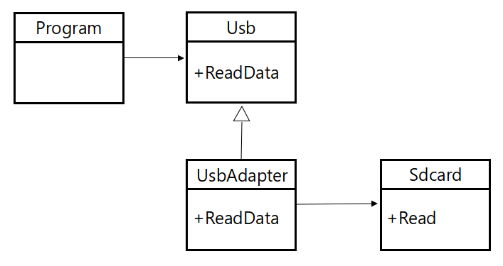
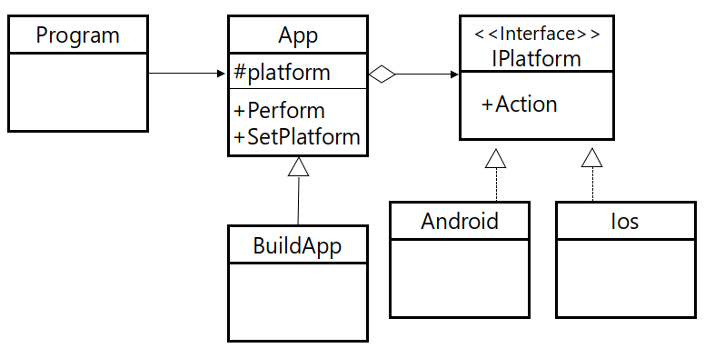
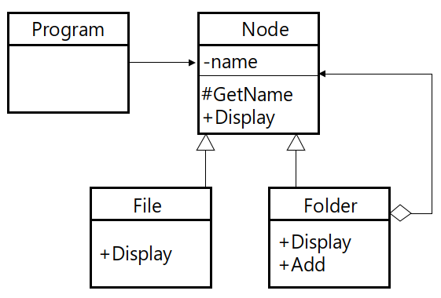

# Adapter pattern

클래스의 인터페이스를 다른 인터페이스로 변환하는 패턴, 어댑터 패턴을 사용함으로서 호환되지 않는 두 클래스를 동작하게 할 수 있다.



## Code

### C#

```csharp
class Usb {
    public virtual void ReadData() {
        Console.WriteLine("USB : ReadData()");
    }
}

class Sdcard {
    public void Read() {
        Console.WriteLine("SDCard : Read()");
    }
}

class UsbAdapter : Usb {
    Sdcard sd_card = new Sdcard();

    public override void ReadData() {
        sd_card.Read();
    }
}

class Program {
    static void Main(string[] args) {
        Usb usb = new UsbAdapter();
        usb.ReadData();
    }
}
```

### C++

```cpp
class Usb {
public:
	virtual void ReadData() {
		cout << "USB : ReadData()" << endl;
	}
};

class Sdcard {
public:
	void Read() {
		cout << "SDCard : Read()" << endl;
	}
};

class UsbAdapter : public Usb {
private:
	Sdcard *sd_card = new Sdcard();
public:
	void ReadData() {
		sd_card->Read();
	}
};

int main() {
	Usb *usb = new UsbAdapter();
	usb->ReadData();
}
```

### Java

```java
class Usb {
	public void ReadData() {
		System.out.println("USB : ReadData()");
	}
}

class Sdcard {
	public void Read() {
		System.out.println("SdCard : Read()");
	}
}

class UsbAdapter extends Usb {
	Sdcard sd_card = new Sdcard();
	
	@Override
	public void ReadData() {
		sd_card.Read();
	}
}

public class Main {
	public static void main(String args[]) {
		Usb usb = new UsbAdapter();
		usb.ReadData();
	}
}
```

### Objective-C

```objc
@protocol Usb<NSObject>
-(void)ReadData;
@end

@interface Usb : NSObject
@end
    
@interface Sdcard : NSObject
-(void)Read;
@end
    
@interface UsbAdapter : NSObject<Usb> {
    Sdcard *sdcard;
}
-(void)ReadData;
@end

@implementation Sdcard
-(void)Read {
    NSLog(@"Sdcard : Read()");
}
@end
    
@implementation Usb
@end

@implementation UsbAdapter
-(void)ReadData {
    sdcard = [[Sdcard alloc] init];
    [sdcard Read];
}
@end

int main (int argc, const char * argv[])
{
    UsbAdapter *adapter = [[UsbAdapter alloc] init];
    [adapter ReadData];
    
    return 0;
}
```

### Python

```python
class Usb:
    def ReadData():
        print("USB : ReadData()");
        
class Sdcard:
    def Read():
       print("SDCard : Read()");
       
class UsbAdapter(Usb):
    def ReadData():
        Sdcard.Read();
        
UsbAdapter.ReadData();
```

# Bridge Pattern

클래스의 세부 구현을 독립적으로 작동시키기 위해 구현을 추상화한 패턴



## Code

### C#

```csharp
interface IPlatform {
    void Action();
}

class Android : IPlatform {
    public void Action() {
        Console.WriteLine("Android : Action()");
    }
}

class Ios : IPlatform {
    public void Action() {
        Console.WriteLine("Ios : Action()");
    }
}

abstract class App {
    protected IPlatform m_platform;

    public abstract void Perform();

    public void SetPlatform(IPlatform platform) {
        m_platform = platform;
    }
}

class BuildApp : App {
    public override void Perform() {
        Console.WriteLine("BuildApp : Perform()");
        m_platform.Action();
    }
}

class Program {
    static void Main(string[] args) {
        BuildApp app = new BuildApp();
        app.SetPlatform(new Android());
        app.Perform();

        app.SetPlatform(new Ios());
        app.Perform();
    }
}
```

### C++

```cpp
class IPlatform {
public:
	virtual void Action() = 0;
};

class Android : public IPlatform {
public:
	void Action() {
		cout << "Android : Action()" << endl;
	}
};

class Ios : public IPlatform {
public:
	void Action() {
		cout << "Ios : Action()" << endl;
	}
};

class App {
public:
	IPlatform *m_platform;

	virtual void Perform() = 0;
	void SetPlatform(IPlatform *platform) {
		m_platform = platform;
	}
};

class BuildApp : public App {
public:
	void Perform() {
		cout << "BuildApp : Perform()" << endl;
		m_platform->Action();
	}
};

int main() {
	BuildApp *app = new BuildApp();
	app->SetPlatform(new Android());
	app->Perform();

	app->SetPlatform(new Ios());
	app->Perform();
}
```

### Java

```java
interface IPlatform {
	void Action();
}

class Android implements IPlatform {
	public void Action() {
		System.out.println("Android : Action()");
	}
}

class Ios implements IPlatform {
	public void Action() {
		System.out.println("Ios : Action()");
	}
}

abstract class App {
	protected IPlatform m_platform;
	
	public abstract void Perform();
	
	public void SetPlatform(IPlatform platform) {
		m_platform = platform;
	}
}

class BuildApp extends App {
	@Override
	public void Perform() {
		System.out.println("BuildApp : Perform()");
		m_platform.Action();
	}
}

public class Main {
	public static void main(String args[]) {
		BuildApp app = new BuildApp();
		app.SetPlatform(new Android());
		app.Perform();
		
		app.SetPlatform(new Ios());
		app.Perform();		
	}
}
```

### Objective-C

```objc
#import <Foundation/Foundation.h>

@protocol IPlatform<NSObject>
@required
-(void) Action;
@end
    
@interface Android : NSObject<IPlatform>
@end

@implementation Android
-(void)Action {
    NSLog(@"Android : Action()");
}
@end

@interface Ios : NSObject<IPlatform>
@end

@implementation Ios
-(void)Action {
    NSLog(@"Ios : Action()");
}
@end

@protocol App<NSObject>
@required
-(void)Perform;
@end

@interface BuildApp : NSObject<App> {
    id<IPlatform> platform;
}
@property (assign) id<IPlatform> platform;
-(void) Perform;
@end

@implementation BuildApp
@synthesize platform;
-(void) Perform {
    [platform Action];
}
@end

int main (int argc, const char * argv[])
{
    Android *android = [[Android alloc] init];
    Ios *ios = [[Ios alloc] init];
    BuildApp *app = [[BuildApp alloc] init];

    [app setPlatform:android];
    [app Perform];
    [app setPlatform:ios];
    [app Perform];

    return 0;
}
```

### Python

```python
from abc import *

class IPlatform:
    @abstractmethod
    def Action(self):
        pass
        
class Android(IPlatform):
    def Action(self):
        print("Android : Action()");
        
class Ios(IPlatform):
    def Action(self):
        print("Ios : Action()");
        
class App:
    def SetPlatform(self, target):
        self.platform = target;
    
    @abstractmethod
    def Perform(self):
        pass
        
class BuildApp(App):
    def Perform(self):
        self.platform.Action();
        
app = BuildApp();
app.SetPlatform(Android());
app.Perform();

app.SetPlatform(Ios());
app.Perform();
```

# Composite Pattern

단일 객체와 객체들의 집합에 대한 처리를 동일하게 수행하기 위한 패턴, 컴포지트 패턴은 트리 구조로 구성된다.



## Code

### C#

```csharp
abstract class Node {
    string name;

    public Node(string name) {
        this.name = name;
    }

    protected string GetName() {
        return name;
    }

    public abstract void Show();
}

class File : Node {
    public File(string name) : base(name) { }

    public override void Show() {
        Console.WriteLine(GetName());
    }
}

class Folder : Node {
    List<Node> m_l_node = new List<Node>();

    public Folder(string name) : base(name) { }

    public void Add(Node node) {
        m_l_node.Add(node);
    }

    public override void Show() {
        Console.WriteLine(GetName());

        for(int n_idx = 0; n_idx < m_l_node.Count; n_idx++) {
            Node node = m_l_node[n_idx];
            if (node == null)
                continue;
            node.Show();
        }
    }
}

class Program {
    static void Main(string[] args) {
        Folder folder = new Folder("Folder1");
        folder.Add(new File("File1"));
        folder.Add(new File("File2"));

        Folder folder1 = new Folder("Folder11");
        folder1.Add(new File("File11"));
        folder1.Add(new File("File12"));

        folder.Add(folder1);
        folder.Show();
    }
}
```

### C++

```cpp
class Node {
private:
	string name;
public:
	Node(string name) {
		this->name = name;
	}

	string GetName() {
		return name;
	}

	virtual void Show() = 0;
};

class File : public Node {
public:
	File(string name) : Node(name) { }

	void Show() {
		cout << GetName() << endl;
	}
};

class Folder : public Node {
public:
	list<Node*> m_l_node;

	Folder(string name) : Node(name){ }

	void Add(Node *node) {
		m_l_node.push_back(node);
	}

	void Show() {
		cout << GetName() << endl;

		list<Node*>::iterator iter;
		for (iter = m_l_node.begin(); iter != m_l_node.end(); iter++) {
			(*iter)->Show();
		}
	}
};

int main() {
	Folder *folder = new Folder("folder1");
	folder->Add(new File("file1"));
	folder->Add(new File("file2"));

	Folder *folder1 = new Folder("folder11");
	folder1->Add(new File("file11"));
	folder1->Add(new File("file12"));

	folder->Add(folder1);
	folder->Show();
}
```

### Java

```java
abstract class Node {
	private String name;
	
	public Node(String name) {
		this.name = name;
	}
	
	protected String GetName() {
		return name;
	}
	
	public abstract void Show();
}

class File extends Node {
	public File(String name) {
		super(name);
	}
	
	@Override
	public void Show() {
		System.out.println(GetName());
	}
}

class Folder extends Node {
	List<Node> m_l_node = new ArrayList<Node>();
	
	public Folder(String name) {
		super(name);
	}
	
	void Add(Node node) {
		m_l_node.add(node);
	}
	
	@Override
	public void Show() {
		System.out.println(GetName());
		
		for(int n_idx = 0; n_idx < m_l_node.size(); n_idx++) {
			Node node = m_l_node.get(n_idx);
			node.Show();
		}
	}
}

public class Main {
	public static void main(String args[]) {
		Folder folder = new Folder("folder1");
		folder.Add(new File("file1"));
		folder.Add(new File("file2"));
		
		Folder folder1 = new Folder("folder11");
		folder1.Add(new File("file11"));
		folder1.Add(new File("file12"));
		
		folder.Add(folder1);
		folder.Show();
	}
}
```

### Objective-C

```objc
#import <Foundation/Foundation.h>

@interface Node : NSObject {
    NSString *m_name;
}
-(void)initWithName:(NSString*)name;
-(void)Show;
@end

@implementation Node
-(void)initWithName:(NSString*)name {
    self = [super init];
    if(self) {
        m_name = name;
    }
}
-(void)Show {
    NSLog(m_name);
}
@end

@interface File : Node
-(void)initWithName:(NSString*)name;
-(void)Show;
@end

@implementation File
-(void)initWithName:(NSString*)name {
    return [super initWithName:name];
}
-(void)Show {
    NSLog(m_name);
}
@end

@interface Folder : Node {
    NSMutableArray *m_nodes;
}
-(void)initWithName:(NSString*)name;
-(void)Add:(Node*)node;
@end

@implementation Folder
-(void)initWithName:(NSString*)name {
    m_nodes = [NSMutableArray arrayWithCapacity:10];
    return [super initWithName:name];
}
-(void)Add:(Node*)node {
    [m_nodes addObject:node];
}
-(void)Show {
    NSLog(m_name);
    for(Node* node in m_nodes) {
        [node Show];
    }
}
@end

int main (int argc, const char * argv[])
{
        NSAutoreleasePool *pool = [[NSAutoreleasePool alloc] init];
        
        Folder *folder1 = [[Folder alloc]initWithName:@"folder1"];
        [folder1 Add:[[File alloc]initWithName:@"file1"]];
        Folder *folder2 = [[Folder alloc]initWithName:@"folder2"];
        [folder2 Add:[[File alloc]initWithName:@"file2"]];
        
        [folder1 Add:folder2];
        [folder1 Show];
        
        [pool drain];
        return 0;
}
```

### Python

```python
from abc import *

class Node:
    def __init__(self, name):
        self.name = name;
        
    @abstractmethod
    def Show(self):
        pass
        
class File(Node):
    def Show(self):
        print(self.name);
        
class Folder(Node):
    def __init__(self, name):
        self.name = name;
        self.nodes = list();
        
    def Add(self, node):
        self.nodes.append(node);
        
    def Show(self):
        print(self.name);
        for node in self.nodes:
            node.Show();
        
folder1 = Folder("folder1");
folder1.Add(File("file1"));
folder2 = Folder("folder2");
folder2.Add(File("file2"));

folder1.Add(folder2);
folder1.Show();
```