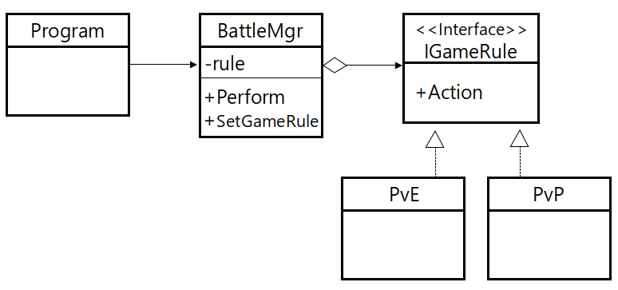

# Strategy pattern

클래스에서 사용되는 로직을 추상화한 패턴, 전략 패턴을 사용함으로서 로직을 사용하는 클래스와 로직 클래스를 독립적으로 변경 및 사용이 가능하다.



-----
## Strategy vs Bridge

* 두 패턴간의 차이는 Strategy 는 행동(Behavioral) 패턴이고, Bridge는 구조(Structural)패턴인 점이다. 즉, Strategy는 하나의 동작에 대해 다른 처리방식(알고리즘)을 수행하고, Bridge는 추상화를 구현과 분리하여 동일한 추상화에 대해 다른 구현을 제공한다.(구조적인 문제를 해결)
-----

## Code

### C#

```csharp
interface IGameRule {
    void Action();
}

class PvE : IGameRule {
    public void Action() {
        Console.WriteLine("PvE : Action()");
    }
}

class PvP : IGameRule {
    public void Action() {
        Console.WriteLine("PvP : Action()");
    }
}

class BattleMgr {
    IGameRule m_rule;

    public void SetGameRule(IGameRule rule) {
        m_rule = rule;
    }

    public void Perform() {
        m_rule.Action();
    }
}

class Program {
    static void Main(string[] args) {
        BattleMgr battle_mgr = new BattleMgr();
        battle_mgr.SetGameRule(new PvE());
        battle_mgr.Perform();

        battle_mgr.SetGameRule(new PvP());
        battle_mgr.Perform();
    }
}
```

### C++

```cpp
class IGameRule {
public:
    virtual void Action() = 0;
};

class PvE : public IGameRule {
public:
    void Action() {
        cout << "PvE : Action()" << endl;
    }
};

class PvP : public IGameRule {
public:
    void Action() {
        cout << "PvP : Action()" << endl;
    }
};

class BattleMgr {
private:
	IGameRule *m_rule;
public:
    void SetGameRule(IGameRule *rule) {
        m_rule = rule;
    }

    void Perform() {
        m_rule->Action();
    }
};

int main() {
    BattleMgr *battle_mgr = new BattleMgr();
    battle_mgr->SetGameRule(new PvE());
    battle_mgr->Perform();

    battle_mgr->SetGameRule(new PvP());
    battle_mgr->Perform();
}
```

### Java

```java
interface IGameRule {
	void Action();
}

class PvE implements IGameRule {
	@Override
	public void Action() {
		System.out.println("PvE : Action()");
	}
}

class PvP implements IGameRule {
	@Override
	public void Action() {
		System.out.println("PvP : Action()");
	}
}

class BattleMgr {
	IGameRule m_rule;
	
	public void SetGameRule(IGameRule rule) {
		m_rule = rule;
	}
	
	public void Perform() {
		m_rule.Action();
	}
}

public class Main {
	public static void main(String args[]) {
		BattleMgr battle_mgr = new BattleMgr();
		battle_mgr.SetGameRule(new PvE());
		battle_mgr.Perform();
		
		battle_mgr.SetGameRule(new PvP());
		battle_mgr.Perform();
	}
}
```

### Objective-C

```objc
#import <Foundation/Foundation.h>

@protocol IGameRule<NSObject>
@required
-(void) Action;
@end
    
@interface PvE : NSObject<IGameRule>
@end

@implementation PvE
-(void)Action {
    NSLog(@"PvE : Action()");
}
@end

@interface PvP : NSObject<IGameRule>
@end

@implementation PvP
-(void)Action {
    NSLog(@"PvP : Action()");
}
@end

@interface BattleMgr : NSObject {
    id<IGameRule> rule;
}
@property (assign) id<IGameRule> rule;
-(void) Perform;
@end

@implementation BattleMgr
@synthesize rule;
-(void) Perform {
    [rule Action];
}
@end

int main (int argc, const char * argv[])
{
    PvE *pve = [[PvE alloc] init];
    PvP *pvp = [[PvP alloc] init];
    BattleMgr *battle_mgr = [[BattleMgr alloc] init];

    [battle_mgr setRule:pve];
    [battle_mgr Perform];
    [battle_mgr setRule:pvp];
    [battle_mgr Perform];

    return 0;
}
```

### Python

```python
from abc import *

class IGameRule:
    @abstractmethod
    def Action(self):
        pass
        
class PvE(IGameRule):
    def Action(self):
        print("PvE : Action()");
        
class PvP(IGameRule):
    def Action(self):
        print("PvP : Action()");
        
class BattleMgr:
    def SetGameRule(self, rule):
        self.rule = rule;
        
    def Perform(self):
        self.rule.Action();
        
mgr = BattleMgr();
mgr.SetGameRule(PvE());
mgr.Perform();
mgr.SetGameRule(PvP());
mgr.Perform();
```