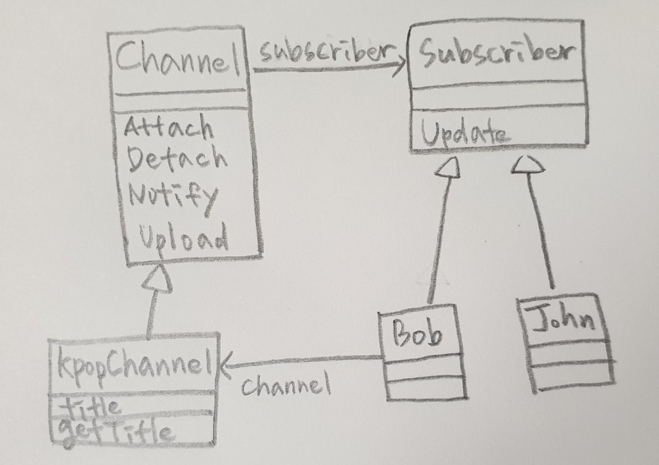

# Observer

* 객체의 상태 변화를 관찰하는 옵저버들의 목록을 객체에 등록하여 상태 변화가 있을때마다 옵저버들에게 통지


```java
public abstract class Channel {
	protected String m_title;
	private List<Subscriber> m_subscribers = new ArrayList<Subscriber>();
	
	public void Attach(Subscriber subscriber) {
		m_subscribers.add(subscriber);
	}
	
	public void Detach(Subscriber subscriber) {
		m_subscribers.remove(subscriber);
	}
	
	public void Notify() {
		for(Subscriber subscriber : m_subscribers){
			subscriber.Update(this);
		}
	}
	
	public String GetTitle() {
		return m_title;
	}
}

public class KpopChannel extends Channel {
	public void Upload(String title) {
		m_title = title;
		Notify();
	}
}

public interface Subscriber {
	void Update(Channel channel);
}

public class Bob implements Subscriber {
	@Override
	public void Update(Channel channel) {
		System.out.println("Bob! " + channel.GetTitle() + " watch now!");
	}
}

public class John implements Subscriber {
	@Override
	public void Update(Channel channel) {
		System.out.println("John! " + channel.GetTitle() + " watch now!");
	}
}

public static void main(String[] args) {
    KpopChannel kpop = new KpopChannel();
    Subscriber bob = new Bob();

    kpop.Attach(bob);
    kpop.Attach(new John());
    
    kpop.Upload("new song");
    
    kpop.Detach(bob);
    
    kpop.Upload("another song");
}

//결과
Bob! new song watch now!
John! new song watch now!
John! another song watch now!
```
### C#
```cs
public abstract class Channel {
    protected string m_title;
    private List<Subscriber> m_subscribers = new List<Subscriber>();

    public void Attach(Subscriber subscriber) {
        m_subscribers.Add(subscriber);
    }

    public void Detach(Subscriber subscriber) {
        m_subscribers.Remove(subscriber);
    }

    public void Notify() {
        foreach(Subscriber subscriber in m_subscribers) {
            subscriber.Update(this);
        }
    }

    public string GetTitle() {
        return m_title;
    }
}

public class KpopChannel : Channel {
    public void Upload(string title) {
        m_title = title;
        Notify();
    }
}

public abstract class Subscriber {
    public abstract void Update(Channel channel);
}

public class Bob : Subscriber {
	public override void Update(Channel channel) {
        Console.WriteLine("Bob! " + channel.GetTitle() + " watch now!");
    }
}

public class John : Subscriber {
    public override void Update(Channel channel) {
            Console.WriteLine("John! " + channel.GetTitle() + " watch now!");
    }
}

static void Main(string[] args) {
    KpopChannel kpop = new KpopChannel();
    Subscriber bob = new Bob();

    kpop.Attach(bob);
    kpop.Attach(new John());

    kpop.Upload("new song");

    kpop.Detach(bob);

    kpop.Upload("another song");
}

//결과
Bob! new song watch now!
John! new song watch now!
John! another song watch now!
```

### C++
```cpp
class Channel {
private:
	vector<Subscriber*> m_subscribers;
protected:
	string m_title;

public:
	void Attach(Subscriber* subscriber) {
		m_subscribers.push_back(subscriber);
	}

	void Detach(Subscriber* subscriber) {
		vector<Subscriber*>::iterator it = std::find(m_subscribers.begin(), m_subscribers.end(), subscriber);
		m_subscribers.erase(it);
	}

	void Notify() {
		for (int i = 0; i < m_subscribers.size(); i++) {
			m_subscribers[i]->Update(this);
		}
	}

	string GetTitle() {
		return m_title;
	}
};

class KpopChannel : public Channel {
public:
	void Upload(string title) {
		m_title = title;
		Notify();
	}
};

// Subscriber.h
class Channel;

class Subscriber {
public:
	virtual void Update(Channel* channel) = 0;
};

class Bob : public Subscriber {
public:
	virtual void Update(Channel* channel);
};

class John : public Subscriber {
public:
	virtual void Update(Channel* channel);
};

// Subscriber.cpp
void Bob::Update(Channel* channel) {
	cout << "Bob! " << channel->GetTitle() << " watch now!" << endl;
}

void John::Update(Channel* channel) {
	cout << "John! " << channel->GetTitle() << " watch now!" << endl;
}

int main() {
	KpopChannel* kpop = new KpopChannel();
	Subscriber* bob = new Bob();

	kpop->Attach(bob);
	kpop->Attach(new John());

	kpop->Upload("new song");

	kpop->Detach(bob);

	kpop->Upload("another song");

	return 0;
}

// 결과
Bob! new song watch now!
John! new song watch now!
John! another song watch now!
```

### Objective-C
```objc
@interface Subscriber : NSObject
-(void) Update:(Channel*)channel;
@end

@interface Bob : Subscriber {
@end

@interface John : Subscriber {
@end

@implementation Bob
-(void) Update:(Channel*)channel {
	NSLog(@"Bob! %@ watch now!", [channel GetTitle]);
}
@end

@implementation John
-(void) Update:(Channel*)channel {
	NSLog(@"John! %@ watch now!", [channel GetTitle]);
}
@end

@interface Channel : NSObject {
    NSMutableArray* m_subscribers;
    NSString* m_title;
}

-(void) Attach:(Subscriber*)subscriber;
-(void) Detach:(Subscriber*)subscriber;
-(void) Notify;
-(NSString*) GetTitle;
@end


@interface KpopChannel : Channel
-(void) Upload:(NSString*)title);
@end

@implementation KpopChannel
-(void) Attach:(Subscriber*)subscriber {
    [m_subscribers addObject:subscriber];
}

-(void) Detach:(Subscriber*)subscriber {
    [m_subscribers removeObject:subscriber];
}

-(void) Detach {
    for(Subscriber* subscriber in m_subscribers) {
        [subscriber Update:this];
    }
}

-(NSString*) GetTitle {
	return m_title;
}

-(void) Upload:(NSString*)title{
    m_title = title;
    [this Notify];
}
@end

int main() { 
    KpopChannel* kpop = [[KpopChannel alloc] init];
    Subscriber* bob = [[Bob alloc] init];

    [kpop Attach:bob];
    [kpop Attach:[[John alloc] init]];

    [kpop Upload:"new song"];
    [kpop Detach:bob];

    [kpop Upload:"another song"];

    return 0;
}