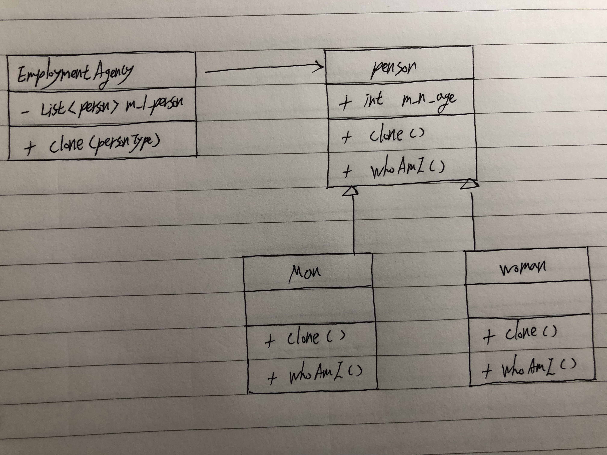

# Prototype

+ `이전에 만들어진 프로토타입 객체` 중 `만들고자 하는 프로토타입을 복사`하여 `새로운 객체 만드는 패턴`. 
+ 동일한 객체를 많이 사용해야 하는 경우 초기화 작업없이 복사만하여 사용. 

# Diagram



# Code

`[C# Code]`

```csharp
using System;
using System.Collections.Generic;

// Prototype
public abstract class Person {
	public int m_n_age;
	
	public abstract Person Clone();
	public abstract void WhoAmI();
}

// Concrete Prototype 1
public class Man : Person {
	public Man() {
		m_n_age = 20;
	}
	
	public override Person Clone() {
		return (Man)this.MemberwiseClone();
	}
	
	public override void WhoAmI() {
		Console.WriteLine("나는 " + m_n_age + "살 남자다.");
	}
}

// Concrete Prototype 2
public class Woman : Person {
	public Woman() {
		m_n_age = 25;
	}
	
	public override Person Clone() {
		return (Woman)this.MemberwiseClone();
	}
	
	public override void WhoAmI() {
		Console.WriteLine("나는 " + m_n_age + "살 여자다.");
	}
}

// Client
public enum PersonType {
	MAN,
	WOMAN,
}

public class EmploymentAgency {
	List<Person> m_l_person = new List<Person>();
	
	public EmploymentAgency() {
		m_l_person.Add(new Man());
		m_l_person.Add(new Woman());
	}
	
	public Person Clone(PersonType type) {
		return m_l_person[(int)type].Clone();
	}
}

public class Program {
	public static void Main() {
		EmploymentAgency agency = new EmploymentAgency();
		
		Man man = (Man)agency.Clone(PersonType.MAN);
		man.WhoAmI();
		
		Woman woman = (Woman)agency.Clone(PersonType.WOMAN);
		woman.WhoAmI();
	}
}
```

`[Java Code]`

```java
import java.util.List;
import java.util.ArrayList;

// Prototype
abstract class Person {
	public int m_n_age;
	
	public abstract Person Clone();
	public abstract void WhoAmI();
}

// Concrete Prototype 1
class Man extends Person {
	public Man() {
		m_n_age = 20;
	}
	
	@Override
	public Person Clone() {
		return this.Clone();
	}
	
	@Override
	public void WhoAmI() {
		System.out.println("나는 " + m_n_age + "살 남자다.");
	}
}

// Concrete Prototype 2
class Woman extends Person {
	public Woman() {
		m_n_age = 25;
	}
	
	@Override
	public Person Clone() {
		return this.Clone();
	}
	
	@Override
	public void WhoAmI() {
		System.out.println("나는 " + m_n_age + "살 여자다.");
	}
}

// Client
enum PersonType {
	MAN,
	WOMAN,
}

class EmploymentAgency {
	List<Person> m_l_person = new ArrayList<Person>();
	
	public EmploymentAgency() {
		m_l_person.add(new Man());
		m_l_person.add(new Woman());
	}
	
	public Person Clone(PersonType type) {
		return m_l_person.get(type.ordinal()).Clone();
	}
}

public class MainClass{
     public static void main(String []args){
        EmploymentAgency agency = new EmploymentAgency();
		
		Man man = (Man)agency.Clone(PersonType.MAN);
		man.WhoAmI();
		
		Woman woman = (Woman)agency.Clone(PersonType.WOMAN);
		woman.WhoAmI();
     }
}
```

`[Objective C Code]`

```objc
[.h]

// Prototype
@interface Person : NSObject {
    int m_n_age;
}

- (Person*) Clone;
- (void) WhoAmI;
@end

// Concrete Prototype 1
@interface Man : Person
- (id) init;
@end

// Concrete Prototype 2
@interface Woman : Person
- (id) init;
@end

@interface EmploymentAgency : NSObject {
    NSArray *m_l_person;
}

- (id) init;
- (Person *) Clone:type;
@end
```

```objc
[.m]

// Prototype
@implementation Person
- (Person*) Clone{return NULL;}
- (void) WhoAmI{}
@end

// Concrete Prototype 1
@implementation Man
-(id)init{
    self = [super init];
    if(self){
        m_n_age = 20;
    }
    return self;
}

- (Person*) Clone {
    return [[Man alloc] init];
}

- (void) WhoAmI{
    NSLog(@"나는 %d 살 남자다.", m_n_age);
}
@end

// Concrete Prototype 2
@implementation Woman
-(id)init{
    self = [super init];
    if(self){
        m_n_age = 25;
    }
    return self;
}

- (Person*) Clone {
    return [[Man alloc] init];
}

- (void) WhoAmI{
    NSLog(@"나는 %d 살 여자다.", m_n_age);
}
@end

// Client
enum PersonType {
    MAN,
    WOMAN,
};

@implementation EmploymentAgency

- (id) init {
    self = [super init];
    if(self){
        [m_l_person arrayByAddingObject:[[Man alloc] init]];
        [m_l_person arrayByAddingObject:[[Woman alloc] init]];
    }
    return self;

}
- (Person *) Clone:type {
    return [[m_l_person objectAtIndex: (int)type] Clone];
}
@end
```

`[Python Code]`

```python
import enum
import copy

# Prototype
class Person:
	m_n_age;
	
	def Clone(self):
	    pass;
	    
	def WhoAmI(self):
	    pass;

# Concrete Prototype 1
class Man(Person):
    def __init__(self):
        self.m_n_age = 20;
        
    def Clone(self):
        return copy.copy(self);
        
    def WhoAmI(self):
        print("나는 " + self.m_n_age + "살 남자다.");

# Concrete Prototype 2
class Woman(Person):
	def __init__(self):
	    self.m_n_age = 25;
	
	def Clone(self):
		return copy.copy(self);
	
	def WhoAmI(self):
		print("나는 " + self.m_n_age + "살 여자다.");

# Client
class PersonType(enum):
	MAN = 0,
	WOMAN = 1,

class EmploymentAgency:
    m_l_person = [];
    def __init__(self):
        self.m_l_person.append(Man);
        self.m_l_person.append(Woman);
        
    def Clone(self, person_type):
        return self.m_l_person[(int)person_type].FindTicket(country);
```

`[C++ Code]`

```cpp
#include <iostream>
#include <list>

using namespace std;

// Prototype
class Person {
public: 
    int m_n_age;
	
	virtual Person* Clone();
	virtual void WhoAmI();
};

// Concrete Prototype 1
class Man : public Person {
public:
    Man() {
		m_n_age = 20;
	}
	
	virtual Person* Clone() {
		return new Man();
	}
	
	virtual void WhoAmI() {
		cout << "나는 " << m_n_age << "살 남자다.";
	}
};

// Concrete Prototype 2
class Woman : public Person {
public: 
    Woman() {
		m_n_age = 25;
	}
	
	virtual Person* Clone() {
		return new Woman();
	}
	
	virtual void WhoAmI() {
		cout << "나는 " << m_n_age << "살 여자다.";
	}
};

// Client
enum PersonType {
	MAN,
	WOMAN,
};

class EmploymentAgency {
	list<Person> *m_l_person;
	
public: 
    EmploymentAgency() {
        m_l_person.push_back(new Man());
        m_l_person.push_back(new Woman());
	}
	
	Person Clone(PersonType type) {
		list<Person>::iterator person = m_l_person.begin() + (int)type;
		return person.Clone();
	}
};
```