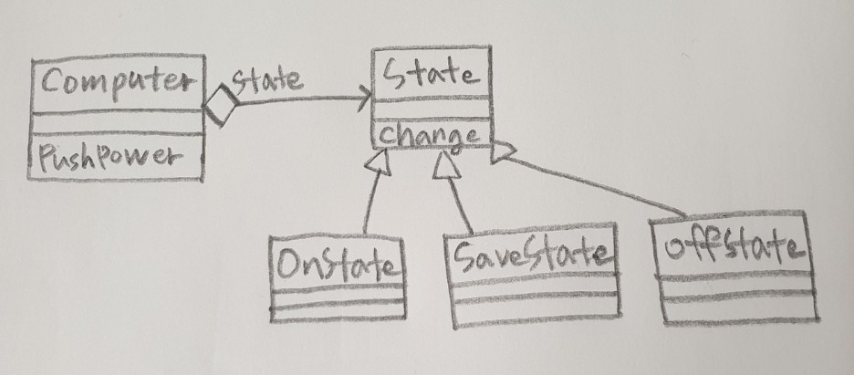

# State

* 객체의 내부 상태가 바뀜에 따라 객체의 행동을 바꿀 수 있음, 마치 객체의 클래스가 바뀌는 것과 같은 결과를 얻음
* 상태를 별도의 클래스로 캡슐화
* 상태가 변할 때마다 새로운 상태를 `new`하면 메모리 낭비


### java
```java
public abstract class State {
	Computer m_computer;
	public State(Computer computer) {
		m_computer = computer;
	}
	public abstract void Change();
}

public class OnState extends State {
	public OnState(Computer computer) {
		super(computer);
	}

	@Override
	public void Change() {
		System.out.println("on -> save");
		m_computer.m_state = new SaveState(m_computer);
	}
}

public class SaveState extends State {
	public SaveState(Computer computer) {
		super(computer);
	}

	@Override
	public void Change() {
		System.out.println("save -> off");
		m_computer.m_state = new OffState(m_computer);
	}
}

public class OffState extends State {
	public OffState(Computer computer) {
		super(computer);
	}

	@Override
	public void Change() {
		System.out.println("off -> on");
		m_computer.m_state = new OnState(m_computer);
	}
}

public class Computer {
	public State m_state;
	
	public Computer() {
		m_state = new OnState(this);
	}
	
	public void PushPower() {
		m_state.Change();
	}
}

public class test {
	public static void main(String[] args) {
		Computer computer = new Computer(); // default : OnState
		
		computer.PushPower();
		computer.PushPower();
		computer.PushPower();
    }
}

//결과
on -> save
save -> off
off -> on
```
### C#
```cs
public abstract class State {
    protected Computer m_computer;
    public State(Computer computer) {
        m_computer = computer;
    }
    public abstract void Change();
}

public class OnState : State {
    public OnState(Computer computer) : base(computer) { }

    public override void Change() {
        Console.WriteLine("on -> save");
        m_computer.m_state = new SaveState(m_computer);
    }
}

public class SaveState : State {
    public SaveState(Computer computer) : base(computer) { }

    public override void Change() {
        Console.WriteLine("save -> off");
        m_computer.m_state = new OffState(m_computer);
    }
}

public class OffState : State {
    public OffState(Computer computer) : base(computer) { }

    public override void Change() {
        Console.WriteLine("off -> on");
        m_computer.m_state = new OnState(m_computer);
    }
}

public class Computer {
    public State m_state;

    public Computer() {
        m_state = new OnState(this);
    }

    public void PushPower() {
        m_state.Change();
    }
}

static void Main(string[] args) {
    Computer computer = new Computer(); // default : OnState

    computer.PushPower();
    computer.PushPower();
    computer.PushPower();
}

// 결과
Bob! new song watch now!
John! new song watch now!
John! another song watch now!
```

### C++
```cpp
// State.h
class Computer;

class State {
protected:
	Computer* m_computer;
public:
	State(Computer* computer);
	virtual void Change() = 0;
};

class OnState : public State {

public:
	OnState(Computer* computer);

	virtual void Change();
};

class SaveState : public State {

public:
	SaveState(Computer* computer);
	virtual void Change();
};

class OffState : public State {
public:
	OffState(Computer* computer);

	virtual void Change();
};

// State.cpp

State::State(Computer* computer) {
	m_computer = computer;
}

OnState::OnState(Computer* computer) : State(computer) { }

void OnState::Change() {
	cout << "on -> save" << endl;
	m_computer->m_state = new SaveState(m_computer);
}

SaveState::SaveState(Computer* computer) : State(computer) { }

void SaveState::Change() {
	cout << "save -> off" << endl;
	m_computer->m_state = new OffState(m_computer);
}

OffState::OffState(Computer* computer) : State(computer) { }

void OffState::Change() {
	cout << "off -> on" << endl;
	m_computer->m_state = new OnState(m_computer);
}

class Computer {
public:
	State* m_state;

	Computer();

	void PushPower();
};

Computer::Computer() {
	m_state = new OnState(this);
}

void Computer::PushPower() {
	m_state->Change();
}

int main() {
	Computer* computer = new Computer(); // default : OnState

	computer->PushPower();
	computer->PushPower();
	computer->PushPower();

	return 0;
}

//결과
on -> save
save -> off
off -> on
```

### Objective-C
```objc
@interface State : NSObject {
    Computer* m_computer;
}
-(id)init:(Computer*)computer;
-(void)Change;
@end

@interface OnState : State 
-(id)init:(Computer*)computer;
-(void)Change;
@end

@interface SaveState : State 
-(id)init:(Computer*)computer;
-(void)Change;
@end

@interface SaveState : State 
-(id)init:(Computer*)computer;
-(void)Change;
@end

@interface OffState : State 
-(id)init:(Computer*)computer;
-(void)Change;
@end

@interface State
-(id)init:(Computer*)computer {
    if(self == [super init]) {
        m_computer = computer;
    }
    return self;
}
@end

@implementation OnState : State 
-(id)init:(Computer*)computer{
    return [super init:computer];
}
-(void)Change{
    NSLog(@"on -> save");
    m_computer.m_state = [[SaveState alloc] init:m_computer];
}
@end

@implementation SaveState : State 
-(id)init:(Computer*)computer{
    return [super init:computer];
}
-(void)Change {
    NSLog(@"save -> off");
    m_computer.m_state = [[OffState alloc] init:m_computer];
}
@end


@implementation OffState : State 
-(id)init:(Computer*)computer{
    return [super init:computer];
}
-(void)Change {
    NSLog(@"off -> on");
    m_computer.m_state = [[OnState alloc] init:m_computer];
}
@end

@interface Computer : NSObject{
	State* m_state;
}
-(id)init;
-(void)PushPower;
@end

@implementation Computer
-(id)init{
    if(self == [super init]){
        m_state = [[OnState alloc] init:self];
    }
    return self;
}

-(void)PushPower{
    [m_state Change];
}
@end

int main (int argc, const char * argv[]) {
    Computer* computer = [[Computer alloc] init]; //default : OnState

    [computer PushPower];
    [computer PushPower];
    [computer PushPower];   

    return 0;
}
```