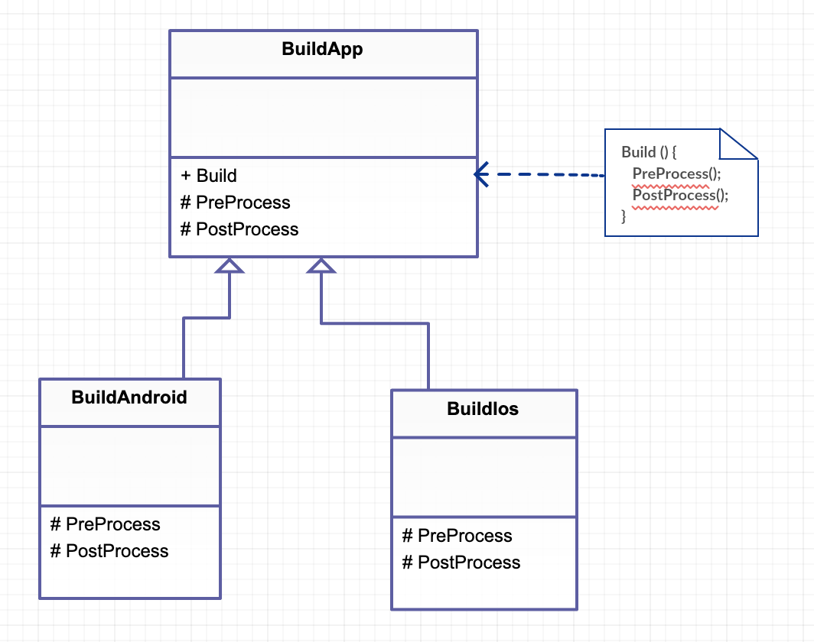

# TempleteMethod

각 절차의 기능을 하위 클래스에게 위임하는 패턴

## Class Diagram



## C#

```cs
public class BuildApp {
	public void Build(){
		PreProcess();
		PostProcess();
	}
	
	protected virtual void PreProcess(){}
	protected virtual void PostProcess(){}
}

public class BuildAndroid : BuildApp {
	
	protected override void PreProcess(){
		Console.WriteLine("Android Build PreProcess");
	}
	
	protected override void PostProcess(){
		Console.WriteLine("Android Build PostProcess");
	}
}

public class BuildIos : BuildApp {
	
	protected override void PreProcess(){
		Console.WriteLine("Ios Build PreProcess");
	}
	
	protected override void PostProcess(){
		Console.WriteLine("Ios Build PostProcess");
	}
}

public class Program
{
	public static void Main()
	{
		BuildApp builder = new BuildAndroid();
		builder.Build();
		
		builder = new BuildIos();
		builder.Build();
	}
}
```

