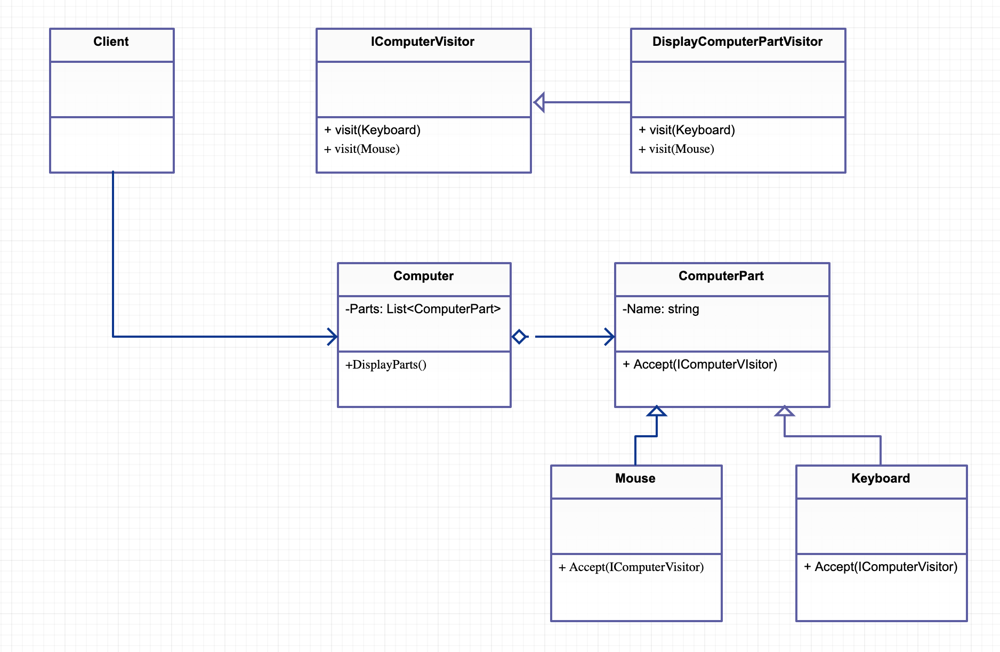

# Visitor

클래스 수정 없이 새로운 기능을 구현하는 패턴

## Class Diagram



## C#

```cs
public interface IComputerVisitor {
	void Visit(Keyboard keyboard);
	void Visit(Mouse mouse);
}

public class DisplayComputerPartVisitor : IComputerVisitor {
	public void Visit(Keyboard keyboard){
		Console.WriteLine("Keyboard Name is " + keyboard.m_name);
	}
	
	public void Visit(Mouse mouse){
		Console.WriteLine("Mouse Name is " + mouse.m_name);
	}
}
public abstract class ComputerPart {
	public string m_name;
	public ComputerPart(string name) {
		m_name = name;	
	}
	public abstract void Accept(IComputerVisitor visitor);
}

public class Mouse : ComputerPart {
	public Mouse(string name) : base(name){}
	
	public override void Accept(IComputerVisitor visitor){
		visitor.Visit(this);
	}
}

public class Keyboard : ComputerPart {
	public Keyboard(string name) : base(name){}
	
	public override void Accept(IComputerVisitor visitor){
		visitor.Visit(this);
	}
}

public class Computer {
	List<ComputerPart> m_l_parts = new List<ComputerPart>();
	
	public Computer(){
		m_l_parts.Add(new Mouse("logitech G"));	
		m_l_parts.Add(new Keyboard("DECK pro"));
	}
	
	public void DisplayParts(){
		DisplayComputerPartVisitor displayer = new DisplayComputerPartVisitor();
		for(int idx = 0; idx < m_l_parts.Count; idx++) {
			m_l_parts[idx].Accept(displayer);
		}
	}
		
}

public class Program
{
	public static void Main()
	{
		Computer computer = new Computer();
		computer.DisplayParts();
	}
}
```

