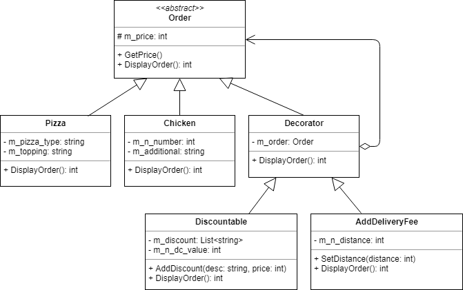

# Decorator

* 객체에 기능을 추가하고 싶을 때 서브클래스 구현 대신 시블링으로 데코레이터 객체를 생성하여 구현하는 패턴

## Class Diagram

* 배달의민족으로 피자와 치킨을 주문한다.
* 할인 적용, 배달비 추가의 데코레이터가 있다.



## Code

### C#

```cs
abstract class Order {
    protected int m_price;

    public int GetPrice() {
        return m_price;
    }
    public abstract int DisplayOrder();
}

class Pizza : Order {
    string m_pizza_type;
    string m_topping;

    public Pizza (string type, string topping, int price) {
        m_pizza_type = type;
        m_topping = topping;
        m_price = price;
    }

    public override int DisplayOrder() {
        Console.WriteLine(m_pizza_type + " 피자 + " + m_topping + " 추가");
        Console.WriteLine("가격 : " + m_price + "원");

        return m_price;
    }
}

class Chicken : Order {
    int m_n_number;
    string m_additional;

    public Chicken(int number, string additional, int price) {
        m_n_number = number;
        m_additional = additional;
        m_price = price;
    }

    public override int DisplayOrder() {
        Console.WriteLine(m_n_number + "마리 치킨 + " + m_additional + " 추가");
        Console.WriteLine("가격 : " + m_price + "원");

        return m_price;
    }
}

abstract class Decorator : Order {
    Order m_order;

    public Decorator(Order order) {
        m_order = order;
    }

    public override int DisplayOrder() {
        return m_order.DisplayOrder();
    }
}

class Discountable : Decorator {
    List<string> m_discount = new List<string>();
    int m_n_dc_value;

    public Discountable(Order order) : base(order) {
        m_n_dc_value = 0;
    }

    public void AddDiscount(string dc_desc, int price) {
        m_discount.Add(dc_desc);
        m_n_dc_value += price;
    }

    public override int DisplayOrder() {
        int total = base.DisplayOrder();

        for (int i = 0; i < m_discount.Count; i++) {
            Console.WriteLine("추가할인 : " + m_discount[i]);
        }
        Console.WriteLine("총 할인 금액 : " + m_n_dc_value + "원");

        return total - m_n_dc_value;
    }
}

class AddDeliveryFee : Decorator {
    int m_n_distance;

    public AddDeliveryFee(Order order) : base(order) {
        m_n_distance = 0;
    }

    public void SetDistance(int distance) {
        m_n_distance = distance;
    }

    public override int DisplayOrder() {
        int total = base.DisplayOrder();

        int add = 0;
        if (m_n_distance > 10) {
            Console.WriteLine("배달비 2000원 추가");
            add += 2000;
        } else if (m_n_distance > 5) {
            Console.WriteLine("배달비 1000원 추가");
            add += 1000;
        }

        return total + add;
    }
}

class Program {
    static void Main(string[] args) {
        // 피자 주문
        Order pizza_order = new Pizza("포테이토", "베이컨, 치즈크러스트", 18000);
        Discountable discount = new Discountable(pizza_order);
        discount.AddDiscount("멤버쉽 할인 3000원", 3000);
        discount.AddDiscount("첫 주문 할인 1000원", 1000);
        AddDeliveryFee delivery = new AddDeliveryFee(discount);
        delivery.SetDistance(15);

        Console.WriteLine("\n----- 현재 주문 내역 -----");
        int price = delivery.DisplayOrder();
        Console.WriteLine("총 주문 금액 : " + price + "원");

        // 치킨 주문
        Order chicken_order = new Chicken(2, "웨지감자, 파", 23000);
        discount = new Discountable(chicken_order);
        discount.AddDiscount("5월 할인 7000원", 7000);
        delivery = new AddDeliveryFee(discount);
        delivery.SetDistance(6);

        Console.WriteLine("\n----- 현재 주문 내역 -----");
        price = delivery.DisplayOrder();
        Console.WriteLine("총 주문 금액 : " + price + "원");
    }
}

// output
----- 현재 주문 내역 -----
포테이토 피자 + 베이컨, 치즈크러스트 추가
가격 : 18000원
추가할인 : 멤버쉽 할인 3000원
추가할인 : 첫 주문 할인 1000원
총 할인 금액 : 4000원
배달비 2000원 추가
총 주문 금액 : 16000원

----- 현재 주문 내역 -----
2마리 치킨 + 웨지감자, 파 추가
가격 : 23000원
추가할인 : 5월 할인 7000원
총 할인 금액 : 7000원
배달비 1000원 추가
총 주문 금액 : 17000원
```

### Java

```java
import java.util.ArrayList;
import java.util.List;

public class Main {
	public static void main(String[] args) {
		// 피자 주문
        Order pizza_order = new Pizza("포테이토", "베이컨, 치즈크러스트", 18000);
        Discountable discount = new Discountable(pizza_order);
        discount.AddDiscount("멤버쉽 할인 3000원", 3000);
        discount.AddDiscount("첫 주문 할인 1000원", 1000);
        AddDeliveryFee delivery = new AddDeliveryFee(discount);
        delivery.SetDistance(15);
		
	    System.out.println("\n----- 현재 주문 내역 -----");
        int price = delivery.DisplayOrder();
	    System.out.println("총 주문 금액 : " + price + "원");
	    
	    // 치킨 주문
        Order chicken_order = new Chicken(2, "웨지감자, 파", 23000);
        discount = new Discountable(chicken_order);
        discount.AddDiscount("5월 할인 7000원", 7000);
        delivery = new AddDeliveryFee(discount);
        delivery.SetDistance(6);
        
	    System.out.println("\n----- 현재 주문 내역 -----");
        price = delivery.DisplayOrder();
	    System.out.println("총 주문 금액 : " + price + "원");
	}
}


abstract class Order {
    protected int m_price;

    public int GetPrice() {
        return m_price;
    }
    public abstract int DisplayOrder();
}

class Pizza extends Order {
    String m_pizza_type;
    String m_topping;

    public Pizza (String type, String topping, int price) {
        m_pizza_type = type;
        m_topping = topping;
        m_price = price;
    }

    @Override
    public int DisplayOrder() {
        System.out.println(m_pizza_type + " 피자 + " + m_topping + " 추가");
        System.out.println("가격 : " + m_price + "원");

        return m_price;
    }
}

class Chicken extends Order {
    int m_n_number;
    String m_additional;

    public Chicken(int number, String additional, int price) {
        m_n_number = number;
        m_additional = additional;
        m_price = price;
    }

    @Override
    public int DisplayOrder() {
        System.out.println(m_n_number + "마리 치킨 + " + m_additional + " 추가");
        System.out.println("가격 : " + m_price + "원");

        return m_price;
    }
}

abstract class Decorator extends Order {
    Order m_order;

    public Decorator(Order order) {
        m_order = order;
    }

    @Override
    public int DisplayOrder() {
        return m_order.DisplayOrder();
    }
}

class Discountable extends Decorator {
    List<String> m_discount = new ArrayList<String>();
    int m_n_dc_value;

    public Discountable(Order order) {
    	super(order);
        m_n_dc_value = 0;
    }

    public void AddDiscount(String dc_desc, int price) {
        m_discount.add(dc_desc);
        m_n_dc_value += price;
    }

    @Override
    public int DisplayOrder() {
        int total = super.DisplayOrder();

        for (String obj : m_discount) {
            System.out.println("추가할인 : " + obj);
        }
        System.out.println("총 할인 금액 : " + m_n_dc_value + "원");

        return total - m_n_dc_value;
    }
}

class AddDeliveryFee extends Decorator {
    int m_n_distance;

    public AddDeliveryFee(Order order) {
    	super(order);
        m_n_distance = 0;
    }

    public void SetDistance(int distance) {
        m_n_distance = distance;
    }

    @Override
    public int DisplayOrder() {
        int total = super.DisplayOrder();

        int add = 0;
        if (m_n_distance > 10) {
            System.out.println("배달비 2000원 추가");
            add += 2000;
        } else if (m_n_distance > 5) {
            System.out.println("배달비 1000원 추가");
            add += 1000;
        }

        return total + add;
    }
}
```

### Objective-c

```objc

```

### C++

```cpp
#include <iostream>
#include <list>
#include <string>
using namespace std;

class Order {
protected:
	int m_price;

public:
	Order() {}
	Order(int price) : m_price(price) { }
	int GetPrice() {
		return m_price;
	}
	virtual int DisplayOrder() {
		return 0;
	}
};

class Pizza : public Order {
	string m_pizza_type;
	string m_topping;

public:
	Pizza(string type, string topping, int price) : m_pizza_type(type), m_topping(topping), Order(price) { }

	int DisplayOrder() {
		cout << m_pizza_type << " 피자 + " << m_topping << " 추가" << endl;
		cout << "가격 : " << m_price << "원" << endl;

		return m_price;
	}
};

class Chicken : public Order {
	int m_n_number;
	string m_additional;

public:
	Chicken(int number, string additional, int price) : m_n_number(number), m_additional(additional), Order(price) { }

	int DisplayOrder() {
		cout << m_n_number << "마리 치킨 + " << m_additional << " 추가" << endl;
		cout << "가격 : " << m_price << "원" << endl;

		return m_price;
	}
};

class Decorator : public Order {
	Order* m_order;

public:
	Decorator(Order* order) {
		m_order = order;
	}

	virtual int DisplayOrder() {
		return m_order->DisplayOrder();
	}
};

class Discountable : public Decorator {
	list<string> m_discount;
	int m_n_dc_value;

public:
	Discountable(Order* order) : Decorator(order) {
		m_n_dc_value = 0;
	}

	void AddDiscount(string dc_desc, int price) {
		m_discount.push_back(dc_desc);
		m_n_dc_value += price;
	}

	int DisplayOrder() {
		int total = Decorator::DisplayOrder();
		
		list<string>::iterator lt;
		for (lt = m_discount.begin(); lt != m_discount.end(); lt++) {
			cout << "추가할인 : " << *lt << endl;
		}
		cout << "총 할인 금액 : " << m_n_dc_value << "원" << endl;

		return total - m_n_dc_value;
	}
};

class AddDeliveryFee : Decorator {
	int m_n_distance;

public:
	AddDeliveryFee(Order* order) : Decorator(order) {
		m_n_distance = 0;
	}

	void SetDistance(int distance) {
		m_n_distance = distance;
	}

	int DisplayOrder() {
		int total = Decorator::DisplayOrder();

		int add = 0;
		if (m_n_distance > 10) {
			cout << "배달비 2000원 추가" << endl;
			add += 2000;
		} else if (m_n_distance > 5) {
			cout << "배달비 1000원 추가" << endl;
			add += 1000;
		}

		return total + add;
	}
};

int main() {
	// 피자 주문
	Pizza* pizza_order = new Pizza("포테이토", "베이컨, 치즈크러스트", 18000);
	Discountable* discount = new Discountable(pizza_order);
	discount->AddDiscount("멤버쉽 할인 3000원", 3000);
	discount->AddDiscount("첫 주문 할인 1000원", 1000);
	AddDeliveryFee* delivery = new AddDeliveryFee(discount);
	delivery->SetDistance(15);

	cout << "\n----- 현재 주문 내역 -----" << endl;
	int price = delivery->DisplayOrder();
	cout << "총 주문 금액 : " << price << "원" << endl;

	delete delivery;
	delete discount;
	delete pizza_order;

	// 치킨 주문
	Chicken* chicken_order = new Chicken(2, "웨지감자, 파", 23000);
	discount = new Discountable(chicken_order);
	discount->AddDiscount("5월 할인 7000원", 7000);
	delivery = new AddDeliveryFee(discount);
	delivery->SetDistance(6);

	cout << "\n----- 현재 주문 내역 -----" << endl;
	price = delivery->DisplayOrder();
	cout << "총 주문 금액 : " << price << "원" << endl;

	delete delivery;
	delete discount;
	delete chicken_order;
}
```

### python

```python
from abc import *

class Order(metaclass=ABCMeta):
    _m_price = 0

    def GetPrice(self):
        return self._m_price

    @abstractmethod
    def DisplayOrder(self):
        pass

class Pizza(Order):
    m_pizza_type = ""
    m_topping = ""

    def __init__(self, type, topping, price):
        self.m_pizza_type = type
        self.m_topping = topping
        self._m_price = price

    def DisplayOrder(self):
        print('%s 피자 + %s 추가' % (self.m_pizza_type, self.m_topping))
        #print self.m_pizza_type + " 피자 + " + self.m_topping + " 추가"
        print("가격 : " + str(self._m_price) + "원")

        return self._m_price

class Chicken(Order):
    m_n_number = 0
    m_additional = ""

    def __init__(self, number, additional, price):
        self.m_n_number = number
        self.m_additional = additional
        self._m_price = price

    def DisplayOrder(self):
        print(str(self.m_n_number) + "마리 치킨 + " + self.m_additional + " 추가")
        print("가격 : " + str(self._m_price) + "원")

        return self._m_price

class Decorator(Order):
    def __init__(self, order):
        self.m_order = order

    def DisplayOrder(self):
        return self.m_order.DisplayOrder()

class Discountable(Decorator):
    m_discount = []
    m_n_dc_value = 0

    def __init__(self, order):
        super().__init__(order)
        self.m_n_dc_value = 0

    def AddDiscount(self, dc_desc, price):
        self.m_discount.append(dc_desc)
        self.m_n_dc_value += price

    def DisplayOrder(self):
        total = super().DisplayOrder()

        for i in self.m_discount:
            print("추가할인 : " + i)
            
        print("총 할인 금액 : " + str(self.m_n_dc_value) + "원")

        return total - self.m_n_dc_value

class AddDeliveryFee(Decorator):
    m_n_distance = 0

    def __init__(self, order):
        super().__init__(order)
        self.m_n_distance = 0

    def SetDistance(self, distance):
        self.m_n_distance = distance

    def DisplayOrder(self):
        total = super().DisplayOrder()

        add = 0
        if self.m_n_distance > 10:
            print("배달비 2000원 추가")
            add += 2000
        elif self.m_n_distance > 5:
            print("배달비 1000원 추가")
            add += 1000

        return total + add

# 피자 주문
pizza_order = Pizza("포테이토", "베이컨, 치즈크러스트", 18000)
discount = Discountable(pizza_order)
discount.AddDiscount("멤버쉽 할인 3000원", 3000)
discount.AddDiscount("첫 주문 할인 1000원", 1000)
delivery = AddDeliveryFee(discount)
delivery.SetDistance(15)

print("\n----- 현재 주문 내역 -----")
price = delivery.DisplayOrder()
print("총 주문 금액 : " + str(price) + "원")

# 치킨 주문
chicken_order = Chicken(2, "웨지감자, 파", 23000)
discount = Discountable(chicken_order)
discount.AddDiscount("5월 할인 7000원", 7000)
delivery = AddDeliveryFee(discount)
delivery.SetDistance(6)

print("\n----- 현재 주문 내역 -----")
price = delivery.DisplayOrder()
print("총 주문 금액 : " + str(price) + "원")
```