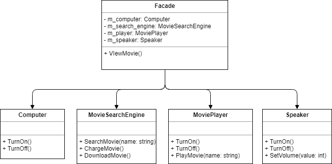

# Facade

* 복잡한 라이브러리 접근 시 간단한 인터페이스를 제공하는 패턴

## Class Diagram

* 집에서 영화를 본다.



## Code

### C#

```cs
class Computer {
	public void TurnOn() {
		Console.WriteLine("컴퓨터를 켠다.");
	}

	public void TurnOff() {
		Console.WriteLine("컴퓨터를 끈다.");
	}
}

class MovieSearchEngine {
	public void SearchMovie(string name) {
		Console.WriteLine("영화를 찾는다. : " + name);
	}

	public void ChargeMovie() {
		Console.WriteLine("영화를 결제한다.");
	}

	public void DownloadMovie() {
		Console.WriteLine("영화를 다운로드한다.");
	}
}

class MoviePlayer {
	public void TurnOn() {
		Console.WriteLine("플레이어를 켠다.");
	}

	public void TurnOff() {
		Console.WriteLine("플레이어를 끈다.");
	}

	public void PlayMovie(string name) {
		Console.WriteLine("영화를 재생한다. : " + name);
	}
}

class Speaker {
	float m_f_volume;
	public void TurnOn() {
		Console.WriteLine("스피커를 켠다.");
	}

	public void TurnOff() {
		Console.WriteLine("스피커를 끈다.");
	}

	public void SetVolume(float val) {
		m_f_volume = val;
		Console.WriteLine("볼륨 조절 : " + val);
	}
}

class Facade {
	Computer m_computer = new Computer();
	MovieSearchEngine m_search_engine = new MovieSearchEngine();
	MoviePlayer m_player = new MoviePlayer();
	Speaker m_speaker = new Speaker();

	public void ViewMovie(string movie_name) {
		m_computer.TurnOn();
		m_search_engine.SearchMovie(movie_name);
		m_search_engine.ChargeMovie();
		m_search_engine.DownloadMovie();
		m_player.TurnOn();
		m_player.PlayMovie(movie_name);
		m_speaker.TurnOn();
		m_speaker.SetVolume(0.5f);
	}
}

class Program {
	static void Main(string[] args) {
		Facade f = new Facade();
		f.ViewMovie("Avengers");
	}
}

// output
컴퓨터를 켠다.
영화를 찾는다. : Avengers
영화를 결제한다.
영화를 다운로드한다.
플레이어를 켠다.
영화를 재생한다. : Avengers
스피커를 켠다.
볼륨 조절 : 0.5
```

### Java

```java
class Computer {
	public void TurnOn() {
		System.out.println("컴퓨터를 켠다.");
	}

	public void TurnOff() {
		System.out.println("컴퓨터를 끈다.");
	}
}

class MovieSearchEngine {
	public void SearchMovie(string name) {
		System.out.println("영화를 찾는다. : " + name);
	}

	public void ChargeMovie() {
		System.out.println("영화를 결제한다.");
	}

	public void DownloadMovie() {
		System.out.println("영화를 다운로드한다.");
	}
}

class MoviePlayer {
	public void TurnOn() {
		System.out.println("플레이어를 켠다.");
	}

	public void TurnOff() {
		System.out.println("플레이어를 끈다.");
	}

	public void PlayMovie(string name) {
		System.out.println("영화를 재생한다. : " + name);
	}
}

class Speaker {
	float m_f_volume;
	public void TurnOn() {
		System.out.println("스피커를 켠다.");
	}

	public void TurnOff() {
		System.out.println("스피커를 끈다.");
	}

	public void SetVolume(float val) {
		m_f_volume = val;
		System.out.println("볼륨 조절 : " + val);
	}
}

class Facade {
	Computer m_computer = new Computer();
	MovieSearchEngine m_search_engine = new MovieSearchEngine();
	MoviePlayer m_player = new MoviePlayer();
	Speaker m_speaker = new Speaker();

	public void ViewMovie(string movie_name) {
		m_computer.TurnOn();
		m_search_engine.SearchMovie(movie_name);
		m_search_engine.ChargeMovie();
		m_search_engine.DownloadMovie();
		m_player.TurnOn();
		m_player.PlayMovie(movie_name);
		m_speaker.TurnOn();
		m_speaker.SetVolume(0.5f);
	}
}

public class Main {
	Facade f = new Facade();
	f.ViewMovie("Avengers");
}
```

### Objective-c

```objc
#import <Foundation/Foundation.h>

@interface Computer : NSObject
- (id)init;
- (void) TurnOn;
- (void) TurnOff;
@end

@interface MovieSearchEngine : NSObject
- (id)init;
- (void) SearchMovie:(NSString *)name;
- (void) ChargeMovie;
- (void) DownloadMovie;
@end

@interface MoviePlayer : NSObject
- (id)init;
- (void) TurnOn;
- (void) TurnOff;
- (void) PlayMovie:(NSString *)name;
@end

@interface Speaker : NSObject {
    float m_f_volume;
}
- (id)init;
- (void) TurnOn;
- (void) TurnOff;
- (void) SetVolume:(float)val;
@end

@interface Facade : NSObject {
    Computer* m_computer;
    MovieSearchEngine* m_search_engine;
    MoviePlayer* m_player;
    Speaker* m_speaker;
}
- (id)init;
- (void) ViewMovie:(NSString *)movie_name;
@end

@implementation Computer : NSObject
- (void) TurnOn {
	NSLog(@"컴퓨터를 켠다.");
}
- (void) TurnOff {
	NSLog(@"컴퓨터를 끈다.");
}
@end

@implementation MovieSearchEngine : NSObject
- (void) SearchMovie:(NSString *)name {
	NSLog(@"영화를 찾는다. : %@", name);
}
- (void) ChargeMovie {
	NSLog(@"영화를 결제한다.");
}
- (void) DownloadMovie {
	NSLog(@"영화를 다운로드한다.");
}
@end

@implementation MoviePlayer : NSObject
- (void) TurnOn {
	NSLog(@"플레이어를 켠다.");
}
- (void) TurnOff {
	NSLog(@"플레이어를 끈다.");
}
- (void) PlayMovie:(NSString *)name {
	NSLog(@"영화를 재생한다. : %@", name);
}
@end

@implementation Speaker : NSObject
- (void) TurnOn {
	NSLog(@"스피커를 켠다.");
}
- (void) TurnOff {
	NSLog(@"스피커를 끈다.");
}
- (void) SetVolume:(float)val {
	m_f_volume = val;
	NSLog(@"볼륨 조절 : %f", val);
}
@end

@implementation Facade : NSObject
- (id)init {
    if(self == [super init]){
    	m_computer = [[Computer alloc] init];
    	m_search_engine = [[MovieSearchEngine alloc] init];
    	m_player = [[MoviePlayer alloc] init];
    	m_speaker = [[Speaker alloc] init];
    }
    return self;
}
- (void) ViewMovie:(NSString *)movie_name {

	[m_computer TurnOn];
	[m_search_engine SearchMovie:movie_name];
	[m_search_engine ChargeMovie];
	[m_search_engine DownloadMovie];
	[m_player TurnOn];
	[m_player PlayMovie:movie_name];
	[m_speaker TurnOn];
	[m_speaker SetVolume:0.5];
}
@end

int main (int argc, const char * argv[]) {
    NSAutoreleasePool* pool = [[NSAutoreleasePool alloc] init];
    Facade* f = [[Facade alloc] init];
	[f ViewMovie:@"Avengers"];

    [pool drain];
	return 0;
}
```

### C++

```cpp
#include <iostream>
#include <string>
using namespace std;

class Computer {
public:
	void TurnOn() {
		cout << "컴퓨터를 켠다." << endl;
	}

	void TurnOff() {
		cout << "컴퓨터를 끈다." << endl;
	}
};

class MovieSearchEngine {
public:
	void SearchMovie(string name) {
		cout << "영화를 찾는다. : " << name << endl;
	}

	void ChargeMovie() {
		cout << "영화를 결제한다." << endl;
	}

	void DownloadMovie() {
		cout << "영화를 다운로드한다." << endl;
	}
};

class MoviePlayer {
public:
	void TurnOn() {
		cout << "플레이어를 켠다." << endl;
	}

	void TurnOff() {
		cout << "플레이어를 끈다." << endl;
	}

	void PlayMovie(string name) {
		cout << "영화를 재생한다. : " << name << endl;
	}
};

class Speaker {
	float m_f_volume;
public:
	void TurnOn() {
		cout << "스피커를 켠다." << endl;
	}

	void TurnOff() {
		cout << "스피커를 끈다." << endl;
	}

	void SetVolume(float val) {
		m_f_volume = val;
		cout << "볼륨 조절 : " << val << endl;
	}
};

class Facade {
	Computer m_computer;
	MovieSearchEngine m_search_engine;
	MoviePlayer m_player;
	Speaker m_speaker;

public:
	void ViewMovie(string movie_name) {
		m_computer.TurnOn();
		m_search_engine.SearchMovie(movie_name);
		m_search_engine.ChargeMovie();
		m_search_engine.DownloadMovie();
		m_player.TurnOn();
		m_player.PlayMovie(movie_name);
		m_speaker.TurnOn();
		m_speaker.SetVolume(0.5f);
	}
};

int main() {
	Facade f;
	f.ViewMovie("Avengers");
}
```

### python

```python
class Computer:
	def TurnOn(self):
		print("컴퓨터를 켠다.")

	def TurnOff(self):
		print("컴퓨터를 끈다.")

class MovieSearchEngine:
	def SearchMovie(self, name):
		print("영화를 찾는다. : " + name)

	def ChargeMovie(self):
		print("영화를 결제한다.")

	def DownloadMovie(self):
		print("영화를 다운로드한다.")

class MoviePlayer:
	def TurnOn(self):
		print("플레이어를 켠다.")

	def TurnOff(self):
		print("플레이어를 끈다.")

	def PlayMovie(self, name):
		print("영화를 재생한다. : " + name)

class Speaker:
	m_f_volume = 0
	def TurnOn(self):
		print("스피커를 켠다.")

	def TurnOff(self):
		print("스피커를 끈다.")

	def SetVolume(self, val):
		m_f_volume = val
		print("볼륨 조절 : " + str(val))

class Facade:
	m_computer = Computer()
	m_search_engine = MovieSearchEngine()
	m_player = MoviePlayer()
	m_speaker = Speaker()

	def ViewMovie(self, movie_name):
		self.m_computer.TurnOn()
		self.m_search_engine.SearchMovie(movie_name)
		self.m_search_engine.ChargeMovie()
		self.m_search_engine.DownloadMovie()
		self.m_player.TurnOn()
		self.m_player.PlayMovie(movie_name)
		self.m_speaker.TurnOn()
		self.m_speaker.SetVolume(0.5)

f = Facade()
f.ViewMovie("Avengers")
```