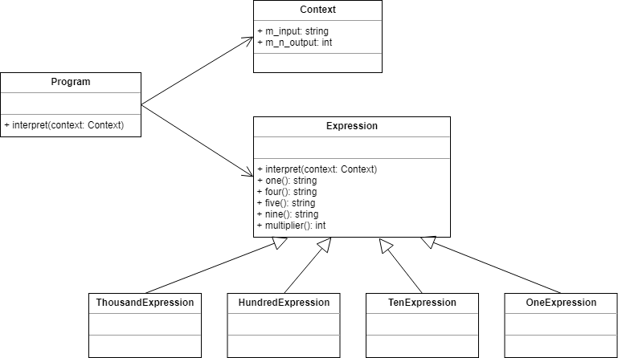

# Interpreter

* 문법을 해석하는 방법을 구현하는 패턴

## Class Diagram

* 로마자 표기를 숫자로 변경한다.



## Code

### C#

```cs
class Context {
	public string m_input;
	public int m_n_output;

	public Context(string input) {
		this.m_input = input;
	}
}

abstract class Expression {
	public void interpret(Context context) {
		if (context.m_input.Length == 0)
			return;

		if (context.m_input.StartsWith(nine())) {
			context.m_n_output = context.m_n_output + (9 * multiplier());
			context.m_input = context.m_input.Substring(2);
		} else if (context.m_input.StartsWith(four())) {
			context.m_n_output = context.m_n_output + (4 * multiplier());
			context.m_input = context.m_input.Substring(2);
		} else if (context.m_input.StartsWith(five())) {
			context.m_n_output = context.m_n_output + (5 * multiplier());
			context.m_input = context.m_input.Substring(1);
		}

		while (context.m_input.StartsWith(one())) {
			context.m_n_output = context.m_n_output + (1 * multiplier());
			context.m_input = context.m_input.Substring(1);
		}
	}

	public abstract string one();
	public abstract string four();
	public abstract string five();
	public abstract string nine();
	public abstract int multiplier();

}
class ThousandExpression : Expression {
	public override string one() { return "M"; }
	public override string four() { return " "; }
	public override string five() { return " "; }
	public override string nine() { return " "; }
	public override int multiplier() { return 1000; }
}

class HundredExpression : Expression {
	public override string one() { return "C"; }
	public override string four() { return "CD"; }
	public override string five() { return "D"; }
	public override string nine() { return "CM"; }
	public override int multiplier() { return 100; }
}

class TenExpression : Expression {
	public override string one() { return "X"; }
	public override string four() { return "XL"; }
	public override string five() { return "L"; }
	public override string nine() { return "XC"; }
	public override int multiplier() { return 10; }
}

class OneExpression : Expression {
	public override string one() { return "I"; }
	public override string four() { return "IV"; }
	public override string five() { return "V"; }
	public override string nine() { return "IX"; }
	public override int multiplier() { return 1; }
}

class Program {
	static void Main(string[] args) {
		string roman = "MCMXXVIII";
		Context context = new Context(roman);
		
		List<Expression> l_tree = new List<Expression>();
		l_tree.Add(new ThousandExpression());
		l_tree.Add(new HundredExpression());
		l_tree.Add(new TenExpression());
		l_tree.Add(new OneExpression());

		// Interpret 
		for (int i = 0; i < l_tree.Count; i++) {
			l_tree[i].interpret(context);
		}

		Console.WriteLine(roman + " = " + context.m_n_output);
	}
}

// output
MCMXXVIII = 1928
```

### C++

```cpp

```

### Java

```java

```

### Objective-c

```objc

```

### python

```python

```