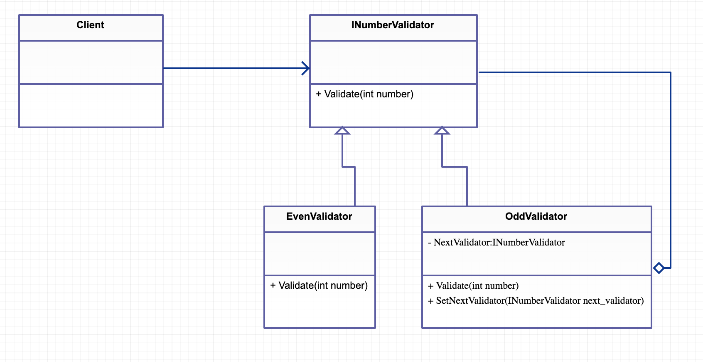

# Chain of Responsibility

요청이 완료 될 때까지 여러개의 객체에게 요청이 이어지는 패턴

## Class Diagram



## C#

```cs
public interface INumberValidator {
	void Validate(int number);
}

public class OddValidator : INumberValidator {
	INumberValidator m_next_validator;
	public void SetNextValidator(INumberValidator next_validator){
		m_next_validator = next_validator;	
	}
	public void Validate(int number){
		if ( number % 2 != 0 ) {
			Console.WriteLine(number + " is Odd");	
		} else {
			m_next_validator.Validate(number);	
		}
	}
}

public class EvenValidator : INumberValidator {

	public void Validate(int number){
		if ( number % 2 == 0 ) {
			Console.WriteLine(number + " is Even");	
		} else {
			Console.WriteLine(number + " is UnKnown");	
		}
	}
}

public class Program
{
	public static void Main()
	{
		OddValidator validator = new OddValidator();
		validator.SetNextValidator(new EvenValidator());
		
		validator.Validate(10);
		validator.Validate(9);
	}
}
```

