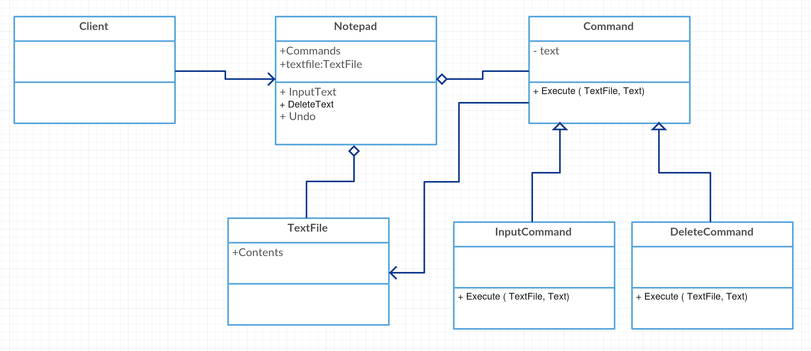

# Command

기능의 수행을 객체화 한 패턴

## Class Diagram



## C#

```cs
public abstract class Command {
	public string m_text;
	public abstract void Execute(TextFile textfile, string text);
}

public class InputCommand : Command {
	
	public override void Execute(TextFile textfile, string text){
		m_text = text;	
		
		textfile.m_contents += text;
	}
}

public class DeleteCommand : Command {
	
	public override void Execute(TextFile textfile, string text){
		m_text = text;	
		textfile.m_contents = textfile.m_contents.Replace(text, string.Empty);
	}
}

public class Notepad {
	TextFile m_text_file = new TextFile();
	List<Command> m_l_commands = new List<Command>();
	
	public void InputText(string text){
		InputCommand command = new InputCommand();
		command.Execute(m_text_file, text);
		m_l_commands.Add(command);
	}
	
	public void DeleteText(string text){
		DeleteCommand command = new DeleteCommand();	
		command.Execute(m_text_file, text);
		m_l_commands.Add(command);
	}
	
	public void Undo(){
		int commands_cnt= m_l_commands.Count;
		if ( commands_cnt == 0 )
			return;
		
		Command last_command = m_l_commands[commands_cnt -1];
		if ( last_command is InputCommand ) {
			DeleteText(last_command.m_text);	
		} else if ( last_command is DeleteCommand ) {
			InputText(last_command.m_text);	
		}
	}
	
	public void Print(){
		Console.WriteLine(m_text_file.m_contents);
	}
}

public class TextFile {
	public string m_contents;	
}

public class Program
{
	public static void Main()
	{
		Notepad notepad = new Notepad();
		notepad.InputText("Hello");
		notepad.Print();
		notepad.InputText(" World");
		notepad.Print();
		notepad.DeleteText("World");
		notepad.Print();
		notepad.Undo();
		notepad.Print();
	}
}
```

