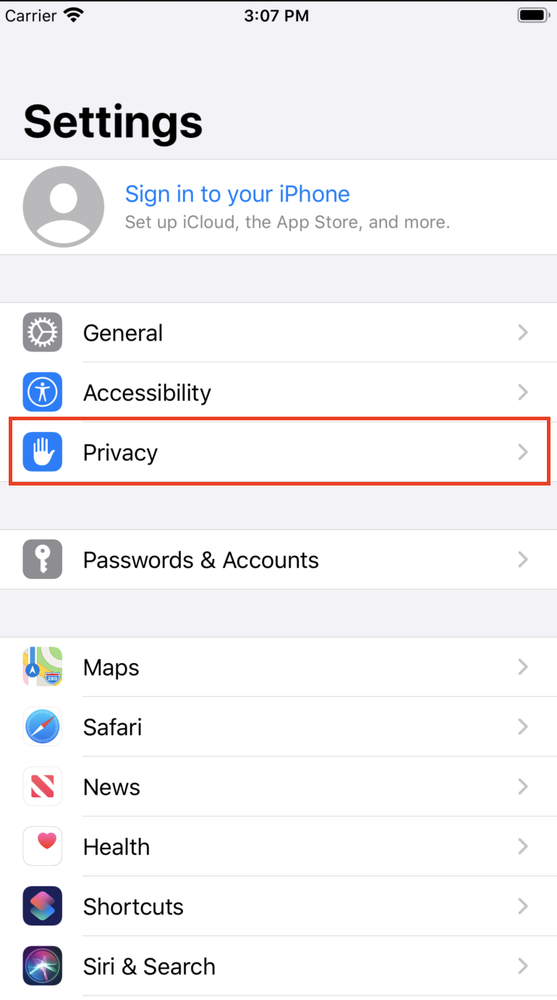
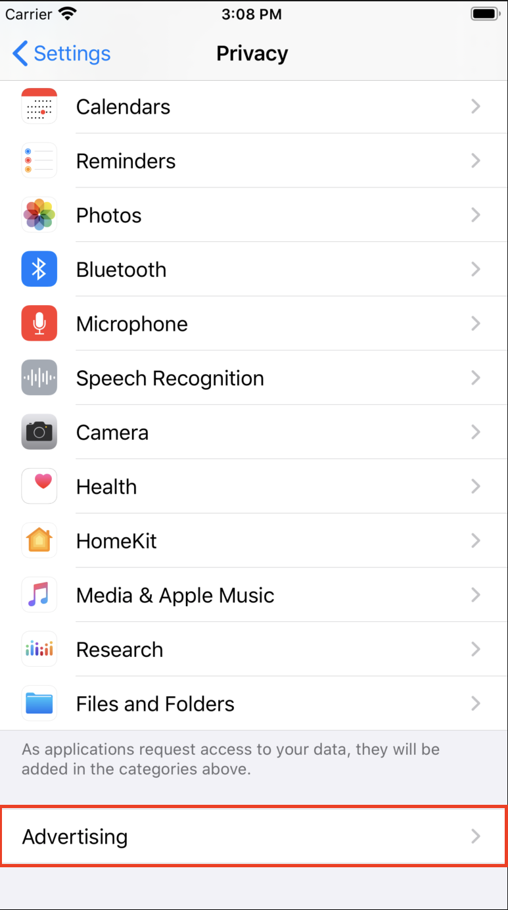
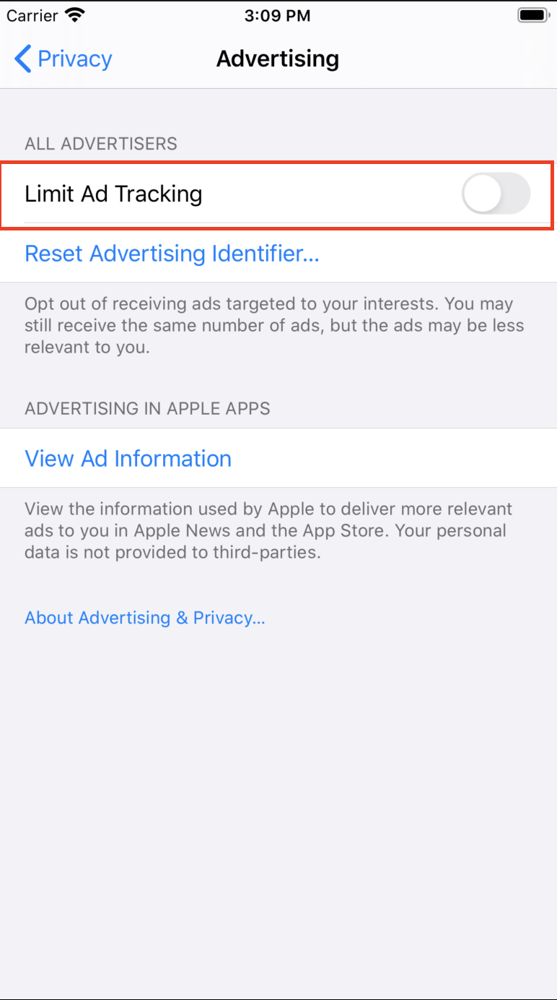
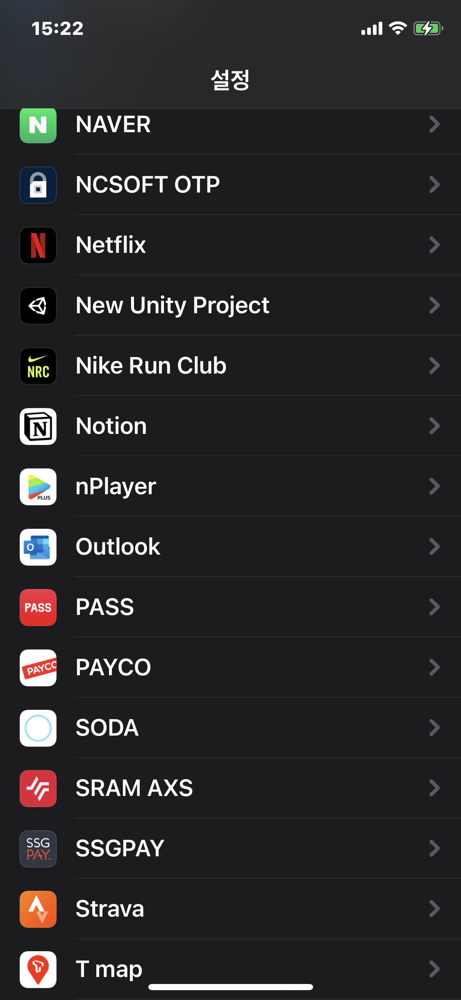
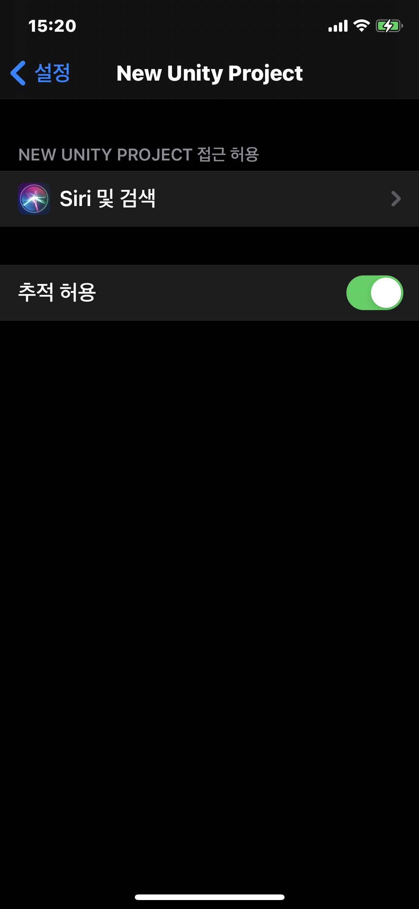
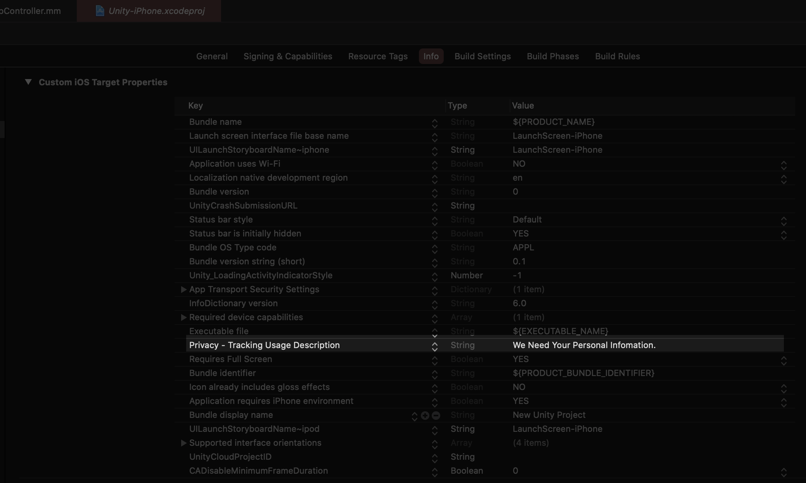
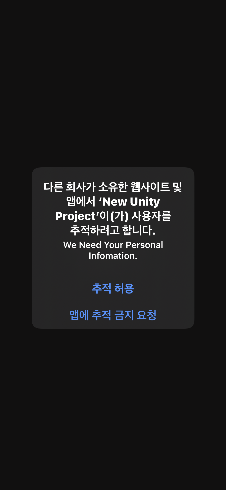

# ios14 버전 IDFA 대응 
> ios14 부터 IDFA의 수집을 하려면 사용자 동의가 필요하다.

# What is IDFA

* 광고를 위한 기기의 고유 ID값
* Anroid의 ADID와 같은 용도

# Get IDFA on Before iOS14

 Settings -> Privacy -> Advertising에서 **isAdvertisingTrackingEnabled** 을 On/Off 할 수 있다. ( Default : On )



## Code
```objectivec
//Need Add AdSupport.framework

#import <AdSupport/ASIdentifierManager.h>

ASIdentifierManager* identifierManager = [ASIdentifierManager sharedManager];
    
if ( [identifierManager isAdvertisingTrackingEnabled ])
{
    NSLog(@"[idfa] isAdvertisingTrackingEnabled enabled" );

    NSString* idfa = identifierManager.advertisingIdentifier.UUIDString;
    NSLog(@"[idfa] %@", idfa);
}
else
{
    NSLog(@"[idfa] isAdvertisingTrackingEnabled disabled" );
}
```

# Get IDFA on iOS14

Settings -> {App}Setting 에서 **isAdvertisingTrackingEnabled** 을 On/Off 할 수 있다.



## info.plist 수정

**Privacy - Tracking Usage Description(NSUserTrackingUsageDescription)** 키를 추가 하고 값을 넣어야 한다.
값은 사용자의 동의를 받기 위한 다이얼로의 문구로 사용된다. 만약 값을 넣지 않으면 문구가 출력 안된다.



## Dialogue

* **[ATTrackingManager requestTrackingAuthorizationWithCompletionHandler:^(ATTrackingManagerAuthorizationStatus status) {}];** 를 통해, 사용자의 동의를 받기 위한 Dialogue를 띄우거나, 현재 동의 여부를 확인 할 수 있다.
  > [ATTrackingManager requestTrackingAuthorizationWithCompletionHandler:^(ATTrackingManagerAuthorizationStatus status) {}];
* 만약 Dialogue를 통해 사용자에게 동의 혹은 거부를 받으면, 앱을 재설치 하기 전까진 다시 뜨지 않는다.
* **status == ATTrackingManagerAuthorizationStatusAuthorized** 인 경우에만 IDFA를 구해 올 수 있다.



## Code

```objectivec
//Need Add AdSupport.framework
//Need Add AppTrackingTransparency.framework

#import <AdSupport/ASIdentifierManager.h>
#import <AppTrackingTransparency/ATTrackingManager.h>

[ATTrackingManager requestTrackingAuthorizationWithCompletionHandler:^(ATTrackingManagerAuthorizationStatus status) {
      
      if ( status == ATTrackingManagerAuthorizationStatusAuthorized )
      {
          NSLog(@"[idfa] ATTrackingManagerAuthorizationStatusAuthorized");
      }
      else if ( status == ATTrackingManagerAuthorizationStatusDenied )
      {
          NSLog(@"[idfa] ATTrackingManagerAuthorizationStatusDenied");
      }
      else if ( status == ATTrackingManagerAuthorizationStatusRestricted )
      {
          NSLog(@"[idfa] ATTrackingManagerAuthorizationStatusRestricted");
      }
      else if ( status == ATTrackingManagerAuthorizationStatusNotDetermined )
      {
          NSLog(@"[idfa] ATTrackingManagerAuthorizationStatusNotDetermined");
      }
      
      if ( [identifierManager isAdvertisingTrackingEnabled ])
      {
          NSLog(@"[idfa] isAdvertisingTrackingEnabled enabled" );
      }
      else
      {
          NSLog(@"[idfa] isAdvertisingTrackingEnabled disabled" );
      }
      
      NSString* idfa = identifierManager.advertisingIdentifier.UUIDString;
      NSLog(@"[idfa] %@", idfa);
  }];
```

# Reference

* [Qiita](https://qiita.com/yofuru/items/213b88b85553631204e4)