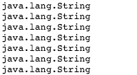

# How to use Reflection effectively

+ 동적으로 메소드를 로드할때 사용.
+ 클래스의 메소드 및 변수를 구해올때 사용.

## Reflection API

`getMethods()`

+ 클래스에 선언된 함수들을 가져오는 함수.

```java
[Java Code]

import java.lang.reflect.Method;

public class MainClass{
     public static void main(String []args){
        final Method[] methods = String.class.getMethods();
        for( final Method method: methods ) {
            System.out.println( method.getName() );
        }
     }
}
```

```csharp
[C# Code]

using System;
using System.Reflection;
		
public class Program {
	public static void Main() {
		Type myType =(typeof(string));
		MethodInfo[] myArrayMethodInfo = myType.GetMethods();
		
		for(int i=0;i<myArrayMethodInfo.Length;i++) {
            MethodInfo myMethodInfo = (MethodInfo)myArrayMethodInfo[i];
            Console.WriteLine(myMethodInfo.Name);
        }
	}
}
```


`getConstructors()`

+ 클래스에 선언된 생성자들을 가져오는 함수.

```java
[Java Code]
import java.lang.reflect.Constructor;

public class MainClass{
     public static void main(String []args){
          final Constructor[] constructors = String.class.getConstructors();
            for( final Constructor constructor: constructors ) {
                System.out.println( constructor.getName() );
            }
     }
}
```

```csharp
[C# Code]

using System;
using System.Reflection;
		
public class Program {
	public static void Main() {
		ConstructorInfo[] p = typeof(string).GetConstructors();
        for (int i=0;i<p.Length;i++) {
            Console.WriteLine(p[i].ToString());
        }
	}
}
```



`getFields()`

+ 클래스에 선언된 필드(=멤버변수)들을 가져오는 함수.

```java
[Java Code]
import java.lang.reflect.Field;

public class MainClass{
     public static void main(String []args){
        final Field[] fields = String.class.getFields();
        for( final Field field: fields ) {
            System.out.println( field.getName() );
        }
     }
}
```

```csharp
[C# Code]

using System;
using System.Reflection;
		
public class Program {
	public static void Main() {
		FieldInfo[] myField = typeof(string).GetFields();
		
		for(int i = 0; i < myField.Length; i++) {
			Console.WriteLine(myField[i].Name);
		}
	}
}
```


## Accessing generic type parameters

+ 선언된 제네릭 타입을 얻어 올수 있다.

`getDeclaredField`

+ private로 선언된 멤버변수에 접근할때 사용.

`getGenericType()`

+ 멤버변수의 제네릭 타입을 반환.

`[참조 변수] instanceof [클래스]`

+ 참조변수가 클래스 타입으로 형변환이 가능한지 판단.

```java
[Java Code]

import java.util.List;
import java.lang.reflect.ParameterizedType;
import java.lang.reflect.Type;

class ParameterizedTypeExample{
    private List< String > strings;
    public List< String > getStrings() {
        return strings;
    } 
}

public class MainClass{
     public static void main(String []args){
         try {
            final Type type = ParameterizedTypeExample.class.getDeclaredField( "strings" ).getGenericType();
    
            if( type instanceof ParameterizedType ) {
                final ParameterizedType parameterizedType = ( ParameterizedType )type;
                
                final Type[] typeArguments = parameterizedType.getActualTypeArguments();
                for( final Type typeArgument: typeArguments ) {
                    System.out.println( typeArgument );
                }
            }
         } catch(Exception e) {
             
         } finally {
             
         }
     }
}
```

```csharp
[C# Code]

using System;
using System.Reflection;
using System.Collections.Generic;
		
public class Program {
	public static void Main() {
		Type[] typeArguments = typeof(List<string>).GetGenericArguments();
		
		for(int i=0;i<typeArguments.Length;i++) {
            Console.WriteLine(typeArguments[i]);
        }
	}
}
```


## Reflection API and visibility

`setAccessible(true/false)`

+ 접근권한을 변경.

```java
import java.lang.reflect.Field;

class PrivateFields {
    private String name;
    public String getName() {
        return name;
} }

public class MainClass{
     public static void main(String []args){
         try {
            final PrivateFields instance = new PrivateFields();
            final Field field = PrivateFields.class.getDeclaredField( "name" );
            field.setAccessible( true );
            field.set( instance, "sample name" );
            
            System.out.println( instance.getName() );
         } catch(Exception e) {
             System.out.println( "setAccessible(false)로 하고 변경하는 경우 Exception");
         } finally {
             
         }
     }
}
```


## Reflection API pitfalls(위험)

+ 코드가 작성된 모든 환경에서 `사용하지 못 할 수 있다`. 
+ 비용이 많이 들어가기 때문에 `성능에 영향`을 미칠 수 있다.
+ 생성자, 함수 매개변수/리턴 `값 변환에 있어 상당히 제한적`이다.

## Method Handles

+ 동적으로 메소드를 할당 및 사용 할 수 있다.

`MethodHandles.lookup()`

+ 메소드를 만들기 위한 객체.

`MethodHandles.Lookup.findVirtual([참조 클래스], [함수 이름], [리턴 타입])`

+ 가상 메소드를 생성.

`MethodHandle.invokeExact([매개변수])`

+ 메소드 실행.

```java
[Java Code]
import java.lang.invoke.MethodHandle;
import java.lang.invoke.MethodHandles;
import java.lang.invoke.MethodHandles.Lookup;
import java.lang.invoke.MethodType;
import java.lang.Throwable;

public class MainClass{
     public static void main(String []args){
         try {
            final MethodHandles.Lookup lookup = MethodHandles.lookup();
            final MethodType methodType = MethodType.methodType( int.class );
            final MethodHandle methodHandle = lookup.findVirtual( String.class, "length", methodType );
            final int length = ( int )methodHandle.invokeExact("sample string");
            System.out.println(length);
         }catch(Throwable e) {
         }finally {
         }
     }
}
```

```csharp
[C# Code]

using System;
using System.Reflection;
using System.Reflection.Emit;
using System.Globalization;

public class Program {
	public static void Main() {
		Type[] lengthArgs = {typeof(string)};

        DynamicMethod hello = new DynamicMethod("length", // 함수 이름
            typeof(int), 								  // 리턴 타입
            lengthArgs, 								  // 매개 변수
            typeof(string).Module);						  // 참조 클래스
		
		
		ILGenerator il = hello.GetILGenerator(256);		  // 동적으로 생성한 메소드에 크기를 할당.
        il.Emit(OpCodes.Ldarg_0);						  // 스택에 첫번째 매개변수를 로드한다.
        il.Emit(OpCodes.Ret);							  // 메소드에 제어권을 반환한다.
		
		object[] invokeArgs = {"sample string"};
		object objRet = hello.Invoke(null, BindingFlags.ExactBinding, null, invokeArgs, new CultureInfo("en-us"));
		Console.WriteLine(objRet);
	}
}
```


## Method Argument Names

+ 클래스의 메소드, 매개변수를 이용해서 함수를 찾을 수 있다.

```java
[Java Code]

import java.util.Arrays;
import java.lang.reflect.Method;
import java.lang.reflect.Parameter;

class MethodParameterNamesExample {
    void performAction( final String a) {}
    void performAction( final String a, final Integer b){}
}

public class MainClass{
     public static void main(String []args){
         try {
            final Method method = MethodParameterNamesExample.class.getDeclaredMethod( "performAction", String.class, Integer.class);
            
            Parameter[] parameters = method.getParameters();
            for( final Parameter parameter: parameters ) {
                System.out.println( parameter.toString());
            }
         }catch(Exception e) {
         }finally {
         }
     }
}
```

```csharp
[C# Code]
using System;
using System.Reflection;

class MethodParameterNamesExample {
    	public void performAction(string a) {}
    	public void performAction(string a, int b){}
}
		
public class Program {
	public static void Main() {
		MethodInfo method = typeof(MethodParameterNamesExample).GetMethod("performAction", new Type[] { typeof(string), typeof(int)});
		ParameterInfo[] parms = method.GetParameters();
		for (int i = 0; i < parms.Length; i++) {
		  Console.Write(parms[i].ParameterType.Name);
	  	}
	}
}
```

