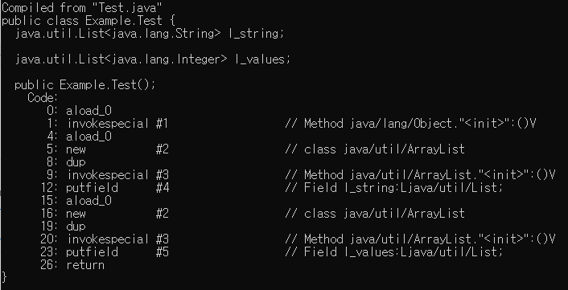

# How and when to use Generics

제네릭(Generic)은 클래스 내부에서 사용할 데이터 타입을 외부에서 지정하는 기법을 의미한다.

즉, 데이터 타입을 메소드나 클래스 및 인터페이스에 대해 매개변수가 되도록 허용하여 다양한 타입에 대해 작동하도록 하는 방법이다.

## Generics and interfaces

일반 인터페이스와 달리 제네릭 인터페이스는 매개변수가 되어야 하는 유형(`T`)를 제공해줘야 한다.

```java
// java
public interface IGenericExample<T> {
    void Action(T t);
}

class GenericExample1 implements IGenericExample<String> {
    public void Action(String str) {
        System.out.println("This is Generic : " + str);
    }
}

class GenericExample2 implements IGenericExample<Integer> {
    public void Action(Integer n_i) {
        System.out.println("This is Generic : " + n_i);
    }
 }

 // Main
GenericExample1 ex = new GenericExample1();
ex.Action("String");
GenericExample2 ex2 = new GenericExample2();
ex2.Action(12345);

// Output
This is Generic : String
This is Generic : 12345
```

위 코드와 같이 단일 형식 `T`로 매개변수화 되며 해당 인터페이스는 둘 이상의 타입으로 활용이 가능해진다.

-----

```csharp
// csharp
interface IGenericExample<T> {
    void Action(T t);
}

class GenericExample1 : IGenericExample<string> {
    public void Action(string str) {
        Console.WriteLine("This is Generic : " + str);
    }
}

class GenericExample2 : IGenericExample<int> {
    public void Action(int n_i) {
        Console.WriteLine("This is Generic : " + n_i.ToString());
    }
}

// Main
GenericExample1 ex = new GenericExample1();
ex.Action("String");
GenericExample2 ex2 = new GenericExample2();
ex2.Action(12345);
```

## Generics and classes

클래스도 인터페이스와 마찬가지로 클래스 정의에 (`T`) 매개변수를 선언해주면 된다.

또한 인터페이스와 부모클래스로부터 꼭 제네릭 타입을 전달받지 않아도 된다.

```java
// java
interface IGenericExample<T> {
    void InterfaceAction(T t);
}

class GenericExample3<T> implements IGenericExample<String> {
    public void InterfaceAction(String str) {
        System.out.println("This is Generic : " + str);
    }

    void ClassAction(T t) {
        System.out.println("This is Generic : " + t);
    }
}

// Main
GenericExample3<Integer> ex = new GenericExample3<Integer>();
ex.InterfaceAction("String");
ex.ClassAction(12345);

// Output
This is Generic : String
This is Generic : 12345
```

-----

C#도 동일하게 해당 기능을 지원한다.

```csharp
// csharp
interface IGenericExample<T> {
    void Action(T t);
}

class GenericExample3<T> : IGenericExample<string> {
    public void Action(string str) {
        Console.WriteLine("This is Generic : " + str);
    }

    public void Action2(T t) {
        Console.WriteLine("This is Generic : " + t.ToString());
    }
}

// Main
GenericExample3<int> ex3 = new GenericExample3<int>();
ex3.InterfaceAction("String");
ex3.ClassAction(1);
```

만약 클래스에서 전달되는 매개변수

## Generics and methods

메소드는 매개변수 또는 반환형에 선언에 대해 제네릭 사용이 가능하다. 즉 여러개의 제네릭 유형을 선언할 수 있다.

```java
// java
class GenericExample3 {
	<T, R> R Action(T t, R r) {
		System.out.println("This is Generic : " + t);
		return r;
	}
}

// Main
GenericExample3 ex = new GenericExample3();
Integer a = ex.Action("string", 12345);
System.out.println("This is Generic : " + a);
```

-----

C#의 경우 선언 위치만 다를뿐 사용법은 똑같습니다.

```csharp
// csharp
class GenericExample3 {
    public R Action<T, R>(T t, R r) {
        Console.WriteLine("This is Generic : " + t);
        return r;
    }
}

// Main
GenericExample3 ex3 = new GenericExample3();
int a = ex3.Action<string, int>("", 12345); // <string, int> 는 매개변수로 타입이 전달되기 때문에 굳이 안써도 된다.
Console.WriteLine("This is Generic : " + a);
```

## Limitaion of generics

제네릭의 경우 몇가지 제한사항이 존재한다.

* Primitive Type 이라고 불리는 자료형들(int, long, byte)은 제네릭에서 사용되도록 허용되지 않는다. 따라서 래퍼를 사용하여 구현해야 한다.

```java
List<Long> l_longs = new List<Long>();
List<Integer l_integers = new List<Integer>();

// compile error
// List<long or int> l_values = new List<long or int>();
```

또한 제네릭에서 래퍼를 사용하기 때문에 값의 암시적 박싱, 언박싱이 일어난다.

```java
List<Long> l_values = new List<Long>();
l_values.Add(0l); // long -> Long, 박싱
long n_value = l_values.get(0); // Long -> long, 언박싱
```

### Type Erasure

자바에서는 이하 코드가 컴파일 에러를 내뱉는다.

```java
void sort(Collection<String> strings) { }
void sort(Collection<Number> numbers) { }
```

오버로딩을 지원하는 자바의 경우 위 코드는 문법적으로 문제될게 없다. 하지만 컴파일 에러를 내뱉는 이유는 자바의 '타입 소거' 때문이다.

타입 소거란 컴파일시에 제너릭 유형의 타입들은 해당 타입 정보들을 모두 지워버리는 행위를 말한다.

??? 자바는 제너릭 기능이 추가되기 이전 버전과 아무 무리 없이 동작하도록 설계되었기 때문

??? [스택 오버플로우 답변](https://stackoverflow.com/questions/1998544/method-has-the-same-erasure-as-another-method-in-type)

```java
public class Test {
	List<String> l_string = new ArrayList<String>();
	List<Integer> l_values = new ArrayList<Integer>();
}
```



위 코드와 사진은 제너릭 형태의 리스트를 인스턴스화 하고 컴파일한 후 자바의 바이트코드를 출력한것이다.
보다시피 두 리스트는 코드상에선 타입이 다르지만 컴파일이 되자 타입 정보는 지워지고, 똑같은 형태의 리스트로 인스턴스화 되었다.

* 제너릭을 이용한 코드에서 해당 클래스의 구체적인 클래스를 가져오려고 하거나 제너릭 형태의 인스턴스를 만들 수 없다.

```java
// compile error
<T> void action(T t) {
    if(t instanceof T) {
        
    }
}
```

* 제너릭 유형의 배열 인스턴스는 허용되지 않는다.

```java
T[] arr = new T[5];
```

---

C# 의 경우 위 제한사항들을 모두 허용합니다.

```csharp
class GenericExample<T> {
    public T[] arr = new T[1];
    
    public void Action(T t) {
        arr[0] = t;
        Console.WriteLine("Type : {0}, Value : {1}", arr.GetType(), arr[0]);
    }

    public void Action<R>(R r) {
        if(r is string) {
            Console.WriteLine("TRUE");
        } else {
            Console.WriteLine("FALSE");
        }
    }
}

// Main
GenericExample<string> ex = new GenericExample<string>();
ex.Action("Test1");
ex.Action<string>("Test2"); // 타입을 명시해줘야 함
// ex.Action("Test2"); 이 구문은 수행은 되지만 무조건 첫번째 함수를 호출하게 된다.

// Output
Type : System.String[], Value : Test1
TRUE
```