# JVM Architecture

JVM의 구조와 각 구성요소들을 조금 더 깊게 알아보자

JVM은 다음 3개의 주요 하위시스템으로 구성된다.

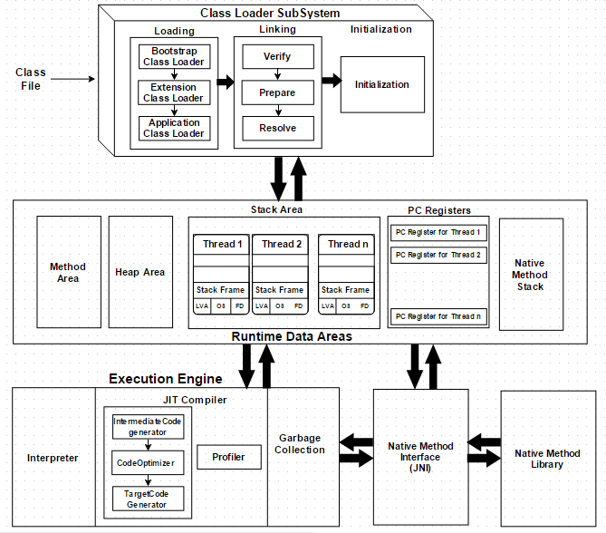

1. `Class Loader SubSystem`
2. `Runtime Data Area`
3. `Excution Engine`

## Class Loader SubSystem

런타임에 클래스를 처음 참조시 클래스를 로드, 링크, 초기화 한다. 일반적으로 클래스들을 요청 시 한 차례만 로드 된다.

### Loading

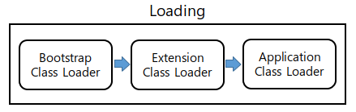

.class 파일을 바이트 코드로 읽어 메모리로 가져오는 과정, 자바에는 기본적으로 3가지 클래스 로더가 존재하며 각 클래스 로더들은 계층 구조를 가지고 있다.

1. `Bootstrap Class Loader` : JVM 구동을 위한 핵심 시스템 클래스들을 로딩한다. 일반적으로 jre/lib/rt.jar 에 담긴 JDK 클래스들이 그 대상이 된다.

2. `Extension Class Loader` : jre/lib/ext 폴더나 java.ext.dirs 환경 변수로 지정된 폴더에 있는 클래스를 로딩한다.

3. `Application Class Loader` : System Class Loader 라고도 하는 이 클래스 로더는 -classpath에 지정된 경로에서 클래스를 로딩한다. 개발자가 애플리케이션 구동을 위해 직접 작성한 대부분의 클래스는 이 로더에 의해 로딩된다.

### Linking

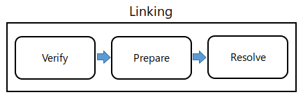

연결 과정으로 `Verify - Prepare - Resolve` 라는 3가지 과정을 거치는데 간략하면 읽어온 바이트 코드가 올바른 규칙을 따르는지 검증하고 (`Verify`), 클래스에 정의된 필드 또는 메소드들에 메모리 할당 및 기본값 지정과 (`Prepare`) 클래스가 참조하고 있는 다른 클래스를 로딩한다. (`Resolve`)

### Initialization

클래스 로딩의 마지막 단계로 슈퍼 클래스 및 정적 필드를 초기화한다.

## Runtime Data Area

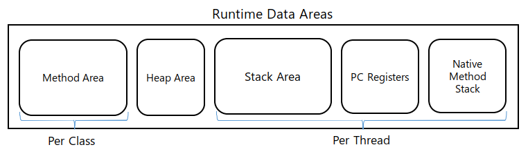

JVM이 운영체제 위에서 실행되며 할당 받은 메모리 영역으로 클래스 로더에서 준비한 데이터(바이트코드)들을 보관하는 저장소이다.
런타임 데이터 영역은 5개의 주요 구성요소로 나뉘어진다.

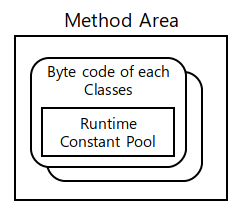

1. `Method Area` : 모든 클래스 수준의 데이터 및 정적 변수가 이곳에 저장된다. JVM 당 단 하나의 메소드 영역이 있으며 이는 공유 자원이다.

---

### Runtime Constant Pool

각 클래스나 인터페이스의 상수, 메소드와 필드에 대한 모든 레퍼런스를 담고 있는 테이블이다. 어떤 메소드나 필드를 참조할 때 JVM은 런타임 상수 풀을 통해 실제 메모리 주소를 찾아서 참조한다.

---

2. `Heap Area` : 모든 객체와 해당 인스턴스 변수 및 배열이 여기에 저장된다. 메소드 영역과 같이 하나의 힙 영역이 있다.

3. `JVM Stack Area` : 메소드 정보, 지역·매개변수, 임시 값들을 저장한다. 모든 스레드들이 별도의 런타임 스택을 가지고 있으며, 모든 메소드 호출에 대해 하나의 항목이 `스택 프레임` 이라고 하는 스택에 만들어 진다. 메소드를 호출시 프레임을 `Push`하며 종료시 `Pop`하는 동작을 수행한다.

-----

### 스택 프레임

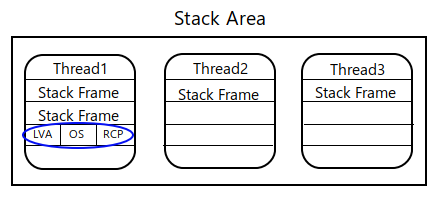

스택 프레임은 다음 3개의 하위요소로 나뉘어진다.

1. `Local Variable Array` : 0부터 시작하는 인덱스를 가진 배열이다. 0은 메소드가 속한 클래스 인스턴스의 `this` 레퍼런스 이고 1부터는 메소드에 전달된 매개변수들이 저장되며, 이후에는 지역변수들이 저장된다.

2. `Operand Stack` : 메소드의 실제 작업 공간으로 각 메소드는 피연산자 스택과 지역 변수 배열 사이에서 데이터를 교환하고, 다른 메소드 호출 결과를 추가하거나(`Push`) 꺼낸다(`Pop`).

3. `Reference to Constant Pool` : 현재 실행중인 메소드가 속한 클래스의 런타임 상수 풀에 대한 참조를 갖는다.

-----

4. `PC Registers` : `PC(Program Counter) 레지스터`는 각 스레드마다 하나씩 존재하며 현재 수행중인 명령의 주소를 가진다.

5. `Native Method Stack` : 자바 외의 언어로 작성된 네이티브 코드를 위한 스택 즉, `JNI(Java Native Interface)`를 통해 호출하는 C/C++ 등의 코드를 수행하기 위한 스택으로, 언어에 맞게 C 스택이나 C++ 스택이 생성된다.

## Excution Engine

런타임 영역에 할당된 데이터는 실행엔진에 의해서 실행된다. 실행 엔진은 명령어 단위로 바이트 코드를 읽어서 실행한다.

1. `Interpreter` : 인터프리터는 바이트 코드를 더 빠르게 해석하지만 실행은 느리게 한다. 단점으로는 하나의 메소드가 여러번 호출 될 때마다 매번 새로운 해석이 요구되는 점이다.

2. `Jit Compiler` : `JIT 컴파일러`는 인터프리터의 단점을 해소한다. 실행 엔진은 인터프리터의 도움을 받아 바이트코드를 변환하지만 반복 코드를 발견하면 `JIT 컴파일러`를 사용하여 해당 코드를 캐싱한 후 이후에 같은 함수가 여러번 불릴 때 매번 기계어 코드를 생성하는 것을 방지한다.

3. `Garbage Collector` : 참조되지 않은 오브젝트를 수집하고, 제거한다. `System.gc()`를 호출하여 가비지 수집을 트리거 할 수 있지만 실행이 보장되지는 않는다.

4. `Java Native Interface (JNI)` : `JNI`는 `Native Method Libraries`와 상호작용 하고, Excution Engine에 필요한 Native Libraries를 제공한다.

5. `Native Method Libraries` : 실행 엔진에 필요한 원시 라이브러리 모음

-----

## 자바 코드

```java
public class Main {
    public static void main(String args[]) {
        Main main = new Main();
        main.SayHello();
    }

    void SayHello() {
        System.out.println("Hello World!");
    }
}
```

## 바이트코드 - Main.class

* 런타임 상수 풀

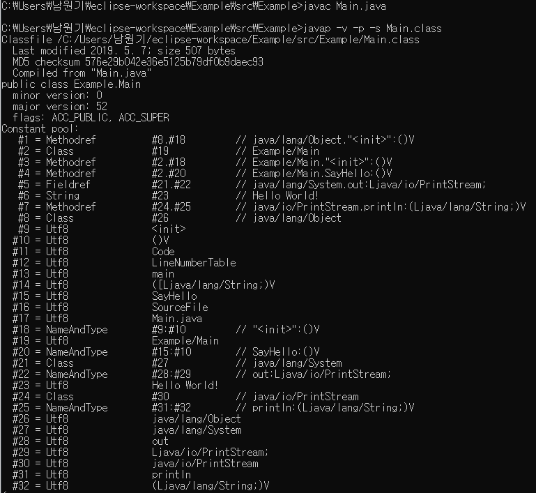

* Main

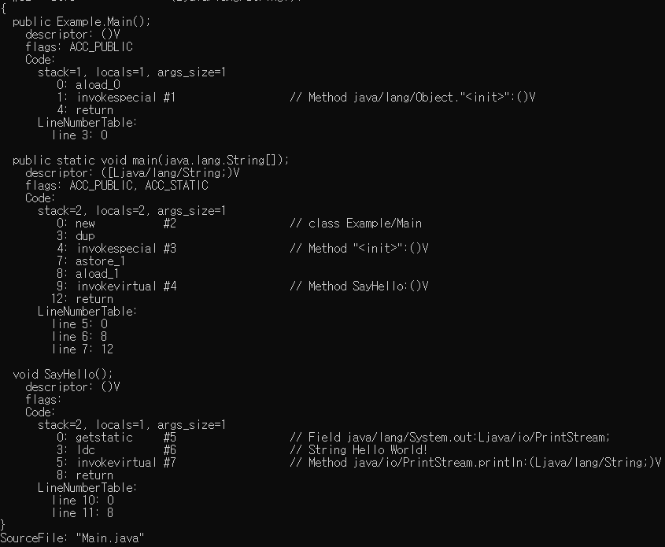

> stack=2, locals=2, args_size=1

* 오퍼랜드 스택의 최대 크기는 2, 로컬 변수 배열 크기는 2, 인자 갯수는 1이다.
* main 메소드 호출시 main 메소드 프레임이 생성된다. 오퍼랜드 스택과 로컬 변수 배열은 비어있고, 상수 풀에 대한 참조는 메인 클래스의 런타임 상수 풀을 가리킨다. 이후 런타임 데이터 영역은 다음과 같다.

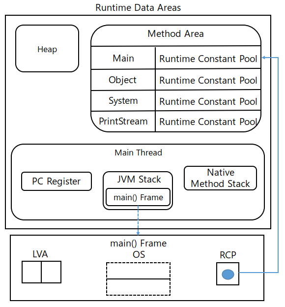

> new #2 // class Example/Hello

* new 는 인자로 지정된 클래스의 새 인스턴스에 필요한 메모리를 힙 영역에 할당하고, 할당된 위치를 가리키는 참조를 오퍼랜드 스택에 쌓는다.

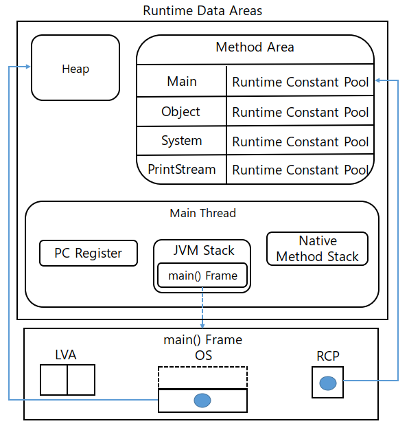

> dup

* dup은 오퍼랜드 스택 맨 위에 있는 값을 복사해서 오퍼랜드 스택 맨 위에 쌓는다.

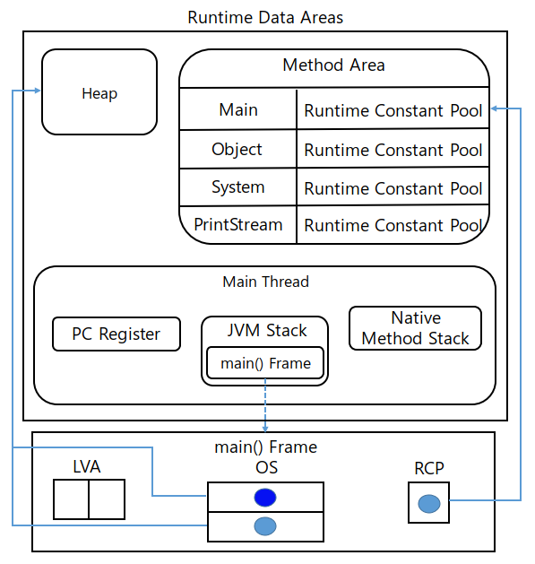

> invokespecial #3 // Method Example/Hello."<init>":()V

* invokespecial은 생성자, 현재 클래스, 수퍼 클래스의 메소드를 호출한다. 메소드 호출시 새 프레임이 생겨나며 호출되는 메소드의 파라미터 갯수 + 1개 만큼 호출하는 쪽의 오퍼랜드 스택에서 값을 꺼내서 호출되는 쪽에 새로 생성된 로컬 변수 배열에 0번 슬롯까지 값이 채워지도록 뒤에서부터 차례대로 채운다.

즉, 현재 main() 프레임의 맨 위에 있는 Main 인스턴스에 대한 참조를 Main 클래스의 생성자에 첫번째 인자로 넘기면서 디폴트 생성자를 호출한다. 이후 Main() 생성자 프레임이 생성되고, Main() 생성자 프레임의 로컬 변수 배열의 0번 슬롯에 Main 인스턴스에 대한 참조가 저장된다(`this`).

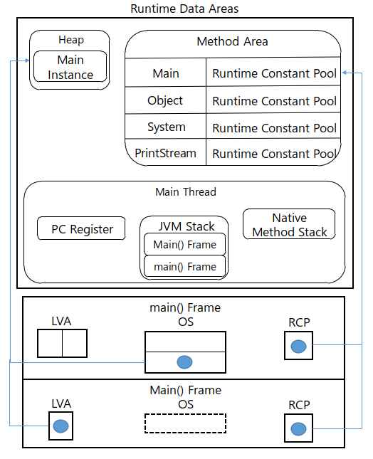

Main 생성자의 바이트 코드는 다음과 같다.

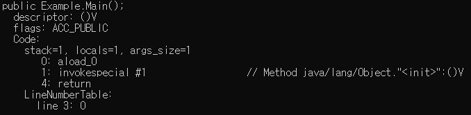

> aload_0

* aload_n은 로컬 변수 배열의 n번 슬롯에 저장된 참조값(접두사 a가 참조값을 의미)을 오퍼랜드 스택 맨위에 쌓는다. 이후 그림은 생략한다.
* [Java ByteCode](https://en.wikipedia.org/wiki/Java_bytecode)

> invokespecial #1 // Method java/lang/Object."<init>":()V

* invokespecial에 대한 설명은 위에서 했으므로 생략한다. 자바의 모든 클래스들은 기본적으로 `Object` 클래스를 상속받고 있으므로 `Object` 클래스의 생성자를 호출하는 과정이다. `Object` 생성자를 호출하면 `Heap`에 `Object`의 인스턴스를 위한 메모리가 할당되고, Object() 생성자 프레임이 생성된다.

Object 생성자의 바이트코드는 다음과 같다.

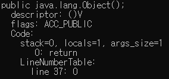

그냥 return 하는것이 전부이기 때문에 Object() 생성자 프레임은 폐기되고 Main() 생성자 프레임으로 제어가 넘어간다.

> astore_1

* astore_n 은 오퍼랜드 스택의 맨 위에 있는 값을 꺼내서 로컬 변수 배열의 n 위치에 저장된다. 즉, 코드상에서 로컬 변수에 무언가를 저장하는걸 뜻한다.

> aload_1

* aload_1 은 main 메소드 프레임의 로컬 변수 배열 1번에 있던 값을 오퍼랜드 스택에 쌓는다.

> invokevirtual #4 // Method Example/Hello.SayHello:()V

* invokevirtual 은 자바 메소드 호출의 기본 방식이며, 객체 참조(`.`)를 붙여서 호출되는 일반적인 메소드를 호출한다. 해당 메소드가 속한 인스턴스를 가리키는 참조가 첫번째 파라미터로 넘겨지고, 호출에 의해 새 프레임이 생성된다.
로컬 변수 배열의 0번 슬롯에 첫 번째 인자로 넘어온 값인 해당 메소드가 속한 인스턴스를 가리키는 참조가 저장되고, 그 이후의 인자도 로컬 변수 배열에 순서대로 저장된다.