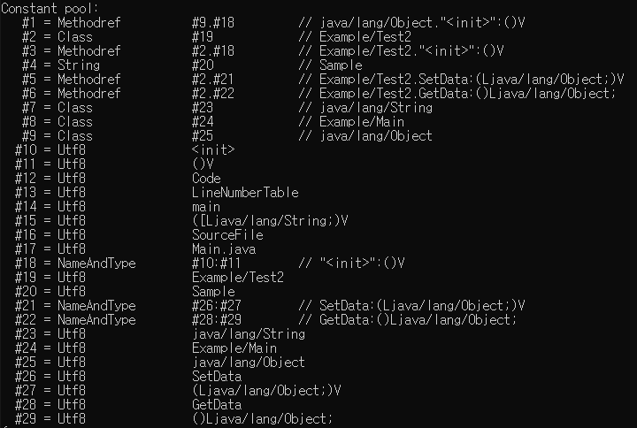
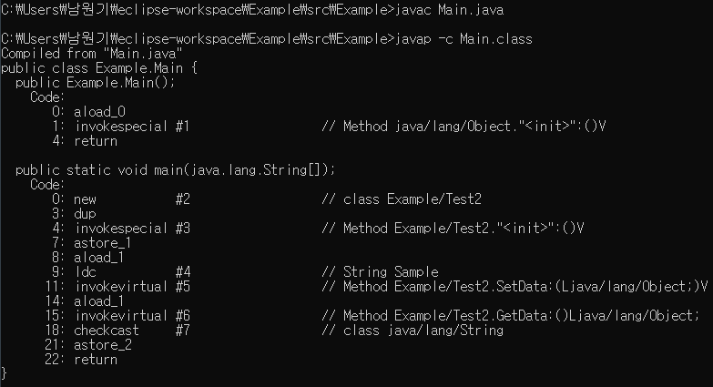

# C++ Templete vs Java Generic vs C# Generic

## C++ Templete

```cpp
#include "pch.h"
#include <iostream>
#include <string>

using namespace std;

template<class T>
class TemplateExample {
    T value;

public:
    TemplateExample(T val) {
        value = val;
    }

    T GetValue() {
        return value;
    }
};

template<class T>
void TempleteExample(T t) {
    cout << "TempleteExample2() : " << t << endl;
}


int main()
{
    TemplateExample<string> *ex = new TemplateExample<string>("TemplateExample1() : SampleString1");
    cout << ex->GetValue() << endl;

    TempleteExample<string>("SampleString2");
    TempleteExample<int>(1);
}
```

C++의 템플릿은 컴파일시 템플릿을 기반으로 컴파일러가 코드를 만들어낸다. 위 코드의 경우 main에서 호출된 데이터형에 따라 다음 함수들이 만들어진다.

```cpp
void TempleteExample(string t) {
	cout << "TempleteExample2() : " << t << endl;
}
void TempleteExample(int t) {
	cout << "TempleteExample2() : " << t << endl;
}
```

## Java

```java
class Test2<T> {
    T val;

    void SetData(T t) {
        val = t;	
    }

    T GetData() {
        return val;
    }
}

public class Main {
    public static void main(String args[]) {
        Test2<String> test = new Test2<String>();
        test.SetData("Sample");
        String str = test.GetData();
    }
}
```

자바의 제네릭은 C++과 달리 제너릭 타입 유형을 컴파일시에 삭제해버리고 캐스팅이 필요한곳에 추가된다. 따라서 각 데이터형마다 새로 함수를 만들지 않고, 하나의 함수만으로 처리한다.




* Methodref, Class 등 상수 항목들은 소스코드 상에서 파악되는 변수, 상수 항목이다. 자세한 내용은 [JVM 스펙](https://docs.oracle.com/javase/specs/jvms/se11/html/jvms-4.html#jvms-4.4.2) 참조
* 위 그림에서 (0: , 1:) 과 같은 번호들은 JVM 내에 로컬 변수 배열이라고 하는 인덱스이다.
* `#` 은 상수풀에서의 위치이다.
* invokespecial, invokevirtual은 메소드 호출이다.


[Java ByteCode](https://en.wikipedia.org/wiki/Java_bytecode_instruction_listings)