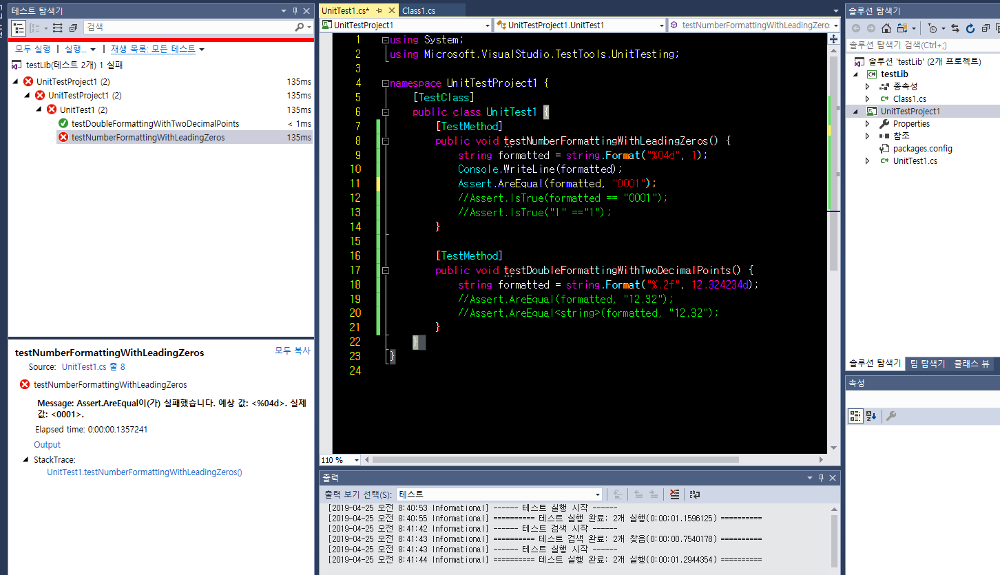

# General programming guidelines

* 좋은 프로그래밍 스타일, 실용적인 조언에 대해 이야기한다.

----
##  Variable scopes

* 지역변수를 사용하는 코드 가까이에서 선언해라
* Java8에서 `lambda`의 도입으로 `foreach`루프에서 사용하는 지역변수를 없앨 수 있다.

```java
import java.util.Arrays;
public class Main {
	public static void main(String[] args) {
	    int[] arr = {1, 2, 3, 4, 5};
	    
        for( final int index: arr ) {
		    System.out.println("index :" + index);
        }
        
        Arrays.stream(arr).forEach((index) -> {
		    System.out.println("index :" + index);
        });
        
        try{
            int tmp = 100;
		    System.out.println("tmp :" + tmp);
        } finally {
	        //System.out.println("tmp :" + tmp);
        }
	        //System.out.println("tmp :" + tmp);
	}
}
```

```cs
using System;
class HelloWorld {
   static void Main() {
	    int[] arr = {1, 2, 3, 4, 5};
	    
        foreach( int index in arr ) {
            Console.WriteLine("index :" + index);
        }
        
        try{
            int tmp = 100;
		    Console.WriteLine("tmp :" + tmp);
        } finally {
	        //Console.WriteLine("tmp :" + tmp);
        }
	        //Console.WriteLine("tmp :" + tmp);
  }
}
```

----
##  Class fields and local variables

* 클래스 필드와 로컬변수의 이름이 같으면 변수 사용 시 구분이 모호해진다.
* `this`를 사용해라.

```java
public class Main {
	public static void main(String[] args) {
        LocalVariableAndClassMember l = new LocalVariableAndClassMember();
	    System.out.println("return value :" + l.calculateValue(5));
	    System.out.println("return value :" + l.calculateValue2(5));
	}
}
class LocalVariableAndClassMember {
    private long value = 20;
    public long calculateValue( final long initial ) {
        long value = initial;
        value *= 10;
        value += value;
        return value;
    }
    public long calculateValue2( final long initial ) {
        long value = initial;
        value *= 10;
        value += this.value;
        return value;
    }
}

// output
return value :100                                                                    
return value :70
```

```cs
using System;
class HelloWorld {
  static void Main() {
        LocalVariableAndClassMember l = new LocalVariableAndClassMember();
	    Console.WriteLine("return value :" + l.calculateValue(5));
	    Console.WriteLine("return value :" + l.calculateValue2(5));
  }
}
class LocalVariableAndClassMember {
    long value = 20;
    public long calculateValue( long initial ) {
        long value = initial;
        value *= 10;
        value += value;
        return value;
    }
    public long calculateValue2( long initial ) {
        long value = initial;
        value *= 10;
        value += this.value;
        return value;
    }
}

```

----
##  Method arguments and local variables

* 메소드 파라미터를 지역변수처럼 사용하지 말고, 값을 변경하려면 새로 선언해서 사용해라.

```java
public class Main {
	public static void main(String[] args) {
        MethodArgumentAsLocalVariable m = new MethodArgumentAsLocalVariable();
	    System.out.println("return value :" + m.sanitize("MethodArgument"));
	    System.out.println("return value :" + m.sanitize("MethodArgument"));
	}
}
class MethodArgumentAsLocalVariable {
    public String sanitize( String str ) {
        if( !str.isEmpty() ) {
            str = str.trim();
        }

        str = str.toLowerCase();
        return str;
    }
    
    public String sanitize2( final String str ) {
        String sanitized = str;
        
        if( !str.isEmpty() ) {
            sanitized = str.trim();
        }

        sanitized = sanitized.toLowerCase();
        return sanitized;
    }
}

// output
return value :methodargument                                                         
return value :methodargument 
```

```cs
using System;
class HelloWorld {
    static void Main() {
        MethodArgumentAsLocalVariable m = new MethodArgumentAsLocalVariable();
        string str = "MethodArgument";
        Console.WriteLine("return value :" + m.sanitize(str));
        Console.WriteLine("return value :" + m.sanitize(str));
  }
}
class MethodArgumentAsLocalVariable {
    public string sanitize( string str ) {
        if( !string.IsNullOrEmpty(str)) {
            str = str.Trim();
        }

        str = str.ToLower();
        return str;
    }
    
    public string sanitize2( string str ) {
        string sanitized = str;
        
        if( !string.IsNullOrEmpty(str)) {
            sanitized = str.Trim();
        }

        sanitized = sanitized.ToLower();
        return sanitized;
    }
}
```

----
##  Boxing and unboxing

* `primitive` 타입(int, long, double)과 `primitive` 타입 래퍼(Integer, Long, Double)사이의 변경
* 필요한 때 아니면 `primitive` 타입을 사용하자

```java
public class Main {
	public static void main(String[] args) {
        Boxing b = new Boxing();
	    final long value = 5;
	    System.out.println("return value :" + b.calculate(value));
	    final Long value2 = null;
	    System.out.println("return value :" + b.calculate(value2));
	}
}
class Boxing {
    public long calculate( long n ) {
        return n * 10;
    }
}

// output
return value :50                                                                     
Exception in thread "main" java.lang.NullPointerException                            
        at Main.main(Main.java:17) 
```

----
##  Interface

* 구현이 아니기 때문에 유연성이 있다. 적절하게 쓰자.
  * 자유롭게 내부 구성물을 수정할 수 있다.

```java
interface TestInterface {
    void Print();   
}
public class Test implements TestInterface {
    public void Print(){
        System.out.println("TestImpl.Print");
    }
}
public class Test2 implements TestInterface {
    public void Print(){
        System.out.println("override TestInterface");
    }
}
public class Main {
	public static void main(String[] args) {
	    Test t = new Test();
	    Test2 t2 = new Test2();
	    t.Print();
	    t2.Print();
	}
}

// output
TestImpl.Print                                                                       
override TestInterface 
```

----
##  Strings

* string 연결 시 매번 새로운 인스턴스를 생성하기 때문에 `StringBuilder`라는 클래스를 제공한다.
* 두개 또는 세개의 문자열을 연결할때는 `+`를 사용하는 게 깔끔해 보인다.
* 문자열 포맷팅을 이용하면 다양한 형식을 표현할 수 있다.

```java
import java.util.Random;
import java.util.Date;
public class Main {
	public static void main(String[] args) {
        final StringBuilder sb = new StringBuilder();
        
        for( int i = 1; i <= 10; ++i ) {
            sb.append( " " );     
            sb.append( i );     
        }
                
        sb.insert( 0, "[" );
        sb.replace( sb.length() - 1, sb.length(), "]" );
        System.out.println(sb);
        
        
        System.out.println(String.format( "%04d", 1 ));
        System.out.println(String.format( "%.2f", 12.324234d )); 
        System.out.println(String.format( "%tR", new Date() ));
        System.out.println(String.format( "%tF", new Date() ));
        System.out.println(String.format( "%d%%", 12 ));
	}
}

// output
[1 2 3 4 5 6 7 8 9 1]                                                                        
0001                                                                                 
12.32                                                                                
23:43                                                                                
2019-04-23                                                                           
12%
```

```cs
using System;
class HelloWorld {
    static void Main() {
        System.Text.StringBuilder sb = new System.Text.StringBuilder();
        
        for( int i = 1; i <= 10; ++i ) {
            sb.Append( " " );     
            sb.Append( i );     
        }
                
        sb.Insert( 0, "[" );
        sb.Replace( '0', ']' );
        Console.WriteLine(sb);
        
        
        Console.WriteLine(string.Format( "{0:D4}", 1 ));
        Console.WriteLine(string.Format( "{0:.##}", 12.324234 )); 
        Console.WriteLine(string.Format( "{0:hh:mm}", new DateTime() ));
        Console.WriteLine(string.Format( "{0:yyyy-MM-dd}", new DateTime() ));
        Console.WriteLine(string.Format( "{0}%", 12 ));
  }
}
```

----
##  Naming conventions

* 다음과 같은 코딩 컨벤션이 있다. 준수하는게 좋음
  * `package` 이름은 `lower case`
  * `class, enum, interface, annotation` 이름은 `pascal case`
  * `method, field, local variable, method argument` 이름은 `camel case`
  * `static final field, enumeration constant` 이름은 `upper case`
  * `generic type parameter` 이름은 대문자 1글자 

----
##  Standard Libraries

* 표준 라이브러리는 `Java` 버전이 올라갈 때마다 변경되기 때문에, 타사 라이브러리를 사용할 때, 필요한 기능이 이미 표준에 구현되어 있는지 확인해라.

----
##  Testing

* 훌륭한 테스트 코드는 짧고 단순하게 유지하면서 한번에 한가지만 테스트하는 것이다.

```java
package com.javacodegeeks.advanced.generic;

import static org.junit.Assert.assertThat;
import static org.hamcrest.CoreMatchers.equalTo;

import org.junit.Test;

public class StringFormatTestCase {
    @Test
    public void testNumberFormattingWithLeadingZeros() {
        final String formatted = String.format( "%04d", 1 );
        assertThat( formatted, equalTo( "0001" ) );
    }
    
    @Test
    public void testDoubleFormattingWithTwoDecimalPoints() {
        final String formatted = String.format( "%.2f", 12.324234d );
        assertThat( formatted, equalTo( "12.32" ) );
    }
}
```

```cs
using System;
using Microsoft.VisualStudio.TestTools.UnitTesting;

namespace UnitTestProject1 {
    [TestClass]
    public class UnitTest1 {
        [TestMethod]
        public void testNumberFormattingWithLeadingZeros() {
            string formatted = string.Format("%04d", 1);
            Console.WriteLine(formatted);
            Assert.AreEqual(formatted, "0001");
        }

        [TestMethod]
        public void testDoubleFormattingWithTwoDecimalPoints() {
            string formatted = string.Format("%.2f", 12.324234d);
        }
    }
}
```

