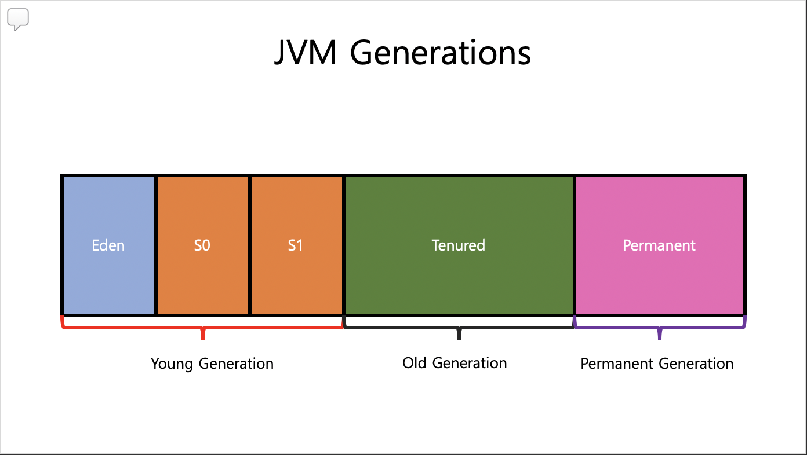
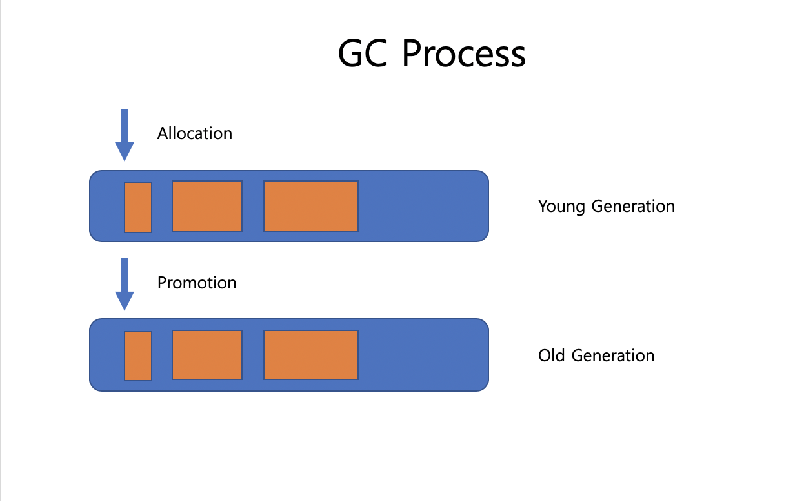

## JVM Garbage Collector

### What is Garbage Collector

Java에서는 개발자가 메모리를 명시적으로 해제할 필요 없도록, 더 이상 사용되지 않는 객체를 찾아 지우는 작업을 하는데. 이 작업을 수행 하는 것이 `Garbage Collector` 이다.

### JVM Generations

JVM에서는 Heap 영역을 크게 2가지로 나눠놨다. 
`Young Generation` 와 `Old Generation`

`Young Generation` : 새롭게 생성된 객체는 이 영역에 위치하게 되고, 이 영역이 가득 차게 되면 `Minor GC`가 발생한다.

`Old Generation` : `Young Generation` 에서 살아남은 객체들이 여기로 위치하게 된다. 이 영역이 가득 차게 되면 `Major GC`가 발생한다.

`Permanent Generation` : Class, Method의 메타 정보가 위치한다.

`Stop-the-World` : 각 영역이 가득 차서 `GC` 가 발생할 때 ,  `Stop-the-World` 이벤트가 JVM에 의해서 선행되는데, `GC`를 위해서 `GC`가 실행될 쓰레드를 제외한 나머지 쓰레드의 작업을 멈춘다. `GC`가 끝나야만 나머지 쓰레드가 다시 작업을 수행한다.

### Process

1. 새로운 객체가 생성되면 `Eden Space`로 할당 된다. 

2. `Eden Space`가 가득 차게 되면 `Minor GC`가 발생한다.

3. 참조된 객체는 `S0` 으로 이동 되고, 참조가 없는 객체는 삭제 된다.

4. 다음 `Minor GC`가 발생하면, 참조가 없는 객체는 삭제되고, 참조된 객체는 이번엔 `S1` 으로 이동 된다. 그리고 `S0`에 있던 참조된 객체는 `Age`가 증가하고, `S1`로 이동 된다.

5. 다음 `Minor GC`가 발생하면, 동일한 작업이 수행되는데, 이땐 다시 참조된 객체는 `S0`으로 이동되면서 `Age`가 증가한다.

6. 위 프로세스가 반복되다가, `Age threshold`에 도달 하게되면, `Old Generation` 으로 이동된다.
